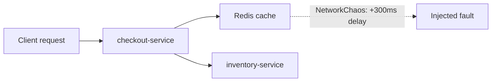

# Resilience Testing — Middle

<!-- level-focus -->
At middle level, focus on this question:

> Where in the deployment pipeline should an automated chaos experiment run, and how big a blast radius earns the right to block a release?

Use the smallest realistic scenario that exposes the decision and its failure behavior.
> **Roadmap:** [Chaos Engineering](../README.md) → Resilience Testing
> *Turning a single automated experiment into a maintainable practice: choosing the pipeline stage, sizing the blast radius, and rolling coverage out incrementally instead of all at once.*

---

## Core Concept 1 — The Placement Decision

A single pod-kill gate in staging (junior level) is a starting point, not a design. Every additional experiment forces a choice: **where in the pipeline does it run, and what does a failure there mean?**

| Placement | When it runs | What failure means | Fidelity to production | Risk |
|---|---|---|---|---|
| Pre-merge (PR check) | On every pull request | Blocks the merge | Low — no real traffic, synthetic environment | Very low |
| Post-deploy staging gate | After deploy to staging, before promotion | Blocks promotion to production | Medium — real deploy, synthetic traffic | Low |
| Production canary | After a canary deploy, small traffic slice | Blocks full rollout, may trigger rollback | High — real traffic | Medium, tightly bounded |
| Scheduled nightly | Independent of any deploy | Files an issue / pages on-call | High if run against a prod-like environment | Depends on environment |

None of these is universally correct. A pre-merge check is cheap and fast but proves little about real behavior. A production canary experiment proves the most but carries real risk and needs mature rollback automation underneath it. The middle-level skill is matching the placement to what you can actually afford to be wrong about at that stage.

## Core Concept 2 — Sizing the Blast Radius as a Trade-off

Blast radius is not just "small is always safer." A blast radius that is too small can pass every time without proving anything (testability without confidence); one that is too large is expensive to run often and erodes trust in the pipeline when it produces noisy failures.

Ask three questions before setting the scope:

1. **What does a failure here cost to investigate?** A flaky gate that pages someone at 2 a.m. for an ambiguous result gets disabled within a month.
2. **What does a false pass cost?** If the experiment is too narrow (e.g. only kills a pod when the deployment already has five spare replicas), it will always pass and gives false confidence.
3. **How fast can we detect and undo the fault if it goes wrong?** Blast radius should never exceed what your rollback automation can undo within your defined abort window.

## Core Concept 3 — Under- and Over-Application Signals

**Under-application** looks like:

- Every experiment only kills one pod in a fully healthy, over-provisioned staging deployment — it never gets close to a real capacity limit, so it always passes.
- Only the "happy path" dependency failure is tested (a clean, immediate disconnect), never a partial failure (slow responses, intermittent errors) which is what most real incidents look like.
- Chaos experiments exist only as a slide in a wiki, not wired into any pipeline that actually runs on a schedule.

**Over-application** looks like:

- Every PR triggers a full-blast-radius chaos run against a shared staging environment, making the pipeline slow and flaky for unrelated reasons.
- Production experiments run with no traffic-percentage cap, no dedicated abort automation, and no separation from a real incident response process.
- Teams chase "100% of services covered" before any single experiment has a track record of catching a real regression, producing volume without signal.

## Core Concept 4 — Incremental Adoption

Roll out automated resilience testing in stages, the same way you would roll out any risky pipeline change:

1. **Shadow mode.** The experiment runs, the steady-state check runs, but the result is only logged — it does not block anything yet. This is how you learn what "normal noise" looks like for the metric before trusting it as a gate.
2. **Advisory gate.** The result is visible in the pipeline (a warning, a Slack message) but does not fail the build. Teams start reacting to it voluntarily.
3. **Blocking gate, single service.** Pick the service with the clearest steady-state signal and the least noisy metrics, and make the gate blocking there first.
4. **Expand fault types and services.** Add latency injection, dependency failure, and resource exhaustion once pod-kill has a track record; add more services once the first one has run cleanly for a defined number of cycles.

## Core Concept 5 — A Scenario Crossing Multiple Components

`checkout-service` calls `inventory-service` synchronously and reads product data from a Redis cache. The steady-state hypothesis for checkout is: "p95 response time stays under 500ms and error rate stays under 1%, even if the Redis cache becomes slow."



Experiment definition, injecting latency instead of a hard failure — most real cache degradations are slow, not dead:

```yaml
apiVersion: chaos-mesh.org/v1alpha1
kind: NetworkChaos
metadata:
  name: redis-latency
  namespace: staging
spec:
  action: delay
  mode: all
  selector:
    namespaces: ["staging"]
    labelSelectors:
      app: redis-cache
  delay:
    latency: "300ms"
    jitter: "50ms"
  duration: "3m"
```

The hypothesis under test is not "does Redis latency happen" (it will), but "does checkout-service fall back gracefully instead of blocking on the cache." If `checkout-service` has no timeout on its Redis client, this experiment should fail loudly — which is the point: it catches a missing timeout before a real cache slowdown does it in production.

## Core Concept 6 — Verifying at Two Levels

**Unit level.** Before wiring up a real Chaos Mesh experiment, the client code that talks to Redis should have its own test that forces a timeout through a fake or a configurable client, and asserts that checkout falls back to a default or a cached value instead of hanging:

```python
def test_checkout_falls_back_when_cache_times_out():
    cache = FakeRedisClient(force_timeout=True)
    checkout = CheckoutService(cache=cache, inventory=RealInventoryStub())
    result = checkout.get_price("sku-123")
    assert result.source == "fallback"
    assert result.latency_ms < 50
```

This proves the fallback logic exists in isolation, quickly and deterministically, without spinning up a cluster.

**Integrated-flow level.** The Chaos Mesh experiment above proves the same behavior holds when the real network, the real client library, the real connection pool, and real concurrent traffic are involved — things a unit test with a fake client cannot see (connection pool exhaustion, retry storms, thread-pool starvation).

Both checks matter and answer different questions: the unit test proves the fallback logic is correct; the integrated experiment proves the fallback logic actually engages under a real, messy failure.

## Real-World Examples

- **A gate that only ever passes.** A team's pod-kill experiment always ran against a staging deployment configured with double the production replica count. The gate never failed, gave the team false confidence, and missed a real regression until it happened in production. Sizing the staging environment to match production replica counts fixed it.
- **Shadow mode catching noisy metrics first.** A team wired an automated latency-injection experiment straight into a blocking gate. It failed intermittently due to normal staging network jitter, not real regressions, and was disabled within two weeks. Restarting in shadow mode for two weeks first revealed the noise floor and let them pick a threshold with margin.
- **Fallback missing entirely.** The Redis-latency experiment above was the first time a team discovered `checkout-service` had no client-side timeout at all — the unit test had mocked the client as always-fast, so a missing timeout was invisible until the integrated experiment exposed it.

## Common Mistakes

- **Gating on a fleet-wide metric instead of a per-service one.** A shared "overall error rate" dashboard can mask a real regression in one service.
- **No rollback tied to the deployment system.** A failing gate that only prints a warning, with no automated `kubectl rollout undo` or feature-flag disable behind it, requires a human to remember to act.
- **Non-idempotent experiments.** A chaos resource left behind after a pipeline crash keeps injecting a fault into an environment nobody is watching.
- **Picking a threshold without a baseline.** Setting "p95 < 400ms" without ever having measured the metric's normal variance produces either a gate that never fails or one that fails constantly.
- **Skipping the unit-level check.** Relying only on the expensive integrated experiment to catch a missing timeout means every regression costs a full cluster run to detect, instead of a few milliseconds.

---

## Apply it

1. Find a real service with at least one synchronous dependency (a cache, a downstream API) where a slow or failing dependency is currently untested.
2. Write two placement options for the experiment (e.g. pre-merge synthetic check vs post-deploy staging gate) and state which trade-off — fidelity, speed, or risk — favors each.
3. Add a unit-level test that forces the dependency failure through a fake client and asserts the expected fallback behavior.
4. Add the same fault as a real chaos experiment (latency or partial failure, not just a hard kill) in a shadow-mode pipeline stage, and observe its result for several runs before making it blocking.
5. Document the incremental plan: shadow mode now, advisory in two weeks, blocking once the false-positive rate is acceptable.

## Verify your work

- The unit test fails before the fallback code exists and passes after it is added.
- The integrated chaos experiment, run in shadow mode, shows a consistent result across multiple runs (not flapping between pass and fail on identical conditions).
- The recorded steady-state metric during the experiment has enough baseline history to justify the chosen threshold.
- Promoting the gate from shadow to blocking does not immediately produce false failures on unrelated changes.

## Review questions

- Which pipeline placement should host a new chaos experiment, and what trade-off decided it?
- What is the difference between an experiment that is too small to prove anything and one that is too large to run safely?
- How does a unit-level fallback test differ from an integrated chaos experiment, and why do you need both?
- What evidence would tell you an experiment is ready to move from shadow mode to a blocking gate?
