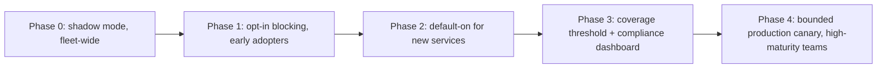

# Resilience Testing — Professional

<!-- level-focus -->
At professional level, focus on this question:

> How do you operate an organization-wide automated resilience-testing program — with clear ownership, governance, and measurable exit conditions — so dozens of teams can safely gate their own pipelines without a central bottleneck?

Use the smallest realistic scenario that exposes the decision and its failure behavior.
> **Roadmap:** [Chaos Engineering](../README.md) → Resilience Testing
> *Scaling one team's chaos gate into an operating model: a shared platform, a governed rollout, a resilience contract between teams, and outcome measures that prove the program is worth its coordination cost.*

---

## Core Concept 1 — Split Ownership Between Platform and Service Teams

At organizational scale, resilience testing fails when either extreme is chosen: a fully centralized team that writes every experiment for every service (does not scale past a handful of teams and becomes a bottleneck), or fully decentralized teams that each build their own injection tooling from scratch (duplicated effort, inconsistent safety guarantees, no shared audit trail).

The durable split:

| Responsibility | Owner |
|---|---|
| Injection tooling, TTL/self-heal guarantees, blast-radius scoping primitives | Platform team |
| Abort/rollback SLO for the shared harness itself | Platform team |
| Audit trail and org-wide dashboard of experiment coverage and verdicts | Platform team |
| Steady-state hypothesis and thresholds for their own service | Service team |
| Choice of which dependencies and fault types to test first | Service team |
| Reacting to a failing gate on their own pipeline | Service team |

This mirrors a paved-road model: the platform team makes the safe path the easy path, and service teams retain the judgment calls that require their domain knowledge.

## Core Concept 2 — Decomposing Rollout into Reversible, Observable Increments

Mandating "every service must have a blocking chaos gate by Q3" produces the same failure pattern every time: teams write a gate that always passes just to satisfy the mandate. The professional approach decomposes adoption the same way any risky migration is decomposed — into phases that each produce evidence before the next phase is approved.



Each phase has an explicit exit condition, not a date:

| Phase | Exit condition to advance |
|---|---|
| Shadow mode | Noise floor understood for at least 3 pilot services; false-positive rate estimated |
| Opt-in blocking | At least one confirmed known-bad catch per pilot service; abort latency measured |
| Default-on | New-service onboarding time to first working gate is under an agreed target |
| Coverage threshold | Dashboard shows tier-1 service coverage above target, sustained for a full quarter |
| Production canary | Abort SLO met under real load for at least one full incident-response drill |

## Core Concept 3 — Governance, Compliance, and Coordination Risk

Automated fault injection touching production, even in small doses, intersects with change control, compliance, and incident response. A professional operating model makes these interfaces explicit instead of discovering them during an audit or an incident.

- **Change-control gating for regulated paths.** Any experiment whose blast radius includes a payments or PII-handling path requires a documented sign-off from the relevant compliance or change-advisory function before it can run against anything beyond an isolated staging clone.
- **A shared chaos calendar.** Teams register planned experiment windows centrally so two teams do not stack faults against shared infrastructure, and so on-call knows a metric dip is an expected experiment rather than a live incident.
- **A platform-wide kill switch.** Central on-call can halt every running automated experiment fleet-wide with one action during a real incident, independent of any individual team's pipeline.
- **An audit trail as a first-class artifact.** Every experiment run — who defined the hypothesis, what blast radius, what verdict — is retained and queryable, both for internal review and for external compliance evidence ("show that payment-path resilience is tested and the results are retained").

```yaml
# excerpt of a machine-readable resilience contract, checked by the platform's onboarding CI
service: payments-gateway
tier: 1
owner_team: payments-platform
steady_state:
  metric: http_success_rate
  threshold: ">= 0.995"
coverage:
  fault_types: [pod-kill, network-delay, broker-partition]
  min_experiments_per_quarter: 4
abort_slo_seconds: 30
compliance_signoff_required: true
```

## Core Concept 4 — Explicit Outcome Measures

A program that only tracks "number of experiments run" measures activity, not outcome, and cannot answer whether the coordination cost is worth it. Track outcomes instead:

- **Coverage**: percentage of tier-1 services with at least one active, blocking resilience gate.
- **Gate precision**: false-positive rate (gate fails with no real regression) and false-negative rate (a known-bad build passed), tracked per service and org-wide.
- **MTTR delta**: mean time to recover for incidents matching a previously-tested failure mode, compared to incidents matching an untested one.
- **Abort reliability**: percentage of experiments where the measured time-to-abort met the declared SLO.
- **Override rate**: how often teams request an exception to bypass a failing gate, and whether that rate is trending down (healthy) or up (the gate is losing trust).

None of these are vanity metrics on their own; together they answer the only question that matters — is the organization actually more resilient because of this program, not just busier.

## Core Concept 5 — Cross-Team Contracts and Accountability

The resilience contract shown above is only useful if it is enforced and if responsibility is unambiguous when something goes wrong.

- **Service teams commit** to maintaining a minimum experiment coverage for their tier, keeping steady-state thresholds current as traffic patterns change, and responding to failing gates within an agreed window.
- **The platform team commits** to an injector reliability SLO, a maximum abort latency for the shared harness, and backward-compatible schema changes with a deprecation window when the experiment definition format evolves — the same discipline applied to any shared internal contract.
- **An explicit override process** exists for when a gate blocks an urgent release: a named approver, a filed exception with an expiry date, and a required follow-up experiment re-run once the underlying issue is fixed. An override with no expiry is how a program quietly rots — teams route around a failing gate instead of fixing what it found.

## Core Concept 6 — A Sustained-Delivery Scenario

Onboarding 40 service teams onto a shared resilience-testing platform over two quarters is not a single migration event — it is ongoing delivery with its own failure modes:

- **Schema evolution without breaking existing experiments.** As the platform team adds new fault types or changes the experiment definition format, existing service-team experiment files must keep working through a deprecation window, exactly like any other internal API contract.
- **Detecting silent drift.** A team quietly disabling a chronically-failing gate, without filing an exception, should show up on the coverage dashboard as a regression, not disappear unnoticed.
- **Avoiding a stalled long tail.** The last handful of low-priority services often never reach coverage without an explicit, funded push; treat the last 10% as its own tracked initiative rather than assuming momentum carries it.
- **Operational cost of the platform itself.** The shared harness needs on-call, a support rotation, and a versioned upgrade path — it is now production infrastructure serving 40 internal customers, not a side project.

## Real-World Examples

- **Mandate-driven false coverage.** An organization required 100% chaos-gate coverage by a fixed date. Teams under time pressure wrote gates against over-provisioned staging environments that could never fail, hitting the metric while adding no real resilience — coverage went up, MTTR did not improve. Switching the exit condition to "at least one confirmed known-bad catch per service" fixed the incentive.
- **A kill switch used for real.** During an unrelated incident, an on-call engineer used the platform-wide kill switch to halt all running experiments fleet-wide within seconds, preventing a scheduled chaos run from compounding a live outage. The switch had been tested in a drill three months earlier and worked exactly as rehearsed.
- **Contract versioning avoiding a flag day.** The platform team changed the experiment schema to add mandatory blast-radius labels. Because the change shipped with a deprecation window and a compatibility shim for the old format, 40 teams migrated on their own schedule instead of all needing to update on the same day.

## Common Mistakes

- **Mandating full production chaos testing on day one.** Skipping shadow mode and opt-in phases removes the evidence needed to trust the harness before it can hurt something real.
- **No clear on-call ownership when a shared-platform experiment causes an unintended outage.** If it is unclear whether the platform team or the service team responds, the incident review becomes a blame exercise instead of a fix.
- **Measuring coverage instead of outcome.** A high experiment count with no tracked false-negative rate or MTTR delta cannot prove the program is worth its cost.
- **Overrides with no expiry.** An exception that never expires becomes the new normal, and the gate it bypasses stops meaning anything.
- **Treating the shared harness as a side project.** Once dozens of teams depend on it for release gating, it needs the same on-call and versioning discipline as any other production dependency.

---

## Apply it

1. Define the organizational outcome resilience testing should improve (e.g. reduced MTTR for previously-tested failure classes, not just "more chaos experiments").
2. Assign explicit owners: platform team for shared tooling and abort SLOs, service teams for hypotheses and thresholds, a named approver for override exceptions.
3. Decompose rollout into phases (shadow, opt-in, default-on, coverage threshold, canary) with an evidence-based exit condition for each, not a calendar date.
4. Publish a resilience contract per tier-1 service specifying coverage, abort SLO, and compliance sign-off requirements, and wire it into onboarding CI.
5. Track coverage, gate precision, MTTR delta, and override rate, and review them quarterly to decide whether to expand, hold, or roll back scope.

## Verify your work

- Each rollout phase has a recorded, evidence-based reason it was allowed to advance, not just a date passing.
- The resilience contract is enforced by CI at onboarding time, not only documented in a wiki.
- Override exceptions all carry an expiry date and a required follow-up re-run, visible on the coverage dashboard.
- Quarterly review shows MTTR trending down for tested failure classes, and the false-negative rate is tracked, not assumed to be zero.

## Review questions

- Why does splitting ownership between a platform team and service teams scale better than either fully centralizing or fully decentralizing resilience testing?
- What evidence should gate a rollout phase, and why is a calendar date not sufficient?
- How does an unenforced or perpetual override exception undermine the entire program?
- Which outcome measures would tell you the program is actually working, as opposed to merely active?
