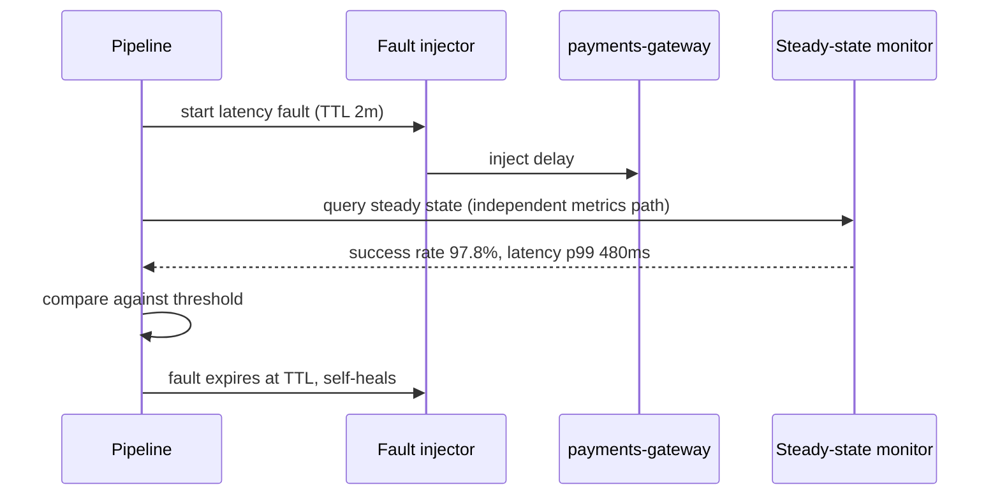

# Resilience Testing — Senior

<!-- level-focus -->
At senior level, focus on this question:

> Which invariants must the automated chaos-testing pipeline itself protect, so that a flaky or buggy experiment cannot become the outage it was built to prevent?

Use the smallest realistic scenario that exposes the decision and its failure behavior.
> **Roadmap:** [Chaos Engineering](../README.md) → Resilience Testing
> *Treating the resilience-testing harness as a system with its own failure modes: bounded blast radius under automation bugs, independent measurement, provable abort, and evidence that the gate actually catches what it claims to catch.*

---

## Core Concept 1 — The Harness Is a System, Not a Script

Once resilience testing is wired into a deploy pipeline and trusted to gate production traffic, the harness itself becomes production infrastructure with its own failure modes. A senior engineer designs it with the same rigor as the system it is testing, because a bug in the harness can cause exactly the outage the practice exists to prevent.

Three invariants have to hold regardless of what the injected fault does:

1. **The fault is bounded and self-terminating**, even if the pipeline that started it crashes, times out, or loses its network connection to the cluster.
2. **The steady-state measurement is independent of the fault path**, so a fault that also breaks your monitoring cannot produce a false "pass."
3. **The abort/rollback path is provably faster than the fault's ability to cause irreversible damage.**

## Core Concept 2 — Bounding the Fault Under Automation Failure

A fault-injection tool that only removes its effect when the pipeline explicitly tells it to is fragile: pipeline crashes, network partitions between CI and the cluster, and human `Ctrl-C` all leave the fault running unattended. The senior-level fix is to make every fault self-limiting by construction, not by pipeline discipline.

```yaml
apiVersion: chaos-mesh.org/v1alpha1
kind: NetworkChaos
metadata:
  name: bounded-latency-experiment
  namespace: prod-canary
spec:
  action: delay
  duration: "2m"          # the fault expires on its own, independent of the pipeline
  selector:
    namespaces: ["prod-canary"]
    labelSelectors:
      app: payments-gateway
      chaos-scope: canary-only   # explicit label scoping bounds blast radius even if the selector logic has a bug
  delay:
    latency: "150ms"
```

The `duration` field, combined with a scoping label that is independently reviewed, means that even if the CI job that launched this experiment disappears entirely, the fault self-heals within two minutes. A blocking gate that relies on the pipeline remembering to clean up is not yet trustworthy at this level.

## Core Concept 3 — Measuring Steady State Out-of-Band

A subtle failure mode: if the steady-state check queries a metrics pipeline that is degraded by the same fault you injected, you can get a false "pass" — not because the system is healthy, but because the thing measuring health is also broken.



Design rule: the monitor's data path (metrics scrape, storage, query) should not share a failure domain with the component under test. If `payments-gateway` and the metrics pipeline share the same node pool, a resource-exhaustion experiment can degrade both at once and mask the real signal.

## Core Concept 4 — Chaos-Testing the Chaos Test

The only reliable evidence that a gate works is proof that it can fail. A senior-level practice treats the gate itself as something to validate, the same way you would validate a monitoring alert by deliberately triggering the condition it should catch.

1. **Control run.** Run the pipeline with no fault injected at all, to measure the natural noise floor of the steady-state metric. If the "no fault" run already flirts with the threshold, the threshold is wrong.
2. **Known-bad run.** Deploy a build with a deliberately broken fallback (e.g. no timeout on the dependency call) and confirm the gate fails. If it passes, the gate has a false-negative problem and nobody has noticed yet because it has never had a real regression to catch.
3. **Track the gate's own precision over time.** Log every verdict, whether a human later confirmed it was a true or false signal, and trend the false-positive and false-negative rate the same way you would trend any other production SLO.

| Validation run | Expected verdict | What a wrong result means |
|---|---|---|
| No fault (control) | Pass, with margin | Threshold is too tight, or metric is noisy |
| Known-good fallback + fault | Pass | Baseline confidence in the gate |
| Known-bad build (missing fallback) + fault | Fail | If it passes, the gate has a blind spot |

## Core Concept 5 — Expanding Blast Radius on Evidence, Not Confidence

Widening scope — from a single staging replica to a production canary — is a system-level decision that should be driven by accumulated evidence, not by comfort or calendar time.

A defensible progression:

1. Start against an isolated pre-prod environment that mirrors production topology as closely as budget allows.
2. Require N consecutive clean control runs and at least one confirmed known-bad catch before considering canary.
3. Move to a bounded production canary (a fixed, small percentage of real traffic) only once the abort path has been forced-fail tested and its time-to-abort is measured and within the acceptable damage window for that dependency.
4. Expand fault types (latency, partial failure, resource exhaustion) independently from expanding blast radius — do not change two risk dimensions in the same step.

## Core Concept 6 — Trade-offs Among Plausible Environments

| Approach | Fidelity to production | Risk if it goes wrong | Cost to maintain | Typical use |
|---|---|---|---|---|
| Isolated staging clone | Medium — depends on parity effort | Low | Environment drift is a constant tax | Early-stage experiments, most fault types |
| Synthetic traffic replay against pre-prod | High for traffic shape, lower for real user variance | Low | Requires a maintained traffic recorder/replayer | Validating capacity-sensitive faults |
| Bounded production canary | Highest | Real, but scoped | Requires mature progressive delivery and abort automation underneath | Faults that only manifest under real load or real data shape |

None of these replaces the others. A senior design typically uses staging for breadth (many fault types, cheap to run often) and a narrow production canary for depth (the few experiments where fidelity has proven to matter and where the abort path has earned trust).

## Core Concept 7 — A Realistic Cross-Component Scenario

`payments-gateway` depends on a `fraud-check` service (synchronous, on the critical path) and publishes events to a message queue consumed asynchronously by a `ledger-service`. The invariant that matters most here is not latency — it is: **no payment is recorded as successful if the ledger event for it was not durably queued.**

An automated experiment injects a broker connection failure for 90 seconds and checks two things simultaneously:

- The steady-state latency/error-rate hypothesis for `payments-gateway` (the usual check).
- A stronger invariant check: reconcile the count of "payment succeeded" responses against the count of ledger events eventually consumed, once the fault window closes.

```yaml
apiVersion: chaos-mesh.org/v1alpha1
kind: NetworkChaos
metadata:
  name: broker-partition
spec:
  action: partition
  duration: "90s"
  selector:
    labelSelectors:
      app: payments-gateway
  direction: to
  target:
    selector:
      labelSelectors:
        app: message-broker
```

If `payments-gateway` returns success to the caller while the broker is unreachable, and the event is silently dropped rather than retried or written to an outbox, the reconciliation check catches a data-integrity gap that a plain latency/error-rate hypothesis would never see. This is the senior-level shift: the steady-state hypothesis for a critical path should include correctness invariants, not only availability metrics.

## Questions That Expose Weak Assumptions

- What guarantees the injected fault is removed if the CI job that started it is killed mid-run?
- Is the steady-state measurement's own data path independent of the component being faulted?
- What is the measured time-to-abort, and is it faster than the time for this fault to cause irreversible damage downstream?
- Has this gate ever been proven to fail on a known-bad build, or has it only ever been observed passing?
- Who approves widening the blast radius, and what specific evidence gate must be satisfied first?

## Common Mistakes

- **Trusting a gate that has never failed.** A pipeline stage that has passed one hundred times in a row with no confirmed known-bad catch is unproven, not reliable.
- **Sharing a failure domain between the target and the monitor.** A resource-exhaustion fault that also starves the metrics pipeline can produce a false pass at exactly the moment it matters most.
- **Widening blast radius on a deadline instead of evidence.** "We said we'd be in production canary by Q3" is not a safety argument.
- **Availability-only steady-state hypotheses on critical paths.** Latency and error rate do not catch silent data loss or double-processing.
- **No measured abort latency.** An abort mechanism that has never been timed under load is a hope, not a control.

---

## Apply it

1. State the invariant that matters most for a critical-path component you own — not just "stays up," but a correctness property (no double-charge, no silent data loss, no orphaned record).
2. Design an experiment whose steady-state check includes that invariant, not only latency and error rate.
3. Run a control (no fault) and a known-bad (deliberately broken build) pass to prove the gate can both pass cleanly and fail on demand.
4. Measure the time between fault injection and full abort/cleanup, and compare it against how quickly this fault could cause irreversible damage downstream.
5. Write down the specific evidence threshold that would justify widening this experiment's blast radius next.

## Verify your work

- The known-bad run produces a failing verdict; the control run produces a clean pass with measurable margin.
- The steady-state check and the fault target do not share a monitoring or infrastructure failure domain.
- Time-to-abort is measured, recorded, and compared against a defined damage window.
- The decision to widen (or not widen) blast radius cites specific recorded evidence, not schedule pressure.

## Review questions

- Why must a chaos-testing harness be validated with both a control run and a known-bad run?
- What happens to an automated experiment's safety guarantee if its abort logic depends on the pipeline that launched it staying alive?
- How can a steady-state hypothesis miss a real data-integrity failure even while every latency and error-rate metric looks healthy?
- What evidence, specifically, should justify moving an experiment from staging to a production canary?
