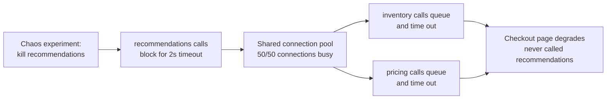

# Blast Radius and Recovery — Middle

<!-- level-focus -->
At middle level, focus on this question:

> Where in a real system should you place bulkheads and traffic-percentage gates so a contained experiment stays contained, and what does it cost to get the boundary wrong?

Use the smallest realistic scenario that exposes the decision and its failure behavior.
> **Roadmap:** [Chaos Engineering](../README.md) → Blast Radius and Recovery

*Scoping an experiment to "5% of traffic" is a promise, not a guarantee — it only holds if the resources behind that 5% are actually isolated from everyone else's. This level is about making the boundary real.*

---

## Core Concept 1 — Blast radius is a property of resources, not of traffic labels

At junior level, scoping a fault to "1 pod of 20" felt like enough. It isn't, on its own. A fault confined to one pod can still escape its label if that pod shares a **resource** with the rest of the fleet — a connection pool, a thread pool, a rate-limited downstream, a shared cache key space, a queue. The label says "5% of traffic"; the shared resource says "100% of capacity, contended."

The **bulkhead pattern** — named after a ship's watertight compartments — is the fix: give each dependency (or each tenant, or each risk class) its own pool of resources, so exhausting one pool cannot exhaust another. Without a bulkhead, blast-radius scoping is theater: the traffic percentage you injected is small, but the failure mode you triggered is shared.

```python
# No bulkhead: one shared pool serves every downstream call.
# A slow `recommendations` call can occupy every worker in the pool,
# starving unrelated calls to `inventory` and `pricing`.
shared_pool = ThreadPoolExecutor(max_workers=50)

# Bulkhead: each dependency gets its own bounded pool.
# recommendations going slow can only ever exhaust ITS OWN 10 workers.
pools = {
    "recommendations": ThreadPoolExecutor(max_workers=10),
    "inventory":        ThreadPoolExecutor(max_workers=15),
    "pricing":          ThreadPoolExecutor(max_workers=15),
}
```

> **Key insight:** A traffic percentage tells you how much of the *input* is affected. A bulkhead tells you how much of the *system* is affected. Blast-radius scoping needs both — the percentage bounds what you inject, the bulkhead bounds what it can reach.

---

## Core Concept 2 — Choosing where to draw the boundary

You cannot bulkhead everything — a pool per downstream call, per tenant, and per endpoint is real operational overhead (more connections, more configuration, more capacity planning). The choice of boundary is a trade-off, evaluated the same way you'd evaluate any other design decision:

| Boundary granularity | Isolation strength | Operational cost | Good fit when |
|---|---|---|---|
| **Per downstream dependency** (one pool per service you call) | Contains a failing dependency to its own pool | Low–medium: one pool per integration | Default starting point for most services |
| **Per tenant / customer** | Contains a noisy or misbehaving tenant | Medium–high: pools scale with tenant count | Multi-tenant systems with SLA differentiation |
| **Per endpoint** | Finest containment; one bad handler can't starve others | High: many pools to size and monitor | A small number of endpoints with very different risk profiles |
| **No bulkhead (shared pool)** | None | Lowest cost | Never, for anything a chaos experiment will touch |

The signal that you've under-applied bulkheads: an experiment scoped to one pod or one tenant still produces symptoms elsewhere — that's the "shared thread pool" failure from Concept 1. The signal that you've over-applied them: you have dozens of pools each sized so small they self-starve under completely normal load, or the operational burden of tuning pool sizes has become its own source of incidents. The right amount of bulkheading is the least isolation that still keeps your worst-case experiment's blast radius where you drew it.

---

## Core Concept 3 — Progressive traffic-percentage scoping

Even with bulkheads in place, you don't jump straight to "inject this fault into 100% of traffic." Scope up gradually, and gate each step on a real signal rather than a fixed schedule:

```yaml
# Progressive experiment scoping, gated on error-budget consumption.
stages:
  - trafficPercent: 1
    holdMinutes: 15
    proceedIf: "error_budget_burn_rate < 1.0"     # not consuming budget faster than allotted
  - trafficPercent: 5
    holdMinutes: 15
    proceedIf: "error_budget_burn_rate < 1.0"
  - trafficPercent: 25
    holdMinutes: 30
    proceedIf: "error_budget_burn_rate < 1.0"
  - trafficPercent: 100
    holdMinutes: 60
    proceedIf: "error_budget_burn_rate < 1.0"
abortIf: "error_budget_burn_rate > 4.0"            # hard stop at any stage
```

This is the same shape as a canary rollout, applied to a fault instead of a feature. The reason to gate on **error-budget burn rate** rather than a raw error count is that it's relative to what your SLO already tolerates — a fault that consumes budget at a sustainable rate is informative; one that burns through a month's budget in fifteen minutes is an incident, and the pipeline should say so automatically rather than waiting for a person to notice.

---

## Core Concept 4 — Circuit breakers: the production-time complement to abort conditions

An abort condition stops *your experiment*. A **circuit breaker** stops *any* call to a failing dependency, whether the failure came from your chaos tool or a real outage — it's the always-on version of the same idea. Once a dependency's error rate or latency crosses a threshold, the circuit "opens" and callers fail fast (or fall back) instead of piling up waiting for a response that keeps timing out.

```yaml
# Envoy outlier detection, acting as a circuit breaker per upstream host.
outlier_detection:
  consecutive_5xx: 5              # 5 consecutive errors from a host...
  interval: 10s
  base_ejection_time: 30s         # ...ejects it from the load-balancing pool for 30s
  max_ejection_percent: 20        # never eject more than 20% of the pool at once
```

`max_ejection_percent` is itself a blast-radius control: it caps how much of your *own* capacity the circuit breaker is allowed to remove in response to a failing dependency, so an overreacting breaker doesn't turn a partial dependency failure into a full outage of the caller. Circuit breakers and bulkheads work together: the bulkhead limits how much of *your* resources one dependency can consume; the circuit breaker limits how long you keep trying once that dependency is clearly unhealthy.

---

## Core Concept 5 — Cross-component scenario: the recommendations widget takes down checkout

**Setup.** `product-page` calls three downstreams — `recommendations`, `inventory`, and `pricing` — all through one shared HTTP client with a single connection pool of 50 connections and a 2-second timeout. A game-day experiment kills the `recommendations` service entirely (not a slowdown — a hard failure).

**What was supposed to happen:** the recommendations widget disappears from the page; everything else renders normally.

**What actually happened:** every call to `recommendations` now blocks for the full 2-second timeout before failing. At normal traffic volume, that's enough concurrent in-flight requests to occupy all 50 connections in the shared pool. Calls to `inventory` and `pricing` — which have nothing to do with the experiment — queue behind them and start timing out too. The checkout page, which never calls `recommendations` at all, degrades because it shares the same HTTP client and connection pool as `product-page`.



**The fix, applied at two levels:** give `recommendations` its own connection pool (bulkhead), sized so it can never consume more than its share, and put a circuit breaker in front of it so that after a handful of consecutive failures, calls fail immediately instead of waiting out the full timeout. After the fix, re-running the identical experiment produces the intended result: the recommendations widget disappears, `inventory` and `pricing` are unaffected, and checkout never notices.

This is the middle-level lesson in one scenario: **scoping the input (which service you attack) does not scope the output (what breaks) unless the resources in between are actually isolated.**

---

## Common Mistakes

1. **Trusting a traffic percentage without checking for shared resources.** "5% of traffic" means nothing if that 5% shares a connection pool, a rate limiter, or a cache with the other 95%.
2. **Jumping straight to 100% scope.** Skipping the progressive stages means the first signal you get that something's wrong is also the worst-case blast radius you'll ever see.
3. **Gating progression on a fixed timer instead of a real signal.** "Wait 15 minutes then proceed" without checking error-budget burn or any other health signal turns the gate into theater.
4. **An abort condition tied to an aggregate metric that dilutes a local problem.** If checkout has 10x the traffic of the canary you're attacking, a localized spike in the canary's error rate can be invisible in the site-wide error rate. Scope the abort metric to the same boundary as the experiment.
5. **Testing the circuit breaker only in isolation.** A unit test that trips the breaker at the configured threshold proves the breaker works; it does not prove the *blast radius stays contained* when the breaker trips in the full request path. Both levels of verification are needed.

---

## Apply it

1. Pick a service in your system that calls at least two downstream dependencies through a shared HTTP client or connection pool.
2. Diagram which resources (pools, rate limiters, caches) each downstream call shares with the others.
3. Give the riskiest downstream (the one most likely to fail, or fail slowly) its own bounded pool and a circuit breaker, leaving the others as they are.
4. Re-run the same fault-injection scenario twice — once with the pools shared and once with the new bulkhead in place — and record whether the unrelated calls are affected each time.
5. Write a one-paragraph note explaining which boundary you chose to isolate and why you didn't isolate the other dependencies yet.

## Verify your work

- A unit-level test proves the circuit breaker trips at the configured threshold in isolation.
- An integrated test (or a repeat of the fault-injection scenario) proves that when the targeted dependency fails, calls to the *other* two dependencies are unaffected.
- You can point to the specific shared resource that caused the original cross-component failure, and show it is no longer shared.
- Reverting the bulkhead change reproduces the original cross-component failure, confirming the fix — not something else — caused the improvement.

## Review questions

- Why can a fault scoped to "one pod" or "5% of traffic" still affect the other 95%?
- What's the difference between what a bulkhead limits and what a circuit breaker limits?
- What's a concrete sign that you've drawn your bulkhead boundaries too coarse? Too fine?
- How would you prove, with evidence, that a fix actually contained the blast radius rather than just moving it?
