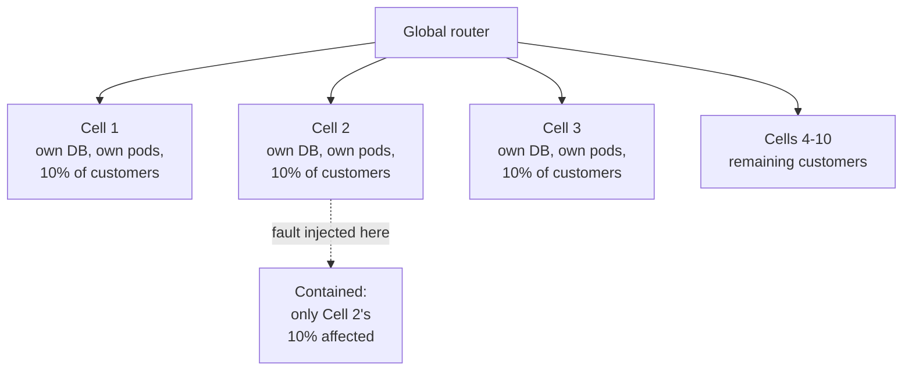

# Blast Radius and Recovery — Senior

<!-- level-focus -->
At senior level, focus on this question:

> What architectural invariant guarantees blast radius stays bounded as the system grows and changes, and what evidence — not preference — proves that invariant holds?

Use the smallest realistic scenario that exposes the decision and its failure behavior.
> **Roadmap:** [Chaos Engineering](../README.md) → Blast Radius and Recovery

*Bulkheads and circuit breakers, applied ad hoc, contain the failures you thought of. An architectural invariant, verified by experiment, is what protects you from the ones you didn't.*

---

## Core Concept 1 — State the invariant, don't just apply the pattern

The middle level treats blast-radius containment as a local decision: this service gets a bulkhead, that dependency gets a circuit breaker. At senior level, the containment has to be an explicit, system-wide **invariant** — a statement that stays true no matter what feature ships next, phrased so precisely that any engineer can check a design against it:

> *No single dependency failure, region outage, or bad deploy may degrade more than one cell of customers, and no cell may exceed N% of total traffic.*

The value of stating it this way is that it's falsifiable. "We use bulkheads" is not falsifiable — you can always find a bulkhead somewhere. "No failure affects more than one cell, and no cell exceeds 10% of traffic" is a claim you can test, and a claim a new feature can violate without anyone noticing until it's tested. Writing the invariant down is what turns "we did some isolation work" into a property you can defend in a design review two years from now, by someone who wasn't in the room when the bulkheads were added.

---

## Core Concept 2 — Cell-based architecture as the invariant's enforcement mechanism

The pattern that turns the invariant from a hope into a structural guarantee is **cell-based architecture** (a form of shuffle-sharding): partition customers, tenants, or traffic into independent, fully-isolated **cells** — each with its own compute, its own data store, its own connection pools — so that a failure inside one cell has no path to another.



Compare this to bulkhead-only isolation, which contains failures *within a service* but does nothing to stop a bad deploy, a noisy-neighbor tenant, or a regional outage from touching every customer that service serves. Cell-based architecture moves the isolation boundary up a level — from "this dependency call" to "this entire slice of customers" — and makes the blast-radius bound a routing-layer property instead of something every service has to get right independently.

| Strategy | What it bounds | What it does *not* bound | Recovery complexity |
|---|---|---|---|
| **Bulkhead per dependency** | Resource exhaustion from one downstream call | A bad deploy, a noisy tenant, a regional outage | Low — restart/circuit-break one pool |
| **Circuit breaker** | How long callers keep hitting a failing dependency | The blast radius of the failure itself | Low — breaker resets automatically |
| **Cell-based / shuffle-sharding** | Bad deploys, noisy tenants, regional failures, cascading retries — all bounded to one cell | Cross-cell shared dependencies (see Concept 4) | Medium — redirect traffic away from the bad cell |
| **Multi-region active-active** | Entire-region loss | Cost (running N regions warm), data-consistency complexity | High — regional failover orchestration |

The trade-off is explicit: cells cost more than bulkheads (data partitioning, routing complexity, per-cell capacity planning) in exchange for a strictly stronger guarantee. A senior engineer's job is to know which row of this table the system currently occupies, and to be able to say so under a proposed change.

---

## Core Concept 3 — Recovery as a designed, not improvised, capability

At the middle level, recovery was "the abort condition fires, the fault stops." At senior level, recovery has to be designed as a system with its own failure modes, and measured with the same rigor as the fault itself.

Decompose the recovery clock the way SRE practice decomposes MTTR:

```
MTTR = MTTD (detect) + MTTA (acknowledge/decide) + MTTF (fix/rollback) + verify

  MTTD : time from fault onset to an alert firing
  MTTA : time from alert to a decision ("roll back", "let the breaker handle it")
  MTTF : time to execute the fix — automated rollback, cell failover, flag flip
  verify: time until health signals confirm the system, not just the fault, is back to baseline
```

Example, worked from a real cell-failover drill:

| Segment | Duration | Lever to reduce it |
|---|---|---|
| MTTD | 40s | Faster SLI evaluation windows on the golden signals |
| MTTA | 90s | Pre-authorized automatic failover instead of a paged decision |
| MTTF | 25s | Router config change (redirect Cell 2's traffic to Cells 1/3) instead of a redeploy |
| Verify | 60s | Health-check-based readiness gate before declaring the cell restored |
| **Total** | **~3.6 min** | — |

The senior-level design goal is to push as much of MTTA and MTTF into automation as the invariant will safely allow — a human deciding whether to fail over a cell is often the largest, most variable segment of the clock, and it's the one most improved by having pre-agreed, automated failover criteria rather than judgment calls made under pressure.

---

## Core Concept 4 — Failure modes at scale: retries, thundering herds, and shared dependencies

Two failure modes appear specifically once a system has enough scale and enough automated recovery that a senior has to reason about them explicitly:

**Retry amplification.** A client that retries a failed call 3 times, behind a load balancer serving 1,000 requests/second, turns one failing backend into up to 4,000 requests/second of retry traffic — which can take down a *healthy* backend it fails over to, or overload the very backend it was retrying against, extending the outage the retries were meant to survive. Any invariant about blast radius must account for what your retry policy does to it: exponential backoff with jitter and a retry budget (a cap on the fraction of traffic allowed to be a retry) turns retries from an amplifier into a bounded cost.

**Cross-cell shared dependencies.** Cell-based architecture bounds blast radius only for the resources each cell owns independently. A shared authentication service, a shared DNS resolver, or a shared central database that every cell calls is a **cross-cutting dependency** — and a failure there breaks the invariant regardless of how well the cells are isolated from each other. The senior question to ask of any cell-based design: *"List everything every cell calls that isn't inside a cell. Each one is a hole in the blast-radius invariant until proven otherwise."*

**Thundering herd on recovery.** When a cell (or a dependency) comes back online, every client that was queuing or retrying against it can hit it simultaneously, overloading it again the moment it recovers — turning "recovered" into "failed again in 200ms." Recovery designs need their own containment: staged traffic ramp-up back onto a recovered cell (similar in shape to the progressive canary in the middle level, run in reverse), not an instant full-traffic cutover.

---

## Core Concept 5 — Evidence over preference: validating the invariant with experiments

An invariant that has never been tested by an actual failure is an opinion. The senior discipline is to treat every fault-injection experiment as a chance to gather **evidence** for or against the stated invariant, and to change the architecture when the evidence contradicts it — not to argue from what the design was "supposed to" do.

Concretely, run the invariant as a testable hypothesis:

```text
Hypothesis: killing all pods in Cell 2's database primary affects only Cell 2's
            customers (~10% of traffic) and recovers within 5 minutes.

Experiment: terminate Cell 2's primary DB instance in a controlled game day.

Evidence to collect:
  - % of total traffic showing elevated error rate during the fault
  - Whether Cells 1, 3-10 show ANY change in their own SLIs
  - Time from termination to Cell 2's traffic being rerouted or restored
  - Whether the shared auth service (a cross-cutting dependency) showed
    any load increase attributable to Cell 2's retries
```

If the experiment shows 14% of traffic affected instead of the predicted 10%, that gap is not noise to explain away — it's evidence that some path leaks across the cell boundary, and it needs to be found before the invariant can be trusted again. This is the same evidentiary standard game days and resilience testing apply more broadly (see those topics); here the object under test is specifically the blast-radius invariant itself.

---

## Common Mistakes

1. **Treating "we have bulkheads" as equivalent to "blast radius is bounded."** Bulkheads bound resource exhaustion from one dependency; they don't bound a bad deploy, a noisy tenant, or a regional failure. Know which failure classes your current architecture actually contains.
2. **Ignoring retry amplification when reasoning about blast radius.** A retry policy with no budget can turn a partial, contained failure into a full-scale one against whatever the client fails over to.
3. **Assuming cell isolation is complete without listing cross-cutting dependencies.** Any service every cell calls is a hole in the invariant. Enumerate them explicitly rather than assuming isolation is total.
4. **Cutting traffic back onto a just-recovered cell at 100% immediately.** This reliably re-triggers the original failure via a thundering herd; ramp recovery the same way you'd ramp a risky rollout.
5. **Treating the invariant as validated because the architecture diagram implies it.** Only an actual experiment, with measured evidence, validates the invariant — a diagram is a hypothesis, not a result.

---

## Apply it

1. Write down, in one falsifiable sentence, the blast-radius invariant your system is currently supposed to satisfy (or should satisfy, if none exists today).
2. List every dependency that is shared across whatever isolation boundaries (cells, bulkheads, regions) you currently have — these are the invariant's known holes.
3. Design one game-day experiment that would falsify the invariant if it doesn't hold, including the exact evidence you'll collect (percentage of traffic affected, cross-boundary SLI changes, recovery time).
4. Run the experiment and compare the measured blast radius and recovery time against the invariant's stated bounds.
5. Update either the invariant's wording or the architecture — whichever the evidence contradicts — and record the decision.

## Verify your work

- The invariant is written as a specific, falsifiable claim, not a general aspiration like "well isolated."
- The experiment produced a number for blast radius and a number for recovery time, both compared explicitly against the invariant's stated bounds.
- Every cross-cutting dependency identified in step 2 was either exercised by the experiment or explicitly flagged as untested.
- A gap between predicted and measured blast radius, if found, has a named root cause, not an unexplained discrepancy.

## Review questions

- What makes a stated blast-radius invariant falsifiable rather than aspirational?
- Which failure classes does a bulkhead contain, and which does it leave completely unaddressed?
- Why can a healthy retry policy turn a contained failure into an uncontained one?
- What evidence would tell you a cell-based architecture's isolation has a hidden hole?
