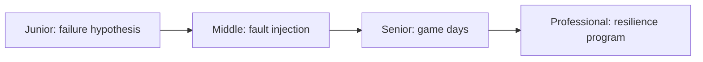
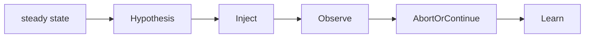

# Chaos Engineering

> Test a resilience hypothesis through controlled failure before an uncontrolled failure tests it for you.

| Level | Guide | You are done when |
|---|---|---|
| Junior | [Run a bounded experiment](junior.md) | You can define steady state, fault, and abort condition. |
| Middle | [Inject realistic faults](middle.md) | You can test network, process, resource, and dependency failure. |
| Senior | [Lead game days](senior.md) | You can control blast radius and validate recovery. |
| Professional | [Build resilience capability](professional.md) | You can govern safe experimentation across systems. |

## Practice rule

Never inject failure without a falsifiable hypothesis, measured steady state, owner, abort condition, and recovery plan.

## Related

- [SRE & Reliability](../sre-reliability/README.md)
- [Testing](../testing/README.md)
