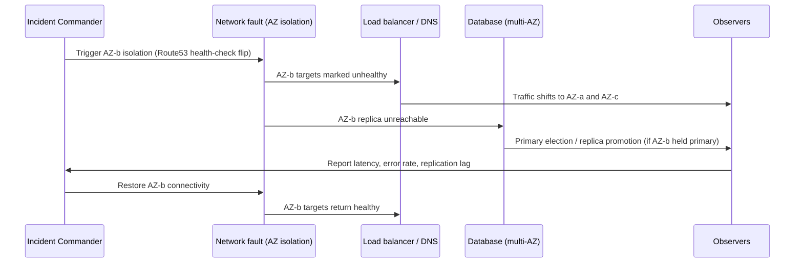

# Game Days — Senior

<!-- level-focus -->
At senior level, focus on this question:

> Which system invariant must this game day prove holds under a realistic multi-component failure, and what evidence would prove it wrong?

Use the smallest realistic scenario that exposes the decision and its failure behavior.
> **Roadmap:** [Chaos Engineering](../README.md) → Game Days
> *A middle-level game day chooses good boundaries for one exercise. A senior-level game day is designed around a specific invariant the architecture claims to hold — and its real purpose is to surface the assumption that would otherwise only be discovered during a real outage.*

---

## Core Concept 1 -- A Game Day Exists to Test an Invariant, Not a Fault

Every non-trivial system carries claims about itself that nobody has verified: "losing one availability zone degrades capacity but never causes data loss," "a payment provider outage delays orders but never drops them," "the cache going cold never causes a cascading failure in the database tier." These claims are **invariants** — properties the architecture is supposed to preserve no matter what happens around it.

A senior engineer's job in designing a game day is to work backward from the invariant, not forward from a convenient fault. The fault (kill a node, cut a network path, saturate a queue) is just the mechanism for putting the invariant under real stress. If you can't name the invariant a scenario is meant to test, you don't yet have a game day — you have a demo.

This is also where the "Principles of Chaos Engineering" manifesto is most directly useful: it frames the whole discipline as forming a *hypothesis about steady state*, then *varying real-world events* to see if the hypothesis holds, while deliberately *minimizing blast radius*. The steady-state hypothesis at senior level is almost always a restatement of an invariant in measurable terms — "steady state holds" means "the invariant is currently true," and the experiment's entire value is in the falsifiable gap between what the architecture claims and what it actually does.

## Core Concept 2 -- Where the Discipline Came From, and Why It Matters Here

Game days as a named practice predate "chaos engineering" as a term. Jesse Robbins, an early Amazon engineer, is credited with formalizing "GameDay" exercises — scheduled, deliberate failure injection into production systems, modeled explicitly on fire-department live-fire training. The idea a senior engineer should take from that origin: **firefighters do not train by reading about fires; they train by setting one, safely, and practicing the response.** The exercise itself is the training, not a report about training.

Netflix's later chaos-engineering program (Chaos Monkey and its successors) industrialized the same idea for cloud infrastructure that fails constantly and unpredictably by nature — the premise being that if instance failure is inevitable, it's better to happen constantly, in small doses, under observation, than rarely and by surprise. Google's Site Reliability Engineering book documents a closely related lineage under disaster-recovery testing — exercises (internally, DiRT — Disaster Recovery Testing) that deliberately break real production dependencies to verify that runbooks, on-call escalation, and recovery procedures actually work, not just that they're written down.

The common thread across all three lineages, and the one a senior engineer should carry into scenario design: **an invariant you haven't watched fail and recover is a hope, not a guarantee.**

## Core Concept 3 -- Evidence, Not Preference

A design review can produce confident-sounding claims that are actually just preference dressed as analysis: "the queue will back-pressure correctly," "the retry logic won't cause a thundering herd," "the failover will be transparent to callers." At senior level, the standard for accepting these claims changes: **a claim about failure behavior is only as good as the experiment that has tested it.**

The practical discipline is to write the invariant as a measurable steady-state hypothesis before the exercise, exactly as you would for a scientific experiment:

| Claim (preference) | Steady-state hypothesis (evidence-testable) |
|---|---|
| "Failover is transparent to callers." | "During AZ failover, p99 latency for `checkout-service` stays under 500ms and error rate stays under 0.5%, measured every 10s for the duration of the failover." |
| "The retry logic won't overload the database." | "Database connection pool utilization stays under 80% for the full 15 minutes following the dependency outage." |
| "Data isn't lost when a replica dies." | "A write acknowledged before the replica died is readable from a surviving replica within the replication-lag SLA (200ms) after failover completes." |

Only the right-hand column can actually be falsified by an experiment. If you cannot phrase the invariant this way, you don't yet know what you're testing — go back and sharpen it before scheduling anyone's time.

## Core Concept 4 -- Designing a Cross-Component Scenario Around Recovery

A senior-level scenario deliberately spans more than one component, because recovery boundaries — not code boundaries — are where architectural assumptions actually break. The scenario below is scoped small (a single, well-contained fault) but its blast radius touches several systems' recovery paths at once, which is exactly what makes it worth an experienced facilitator.

**Invariant under test:** "Losing one availability zone degrades capacity but causes no data loss and no full outage."

**What the scenario is actually checking, at each step:** that the load balancer's health checks detect the isolation fast enough to matter (not just eventually); that whatever held primary status in the isolated AZ fails over cleanly rather than causing a split-brain write conflict; that replication lag at the moment of failover is inside the SLA that downstream reads assume; and that restoring connectivity doesn't cause a second disruption (a "thundering herd" of reconnections, or a stale replica briefly serving as primary again).

**A run of this scenario found a real gap:** replica promotion took 47 seconds — comfortably inside the team's stated 60-second SLA — but the connection pool in `checkout-service` had a 90-second idle-connection reap cycle, so it kept routing a fraction of writes to the now-dead primary for almost a minute after the failover completed, each one timing out and retrying. No invariant document had ever mentioned the pool's reap cycle, because nobody had reason to think about it until they watched it interact with a failover in real time.

## Core Concept 5 -- Trade-offs Among Plausible Approaches

At senior level, more than one design for running the exercise is plausible, and the job is choosing between them with the trade-off stated explicitly, not defaulting to whichever is more convenient this quarter.

| Approach | Strength | Cost |
|---|---|---|
| **Facilitated game day** (scheduled, humans watching, one exercise) | Surfaces judgment failures — bad runbooks, unclear ownership, slow human decisions — that automation can't see | Expensive per exercise; can't run often enough to catch regressions between exercises |
| **Continuous automated chaos** (see [Resilience Testing](../resilience-testing/senior.md)) | Runs on every deploy; catches regressions immediately, at near-zero marginal cost | Can't evaluate whether a *human* would have made the right call under pressure |
| **Synthetic traffic during the exercise** | Repeatable, safe to run at any hour, no customer impact if something goes wrong | Doesn't reproduce real traffic's shape, so it can miss exactly the interaction (like the connection-pool reap cycle above) that only shows up under production load |
| **Real production traffic, canary-scoped** | Finds the failure modes that only exist under genuine load and request mix | Requires real blast-radius controls and real stakeholder buy-in; mistakes have real cost |

The senior judgment call is rarely "which one is correct" — it's usually "which invariant needs which kind of evidence, this quarter, given what we already know and don't know." A team that has never watched a human incident commander make a real decision under a real failure still needs at least one facilitated game day, no matter how mature its automated chaos testing is; the reverse is also true — a team relying only on facilitated game days will miss the regression introduced by last Tuesday's deploy, because nobody scheduled an exercise for it.

## Core Concept 6 -- Questions That Expose Weak Assumptions Before You Run Anything

The highest-leverage moment in designing a senior-level game day is the design review, before any fault is injected. These are the questions that catch a bad scenario before it wastes an afternoon or, worse, before it produces a false sense of confidence:

- **"What specifically would falsify this hypothesis?"** If the answer is vague, the hypothesis isn't sharp enough to run yet.
- **"Do we actually know the current value of the threshold we're testing against?"** (The middle-level worked example found a threshold that didn't match the design doc — ask this before you schedule, not after.)
- **"What in this system have we never watched fail?"** This is usually where the real invariant risk hides, not in the parts everyone already argues about.
- **"If this goes wrong beyond our blast-radius estimate, who finds out, and how fast?"** If the answer relies on someone noticing a dashboard rather than an alert firing, the safety net has a hole in it.
- **"Is the recovery path itself untested?"** A scenario that only exercises the failure and not the return-to-normal step (like the connection-pool reap cycle) misses exactly the class of bug that turns a contained fault into a second incident.
- **"What would we conclude if this scenario is a no-op — nothing visibly changes?"** A senior engineer plans for this outcome deliberately: it either means the invariant genuinely holds, or it means the fault didn't actually reach the path you intended, and those two are not the same finding.

## Common Mistakes

- **Running the exercise without a falsifiable hypothesis about an invariant**, producing an interesting afternoon but no evidence anyone can act on.
- **Testing only the failure, not the recovery.** The most expensive gaps — like a stale connection pool routing traffic to a dead primary — live in the return-to-steady-state path, which teams routinely skip once the dramatic part is over.
- **Trusting the design doc's stated thresholds** instead of verifying the live configuration before the exercise, which repeats the middle-level drift problem at higher stakes.
- **Treating a "nothing happened" result as automatically good news** without checking whether the fault actually reached the intended path.
- **Choosing facilitated or automated chaos as a permanent either/or** instead of matching the technique to which invariant needs which kind of evidence this quarter.
- **Skipping the pre-exercise design review.** The senior-level questions above are cheapest to ask before the exercise, and most expensive to discover during a real incident instead.

---

## Apply it

1. Pick a real invariant your system's design assumes but has never been directly observed — for example, "losing one dependency degrades one feature, never causes a full outage."
2. Rewrite it as a falsifiable steady-state hypothesis with a specific metric, threshold, and measurement window.
3. Design a scenario that stresses both the failure path and the recovery path, and name every component whose recovery boundary is touched.
4. Run the pre-exercise design review using the weak-assumption questions, and revise the scenario until every question has a concrete answer.
5. After the exercise, write down whether the hypothesis held, and if it held, what would have had to be different for it to fail — a clean result that can't imagine its own failure mode hasn't been fully understood.

## Verify your work

- The hypothesis names a specific, measurable threshold that the exercise could have falsified.
- The scenario's design review has a written answer to each weak-assumption question before injection.
- Observation covers both the failure and the recovery/return-to-steady-state path, not just the dramatic middle.
- The debrief identifies at least one assumption that turned out to be untested before this exercise, even if the overall hypothesis held.

## Review questions

- Why must a game day scenario be designed backward from an invariant rather than forward from a convenient fault?
- What distinguishes a falsifiable steady-state hypothesis from a confident-sounding design claim?
- Why is the recovery path often the place where a system's real assumptions break, more than the failure itself?
- When would a facilitated game day still be necessary even if continuous automated chaos testing is already mature?
