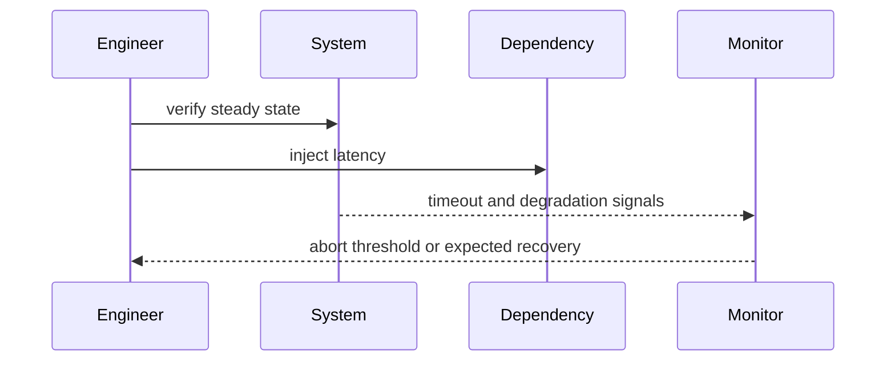

# Chaos Engineering — Junior

Start in a safe environment with one fault: terminate a worker, delay a dependency, or fill a bounded queue. Predict the user-visible result first.

## Test yourself

1. What is the steady-state measure?
2. Which condition aborts immediately?
3. How is blast radius bounded?
4. What proves recovery?

Continue to [`middle.md`](middle.md).
