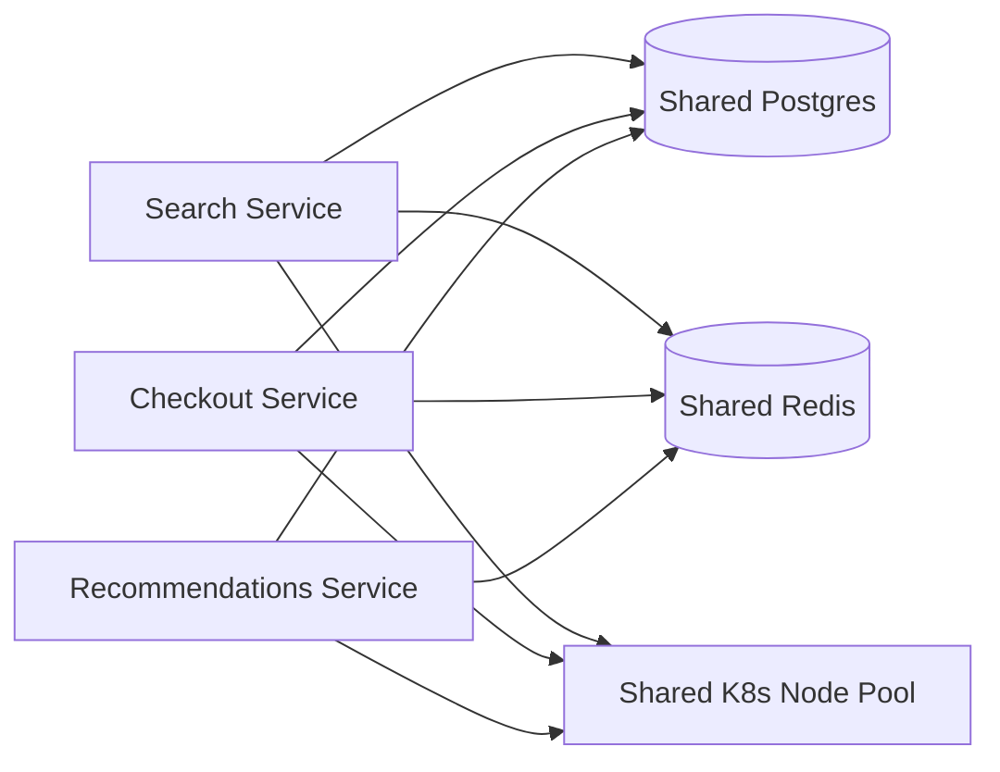

# Cost Modeling — Middle

<!-- level-focus -->
At middle level, focus on this question:

> When several features share the same underlying infrastructure, how do you choose an allocation method that produces trustworthy per-feature and per-team unit costs as usage patterns shift?

Use the smallest realistic scenario that exposes the decision and its failure behavior.

> **Roadmap:** [Cost Efficiency](../README.md) → Cost Modeling

*A junior-level unit cost divides one bill by one volume number for one service. The moment three features share one database, one cache, and one Kubernetes cluster, "divide total cost by total volume" stops answering the question anyone actually has: which feature is expensive?*

---

## Core Concept 1 — From One Number to an Attribution Problem

A single-service cost model answers "what does this service cost per request." An attribution problem asks a harder question: **when a Postgres cluster, a Redis cache, and a Kubernetes node pool are shared by Search, Checkout, and Recommendations, how much of that shared bill belongs to each?**

There is no single correct answer — there are several defensible allocation methods, each with different failure modes:

| Method | How it works | Strength | Weakness |
|---|---|---|---|
| **Even split** | Divide shared cost equally across N consumers | Trivial to compute, no instrumentation needed | Wildly wrong the moment consumption is uneven — a light feature subsidizes a heavy one |
| **Usage-weighted** | Allocate by a measured usage signal (request count, rows read, bytes transferred) | Reflects actual load reasonably well, uses metrics teams often already have | The usage signal can be a poor proxy for actual resource cost (a request that scans 10M rows costs far more than one that reads a cache) |
| **Resource-weighted** | Allocate by measured resource consumption (CPU-seconds, memory-seconds, IOPS) tagged per consumer | Closest to "what actually drove the bill" | Requires real instrumentation (tagging, per-tenant resource metrics) that most teams don't have on day one |
| **Tag-based (cloud-native)** | Allocate using cloud provider cost-allocation tags on each resource | Reconciles cleanly against the actual invoice | Only as accurate as tagging discipline; untagged or shared resources fall into an "unallocated" bucket |

None of these is free. Even split is fast and wrong; resource-weighted is accurate and expensive to build. The middle-level judgment is choosing the cheapest method that is *accurate enough for the decision being made* — a rough allocation is fine for "should we worry about Recommendations' cost," but not for a chargeback that determines a team's budget.

## Core Concept 2 — A Shared-Infrastructure Scenario

Take an e-commerce backend where `Search`, `Checkout`, and `Recommendations` all read and write the same Postgres cluster and the same Redis cache, and all run on the same Kubernetes node pool.



The shared bill for one month: Postgres cluster $9,000, Redis $3,000, Kubernetes node pool $14,000 — total $26,000. None of these three line items has a native per-team breakdown; the cloud invoice just says "one Postgres cluster."

Two allocation methods produce different verdicts about which service is "expensive":

| Service | Requests/month (share) | CPU-seconds/month (share) | Even split | Usage-weighted (by requests) | Resource-weighted (by CPU-seconds) |
|---|---|---|---|---|---|
| Search | 60% | 25% | $8,667 | $15,600 | $6,500 |
| Checkout | 15% | 55% | $8,667 | $3,900 | $14,300 |
| Recommendations | 25% | 20% | $8,667 | $6,500 | $5,200 |

Search handles the most requests but each one is cheap (a fast, cache-friendly lookup); Checkout handles far fewer requests but each one does heavier work (multiple writes, a payment call, an inventory check) and consumes most of the CPU time. Usage-weighted allocation makes Search look like the expensive service; resource-weighted allocation reveals Checkout is actually the one consuming the bulk of the shared infrastructure. If a team used the usage-weighted number to decide where to invest in cost optimization, they would optimize the wrong service.

## Core Concept 3 — Testability and Debuggability of an Allocation Model

Treat the allocation model itself as something that can be wrong, and build in a way to check it:

- **Reconciliation invariant.** The sum of every service's allocated cost must equal the shared bill's actual total. If Search + Checkout + Recommendations ≠ $26,000, the model has a bug — a resource counted twice, or a resource missed entirely.
- **Traceable inputs.** Each allocation should point to the metric it was computed from (this month's CPU-seconds by pod label, this month's request count by service tag) so a teammate can recompute it independently, not just trust a spreadsheet cell.
- **Stability check.** Re-running the same method on the same underlying data twice should produce the same number. An allocation that depends on manual, undocumented adjustments each month isn't debuggable.

A model that only produces a final dollar figure per team, with no visible path back to the metric that produced it, is not verifiable — nobody can tell if last month's number was right, and nobody can tell why this month's number moved.

## Core Concept 4 — Under- and Over-Application Signals

**Under-modeling** shows up as: every shared resource lands in one undifferentiated "platform infra" bucket that no team's cost report reflects, a team's unit economics look artificially cheap because their heaviest shared-resource usage is hidden in someone else's budget line, or nobody can answer "which feature should we optimize first" because there's no per-feature number to compare.

**Over-modeling** shows up as: an allocation spreadsheet with forty adjustment factors that took two people a week to build and that nobody trusts enough to act on, resource-level tagging effort spent on a service whose shared-cost share is 2% of the bill, or an allocation method so granular it changes noticeably month to month for reasons nobody can explain, making the number look precise while actually being noisy.

The middle-level correction: allocate the top two or three shared resources (the ones that are actually large relative to the total bill) with a method accurate enough to trust, and leave small, low-impact shared costs on an even split or a coarser bucket. Spending equal precision on every line item wastes effort on the ones that don't matter and often delays getting the ones that do matter modeled at all.

## Core Concept 5 — Incremental Adoption

Rolling out feature/team-level cost attribution across a codebase in one pass usually stalls. A workable order:

1. **Identify the largest shared cost first** (here, the Kubernetes node pool at $14,000, over half the shared bill) and get that one allocated with a method the receiving teams accept as fair.
2. **Instrument the minimum needed for that one resource** — CPU-seconds per pod label is usually already available from the cluster's metrics; it rarely requires new code.
3. **Reconcile it against the actual invoice for one full month** before trusting it, to catch double-counted or missed resources early.
4. **Extend the same method to the next-largest shared resource**, reusing the reconciliation habit rather than inventing a new process each time.
5. **Only then decide whether the smaller shared resources (Redis at $3,000) need their own precise allocation**, or whether an even split is good enough given their size relative to the total.

## Core Concept 6 — Verifying at Unit and Integrated-Flow Level

- **Unit level.** Does the allocation calculation for one service, given a fixed set of inputs (CPU-seconds, request count), produce the number you expect? Write a small test against the allocation function itself with known inputs and a hand-computed expected output — this catches an arithmetic or weighting bug before it reaches a report anyone reads.
- **Integrated-flow level.** Does the *sum* of all services' allocated shares, computed through the real pipeline (metrics source → allocation function → per-team report), equal the shared bill's actual total for a real month? This is the reconciliation invariant from Core Concept 3, checked end to end rather than assumed.

```python
# Unit-level check: the allocation function itself, with known inputs.
def test_resource_weighted_allocation_sums_to_total():
    shares = allocate_by_cpu_seconds(
        total_cost=14000,
        cpu_seconds={"search": 2500, "checkout": 5500, "recommendations": 2000},
    )
    assert shares["search"] + shares["checkout"] + shares["recommendations"] == 14000
    assert round(shares["checkout"], 2) == 7700.00  # 55% of $14,000
```

A test like this catches the most common allocation bug: a rounding or weighting error that leaves a few hundred dollars unaccounted for, silently understating every team's true cost.

---

## Real-World Examples

- **Usage-weighted allocation hides the real cost driver.** A team optimizes Search's caching layer because the usage-weighted report shows Search as the most expensive service — but the shared Kubernetes bill barely moves, because Checkout, not Search, was the actual CPU consumer all along.
- **An allocation model that doesn't reconcile.** A spreadsheet allocates the Postgres bill by an outdated even-split assumption from a year ago, before Recommendations existed as a separate service. The three teams' reported shares sum to less than the actual invoice, and nobody notices for two quarters because no one checks the total against the bill.
- **Over-precision that erodes trust.** A finance-driven initiative asks every team to tag every resource down to the individual endpoint. Three months later, half the tags are stale because endpoints were renamed, and teams quietly stop trusting the per-endpoint numbers — while the two resources that actually mattered (the shared database and the node pool) were never even the bottleneck in the first tagging pass.

## Common Mistakes

- **Choosing even split by default because it's easiest**, even when usage is visibly uneven — this systematically overcharges light consumers and undercharges heavy ones.
- **Trusting a usage-weighted metric without checking whether it correlates with actual resource cost.** Request count is a poor proxy when request *cost* varies widely between features.
- **Building an allocation model with no reconciliation step**, so a bug that drops or double-counts a resource goes unnoticed indefinitely.
- **Applying uniform precision to every shared resource** instead of prioritizing the one or two that dominate the bill.
- **Rolling out full-detail attribution to every team and every resource at once**, instead of proving the method on the largest shared cost first.

---

## Apply it

1. Take the three-service shared-infrastructure scenario above (Search, Checkout, Recommendations sharing Postgres, Redis, and a Kubernetes pool) and compute the even-split, usage-weighted, and resource-weighted allocations for the $9,000 Postgres line item, using this month's made-up split: Search reads 70% of queries but each read is a cheap cache-assisted lookup; Checkout issues 10% of queries but each one is a heavier transactional write; Recommendations issues 20% of queries at medium cost. Assign plausible CPU-second shares consistent with that description and show all three allocations.
2. Identify which method changes the "most expensive service" verdict compared to even split, and explain in one paragraph why that happens.
3. Write the reconciliation check for your own allocation: confirm the three services' shares sum exactly to $9,000.
4. Decide, and justify in two or three sentences, which single method you would actually recommend adopting for this line item, given the effort needed to instrument it versus the size of the decision it would inform.
5. Propose an incremental rollout order for allocating all three shared resources (Postgres, Redis, Kubernetes), starting with the one that would most change a real decision if attributed correctly.

## Verify your work

- All three allocation methods you computed sum exactly to the shared cost being allocated, with no leftover or double-counted dollars.
- You can name, in one sentence, why usage-weighted and resource-weighted allocation disagree about which service looks expensive in this scenario.
- Your recommended method is justified by a stated trade-off (accuracy needed versus instrumentation cost), not just "the most accurate one is always right."
- Your rollout order is justified by relative size of the shared resource, not simply alphabetical or arbitrary order.

## Review questions

- Why can a usage-weighted allocation and a resource-weighted allocation disagree about which service is the expensive one?
- What is the reconciliation invariant for a cost-allocation model, and why does violating it mean the model has a bug?
- What signals indicate a cost-allocation effort is under-modeled versus over-modeled?
- Why should the largest shared cost be attributed first when rolling out feature-level cost attribution incrementally?
