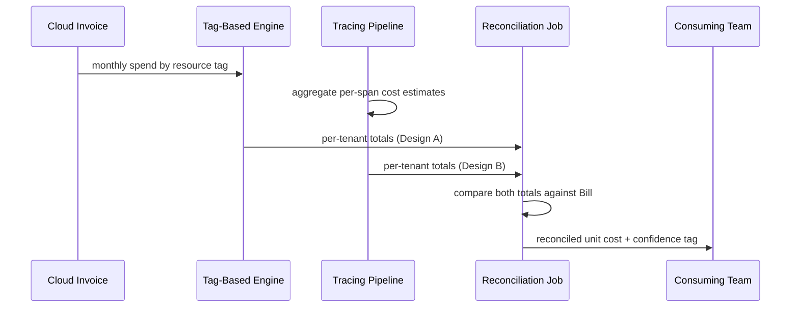

# Cost Modeling — Senior

<!-- level-focus -->
At senior level, focus on this question:

> What cost-model design and invariants keep unit-economics numbers trustworthy as the system scales across regions, tenants, and changing pricing arrangements, and what evidence would tell you the model has drifted from reality?

Use the smallest realistic scenario that exposes the decision and its failure behavior.

> **Roadmap:** [Cost Efficiency](../README.md) → Cost Modeling

*A middle-level allocation model reconciles against one month's bill for one shared resource. At senior level the system has multiple regions, multiple tenants, a mix of discounted and on-demand pricing, and the model has to keep telling the truth as all of that keeps changing underneath it.*

---

## Core Concept 1 — Deliberate Scope: What's Inside the Model, What's Outside

A cost model that tries to capture everything (engineering salaries, opportunity cost, overhead allocation from finance) becomes unfalsifiable — nobody can check it against anything, because there's no invoice for "opportunity cost." A senior-level model draws its boundary deliberately:

| Inside the model | Outside the model (tracked elsewhere) |
|---|---|
| Compute, storage, managed-service, and data-transfer spend directly billed by infrastructure providers | Engineering headcount cost, salaries |
| Third-party API and vendor costs billed per usage | Real-estate, office, and general overhead |
| Discounts, commitments, and credits that reduce the effective rate paid | Opportunity cost of features not built |

This isn't a claim that people-cost or opportunity-cost don't matter — it's a decision about what this *particular* model is responsible for being right about, so it can be checked against something concrete: the actual infrastructure invoice. A model that mixes billed infrastructure spend with an estimated headcount allocation produces a number nobody can verify, because half its inputs have no external source of truth to reconcile against.

## Core Concept 2 — Invariants the Model Must Never Violate

1. **Conservation.** The sum of every tenant's, team's, or feature's allocated cost must equal the total actual billed spend for the period, within a stated tolerance (commonly a low single-digit percentage, reserved for genuinely unallocable shared overhead). A model that routinely reconciles to 70% of the actual bill isn't a rough model — it's silently dropping a third of real spend somewhere.
2. **Attribution integrity.** A unit cost for feature A must not silently absorb cost actually driven by feature B. This breaks most easily when a shared resource's allocation key goes stale — an allocation weight computed from a usage pattern that existed six months ago, before an architecture change shifted load somewhere else.
3. **Reconciliation with reality, not with a budget.** The model must be checked against the actual invoice, not against a forecast or budget figure. A model that only ever compares itself to a plan can drift arbitrarily far from what was actually spent while still looking "on target."

Every invariant needs an owner check: a scheduled job that recomputes conservation and attribution integrity against the latest bill, not a person remembering to look once a quarter.

## Core Concept 3 — Failure Modes Specific to Scale

- **Stale allocation keys.** A resource-weighted allocation computed from last quarter's CPU-second distribution stops matching reality the moment a service is refactored, a feature's traffic moves to a different region, or a new tenant is onboarded with a very different usage shape. The model keeps producing numbers; they're just wrong.
- **Commitment and discount amortization.** Reserved instances, savings plans, and committed-use discounts change the *effective* rate paid for a resource, but that discount typically applies at the account or organization level, not per tenant or per feature. A model that allocates cost using on-demand list price when the org actually pays a discounted committed rate will overstate every unit cost proportionally — consistently wrong in the same direction, which is a subtler and more dangerous failure than random noise because it looks internally consistent.
- **Multi-tenant noisy neighbors.** In a shared, multi-tenant cluster, one tenant's unusual traffic spike can inflate the measured resource consumption attributed to *itself* correctly, but can also degrade shared infrastructure (e.g., forcing autoscaling that adds nodes everyone's allocation formula then divides across) in a way that inflates *everyone else's* unit cost too, for a cause that has nothing to do with their own usage.
- **Goodhart's law on the allocation metric.** Once a team's budget or performance review is tied to their modeled unit cost, they have an incentive to shape behavior around the metric rather than around actual efficiency — moving a workload to avoid the allocation key rather than making it genuinely cheaper. A model whose allocation key is easy to game without changing real spend will get gamed.

## Core Concept 4 — Evidence Over Assumption

A cost model built once in a workshop and never checked again reflects what the room assumed the system's cost structure looked like. A validated model is checked against:

- **Actual invoice reconciliation**, run every billing period, not just when someone remembers to. The conservation invariant from Core Concept 2 is the check; the invoice is the ground truth.
- **Back-testing against a known event.** If a past region expansion, a pricing-tier change, or a large single tenant's onboarding is already known to have moved the actual bill by a specific amount, the model should reproduce that movement when run against the same period's inputs. If it doesn't, the model's structure — not just its current inputs — is wrong.
- **Confidence-tagging entries the way a failure-mode catalog does.** Mark each allocation key as "reconciled against a real invoice this period," "computed from live metrics but not independently checked," or "a static estimate carried forward from an earlier period" — and prioritize refreshing the last category first, since it's the one most likely to have silently gone stale.

## Core Concept 5 — Cross-Component Scenario: Multi-Region, Mixed-Pricing SaaS Platform

A SaaS platform serves tenants from two regions, with a mix of reserved-instance capacity (covering baseline load) and on-demand instances (covering burst) in each region. Two plausible cost-model designs:

| Design | Mechanism | Trade-off |
|---|---|---|
| **A: Account-level tag-based allocation** | Cloud cost-allocation tags on each resource roll up to a per-tenant, per-region total; reserved-instance discounts are amortized proportionally across all usage in that account | Cheap to build, reconciles cleanly against the invoice by construction, but coarse — a noisy-neighbor tenant's excess burst usage gets smeared across everyone sharing that account's discount pool |
| **B: Request-level attribution via tracing** | Distributed-tracing spans are annotated with an estimated per-span resource cost, aggregated per tenant and per feature | Fine-grained enough to isolate a specific noisy tenant or expensive request pattern, but the per-span cost estimate is itself a model with its own error, and the volume of trace data makes the aggregation pipeline a new, expensive piece of infrastructure to run and keep correct |

Neither design is free. Design A trades precision for cheap, invoice-anchored trust — it's easy to reconcile because it's built directly from what generated the bill, but it cannot see inside an account to isolate a single misbehaving tenant. Design B trades cost and operational burden for precision — it can isolate the noisy tenant, but it introduces its own estimation error and a pipeline that itself needs to be monitored and reconciled, and if trace sampling drops spans under load (exactly when a noisy-neighbor incident is happening), Design B's numbers become least reliable at the moment they matter most. The senior-level judgment is not "pick the more precise design" — it's picking the design whose own failure mode is tolerable given what decision the number will drive: budget-level chargeback tolerates Design A's coarseness; diagnosing a specific tenant's abusive usage pattern needs something closer to Design B, at least temporarily and targeted at the suspect tenant rather than run continuously for everyone.

## Core Concept 6 — Questions That Expose Weak Assumptions

- "Does this model reconcile against the actual invoice, or only against a forecast?" — a model that only compares to a budget can drift indefinitely without anyone noticing.
- "What happens to this allocation when a discount or committed-use rate changes?" — if the answer is "we'd have to manually update it," the model has a silent staleness risk baked in.
- "Could a team change their reported unit cost without changing their actual resource usage?" — if yes, the allocation key is gameable, and someone eventually will, intentionally or not.
- "What does this model do with a noisy-neighbor tenant sharing our infrastructure?" — if the honest answer is "smear the cost across everyone else," that's worth stating explicitly rather than discovering during an incident review.
- "Which allocation keys were computed from live data this period, and which are carried forward from an earlier period?" — surfaces staleness before it causes a wrong decision.

## Core Concept 7 — Recovery and Evolution

A cost model needs a trigger for revisiting it, the same way an architecture needs a trigger for a failure-mode review: a new region or tenant onboarded, a pricing or discount-tier change, a service refactor that shifts which resource actually drives which feature's cost, or a reconciliation run that misses the conservation invariant's tolerance. Treat a reconciliation miss as a finding to investigate and record, not an annoyance to patch quietly — the root cause is usually a stale allocation key or a newly added resource that was never tagged, and both make the next version of the model more accurate than the last.

---

## Real-World Examples

- **A discount masks the real cost driver.** A reserved-instance commitment lowers the effective compute rate org-wide; a model still allocating at on-demand list price overstates every tenant's unit cost by the same proportion, making the *relative* ranking between tenants still directionally useful but the *absolute* number wrong enough to mislead a pricing decision based on it.
- **A noisy neighbor's cost gets smeared.** One tenant's traffic spike forces the shared cluster to autoscale; the account-level tag-based model allocates the new nodes' cost proportionally across all tenants, quietly raising everyone's unit cost for a cause none of them caused.
- **Trace sampling fails exactly when it's needed.** During a real noisy-neighbor incident, the tracing pipeline drops spans under the same load spike causing the incident, so Design B's fine-grained attribution becomes least trustworthy at the one moment someone actually needed to isolate the misbehaving tenant.

## Common Mistakes

- **Mixing billed infrastructure spend with unbillable estimates (headcount, opportunity cost) in one model**, producing a number nobody can reconcile against anything real.
- **Reconciling against a budget or forecast instead of the actual invoice**, allowing the model to drift indefinitely while still looking "on plan."
- **Allocating at list price when the org actually pays a discounted committed rate**, systematically overstating every unit cost in the same direction.
- **Assuming a more granular model (tracing-based) is strictly better** without checking whether its own pipeline degrades exactly when the incident it's meant to diagnose is happening.
- **Tying team incentives to a gameable allocation metric** without checking whether the metric can be moved without any real change in resource usage.

---

## Apply it

1. Take a system you know that has at least two regions or at least a mix of committed and on-demand pricing, and state explicitly what is inside your cost model's scope and what is deliberately left out.
2. Write the conservation invariant for that system in one sentence stating the tolerance you'd accept (e.g., "allocated totals must reconcile to the actual invoice within 2%").
3. Identify one allocation key in your system that is likely stale — computed from a usage pattern that has since changed — and describe what evidence would confirm it's stale.
4. Compare the tag-based and trace-based (or an equivalent coarse-vs-fine) design for one specific shared resource in your system, and state which decision each design is and isn't trustworthy enough to support.
5. Ask the five weak-assumption questions from Core Concept 6 against your system's actual cost model (or the informal one your team uses today), and write down which question exposed the weakest assumption.

## Verify your work

- Your scope statement names at least one thing deliberately excluded and why, not just what's included.
- Your conservation invariant names a specific numeric tolerance, not a vague "should roughly match."
- Your stale-allocation-key answer names a concrete piece of evidence (a changed traffic pattern, a refactor, a new tenant) rather than a general suspicion.
- Your design comparison states, for each design, at least one real decision it should not be trusted to inform.
- Applying the five questions surfaces at least one assumption your team's current cost model doesn't actually address.

## Review questions

- Why does mixing billed infrastructure spend with unbillable estimates like headcount produce a model nobody can verify?
- Why is reconciling a cost model against a budget insufficient, and what should it be reconciled against instead?
- How can a reserved-instance or committed-use discount cause a cost model to be wrong in a consistent, hard-to-notice direction?
- Why can a more fine-grained, trace-based cost model become least reliable at exactly the moment it's most needed?
