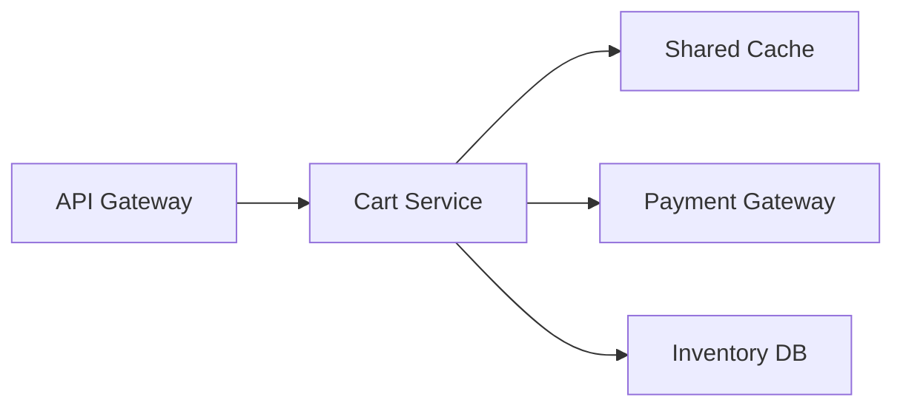

# Capacity Planning — Middle

<!-- level-focus -->
At middle level, focus on this question:

> When a request path crosses tiers with different scale-out speeds and different growth curves, how do you set a headroom target and an autoscaling policy for each tier instead of applying one number everywhere?

Use the smallest realistic scenario that exposes the decision and its failure behavior.

> **Roadmap:** [Cost Efficiency](../README.md) → Capacity Planning

*A single headroom number applied uniformly across a whole request path is a junior-level shortcut. The tiers don't scale at the same speed, so they shouldn't carry the same buffer.*

---

## Core Concept 1 — Choosing a Forecasting Method

A junior-level projection usually applies one compounding growth rate to everything. At middle level, the more useful move is matching the forecasting method to the traffic pattern you're actually looking at:

| Method | When it fits | Risk if misapplied |
|---|---|---|
| **Linear** | Slow, steady, non-compounding growth (e.g., a niche internal tool gaining a handful of users a month) | Understates capacity needs badly if growth is actually compounding |
| **Compounding (percentage-based)** | Product growth, viral or network-effect traffic, most consumer-facing services | Overstates near-term needs if a growth burst was a one-time event rather than a trend |
| **Seasonal / cyclical** | Traffic with strong daily, weekly, or calendar patterns (retail before a holiday, payroll systems at month-end) | A flat growth-rate model completely misses the predictable spike, so the fleet under-provisions right when it matters most |

The discipline: don't default to whichever method is easiest to compute. Plot recent history first, and pick the model that actually fits the shape of the data — then **backtest** it: apply the model to last quarter's starting point and check whether it would have predicted this quarter's actual peak within a reasonable margin. A model that hasn't been checked against real history is a guess wearing a formula.

## Core Concept 2 — Headroom Targets Differ by Scale-Out Speed

The junior level treats "headroom target" as one number. The middle-level insight is that headroom exists to cover the gap between *when you notice you need more capacity* and *when that capacity is actually serving traffic* — and that gap varies enormously by tier:

| Tier | Typical scale-out lead time | Headroom implication |
|---|---|---|
| Stateless app/web instances behind an autoscaler | Seconds to a couple of minutes | Can run thinner headroom — the autoscaler reacts before a slow-building spike becomes a problem |
| Cache cluster (fixed shard count) | Manual resharding or resize, often hours | Needs a bigger pre-provisioned buffer; you can't autoscale your way out of a cache miss storm in real time |
| Database / read replicas | Provisioning a new replica plus replication catch-up, often tens of minutes to hours | Needs the largest buffer of any tier here, or a pre-planned schedule for adding replicas ahead of known growth, not a reactive trigger |
| External dependency (a third-party payment processor, a partner API) | Not under your control at all — often a contractual rate limit | Headroom here means staying under the negotiated limit, and knowing the escalation path if you need it raised |

Treating every tier's headroom the same way either wastes money (thin margins on a slow-to-scale database force emergency manual intervention) or wastes it in the other direction (thick margins on a fast-autoscaling web tier that never needed the buffer).

## Core Concept 3 — Autoscaling Policy Inputs Come From the Capacity Model

An autoscaler's configuration is not a separate decision from the capacity model — the model should produce the policy's numbers directly:

- **Target utilization** — the autoscaler's scale-out trigger should equal the headroom target from the capacity calculation (if the model says "operate at ≤70% of saturation," the autoscaler's target metric is 70%, not an arbitrary default).
- **Cooldown period** — set long enough that the newly added instance is actually warmed up and absorbing traffic before the autoscaler evaluates again, or you get overshoot: adding instances faster than they can become useful.
- **Min/max instance count** — the minimum should cover your *lowest* expected valid traffic without flapping; the maximum should be a deliberate ceiling tied to what the tiers behind this one (database connections, downstream rate limits) can actually absorb, not left at whatever the default quota happens to be.

## Core Concept 4 — Worked Scenario: A Checkout Path Under Growth

Take a checkout flow: `API Gateway → Cart Service (stateless, autoscaled) → Payment Gateway (external, rate-limited) → Inventory DB (read replicas)`, with Cart Service also reading through a shared cache.

Projected growth (from Core Concept 1's backtested model) says peak traffic will justify scaling Cart Service from 4 instances to 6 over the next quarter. Each Cart Service instance holds a connection pool of 20 connections to the Inventory DB. The DB's `max_connections` is set to 100.

| Cart Service instances | Connections requested (20 each) | DB max_connections | Result |
|---|---|---|---|
| 4 (today) | 80 | 100 | Fine — 20 spare |
| 5 | 100 | 100 | Exactly at limit — no slack |
| 6 (projected) | 120 | 100 | **Exceeds limit** — new connections get refused or queued |

This is the failure a per-tier capacity model misses: Cart Service's *own* capacity model looked healthy at 6 instances (CPU, memory, and request-handling headroom were all fine), but the Inventory DB's connection limit — a shared resource nobody modeled against the app tier's planned growth — becomes the actual ceiling. The real capacity limit of this request path is `min(Cart Service capacity, DB connection budget / pool size per instance)`, not Cart Service's number alone. Composing the tiers' models, instead of treating each in isolation, is what catches this before it becomes an incident.

## Core Concept 5 — Under- and Over-Application Signals

**Under-provisioning** shows up as: repeated manual scale-ups during an active incident, alerts firing at every peak instead of ahead of it, or a growth trend that outpaced the last capacity review by the time anyone looked again.

**Over-provisioning** shows up as: fleets sitting at 20–30% utilization even at peak with no plan to right-size, an autoscaler that has never once triggered a scale-out event since it was configured, or a headroom target copied from a critical payment path onto a low-traffic internal tool that never needed it.

Both are capacity-planning failures, just in opposite directions — the correction for over-provisioning is not "remove all buffer," it's matching the headroom target to that tier's actual scale-out lead time and criticality, rather than defaulting to the most conservative number everywhere.

## Core Concept 6 — Incremental Adoption

Don't try to build a composed capacity model for every tier at once:

1. Identify the tier with the **slowest scale-out lead time** on your critical path (usually the database) — that's where a wrong model is most expensive to discover late.
2. Model that tier first, including its shared-resource limits (connection pools, replica lag budget).
3. Model the tier immediately upstream of it, specifically checking for the kind of composed limit shown in Core Concept 4.
4. Only then extend the same method to less critical or faster-scaling tiers, where a rough model is a smaller risk.

## Core Concept 7 — Verifying at Two Levels

- **Unit level** — does the autoscaler's actual configuration match the number the capacity model produced? A config review that checks "target utilization = 70%, matching the model" catches drift between what was calculated and what was deployed.
- **Integrated-flow level** — run a load test against the *whole path* at the projected future peak (not each tier in isolation), specifically to surface composed limits like the connection-pool example above. A per-tier synthetic test would have shown Cart Service healthy at 6 instances; only an end-to-end test at that instance count exposes the DB connection ceiling.

---

## Common Mistakes

- **Modeling each tier's capacity in isolation.** The connection-pool scenario above is the textbook version of this: every tier looks fine alone, and the shared resource between them is what actually breaks.
- **Applying one headroom percentage to every tier regardless of scale-out lead time.** A cache cluster and an autoscaled web tier do not deserve the same buffer.
- **Setting autoscaler thresholds without connecting them back to the capacity model.** A target-utilization value picked arbitrarily, instead of derived from the load-tested saturation point, means the autoscaler is reacting to a number that was never actually validated.
- **Never backtesting the growth model.** A compounding-growth assumption that was never checked against last quarter's actual numbers might be systematically wrong in either direction.
- **Testing capacity per-tier and calling it done.** Without an integrated-flow load test at the projected instance counts, composed limits stay invisible until they happen in production.

---

## Apply it

1. Pick a real multi-tier request path you own (or the checkout example above), and diagram every tier it touches, noting each tier's approximate scale-out lead time.
2. For the two slowest-scaling tiers, state the headroom target you'd use and why, referencing that lead time explicitly.
3. Find one shared resource (a connection pool, a rate limit, a fixed-size cache) that more than one tier depends on, and calculate whether your planned growth in the upstream tier would exceed that shared resource's limit — show the arithmetic, as in Core Concept 4.
4. Translate your capacity model's headroom target into a concrete autoscaler configuration value (target utilization, min/max instances) for one tier.
5. Describe the integrated-flow load test you would run to confirm the composed limit from step 3 either holds or breaks, and at what traffic level you'd run it.

## Verify your work

- Your headroom targets differ across tiers, and each one is justified by that tier's actual scale-out lead time, not copied uniformly.
- Your shared-resource calculation names the specific limit (a number: max connections, a rate-limit ceiling) and shows the arithmetic that determines whether planned growth breaches it.
- Your autoscaler configuration value traces directly back to a number in your capacity model — someone could reconstruct the config from the model alone.
- Your integrated-flow test plan specifies the traffic level and the tier you expect to break first, not just "load test the system."

## Review questions

- Why should headroom targets differ between a stateless autoscaled tier and a database tier?
- How can a capacity model that looks correct for every individual tier still miss the system's real capacity limit?
- What should determine an autoscaler's target-utilization threshold, if not an arbitrary default?
- Why does an integrated-flow load test catch problems that per-tier synthetic tests miss?
