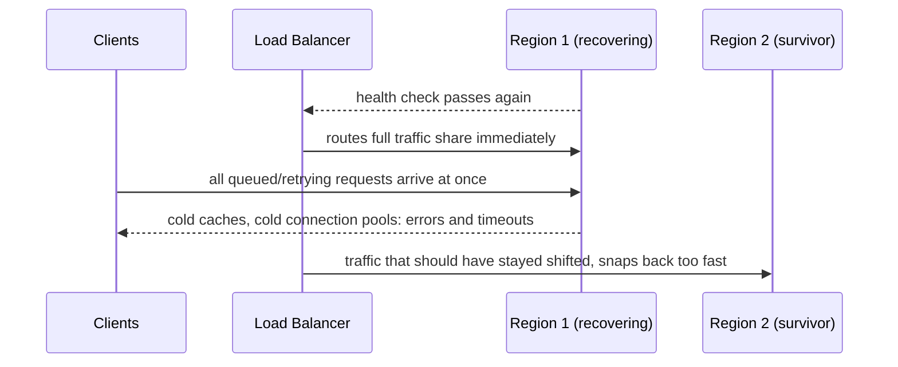

# Capacity Planning — Senior

<!-- level-focus -->
At senior level, focus on this question:

> What evidence proves your capacity plan holds when a whole failure domain is lost, and which shared bottleneck would break every tier's individual headroom assumption at the same moment?

Use the smallest realistic scenario that exposes the decision and its failure behavior.

> **Roadmap:** [Cost Efficiency](../README.md) → Capacity Planning

*A capacity plan validated only against steady growth is a plan for the easy case. The hard case is the moment demand jumps discontinuously — a region fails over, a competitor's outage sends you their traffic, a feature launches faster than expected — and headroom that looked comfortable evaporates all at once.*

---

## Core Concept 1 — The Invariant: SLO Holds at Peak Under N-1

A middle-level capacity plan targets steady projected growth. A senior-level plan states an explicit invariant: **the system holds its latency and error-rate targets at projected peak, even with one failure domain unavailable** — one availability zone down, one region down, one large shard offline. This is the capacity equivalent of the reliability invariants used in failure-mode analysis: a property that must hold regardless of what fails, not just under the easy, everything-healthy case.

The practical consequence: if you run two regions and plan each one's capacity only for its own steady growth, you have implicitly assumed the invariant doesn't need to hold — because the moment one region fails over, the survivor doesn't absorb its own growth, it absorbs both regions' peak traffic at once. A capacity plan that never states this invariant explicitly will pass every normal-operation load test and still fail the first real failover.

## Core Concept 2 — Correlated Saturation Across Tiers

The middle level found one composed limit (a shared connection pool). At senior level, the pattern generalizes: **any resource shared across "independently" scaled tiers or regions is a candidate for correlated saturation**, and correlated saturation is what turns an isolated incident into a cascading one.

Common shared bottlenecks that per-tier or per-region capacity models miss:

- **A shared downstream dependency** — two regions' checkout paths both call the same single-instance payment processor account or the same central rate-limited third-party API. Doubling one region's load during failover doubles pressure on that shared dependency too, regardless of how much local compute headroom either region has.
- **A shared control-plane resource** — a service mesh's certificate authority, a shared DNS resolver, a shared secrets store. These rarely appear in a capacity model at all because they're "infrastructure," not "the service," yet they saturate under the same load spike everything else does.
- **A shared observability or logging pipeline** — ironically, the exact system you'd rely on to diagnose a capacity incident can itself saturate under the burst of error logs and traces the incident produces, blinding you at the moment you need visibility most.

## Core Concept 3 — Autoscale Storms and the Scale-Up Lead-Time Gap

Two failure modes are specific to capacity planning itself, not to the system being planned for:

**Thundering herd on recovery.** When a failed component comes back, every client that was queued, retrying, or failed-over hits it simultaneously — the fresh-but-cold component can saturate and fail again immediately, even though its steady-state capacity is fine.

**The scale-up lead-time gap.** Between the moment demand crosses your headroom target and the moment new capacity is actually serving traffic (instance boot, cache warm, connection pool fill, JIT/GC warm-up for some runtimes), demand keeps growing. If the lead time is five minutes and demand is spiking faster than that, the plan needs either a bigger pre-provisioned buffer or a pre-warmed standby pool — reactive autoscaling alone cannot close a gap that's structurally faster than its own reaction time.

Both failure modes exist regardless of how accurate the underlying growth forecast is — they're properties of the *mechanism* of adding capacity, not of the demand projection, which is why they belong in a senior-level review even when the numbers look solid.

## Core Concept 4 — Evidence Over Extrapolation

A capacity number is only trustworthy to the degree it was validated, not assumed:

- **Load-test to actual saturation, not extrapolated from low load.** A benchmark run at 20% of expected peak and linearly scaled up hides non-linear effects — garbage-collection pauses, lock contention, connection-pool exhaustion — that only appear near the real ceiling. The only way to know the true saturation point is to actually reach it in a test.
- **Failover drills, not just architecture diagrams.** A design that claims "the surviving region absorbs a full failover" is an assumption until a real or simulated failover drill confirms the surviving region's capacity actually holds SLO under that doubled load, not just that the diagram shows redundant capacity existing somewhere.
- **Incident history reconciliation.** Every past capacity-related incident should map to something the current plan now accounts for. A plan with zero entries traceable to a real past incident either belongs to a young system or hasn't been reconciled against what actually happened.

Treat each capacity assumption as carrying a confidence level — *confirmed by a load test at real saturation*, *confirmed by a failover drill*, or *assumed, not yet validated* — and prioritize validating the assumed ones that would break the N-1 invariant first.

## Core Concept 5 — Cross-Component Scenario: Two Designs for Regional Failover Capacity

Consider a payment system running active-active across two regions, each normally handling half of total peak traffic.

| Design | Behavior under one region's failure | Trade-off |
|---|---|---|
| **A: Symmetric N-1 pre-provisioning** — each region always runs enough capacity to independently absorb full global peak | Surviving region already has the headroom; no scale-up lead-time gap during the worst moment | Every region runs at roughly half utilization all the time — a standing cost paid whether or not a failover ever happens |
| **B: Reactive burst autoscaling on failover signal** — each region sized for its own steady peak, with autoscaling triggered by the failover event itself | Cheaper day to day, no idle standing capacity | Exposed to the scale-up lead-time gap and the thundering-herd pattern from Core Concept 3, exactly when the system is already degraded |

Neither is free. Design A trades ongoing cost for a validated invariant that holds without depending on a fast reaction; Design B trades cost efficiency for exposure during the exact window failover is meant to protect against. The senior-level judgment isn't "pick the cheaper one" or "pick the safer one" reflexively — it's checking which failure modes each design actually eliminates versus merely defers, and whether the scale-up lead-time gap in Design B has been closed by pre-warming (a partial middle ground: some standing buffer, sized to exactly cover the lead-time gap, rather than the full failover load).

## Core Concept 6 — Questions That Expose Weak Assumptions

- "Was this saturation point measured at real saturation, or extrapolated from a lower-load benchmark?"
- "If our primary region fails over, what does the survivor's capacity plan assume about the failed region's traffic — and has that assumption ever been tested in a real drill?"
- "What's the lead time to add capacity here, and how does it compare to how fast demand can actually spike?"
- "Is there a resource — a dependency, a control-plane service, a logging pipeline — that both halves of this 'redundant' design actually share?"
- "If this failure mode happened right now, would our capacity metrics show it clearly, or would it look like a routine spike until it was too late?"

## Core Concept 7 — Recovery and Evolution

A capacity plan needs a trigger for revisiting it, the same as a failure-mode catalog does: a new shared dependency being introduced, a new region being added, a growth curve that broke its last backtest, or a failover drill that didn't hold SLO. Treat "the plan didn't predict this" as a finding to record — usually the fix is a newly identified correlated bottleneck or a previously assumed capacity number finally getting validated, and both make the next revision more trustworthy than the last.

---

## Common Mistakes

- **Validating capacity only under steady growth, never under a failure scenario.** The N-1 invariant is exactly the case a growth-only model never tests.
- **Extrapolating saturation from a low-load benchmark.** Non-linear breakdown (GC, lock contention, pool exhaustion) only shows up near the real ceiling; extrapolation hides it until production finds it.
- **Missing a shared bottleneck because it's "infrastructure," not "the service."** A shared payment processor account, control plane, or logging pipeline saturates under the same spike as everything else, whether or not it appears in the capacity diagram.
- **Trusting reactive autoscaling to close a lead-time gap it's structurally too slow to close.** If demand can spike faster than new capacity can come online, no autoscaler configuration fixes that — only pre-provisioned buffer or pre-warming does.
- **Never running a real failover drill.** A redundant design that has only ever been reasoned about on a whiteboard is an assumption, not a validated capacity plan.

---

## Apply it

1. State your system's capacity invariant explicitly — for example, "SLO holds at projected peak with one availability zone or region unavailable" — for one real system you know.
2. Identify one shared resource that more than one of your "independent" tiers or regions actually depends on, and describe what happens to it if failover doubles load on the survivor.
3. For one saturation number your team currently relies on, state whether it was measured at real saturation or extrapolated, and if extrapolated, describe the load test that would confirm or correct it.
4. Compare two designs (pre-provisioned N-1 capacity vs. reactive burst autoscaling) for one real failover scenario, and state which failure mode each one leaves unaddressed.
5. Ask the five weak-assumption questions from Core Concept 6 against a real capacity decision your team made, and record which question exposed the shakiest assumption.

## Verify your work

- Your invariant is stated as a specific, falsifiable condition (a named failure domain and a named SLO), not a vague "the system should be resilient."
- Your shared-resource answer names the specific resource and shows what doubles or breaks under failover, not a general "things might interact."
- Your saturation-number review results in a concrete next step (a specific load test to run) if the number was extrapolated rather than measured at real saturation.
- Your design comparison names which failure mode (lead-time gap, thundering herd, standing cost) each option leaves exposed, not just which one is cheaper.

## Review questions

- Why does a capacity plan validated only under steady growth fail to prove the N-1 invariant holds?
- What makes a shared dependency a candidate for correlated saturation even when each tier's own capacity looks fine?
- Why can extrapolating a saturation point from a low-load benchmark be worse than not measuring it precisely at all?
- What closes the scale-up lead-time gap when reactive autoscaling is structurally too slow to close it?
