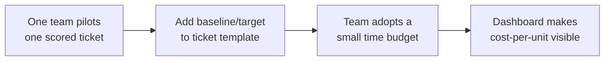

# Efficiency as a Feature — Middle

<!-- level-focus -->
At middle level, focus on this question:

> When an efficiency fix competes with feature work and with other efficiency fixes for the same sprint capacity, how do I decide what to prioritize, and how do I stop it from silently sliding to the bottom of the backlog forever?

Use the smallest realistic scenario that exposes the decision and its failure behavior.

---

## Core Concept 1 — Efficiency Work Is a Competing Claim on Capacity

At junior level, the skill was writing one efficiency item well enough to be legible in planning. At middle level, the problem changes shape: you now have several legible efficiency items, a stack of feature requests, and one sprint's worth of engineering time — and someone has to decide which wins. This is the core of "efficiency as a feature": it does not get a separate lane that's exempt from prioritization, and it does not get automatically deprioritized just because no customer filed a ticket asking for it. It competes on the same board, using comparable evidence.

The comparison only works if efficiency items are scored on the same axes a feature would be: expected value, effort, confidence, and time-to-payback — not vibes about what "feels wasteful."

## Core Concept 2 — Scoring Efficiency Against Feature Work

A lightweight, comparable scoring approach (an adaptation of RICE-style prioritization) puts efficiency and feature tickets on one backlog:

| Ticket | Estimated impact/month | Effort (eng-days) | Confidence | Payback period |
|---|---|---|---|---|
| Add product-list pagination (feature) | +$12k revenue (est.) | 8 | Medium | n/a (revenue, not cost) |
| Rightsize `search-api` instances | $3,100 saved | 2 | High (measured baseline) | ~2 weeks |
| Cache product-detail reads | $4,140 saved | 2 | Medium (estimated hit rate) | ~2 weeks |
| Migrate logs to cheaper tier | $900 saved | 5 | High | ~7 weeks |

Putting a payback period and a confidence level next to each row is what makes the comparison honest: a rightsizing change with a high-confidence, two-week payback can legitimately outrank a feature with a bigger but riskier upside, and a team lead can defend that call in a planning meeting instead of it looking like an arbitrary preference for "boring infra work."

The discipline that matters most here: **confidence is not the same as size.** A large estimated saving based on a guessed cache-hit-rate is not automatically more valuable than a smaller, measured saving — until it's been validated, discount it accordingly.

## Core Concept 3 — Efficiency Budgets: Protecting Capacity Without a Special Case

If efficiency work only ever wins a head-to-head prioritization fight against a shiny feature, it will lose most of the time — not because it's less valuable, but because feature impact is usually easier to sell in a planning meeting than a $3,100/month saving. The fix that works in practice is an **efficiency budget**: a standing allocation of capacity (for example, "10% of each sprint" or "one engineer-week per quarter per team") reserved for efficiency work, decided once at the policy level rather than re-litigated every sprint.

This is different from a hard ceiling on cloud spend (that's capacity planning) — an efficiency budget is a *staffing* commitment: a guaranteed slice of engineering time that efficiency tickets compete for among themselves, so they stop having to individually out-argue feature work for every sprint slot.

| Under-application signal | Over-application signal |
|---|---|
| No budget at all — every efficiency ticket must win an ad hoc argument against a named feature, and mostly loses | A budget so large it starves feature delivery, or teams inventing marginal "efficiency" tickets just to fill an allocation |
| Efficiency tickets pile up for quarters because nobody owns getting them scheduled | Rewriting a well-performing, cheap-enough system because an efficiency budget "needs to be spent" |
| Cost only gets attention after a bill spikes, never before | A team spending its efficiency budget on speculative rewrites with no baseline/target, defeating the point of the discipline |

## Core Concept 4 — Testability, Debugging, and Change Cost

Two efficiency tickets that promise similar savings are not equally good choices. The middle-level judgment call weighs the same three factors you'd use for any local design decision:

- **Testability of the claim.** Can you verify the saving in isolation, with a metric that isn't tangled up with ten other changes landing the same week? A caching change with its own hit-rate metric is easy to verify; a "general query optimization pass" across a shared service is not.
- **Debuggability if it goes wrong.** If cost *goes up* after the change (a bad cache invalidation strategy causing more origin traffic, a rightsized instance that starts throttling under peak load), how quickly can you tell, and how easily can you roll it back? Prefer changes with a fast, cheap rollback path over ones that require a second migration to undo.
- **Change cost for the team that owns the code afterward.** A cache adds an invalidation concern the owning team now has to reason about forever. A smaller instance type is nearly free to reason about later. Weigh the ongoing cognitive cost, not just the one-time engineering effort to ship it.

## Core Concept 5 — Incremental Adoption

Introducing "efficiency as a feature" into a team that has never worked this way should not start with a big-bang policy (mandatory budgets, a scorecard, a governance review). It works better as a small sequence:

- **One team, one ticket.** Prove the scoring approach works on a single real ticket before asking anyone else to adopt it.
- **Template change.** Once it's worked once, add baseline/target/owner fields to the team's normal ticket template so it's the default shape, not a special process.
- **Small time budget.** Only after a few tickets have shipped and been verified does a standing capacity allocation make sense — committing to a budget before you've proven the tickets are worth doing is premature.
- **Visibility.** A shared dashboard of cost-per-unit trend per service closes the loop and makes the next round of prioritization easier, because the evidence is already sitting there instead of needing to be re-gathered each time.

## Core Concept 6 — Scenario: Two Services, One Shared Budget

**Setup:** The checkout team and the search team share a quarterly efficiency budget of one engineer-week per team, agreed with their shared engineering manager. Both teams have efficiency tickets in their backlog.

- **Checkout team's ticket:** batch three sequential inventory-check calls into one call, estimated to save $1,800/month, high confidence (based on measured call volume), 3 days effort.
- **Search team's ticket:** move search-index snapshots to a cheaper storage tier, estimated to save $600/month, medium confidence, 4 days effort.

Both fit inside their respective one-week budgets, so this isn't actually a fight over one shared slot — it's two independent decisions. The interesting cross-component wrinkle: the checkout team's batching change touches the same inventory service the search team's indexing job reads from nightly. Before scheduling either ticket, both teams check whether the batching change alters the inventory service's response shape or timing in a way that would break the nightly index job — a five-minute conversation that would have been a production incident discovered the hard way if either team had treated their efficiency ticket as isolated just because it lived in their own backlog.

**Verification, at two levels:**

- **Unit level:** each team verifies its own metric independently — checkout confirms inventory-check call count and cost-per-checkout dropped as predicted; search confirms storage cost for snapshots dropped and index-restore time is still within its SLA after the tier change.
- **Integrated-flow level:** both teams confirm, a week after both changes ship, that the nightly index job still completes successfully end-to-end against the batched inventory API — the two changes were scoped independently but verified together, because they share a dependency.

## Common Mistakes

- **Scoring efficiency tickets on savings alone, without confidence or payback period**, which makes a speculative big number look better than a proven small one.
- **No standing efficiency budget**, so efficiency work only happens when someone champions it hard enough to beat a feature in an ad hoc argument, sprint after sprint.
- **An efficiency budget with no verification requirement**, which turns into a license to do speculative rewrites that never get checked against a baseline.
- **Ignoring cross-component dependencies** when two teams' efficiency changes touch a shared system, discovering the conflict in production instead of in planning.
- **Verifying only the metric the ticket promised**, and missing a regression the change caused somewhere else (a cache that dropped cost but broke read-after-write consistency for one caller).
- **Treating incremental adoption as optional** and trying to mandate a budget and a scorecard across every team in one announcement, which produces compliance theater instead of real adoption.

---

## Apply it

1. Take two or three real efficiency candidates from a backlog (or invent realistic ones) and score each on estimated impact, effort, confidence, and payback period, alongside at least one real feature ticket.
2. Propose a small efficiency budget for one team (for example, one engineer-day per sprint) and write down what would count as spending it well versus spending it on filler.
3. Pick the top-scored efficiency ticket and identify any other component or team that shares a dependency with the system it touches.
4. Ship (or simulate shipping) the change, and write the unit-level verification (does the ticket's own metric move as predicted) separately from the integrated-flow verification (does anything downstream still work correctly).
5. Update the shared cost dashboard or a simple before/after summary so the next prioritization round has evidence instead of starting from scratch.

## Verify your work

- At least one efficiency ticket and one feature ticket were scored on the same axes (impact, effort, confidence, payback), and the comparison is defensible in a planning conversation.
- The efficiency budget is a specific, stated amount of time, not an open-ended "when we get to it."
- A shared dependency between two components was identified and checked before either change shipped, not after.
- Unit-level verification (the ticket's own metric) and integrated-flow verification (the downstream system it touches) are both recorded, and they agree.

## Review questions

- Why should efficiency tickets be scored on the same axes as feature tickets instead of getting a separate, informal priority lane?
- What is the difference between an efficiency budget and a hard cloud-spend ceiling, and why does one require staffing commitment rather than a spend limit?
- What under-application and over-application signals would tell you an efficiency budget is set at the wrong size?
- Why does verifying an efficiency change sometimes require checking a different component than the one you changed?
