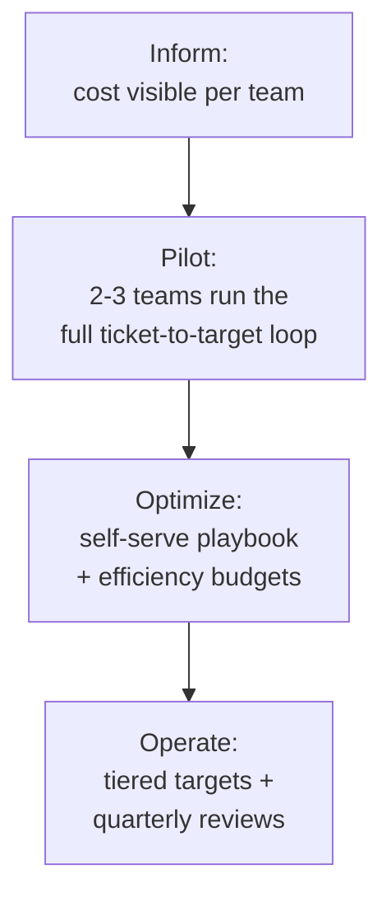

# Efficiency as a Feature — Professional

<!-- level-focus -->
At professional level, focus on this question:

> How do you build an organization-wide operating model — with clear cross-team accountability and evidence-based exit conditions — so cost efficiency keeps getting delivered as teams, priorities, and headcount keep changing, rather than surviving only as one hard push?

Use the smallest realistic scenario that exposes the decision and its failure behavior.

---

## Core Concept 1 — The Program Problem Is Different From the Design Problem

A senior engineer can design a durable ownership model for cost on one service or one shared platform. A **professional-level program** has to make "efficiency is treated like a feature, with an owner and a target" true across dozens of teams with different maturity, different appetite for this kind of work, and a roadmap that will always have louder, more urgent things competing for attention. The naive failure mode is a central FinOps or platform team that personally chases every team's cost dashboard — it works at five teams and collapses at fifty, because the center becomes a bottleneck and never understands any one service's trade-offs as well as the team that owns it.

The FinOps Foundation's widely-used **inform → optimize → operate** model describes the shape of a mature program well: first make cost visible and attributable (inform), then make people capable of acting on efficiency opportunities (optimize), then make it a standing, governed part of how the organization runs (operate) — not a one-time initiative that quietly stops the day its champion moves to a different role.

## Core Concept 2 — Decomposing the Rollout Into Reversible Increments

Rolling "efficiency as a feature" out to an entire engineering organization in one policy announcement is how these programs die, and it is also unfalsifiable mid-rollout — a stall could be normal adoption friction or a genuinely broken design, and a single big push gives you no way to tell which.

- **Inform.** Before asking any team to act, make cost-per-unit visible and attributable to the team that owns each service — this alone often surfaces the worst regressions and builds the case for the rest of the program without requiring a mandate.
- **Pilot.** Two or three willing teams run the full loop from earlier levels — scored efficiency tickets, a small time budget, a verified before/after — with direct support from whoever is championing the program. The goal is finding out what the ticket template, the budget size, and the dashboard actually need to contain, not achieving coverage.
- **Optimize.** Codify what the pilot learned into a self-serve playbook (ticket template, scoring rubric, a standard efficiency-budget size) any team can adopt without the central team in the room.
- **Operate.** The steady state: cost-per-unit targets are a normal input to quarterly planning for every tiered service, reviewed on the same cadence as reliability or security metrics, with a shared dashboard the organization already trusts because it was built during "inform."

Each stage produces a real decision point and is reversible — if the pilot shows the ticket template is wrong, it gets fixed once, cheaply, instead of forty teams independently discovering the same gap.

## Core Concept 3 — Cross-Team Contracts and Accountability

A program only scales if responsibility is unambiguous and written down, not assumed:

| Responsibility | Owned by | Why it can't sit with the other side |
|---|---|---|
| Cost attribution tooling and the shared dashboard | **Platform / FinOps function** | A dashboard every team half-builds themselves fragments into inconsistent numbers nobody trusts enough to act on |
| Setting the cost-per-unit target for a specific service | **Service-owning team** | Only the team that owns `checkout-api` understands what a defensible target looks like given its own traffic pattern and architecture |
| Scoring and scheduling their own efficiency tickets | **Service-owning team** | Centralizing scheduling recreates the same bottleneck a central execution team creates in any similar program |
| Tiering policy — which services must report a target, and on what cadence | **Platform / FinOps function** | Someone has to be able to say which of two hundred services are actually cost-critical without asking every team individually |
| Escalation when a team's cost-per-unit misses its own target for two consecutive quarters | **Joint: team explains, a defined reviewer (engineering leadership or FinOps) signs off on the remediation plan** | A target with no consequence for repeated misses quietly becomes decorative |

The failure mode of an implicit split is familiar from other cross-team programs: both sides assume the other owns the dashboard's accuracy, and nobody notices it has drifted until a team disputes a number in front of leadership.

## Core Concept 4 — Governance, Compliance, and Coordination Risk

At organization scale, risks appear that a single team's efficiency ticket never has to consider:

- **Chargeback/showback accuracy.** If cost attribution feeds into any actual budget allocation between teams or business units, the attribution model itself becomes something finance and engineering both depend on being correct — an attribution bug here isn't just an engineering annoyance, it can misallocate real budget between teams.
- **Access to billing data.** Giving every team visibility into their own cost-per-unit usually means giving broader access to cloud billing exports than existed before; this needs the same access-governance discipline as any other sensitive internal data, decided once by security/finance rather than negotiated per team.
- **Coordination with finance's own cadence.** Finance typically plans on a different cadence (annual budget cycles, quarterly forecasts) than engineering sprints. A program that reports "operate-stage" cost trends needs an agreed handoff — what number finance actually consumes, and how often — so engineering's dashboard and finance's forecast don't quietly diverge into two different "truths."
- **Avoiding a second shadow-IT problem.** If teams build their own cost-tracking scripts before central tooling exists (common during "inform"), the operate stage needs an explicit migration off of them — otherwise the organization ends up maintaining the same fragmentation the program was meant to fix, just with better intentions.

## Core Concept 5 — Outcome Measures and Exit Conditions

A program that cannot show it is working loses its budget and its champions the first time the organization gets busy with something else. Define measures and exit conditions before rollout:

| Measure | What it tells you | Healthy signal |
|---|---|---|
| **Coverage** — % of tier-1 services with a named cost owner and an active target | Whether the program is reaching the services that matter most | Rising toward 100% of tier-1, tracked explicitly, not assumed |
| **Target-hit rate** — % of teams meeting their own cost-per-unit target per quarter | Whether targets are being taken seriously or set-and-forgotten | Most teams hitting or explaining misses, not silently drifting |
| **Backlog aging** — median age of an efficiency ticket before it's scheduled | Whether the efficiency budget is a real allocation or decorative | Aging comparable to feature-ticket aging, not systematically longer |
| **Regression catch time** — days between a cost regression starting and a team being notified | Whether the visibility layer (Core Concept 2/3 of the senior level) is actually working at scale | Days, not months, and trending down as tooling matures |
| **Realized vs. estimated savings** | Whether tickets are actually verified after shipping, or estimates are trusted uncritically | A tracked ratio, ideally close to 1.0, with outliers investigated rather than ignored |

**Exit conditions** matter as much as the measures — each rollout stage needs an explicit, checkable definition of done. For example: "the optimize stage is complete when at least 80% of tier-1 teams have run one full ticket-to-verified-savings cycle using the shared playbook, and backlog aging for efficiency tickets is within 1.5x of feature-ticket aging" is a condition you can check. "Teams seem to be taking cost more seriously" is not.

## Core Concept 6 — A Sustained-Delivery Scenario: 18 Months, 6 Teams to 40

**Start:** A platform team pilots the ticket-to-target loop with 6 volunteer teams. Cost visibility exists only in raw billing exports; efficiency work happens only when a champion pushes it in planning.

**18 months later:** 40 teams, cost-per-unit tracked for all tier-1 and tier-2 services, quarterly target review folded into the same planning ritual teams already use for reliability OKRs.

- **What stayed the same:** the five-part ticket shape (baseline, change, target, verification, owner) from the junior level, and the scoring approach from the middle level — these transferred unchanged because they were never organization-scale concerns, just good ticket hygiene.
- **What had to change:** a manually-maintained spreadsheet of per-team costs became untenable past roughly 15 teams and was replaced by an automated attribution pipeline tied to the service catalog, so ownership updates automatically when the catalog's on-call field changes. Quarterly target-setting moved from an ad hoc conversation with the platform team into a standard planning-cycle input, because 40 teams cannot each individually negotiate a target with a central function every quarter.
- **What the organization measures now that it didn't at 6 teams:** target-hit rate and backlog aging *by team*, visible to engineering leadership without asking — at 6 teams everyone just knew who was keeping up, at 40 that knowledge doesn't fit in anyone's head, and the dashboard is what replaces it.
- **The signal the program is self-sustaining rather than running on one champion's energy:** new teams onboard themselves from the playbook without asking the platform team for help, and the realized-vs-estimated savings ratio stays close to 1.0 — evidence that verification discipline survived the scale-up rather than quietly eroding into unchecked estimates.

## Common Mistakes

- **Centralizing ticket execution instead of tooling and standards**, recreating the same bottleneck a single central reviewer creates at the service level, just at organizational scale.
- **Rolling out to every team before the pilot has proven the ticket template and budget size**, so the same gaps surface forty times in parallel instead of once, cheaply.
- **Cost attribution feeding a real chargeback process without the accuracy bar that requires**, creating a finance dispute the first time a team's number looks wrong to them.
- **Measuring activity (tickets filed) instead of outcomes** (targets hit, savings realized), which rewards teams for generating paperwork rather than real cost reduction.
- **No exit condition per rollout stage**, so the program stalls indefinitely in "pilot" with no trigger to advance or to honestly declare it isn't working as designed.
- **Letting the realized-vs-estimated ratio go unmeasured**, which is how "efficiency as a feature" quietly reverts to "efficiency as an unverified estimate" at scale.

---

## Apply it

1. Define the organization-level outcome the program should move — for example, "cost-per-unit for tier-1 services flat or declining despite traffic growth" — and the coverage/target-hit/backlog-aging measures that would show progress toward it.
2. Write the cross-team contract: which responsibilities sit with the platform/FinOps function, which sit with service-owning teams, and who signs off when a team misses its target repeatedly.
3. Decompose the rollout into the inform/pilot/optimize/operate stages, each with a written, checkable exit condition.
4. Run the pilot with 2-3 volunteer teams and use their tickets to revise the shared ticket template and target-setting process before wider rollout.
5. Publish the coverage, target-hit-rate, and realized-vs-estimated-savings dashboard, and review it on the same cadence as an existing planning ritual (sprint review, quarterly OKR check-in) rather than inventing a new meeting.

## Verify your work

- Each rollout stage has a written exit condition, and the program only advances when that condition is met, not on a fixed calendar date.
- The cross-team contract names an owner for attribution tooling, target-setting, ticket scheduling, and escalation on repeated misses, with nothing left implicit.
- Coverage and target-hit rate are visible per team without requiring anyone to ask individually.
- The realized-vs-estimated savings ratio is tracked, and at least one real ticket's post-ship number has been compared against its original estimate.

## Review questions

- Why does the FinOps inform/optimize/operate sequence matter as an order, rather than jumping straight to mandating targets?
- What must the cross-team contract specify explicitly to avoid an implicit gap in cost-attribution ownership?
- Why is an explicit, checkable exit condition necessary for each rollout stage, rather than a general sense that teams have "bought in"?
- What would a realized-vs-estimated savings ratio that drifts well below 1.0 across many teams actually indicate about the program?
