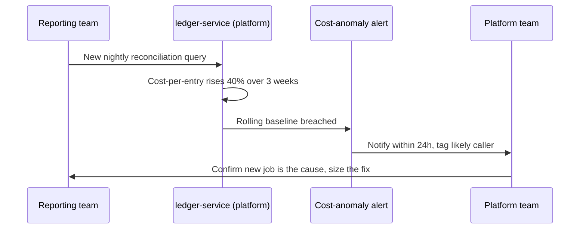

# Efficiency as a Feature — Senior

<!-- level-focus -->
At senior level, focus on this question:

> How do you design an ownership model for efficiency across a whole service or portfolio — one that catches cost regressions before they compound and survives roadmap pressure — without turning every feature launch into a review gate?

Use the smallest realistic scenario that exposes the decision and its failure behavior.

---

## Core Concept 1 — From One Ticket to a System of Ownership

A middle-level engineer can score one efficiency ticket well and defend it in a planning meeting. The senior-level problem is different in kind: design the *system* that decides which efficiency work happens across a portfolio of services, owned by different teams, over a timescale long enough that reorgs, roadmap pressure, and plain forgetting will all test it. A single well-run prioritization exercise proves a method works once. A durable ownership model has to keep working when the person who set it up moves to a different team.

The design question is a system-boundary question: what has to be centralized (so cost visibility and standards don't fragment into twenty inconsistent spreadsheets), and what has to stay decentralized (so every efficiency decision doesn't route through one overloaded reviewer who doesn't understand any one service as well as its owning team does)?

## Core Concept 2 — Invariants Worth Designing For

An efficiency ownership model is only as good as the invariants it protects. Three matter most:

| Invariant | Statement | Why it's the one that breaks first |
|---|---|---|
| **No silent regression** | Cost-per-unit for a tier-1 service does not move by more than an agreed threshold without someone being notified within days, not discovered a quarter later in a budget review | Without an alert, a regression is invisible until the bill is large enough to escalate, by which point it has been compounding for months |
| **Named ownership** | Every service with a cost-per-unit metric has one team accountable for it, discoverable without asking around | Reorgs and team splits routinely leave services "orphaned" for cost purposes even when they still have a code owner for correctness bugs |
| **Evidence before action** | A proposed efficiency change is validated against a real baseline and a real post-change measurement, not shipped on the strength of an estimate alone | Without this, "efficiency work" degenerates into speculative rewrites that may or may not help, indistinguishable from any other unvalidated change |

These are the properties you're actually protecting when you design the system — not "teams do efficiency work," which is too vague to defend or test.

## Core Concept 3 — Failure Modes and Recovery

Four failure modes recur across organizations that try to institutionalize this, and each has a distinct recovery path:

- **Silent cost creep.** A service's cost-per-unit rises gradually — a new feature adds an N+1 query, a cache hit rate degrades as data grows — and nobody notices because nothing alerts on the *trend*, only on absolute spend crossing some large threshold. Recovery: alert on cost-per-unit relative to its own rolling baseline, not just on absolute dollars, so a 20% regression on a small service is caught as reliably as one on a large service.
- **The gate becomes a rubber stamp.** A mandatory "cost review" step gets added to the launch process, and within two quarters it's a checkbox nobody reads carefully because it blocks every launch and has an incentive to be cleared fast. Recovery: replace a blocking gate with an *informational* signal at launch time (a projected cost-per-unit delta shown in the PR or launch checklist) plus a real alert after the fact if the projection was wrong — friction at the wrong moment doesn't produce diligence, it produces workarounds.
- **The dashboard nobody looks at.** Cost visibility exists, technically, but it's a dashboard buried three clicks deep that only the person who built it ever opens. Recovery: push the metric to where the owning team already looks — the same on-call dashboard, the same sprint review — rather than adding a new destination competing for attention with everything else.
- **Ownership diffuses during a reorg.** A service moves teams, and cost accountability doesn't move with it because it was never written down anywhere formal, only remembered informally by whoever set it up. Recovery: the same system of record that tracks *on-call ownership* for a service (a service catalog, an ownership registry) should carry cost ownership as a required field, so it moves automatically with any reorg that updates on-call, instead of needing a second, easily-forgotten handoff.

## Core Concept 4 — A Cross-Component Scenario

**Setup:** A payments platform team owns a shared `ledger-service` used by four product teams (checkout, refunds, payouts, reporting). Each product team calls `ledger-service` at different volumes and has its own cost-per-unit target for its own service, but none of them owns `ledger-service` itself — the platform team does.

**The failure that motivates the design:** the reporting team ships a new nightly reconciliation job that queries `ledger-service` far more heavily than before. `ledger-service`'s cost-per-unit (cost per ledger entry processed) rises 40% over three weeks. No single product team notices, because each team's own dashboard only shows *their* service's cost, and the platform team's dashboard shows total `ledger-service` spend, which looks like normal growth against rising overall transaction volume — the regression is hidden inside a metric that's aggregated at the wrong grain.

**Design response:** `ledger-service` needs per-caller cost attribution (which team's traffic drives which share of cost), not just an aggregate number, and the alert needs to fire on a rolling baseline deviation, not a fixed absolute threshold, since the anomaly here is a *rate-of-change* problem, invisible to a static ceiling. This is the senior-level insight the scenario is built to expose: shared infrastructure needs cost visibility broken down by consumer, or regressions caused by one team hide inside an aggregate that looks fine to everyone else.

## Core Concept 5 — Trade-offs Among Plausible Approaches

Three real design options exist for making efficiency ownership durable, and the right choice depends on the organization's size and culture — there is no universally correct answer, only trade-offs to make explicitly:

| Approach | Strength | Weakness | Fits best when |
|---|---|---|---|
| **Hard gate at launch/code review** | Guarantees every change is checked before it ships | Becomes a rubber stamp under volume; slows delivery; reviewers can't deeply understand every service | Small number of high-risk services, low launch frequency |
| **Cost-anomaly alerting (post-hoc, automated)** | Scales without a human bottleneck; catches regressions regardless of cause | Detects after the fact, not before — some cost is already spent before anyone acts | Larger portfolios, services with good existing metrics infrastructure |
| **OKR/KPI-driven (quarterly target owned by the team)** | Builds accountability into normal planning cadence teams already use; no new tooling required | Only as good as the team's own diligence; easy to deprioritize under roadmap pressure if not paired with visibility | Organizations where planning rituals are already strong and trusted |

In practice, a durable model usually combines the second and third: automated anomaly alerting supplies the evidence, and a quarterly cost-per-unit target owned by the team supplies the accountability — the gate approach is reserved only for the small number of services where a pre-launch check is genuinely worth its friction cost.

## Core Concept 6 — Evidence That Validates the Design (Not Preference)

A senior engineer proposing this kind of system should be able to point to evidence, not just argue from principle:

- **A real regression the current setup missed.** If you can find (or reconstruct) a past incident where cost crept up for weeks before anyone noticed, that's direct evidence the current visibility grain is wrong — exactly like the `ledger-service` scenario above.
- **A false-positive rate on any proposed alert threshold**, tested against historical cost data before it ships — an alert that fires every week on normal traffic variance will get muted within a month, which is functionally the same as not having it.
- **A comparison of gate friction versus catches.** If a mandatory review gate exists today, look at how many launches it actually stopped or changed versus how many it merely delayed — if the catch rate is near zero, that's evidence for replacing it with an informational signal instead of a blocker.

## Common Mistakes

- **Designing a single dashboard for the whole portfolio** with no per-consumer or per-team breakdown, which hides exactly the kind of regression the `ledger-service` scenario describes.
- **A gate that scales with launch volume but not with reviewer capacity**, guaranteeing it degrades into a rubber stamp as the organization grows.
- **Cost ownership that isn't written into the same system of record as on-call ownership**, so it silently disappears during the next reorg.
- **Alerting on absolute spend instead of relative/rolling deviation**, which misses gradual creep on small-to-medium services until it's large enough to matter on its own.
- **Proposing a design change without evidence of the failure it fixes**, which makes it indistinguishable from a preference and easy to deprioritize under pressure.

---

## Apply it

1. Pick a real (or realistic) piece of shared infrastructure with multiple internal consumers and check whether its cost dashboard is broken down per-consumer or only shown in aggregate.
2. Write down the three invariants from Core Concept 2 as they'd apply to that system, and identify which one is currently unprotected.
3. Design an alerting rule based on rolling-baseline deviation rather than an absolute threshold, and estimate (or test against historical data) its false-positive rate.
4. Decide, for this specific system, which of the three approaches in Core Concept 5 (gate, anomaly alert, OKR) fits best, and write the one sentence justifying why the other two are worse fits here.
5. Trace where cost ownership for this system is recorded, and confirm it would automatically transfer if the owning team were reorganized tomorrow.

## Verify your work

- The chosen visibility grain (per-consumer vs. aggregate) is justified against a real or plausible regression scenario it would have caught.
- The alerting rule is defined against a rolling baseline, and its false-positive rate has been estimated or tested, not assumed.
- The choice among gate / anomaly-alert / OKR is written down with an explicit reason tied to this system's launch frequency and criticality, not a default preference.
- Cost ownership for the system is discoverable from the same place on-call ownership is recorded.

## Review questions

- Why can a cost dashboard that looks healthy in aggregate still be hiding a real regression caused by one consumer?
- What makes a rolling-baseline alert more useful than a fixed absolute threshold for catching gradual cost creep?
- Under what conditions does a hard cost-review gate at launch make sense, and when does it degrade into a rubber stamp?
- Why does cost ownership need to live in the same system of record as on-call ownership rather than a separate document?
