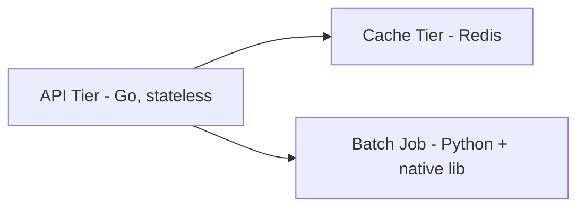

# Hardware-Aware Design — Middle

<!-- level-focus -->
At middle level, focus on this question:

> When a system is made of several components with different resource profiles, how do you choose an instance family per component, decide whether an ARM migration is worth it, and adopt the change incrementally without gambling the whole fleet on one guess?

Use the smallest realistic scenario that exposes the decision and its failure behavior.

*Junior-level profiling classifies one service. Middle-level work composes that classification across a whole system, weighs one architecture change (ARM vs x86) against the churn it causes, and rolls it out in a way you can back out of.*

---

## Core Concept 1 — Composite Profiling, Not a Single Snapshot

A single `vmstat` snapshot tells you the dominant bottleneck right now. A middle-level profile combines several signals into a table you can actually decide from, and separates **average** load from **peak** load — the peak is usually what determines the instance size you need, not the average, because undersizing for peak produces exactly the latency spikes a customer notices.

| Signal | Tool | What it tells you |
|---|---|---|
| CPU utilization (user/sys), by core | `mpstat -P ALL 1` | Whether load is spread evenly or pinned to one core (a single-threaded hot path) |
| Cycles per instruction, cache misses | `perf stat -e cycles,instructions,cache-misses` | Whether CPU time is doing real work or stalling on memory access — a high cycles-per-instruction with high cache-miss rate is memory-bound *even if* `top` shows high `%us` |
| Memory working set | `vmstat` (`si`/`so`), `/proc/meminfo` | Whether the process fits comfortably in RAM or is paging under load |
| Disk/network throughput | `iostat -x`, `sar -n DEV` | Whether local disk or the network interface is the actual ceiling |

The cache-miss column matters because it catches a case junior-level profiling misses: a workload that looks CPU-bound in `top` (high `%us`) can still be memory-bound in the sense that matters for hardware selection — its cycles are spent waiting on RAM, not computing, and a CPU with a larger cache or higher memory bandwidth helps more than one with a higher clock speed.

## Core Concept 2 — An Instance-Family Comparison, With Trade-offs

Once you have a composite profile per component, compare specific instance families side by side rather than picking by convention. Illustrative comparison (values are representative, not vendor benchmarks):

| Instance family | vCPU : Memory | Network/disk | $/hr (illustrative, relative) | Best for |
|---|---|---|---|---|
| `m6i.xlarge` (general purpose, x86) | 4 : 16 GiB | Up to 12.5 Gbps | 1.0x (baseline) | Mixed API traffic, unclear or evolving profile |
| `c6i.xlarge` (compute-optimized, x86) | 4 : 8 GiB | Up to 12.5 Gbps | ~0.9x | CPU-bound batch/encode jobs |
| `r6i.xlarge` (memory-optimized, x86) | 4 : 32 GiB | Up to 12.5 Gbps | ~1.3x | In-memory caches, large working sets |
| `m7g.xlarge` (general purpose, ARM/Graviton) | 4 : 16 GiB | Up to 12.5 Gbps | ~0.8x | Same shape as `m6i`, lower cost per unit of throughput for compatible workloads |

The last row is the one worth pausing on: same vCPU-to-memory ratio as the x86 general-purpose instance, but a different CPU architecture entirely. That's not a sizing decision — it's an architecture decision, and it comes with its own trade-offs beyond the price tag.

## Core Concept 3 — The ARM/Graviton Trade-off

AWS Graviton (ARM-based) instances are a well-established example of the pattern: AWS publicly advertises meaningfully better price-performance for many workloads compared to equivalent x86 instances, and the underlying reason is well understood — ARM cores in these families are typically more power- and area-efficient per unit of throughput for a wide class of general-purpose and web workloads. That's a real, citable, industry-wide pattern; treat any specific percentage figure as a vendor claim to verify against your own benchmark, not a fact to repeat as your own number.

What it costs you, separate from the sticker price:

| Concern | What changes | How to check it |
|---|---|---|
| **Native dependencies** | Any compiled C/C++ extension, native library, or vendored binary needs an `arm64` build | `docker buildx build --platform linux/arm64` and run your existing test suite against the result |
| **Container base images** | Multi-arch images must exist for every layer in your Dockerfile, including third-party base images | `docker manifest inspect <image>` shows whether `arm64` is published |
| **JIT/runtime warm-up** | Managed runtimes (JVM, Node.js) may have different warm-up curves or available JIT optimizations per architecture | Compare p50/p99 latency in the first few minutes after deploy, not just steady-state |
| **CI/CD pipeline** | Builds now need to target two architectures, roughly doubling build-matrix time unless cached well | Track CI minutes before/after adding the second target |
| **Debugging tooling** | Some profilers and APM agents have partial or newer `arm64` support | Confirm your existing profiling/tracing agent officially supports `arm64` before migrating a service you rely on being observable |

None of these make ARM migration a bad idea — they make it a real migration with real switching cost, which is exactly why it's evaluated per-component and rolled out incrementally rather than flipped for the whole fleet at once.

## Core Concept 4 — Testability, Debugging, and Change Cost

The trade-off a middle-level engineer actually owns is not "ARM vs x86" in the abstract, it's: **for this specific component, does the price-performance gain outweigh the cost of maintaining two build targets, re-validating native dependencies, and re-baselining performance dashboards?**

- **Testability** gets harder in one specific way: a bug that only reproduces on one architecture (an unaligned-memory-access issue, a floating-point rounding difference in a numeric library) is rare but real, and your test suite needs to actually run on both architectures in CI, not just build for both, or you'll ship the bug.
- **Debugging cost** rises during the migration window, because you now have two fleets to compare when something looks wrong — was this regression caused by the architecture change, or is it unrelated? Keep the canary small and the comparison window short to limit how often you're debugging that ambiguity.
- **Change cost** is lowest for stateless, horizontally-scaled services with no native dependencies (a typical Go or Node.js API service), and highest for anything with vendored native binaries, GPU dependencies, or licensing tied to a specific CPU architecture.

## Core Concept 5 — Under- and Over-Application Signals

**Under-application** looks like: every service still runs on whatever instance family it was launched with years ago, nobody has profiled a workload since it was first deployed, and the fleet has drifted from what the workloads actually need as traffic patterns changed.

**Over-application** looks like: chasing a marginal price-performance gain on a low-traffic internal tool that costs more in migration engineering time than it will ever save in compute spend, or migrating a stateful service with a fragile native dependency before confirming an `arm64` build even exists for that dependency.

The middle-level correction: rank candidate services by (cost of running today) × (confidence the workload is a good architectural fit), and start with the highest-cost, most-confident match — not the easiest one to migrate, and not the one that would save the most in theory if every unknown resolves favorably.

## Core Concept 6 — Incremental Adoption, Cross-Component Scenario

Take a small system: a stateless API tier (Go, no native dependencies), a Redis-backed cache tier, and a nightly batch-analytics job (Python, with a native numeric library).



Profiling each component separately:

| Component | Profile | ARM fit | Why |
|---|---|---|---|
| API tier | CPU-bound, moderate | Strong | Stateless, no native deps, easy to canary and roll back |
| Cache tier | Memory-bound | Weak, separate question | Redis performance depends more on memory bandwidth and network than CPU architecture; the memory-optimized family choice matters more than x86-vs-ARM here |
| Batch job | CPU-bound, heavy numeric compute | Needs verification | Only worth it once the native numeric library is confirmed to have a maintained `arm64` build with equivalent performance |

A workable rollout order:

1. **Canary the API tier first** — smallest blast radius, easiest rollback, and it's the component most likely to show a clean price-performance win with the least migration risk.
2. **Run the canary and the existing fleet side by side** for a full traffic cycle (including peak), comparing p50/p99 latency, error rate, and cost per request — not just average CPU utilization.
3. **Confirm the native dependency question for the batch job** before touching it at all — check `arm64` build availability and benchmark it in isolation, since that's the component where an assumption would be most expensive to be wrong about.
4. **Leave the cache tier's architecture decision separate from the ARM question** — right-size its instance family (memory-optimized vs general-purpose) first, and only reconsider CPU architecture once the memory-sizing question is settled.
5. **Expand ARM adoption tier by tier**, only after each canary has run through at least one peak-traffic cycle with no regression.

## Core Concept 7 — Verifying at Unit and Integrated-Flow Level

- **Unit level** — a benchmark that runs the same code path on both architectures and asserts throughput and correctness are within an acceptable band. This catches the native-dependency and floating-point-difference risks directly, in isolation, before they reach a shared environment.

```bash
# Unit-level check: run the same benchmark suite against both build targets
# and fail if arm64 throughput regresses beyond an agreed threshold, or if
# output differs from x86 beyond expected floating-point tolerance.
go test -bench=. -benchtime=5s ./... > x86_bench.txt   # on an x86 runner
go test -bench=. -benchtime=5s ./... > arm64_bench.txt # on an arm64 runner
benchstat x86_bench.txt arm64_bench.txt
```

- **Integrated-flow level** — a canary running real traffic for a full day/week cycle, compared against the existing fleet on latency percentiles, error rate, and cost per unit of work, not just raw instance price. A component can pass every unit benchmark and still regress in an integrated flow if, for example, its warm-up curve under a managed runtime behaves differently under real traffic patterns than under a synthetic benchmark.

---

## Common Mistakes

- **Treating "CPU-bound" from `top` as final**, without checking cache-miss rate, and picking a compute-optimized instance for a workload that's actually stalling on memory access.
- **Migrating the whole fleet to ARM in one change** instead of canarying the lowest-risk component first and expanding only after it holds up under peak traffic.
- **Assuming price-performance gains transfer uniformly** across every component, when a cache tier's bottleneck (memory bandwidth, network) may not respond to a CPU architecture change at all.
- **Skipping the native-dependency check** before migrating a component that vendors a compiled library, discovering the missing `arm64` build only when the canary fails to start.
- **Comparing architectures on average utilization instead of peak and tail latency**, missing a warm-up or GC-pause regression that only shows up under real traffic.

## Apply it

1. Pick a system with at least two components with visibly different resource profiles (a stateless service plus a cache, a queue worker plus a database).
2. Build a composite profile table for each component using at least three of the four signal types from Core Concept 1 — including cache-miss rate for at least one CPU-bound component.
3. For one component, evaluate whether an ARM/Graviton-equivalent instance is a plausible fit, and check for at least one native-dependency or tooling blocker from Core Concept 3's table before assuming it is.
4. Design a canary rollout order across the components, stating explicitly which one goes first and why, using the ranking logic from Core Concept 5.
5. Write one unit-level benchmark comparison and one integrated-flow verification step you would run before calling the migration for that first component complete.

## Verify your work

- Each component's profile table cites a specific signal (not just "%us looked high") and states which resource is the actual ceiling.
- The ARM-fit evaluation for your chosen component names at least one concrete blocker checked (native dependency, base image availability, or tooling support) rather than assuming compatibility.
- The rollout order is justified by blast radius and confidence, not just by which component was easiest to touch.
- The benchmark comparison would fail loudly if the migrated component regressed on either throughput or correctness, not just on raw price.

## Review questions

- Why can a workload show high CPU utilization in `top` while still being memory-bound in the sense that matters for instance selection?
- What specific engineering costs, beyond the sticker price, does an ARM/Graviton migration introduce?
- Why should a cache tier's instance-family decision be evaluated separately from a CPU-architecture decision?
- Why is canarying the lowest-risk, easiest-to-roll-back component first a better rollout order than migrating by theoretical savings alone?
