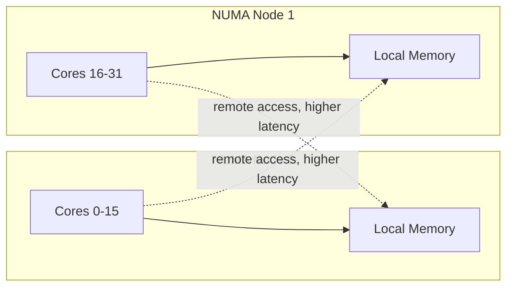
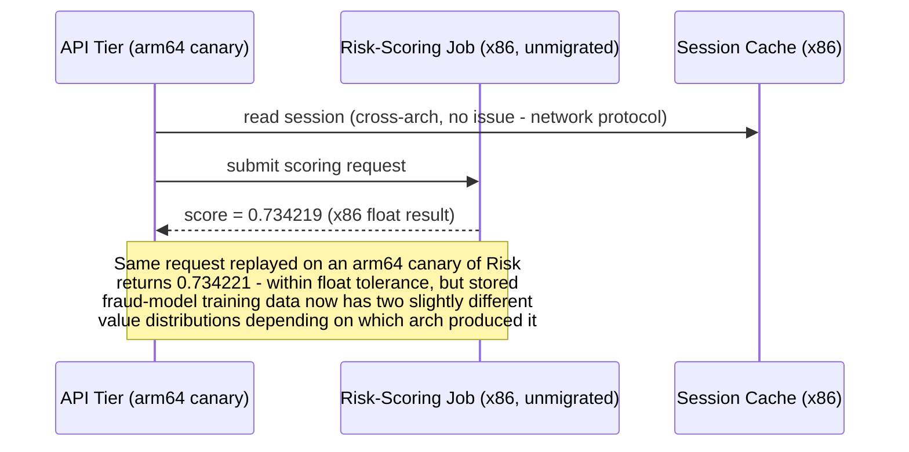

# Hardware-Aware Design — Senior

<!-- level-focus -->
At senior level, focus on this question:

> Which invariants does a hardware choice put at risk across a heterogeneous fleet, what evidence would prove a migration is actually safe under production conditions rather than under a clean benchmark, and what's the rollback path if it isn't?

Use the smallest realistic scenario that exposes the decision and its failure behavior.

*A benchmark run in isolation proves a CPU architecture can do the work. It says nothing about what happens when that instance shares a physical host with a noisy neighbor, sits across a NUMA boundary from the memory it needs, or hits a code path nobody tested on that architecture. Senior work is closing that gap before it becomes an incident.*

---

## Core Concept 1 — Anchor Hardware Choices to Invariants, Not Benchmarks

A middle-level evaluation compares instance families and architectures on throughput and cost. At senior level, the organizing question changes: **which invariant does this hardware choice put at risk?** Typical invariants for a production system:

- **Tail latency stays within SLO regardless of which physical host a request lands on.**
- **A CPU-architecture migration never silently changes output** (a floating-point result, a hash, a serialized byte order) in a way that breaks a downstream consumer or a stored artifact's compatibility.
- **Capacity does not silently degrade** when the underlying hardware changes for reasons outside your control — an instance-family deprecation, a spot-instance reclaim, a host-level noisy-neighbor event.

A migration or a right-sizing decision that looks fine on paper (higher throughput, lower cost) but has no evidence connecting it to these invariants is an assumption, not a validated design. The senior-level catalog of a hardware decision is done when every invariant it could threaten has a named defense — a test, a canary result, or a monitoring signal — not just a benchmark number.

## Core Concept 2 — Failure Modes Specific to Hardware Mismatch

| Failure mode | Trigger | Observable symptom |
|---|---|---|
| **NUMA cross-socket penalty** | A process's threads and the memory they access end up on different NUMA nodes (different physical CPU sockets, each with faster access to its own local memory bank) | Latency is inconsistent across otherwise-identical requests, and `perf stat -e node-loads,node-load-misses` shows a high remote-access ratio |
| **Noisy-neighbor contention** | A shared physical host runs another tenant's bursty workload alongside yours, on a shared-core or burstable instance type | CPU steal time (`%st` in `top`) rises without your own workload changing, and p99 latency degrades while p50 stays flat |
| **False sharing / cache-line contention** | Two threads on different cores frequently write to different variables that happen to share a CPU cache line | Throughput scales worse than expected as core count increases, visible as a falling `instructions-per-cycle` under `perf stat` despite added cores |
| **Architecture-specific correctness gap** | A migration to a new CPU architecture (or even a new CPU generation) exposes code that assumed a specific memory model, alignment behavior, or floating-point rounding mode | A downstream consumer of stored output (a hash, a checksum, a serialized float) disagrees with a value produced on the old hardware — often intermittent and hard to reproduce |
| **Fleet-wide capacity cliff** | An instance family is deprecated, or spot capacity for it dries up in a region, and the fleet has no validated fallback family | Autoscaling fails to acquire capacity during a spike, and the failure only surfaces under load, not in normal operation |

None of these show up in a single-instance benchmark. They show up only when a workload runs at fleet scale, under real contention, for long enough that the tail — not the average — becomes visible.

## Core Concept 3 — NUMA and Cache Awareness at a Systems Level

Modern multi-socket servers (and some large single-socket instance types with multiple memory channels) have non-uniform memory access: a core can reach memory attached to its own socket faster than memory attached to another socket. Most cloud instance sizes below the largest tiers hide this from you by fitting entirely within one NUMA node — but the largest instance sizes, and any workload that pins threads across the full width of a large host, can hit it directly.

The practical senior-level questions this raises for hardware-aware design:

- **Does the instance size you're choosing span more than one NUMA node?** If so, does your runtime (JVM, a thread pool, a database engine) pin threads to cores in a way that keeps memory access local, or does it schedule freely and pay a random remote-access penalty?
- **Is cache-line false sharing plausible in your hot path?** This matters most for high-throughput, highly parallel code with shared counters or flags — the fix is usually padding shared state to a full cache line, not a hardware change, but the *symptom* (throughput not scaling with cores) is easy to misdiagnose as "we need a bigger instance" when the actual bug is contention.
- **If you don't know the answer, do you have a way to find out** without guessing? `perf stat -e node-loads,node-load-misses` and `numastat` are the direct tools; if your team has never run either against your largest instance size, that's a gap worth naming before scaling that workload further.

## Core Concept 4 — Evidence Over Benchmark

A vendor benchmark, or even your own clean-room benchmark, proves a CPU architecture *can* do the work under ideal conditions. It doesn't prove your production system is safe running on it. Evidence that does:

- **A canary running real production traffic**, not synthetic load, across at least one full peak-traffic cycle, compared against the existing fleet on p50/p95/p99 latency, error rate, and — critically — **output correctness** for anything that produces a stored or transmitted artifact.
- **A rollback path that's actually been exercised**, not just described in a doc: can traffic be shifted off the new architecture within your incident-response time budget, and has that shift been tested, not just planned?
- **A dependency audit result**, not an assumption: every native library, base image, and third-party binary in the path has a confirmed, tested build for the new architecture — "it probably has one" is not evidence.
- **A noisy-neighbor and steal-time baseline** for the instance type in question, especially for burstable or shared-core families, gathered over enough time to catch the pattern rather than a lucky quiet window.

Treat each hardware decision's supporting evidence the same way you'd treat a failure-mode catalog entry: "confirmed by a full-cycle canary," "confirmed by dependency audit," or "assumed, not yet validated" — and prioritize validating the assumed ones that touch your highest-value invariants before scaling the decision to more of the fleet.

## Core Concept 5 — Cross-Component Scenario: a Mixed-Architecture Fleet Migration

A payments-adjacent system has three components: a stateless API tier, a numeric risk-scoring batch job that vendors a native math library, and a Redis-backed session cache. The team is migrating the fleet to Graviton (ARM) for cost, tier by tier.

The API tier migrates cleanly — stateless, no native dependencies, and the canary's latency and error rate match the existing fleet through a full peak cycle. The risk-scoring job is where the invariant question bites: its native math library produces a *slightly* different floating-point result on `arm64` due to differences in SIMD instruction sets and floating-point rounding between architectures. Individually the difference is within acceptable tolerance for a single score, but at fleet scale it silently skews the training data distribution for whatever model consumes stored scores, because half the fleet now produces marginally different values than the other half during the migration window.

Two plausible responses:

| Response | Behavior | Trade-off |
|---|---|---|
| **A: Migrate the risk-scoring job anyway, tag output by architecture** | Every score record includes which architecture produced it | Preserves migration speed; pushes the reconciliation problem to whoever consumes the training data, who must now account for a new dimension of variance |
| **B: Hold the risk-scoring job on x86 until the float-tolerance question is resolved with the model-training team** | Migration stalls on this one component | Slower, but the invariant ("score computation is architecture-independent enough not to bias training data") is protected until someone with the right context signs off |

Response B is the senior-level default when the invariant at risk touches a system you don't fully control the downstream consequences of (a fraud model trained on skewed data affects decisions made elsewhere, by people who never knew the hardware changed). Response A is defensible only if the downstream consumer is identified, informed, and has confirmed the tagged variance is tolerable — silently accepting the risk on their behalf is the failure mode.

## Core Concept 6 — Questions That Expose Weak Assumptions

- "Has this benchmark ever run under real production traffic, with real contention, or only in isolation?" — isolation hides noisy-neighbor and NUMA effects entirely.
- "What does this workload's code assume about the underlying architecture — alignment, floating-point rounding, endianness — and has anyone actually checked?" — most teams have never asked this because x86 was the only architecture in play until now.
- "If this instance family became unavailable in this region tomorrow, what's the validated fallback?" — surfaces whether the fleet has ever exercised its own resilience to a hardware-availability failure, not just a traffic failure.
- "Who consumes the output of this component downstream, and would they notice if its values shifted slightly?" — the risk-scoring example exists precisely because nobody asked this before migrating.
- "Has the rollback path actually been executed once, or only documented?" — a rollback plan that's never been run is a hypothesis, not a safety net.

## Core Concept 7 — Recovery and Evolution

A hardware-aware fleet is never in a finished state — instance generations retire roughly every couple of years, new architectures gain viable software support over time, and workloads themselves change shape as features are added. Build in a trigger for revisiting a hardware decision: a workload's profile changing materially (new feature adds a memory-heavy code path to a previously CPU-bound service), an instance-family deprecation notice from the provider, or a postmortem whose root cause traces to a hardware-contention effect nobody had modeled. Treat "the canary didn't predict this production behavior" as a finding to fold into the next migration's evidence checklist, not just an incident to close out.

---

## Common Mistakes

- **Trusting an isolated benchmark as proof of fleet-wide safety.** Noisy-neighbor, NUMA, and false-sharing effects only appear under real contention at scale, never in a clean single-instance test.
- **Migrating a component that affects a downstream consumer without informing that consumer.** A subtle output shift (floating-point, ordering, timing) can silently bias something built on top of it, by a team that never knew the hardware changed underneath them.
- **Treating a documented rollback plan as equivalent to a tested one.** A rollback that's never been executed carries unknown friction that only surfaces during the incident it was supposed to resolve.
- **Diagnosing a scaling problem as "need bigger hardware" without checking for cache-line contention or NUMA locality first.** The actual bug may be in how threads and memory are pinned, not in the instance size.
- **Assuming architecture support is binary (works / doesn't work) rather than checking for subtle numeric or behavioral differences** that pass a smoke test but bias data downstream over time.

## Apply it

1. Take a system you know well with at least one component whose output feeds a downstream consumer (a model, a stored record, another team's service), and identify the invariant that a hardware change (instance family, CPU architecture, or generation) could put at risk for that specific handoff.
2. List at least one hardware-contention failure mode from Core Concept 2 (NUMA, noisy-neighbor, false sharing) that plausibly applies to your system's largest or most parallel component, and name the specific tool (`perf stat`, `numastat`, `%st` in `top`) you'd use to check for it.
3. For a hypothetical or planned migration, write down what evidence you currently have versus what's assumed, using the three-tier confidence language from Core Concept 4 (confirmed by canary, confirmed by audit, assumed).
4. Design the rollback path for that migration concretely enough that you could state the actual mechanism (traffic-shifting config, DNS change, deploy revert) and whether it has ever been exercised.
5. Ask at least three of the five weak-assumption questions from Core Concept 6 against a real hardware decision your team has made or is considering, and record which question surfaced the shakiest assumption.

## Verify your work

- The invariant you named is specific to a real downstream consequence, not a generic "performance should be fine."
- The contention failure mode you identified names a specific tool and what output from that tool would confirm or rule it out.
- Your evidence tally has at least one entry honestly marked "assumed, not yet validated," with a concrete next step to close that gap.
- The rollback path names an actual mechanism and states plainly whether it has been tested, not just documented.

## Review questions

- Why is an isolated architecture benchmark insufficient evidence that a fleet-wide hardware migration is safe?
- How can a workload be diagnosed as "needs a bigger instance" when the real problem is NUMA locality or cache-line contention?
- Why might migrating a component to a new CPU architecture silently bias a downstream consumer's data, even when every individual output is within tolerance?
- What separates a rollback plan that is genuinely a safety net from one that only looks like one?
