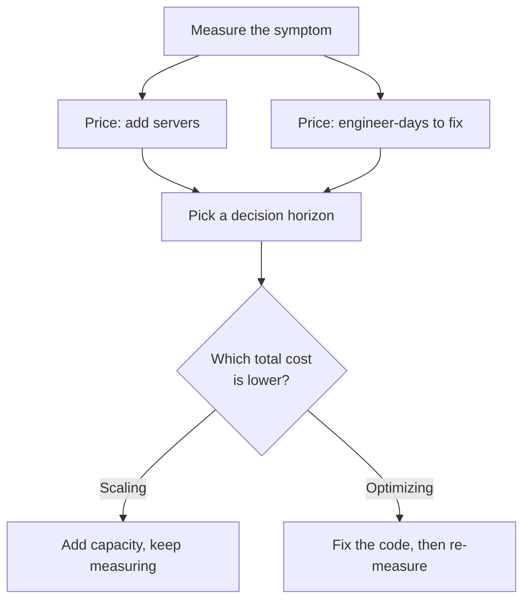

# Performance Economics — Junior

<!-- level-focus -->
At junior level, focus on this question:

> Given one slow endpoint and two concrete options — spend engineer-days optimizing it, or spend dollars adding more servers — can you calculate which one is cheaper over a fixed time horizon and justify the choice with numbers?

Use the smallest realistic scenario that exposes the decision and its failure behavior.

*Performance work is not free just because it doesn't show up on an invoice. Every hour spent tuning a hot loop is an hour not spent on something else, and every server added to make a problem go away is a bill that recurs whether or not anyone remembers why it's there. This topic is about putting both sides on the same scale before deciding.*

---

## Core Concept 1 — Two Costs, One Comparison

Every performance problem has (at least) two possible responses, and each one has a real cost attached:

- **Optimize** — an engineer spends time changing the code or configuration so the same hardware does more work. The cost is **engineer-time**: days of work, plus the risk and review time that comes with any code change.
- **Scale** — add more or bigger hardware (more instances, a bigger database, more memory) so the existing code has more room to work in. The cost is **infrastructure spend**: a recurring bill, usually monthly.

The junior-level skill is not picking one of these as "the right answer" in general — it's running the same small comparison every time: *what does each option cost, over what period, and which is cheaper for this specific problem, right now?*

## Core Concept 2 — Vocabulary

- **Vertical scaling** — making one machine bigger (more CPU, more RAM).
- **Horizontal scaling** — adding more machines that do the same job in parallel.
- **Latency** — how long one request takes. **Throughput** — how many requests the system handles per unit time.
- **Diminishing returns** — each additional unit of effort (or hardware) buys a smaller improvement than the one before it.
- **Opportunity cost** — what you give up by choosing one option; the three engineer-days spent optimizing are three days not spent on the next feature or bug fix.
- **Premature optimization** — spending effort improving performance before you have evidence it's needed; the classic warning ("premature optimization is the root of all evil") is about skipping the measurement step, not about optimization being bad.

## Core Concept 3 — A Repeatable Method

1. **Measure the current problem concretely.** A number, not a feeling: "p95 latency is 900ms," "CPU is pinned at 90% at peak," "the queue backs up to 10,000 items during the evening spike."
2. **Price the scaling option.** How many more instances, of what size, at what monthly rate, would remove the symptom? Multiply out to a monthly dollar figure.
3. **Price the optimization option.** How many engineer-days would a competent fix realistically take? Multiply by a loaded daily cost (salary, benefits, and overhead — not just take-home pay) to get a dollar figure.
4. **Pick a decision horizon.** How long will this system run roughly as-is — the next quarter? The next year? This matters because optimization is usually a one-time cost and scaling is a recurring one.
5. **Compare total cost over that horizon**, and choose the cheaper path — unless there's a reason beyond cost (a looming deadline, a reliability requirement) that overrides it. If so, say that reason explicitly rather than let it hide inside the cost decision.

## Core Concept 4 — Worked Example: One Slow Endpoint

A small e-commerce API has one endpoint, `GET /product/:id`, running hot during a daily peak. Profiling shows an N+1 query: one query for the product, then one extra query per related item, made worse by the fact that the loop is single-threaded and blocking. Measured symptom: p95 latency of 900ms at peak, CPU on the app tier sitting at 85%.

Two options are on the table (all figures below are an illustrative example, not a real benchmark or company figure):

| Option | What it involves | Cost |
|---|---|---|
| **A — Optimize** | One engineer batches the related-item lookup into a single query; estimated 3 engineer-days | ~$700/day loaded cost × 3 days ≈ **$2,100, one-time** |
| **B — Scale** | Add 2 more application server instances to absorb the load without touching the code | **$150/month per instance × 2 = $300/month, recurring** |

Because A is a one-time cost and B recurs every month, the comparison depends on the horizon:

| Horizon | Total cost of A (optimize) | Total cost of B (scale) |
|---|---|---|
| 1 month | $2,100 | $300 |
| 3 months | $2,100 | $900 |
| 6 months | $2,100 | $1,800 |
| 9 months | $2,100 | $2,700 |
| 12 months | $2,100 | $3,600 |

The crossover point — where optimizing becomes the cheaper choice — lands around month 7. If this endpoint is expected to keep running roughly as-is for a year or more, Option A is cheaper overall *and* it removes the recurring bill entirely. If the endpoint is being replaced in two months anyway, Option B is cheaper for the time it matters, and the optimization would be wasted effort.

There's a second wrinkle worth naming: the N+1 query gets worse as the product catalog grows — more related items means more extra queries per request. Scaling with more servers papers over a cost that keeps climbing; fixing the query removes the growth pattern, not just the symptom on the day it's measured.

## Core Concept 5 — Success Criteria

A junior-level decision is complete when it has all of the following, written down, not just reasoned about silently:

1. A **concrete measured symptom** (a number, not "it's slow").
2. A **priced scaling option** (dollars per month).
3. A **priced optimization option** (engineer-days and a loaded daily rate).
4. A **stated decision horizon**.
5. A **re-measurement plan** — how you'll confirm, after the fact, that the chosen option actually fixed the symptom.

If any of these five is missing, the decision isn't ready to act on yet — it's still a guess wearing the shape of a decision.

---

## Common Mistakes

- **Comparing a one-time cost to only one month of recurring cost.** $2,100 sounds much scarier next to $300 than next to $3,600 — always extend the comparison to a real horizon before judging which is bigger.
- **Optimizing by reflex because it feels more "correct."** Spending a week micro-tuning a path that would cost $50/month to scale is premature optimization: the fix is real, but the economics don't justify the time spent right now.
- **Scaling by reflex without checking that it will actually help.** If the bottleneck is a single-threaded lock, a single database connection, or anything else that doesn't parallelize, adding more application servers can leave the symptom unchanged while the bill grows anyway.
- **Skipping the measurement step.** A decision made from "it feels slow" instead of a p95 number or a CPU percentage can't be checked later and can't be compared against a price.
- **Ignoring opportunity cost.** The three engineer-days aren't "free" just because no invoice arrives for them — they're days not spent on the next ticket, and that has to be weighed too.
- **Forgetting to re-measure after acting.** A fix that isn't confirmed against the original symptom might not have worked at all.

---

## Apply it

1. Pick one real (or realistic) slow endpoint or job in a system you know, and write down its current measured symptom as a specific number (p95 latency, CPU percentage, or queue depth).
2. Price a scaling fix: how many additional instances/resources, at what monthly rate, would remove the symptom without touching code?
3. Price an optimization fix: estimate the engineer-days a competent fix would take, and multiply by a reasonable loaded daily rate (use $600–$900/day if you don't have a real figure).
4. Build a small table like the one in Concept 4, showing total cost of each option at 1, 3, 6, and 12 months, and identify the crossover month.
5. State your decision, the horizon you're assuming, and one thing you'd check after making the change to confirm it worked.

## Verify your work

- Your symptom is a specific number, not a description like "slow" or "laggy."
- Both options are priced in dollars, on the same table, at the same set of time horizons.
- You can name the exact month where the cheaper option switches from one to the other.
- You've written down what you would measure afterward to confirm the fix actually worked, not just that you did the cheaper thing.

## Review questions

- Why does comparing a one-time engineering cost against only one month of infrastructure cost give a misleading answer?
- What does "premature optimization" actually warn against, and what does it not warn against?
- Why might adding more application servers fail to fix a measured latency problem even though it costs money every month?
- What five pieces of information does a complete junior-level performance-economics decision need to include?
