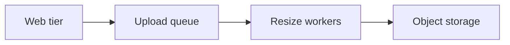

# Performance Economics — Middle

<!-- level-focus -->
At middle level, focus on this question:

> When a slowdown spans several components, which one should absorb the optimization effort and which should just get more capacity — and how do you avoid discovering, three sprints later, that you optimized the wrong thing or scaled a component that couldn't actually get faster that way?

Use the smallest realistic scenario that exposes the decision and its failure behavior.

*A single endpoint has one bottleneck and one obvious fix. A real system has several components, and the bottleneck moves. Middle-level performance economics is about choosing where to spend money or time first, confirming the choice with a measurement, and not stopping at the first plausible-looking fix.*

---

## Core Concept 1 — Locate the Bottleneck Before Pricing Anything

The junior-level method assumes you already know which component is slow. In a system with several moving parts, that's the step most likely to be skipped — and skipping it means pricing a fix for the wrong thing. Before comparing "optimize vs. scale" for any component, confirm with a profile, a trace, or a load test which component is actually the limiting factor under the load you care about. A component that's busy is not automatically the bottleneck; a component whose queue is growing without bound usually is.

This matters economically, not just technically: pricing an optimization or a scale-up for a component that isn't actually limiting throughput wastes the whole budget, whichever budget (time or dollars) you spend it from.

## Core Concept 2 — What Each Option Actually Costs to Maintain

At middle level, "cost" needs a second dimension beyond the one-time-vs-recurring split from the junior level: **change cost and debuggability**, going forward.

| Dimension | Optimize (code change) | Scale (add capacity) |
|---|---|---|
| **Initial cost** | Engineer-days, plus code review and test-writing time | Usually fast — a config change or an autoscaling rule |
| **Ongoing cost** | Someone has to understand the optimized code later; clever code (hand-rolled caching, manual batching, unusual data structures) raises the cost of the next change | A recurring bill; usually low ongoing engineering cost unless capacity limits get hit again |
| **Debuggability** | A new code path is a new thing that can have its own bugs | Usually doesn't introduce new logic, so it's less likely to introduce new bugs |
| **Reversibility** | Reverting a code change is a normal deploy | Reverting extra capacity is usually a one-line infra change |

The scaling option often looks cheap and safe on this table — which is exactly why it's tempting to over-use it. The catch is the next concept.

## Core Concept 3 — When Scaling Stops Paying Off

Horizontal scaling works cleanly when the component is **stateless** and the resource it needs (CPU, mostly) scales linearly with more instances. It stops paying off when the component shares something that doesn't scale the same way: a single database, a fixed-size connection pool, a per-account rate limit from a third party, or a piece of software licensed per core.

**Signal you're under-applying optimization:** the cost of scaling is growing linearly (or faster) with traffic, and the growth shows no sign of leveling off — this is the sign that the underlying inefficiency is being paid for every month instead of fixed once.

**Signal you're over-applying optimization:** the component is stateless, cheap to run more of, and traffic growth is expected to be modest — spending multiple engineer-weeks tuning it before scaling is tried at all is optimizing something that would have been solved by a five-minute autoscaling change.

## Core Concept 4 — Worked Scenario: An Image-Processing Pipeline

An image-upload feature has four components: a web tier that accepts uploads, a queue, a fleet of resize workers that generate thumbnails, and object storage. The backlog in the queue has been growing during peak hours — uploads are accepted fine, but thumbnails are taking longer and longer to appear.

A quick profile of the resize workers shows they're CPU-bound decoding and re-encoding JPEGs, and the queue depth confirms the workers are the bottleneck (web tier and storage are both well under capacity). Two options surface:

| Option | Detail | Cost (illustrative) |
|---|---|---|
| **Scale workers** | Workers are stateless — add more instances to the fleet | $80/instance-month; currently 4 workers, backlog needs roughly 3 more to clear peak → **$240/month** |
| **Optimize workers** | Swap the JPEG library for a faster one and batch-decode where possible | Estimated 5 engineer-days ≈ **$3,500 one-time**, cuts per-image processing time by roughly 40% |

Because the workers are stateless, scaling is architecturally cheap here — this is exactly the case from Concept 3 where scaling pays off cleanly. Over 6 months, scaling costs $1,440; optimizing costs $3,500 up front. Scaling wins on pure cost for now.

But there's a second piece of information: traffic is projected to roughly double in six months. Re-running the numbers at 2x load: the queue would need roughly 6 more workers instead of 3, pushing the scaling cost to about $480/month — and that number keeps climbing every time traffic grows again, with no ceiling. The optimization, once done, permanently cuts the per-image cost by 40%, which lowers *every future* scaling calculation too, not just today's.

The middle-level move is **incremental, not all-or-nothing**: scale now to relieve the immediate backlog (cheap, fast, safe), and schedule the library optimization as a follow-up sized against the *projected* growth curve rather than today's snapshot — because the two options aren't mutually exclusive, and doing the cheap one first buys time to do the other one properly.

## Core Concept 5 — The Diminishing-Returns Curve, Reasoned Numerically

Optimization work on one component rarely has a flat payoff — each additional pass tends to buy less than the one before it. Continuing the image-pipeline example, three successive optimization passes on the resize worker might look like this:

| Pass | Change | Per-image time | Engineer-days | Cost per ms saved |
|---|---|---|---|---|
| 1 | Swap JPEG library | 400ms → 240ms (−160ms) | 2 | ~2.2 days per 100ms |
| 2 | Add a resize-result cache for duplicate uploads | 240ms → 200ms (−40ms) | 2 | ~10 days per 100ms |
| 3 | Rewrite the hot path in a lower-level language | 200ms → 170ms (−30ms) | 8 | ~53 days per 100ms |

Pass 1 is a clear win: cheap, and it's the fix that also lowers the ongoing scaling cost calculated in Concept 4. Pass 2 is a judgment call depending on how much duplicate-upload traffic actually exists. Pass 3 is almost certainly not worth it against a scaling alternative that, at this point, is cheaper for the same throughput gain — this is the numeric shape of diminishing returns, and reasoning through it explicitly is what keeps a team from chasing pass 3 out of momentum rather than evidence.

## Core Concept 6 — Verifying at Two Levels

A performance-economics decision at middle level isn't verified until it's checked at both:

- **Unit level** — the optimized function is still correct (existing tests pass, and a new test covers the case the optimization changed, such as the batched query returning results in the same order as before) and is actually faster in isolation (a microbenchmark shows the claimed improvement).
- **Integrated-flow level** — the change or the added capacity actually moves the bottleneck the way predicted. Run the same load test or traffic replay used to find the original bottleneck, and confirm the queue depth (or p95 latency, or CPU) that motivated the decision has actually improved, and confirm what the *new* limiting component is — because fixing one bottleneck usually reveals the next one.

Skipping the integrated check is the most common way a well-reasoned decision still fails in practice: the unit-level fix was correct, but something else in the flow (a shared connection pool, a downstream rate limit) was the real ceiling all along.

---

## Common Mistakes

- **Pricing a fix before confirming the bottleneck.** Optimizing or scaling a component that profiling doesn't actually implicate wastes the budget regardless of which budget it comes from.
- **Treating "add more instances" as free just because it's fast to do.** It's fast to *decide*, but the monthly cost is real and, for components with a shared serial resource, doesn't buy the throughput it looks like it should.
- **Chasing diminishing returns past the point where scaling is cheaper for the same gain.** Momentum from an already-started optimization effort is not a cost justification for continuing it.
- **Whac-a-mole fixes.** Solving one bottleneck without re-measuring the whole flow, then being surprised when the next component down the chain becomes the new ceiling under the same load.
- **Choosing an all-or-nothing plan** instead of the cheap short-term relief (scale now) plus the properly-sized long-term fix (optimize against the *projected* curve, not the current one).

---

## Apply it

1. Pick a system with at least three components in the request or processing path, and identify (via a real profile, trace, or load test — not a guess) which one is the actual bottleneck under realistic load.
2. Price a scaling fix and an optimization fix for that component, following the junior-level method, and note whether the component is stateless (cheap to scale) or shares a bottlenecked resource (scaling won't help as much).
3. Recalculate the scaling cost assuming traffic doubles, and check whether the crossover point between scaling and optimizing moves earlier.
4. Sketch a diminishing-returns table for at least two rounds of optimization on that component (real numbers if you have them, reasoned estimates if you don't), and mark the round past which further optimization stops being worth it.
5. Define your unit-level and integrated-flow-level verification for the change you'd make, and state what you expect the *next* bottleneck to be once this one is resolved.

## Verify your work

- You can name the actual bottleneck component with evidence (a profile, trace, or load-test result), not an assumption.
- Your cost comparison includes a projected-growth recalculation, not just today's snapshot.
- Your diminishing-returns table shows at least one round where further optimization is no longer worth it compared to scaling, with a reason.
- You have both a unit-level check (correctness plus isolated speed) and an integrated-flow check (the real bottleneck metric, re-measured after the change) written down before implementing anything.

## Review questions

- Why is confirming the actual bottleneck a prerequisite step before pricing either an optimization or a scaling option?
- What makes horizontal scaling cheap and reliable for one component but ineffective for another in the same system?
- How does recalculating cost against projected future traffic, rather than current traffic, change which option looks cheaper?
- Why is checking the integrated flow, not just the changed component in isolation, necessary to call a performance-economics decision verified?
