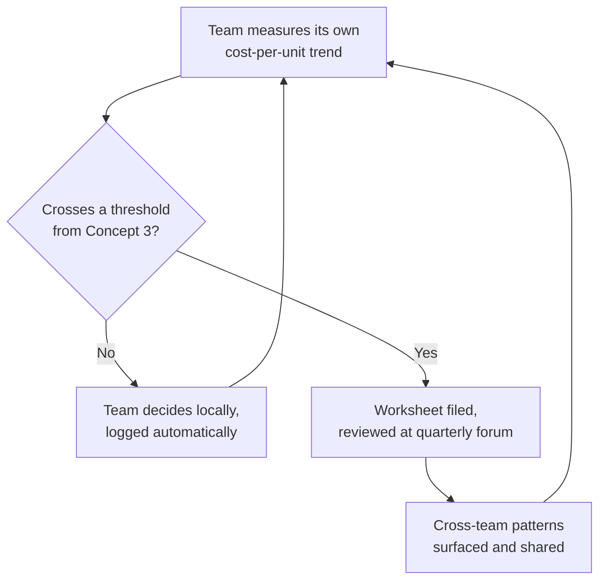

# Performance Economics — Professional

<!-- level-focus -->
At professional level, focus on this question:

> How do you design an operating model so individual teams can decide, on their own cadence, when to spend engineer-time on performance work versus request more infrastructure budget — without every decision needing central sign-off, while still catching cases where a locally reasonable call is quietly expensive or under-invested at company scale?

Use the smallest realistic scenario that exposes the decision and its failure behavior.

*A single team can run the optimize-vs-scale comparison well and still produce a bad outcome for the organization — if every team reinvents the comparison from scratch, if nobody notices the pattern across teams, or if the "cheap, reversible" local decision quietly breaks a shared constraint owned somewhere else. Professional-level work here is designing the process that makes good local decisions add up to a good organizational one.*

---

## Core Concept 1 — Align Ownership So the Trade-off Is Visible Locally

The optimize-vs-scale comparison only works when the team making the call can see *both* sides of it. If one group owns the cloud bill and a different group owns the code and the on-call pager, neither has the full picture: the code-owning team sees engineer-time cost and latency but not the invoice; the infrastructure-owning team sees the invoice but not what a fix would cost to build. That split reliably produces bad decisions in both directions — code teams over-request capacity because it's "free" to them, and infra teams push back on scaling requests without being able to evaluate whether an optimization was actually feasible in the requester's timeline.

The organizational fix is **matching ownership to the decision**: a team that owns a service should see its own infrastructure cost and its own engineering capacity in the same view, with enough context (a per-team monthly spend dashboard tied to that team's services, a template for estimating engineer-days) to run the comparison itself, most of the time, without escalating.

## Core Concept 2 — A Shared Framework, Not a Shared Decision

Professional-level architecture-of-decisions balances two failure modes: centralizing every performance-economics call (a bottleneck on a scarce group's time, and a delay on every team that needs a fast answer) against leaving every team to invent its own comparison method (inconsistent quality, decisions that don't hold up when questioned later, and no way to compare patterns across teams).

The resolution used at this level is a **shared framework, locally applied**: a lightweight, standard worksheet — measured symptom, priced scaling option, priced optimization option, decision horizon, re-measurement plan (the same five elements from the junior-level method) plus the cost-per-unit trend line and ceiling evidence from the senior level — that any team fills in themselves, in a format a platform or finance partner can skim in minutes rather than needing to re-derive from a conversation. The framework is owned centrally; the decision is not.

## Core Concept 3 — Thresholds, Not Gates

Not every decision needs review, and deciding which ones do is itself a design choice. A workable pattern is a small set of **thresholds that trigger visibility, not approval**:

| Trigger | Example threshold | What happens |
|---|---|---|
| Infra spend change | A single team's monthly spend change exceeds a set amount | Logged automatically in a shared dashboard; no action required unless flagged |
| Engineer-time investment | An optimization effort exceeds roughly two engineer-weeks | A one-page worksheet (Concept 2) is filed, visible to a lightweight review forum |
| Shared-resource impact | The scaling option touches a resource with company-wide capacity limits (a shared cluster, a committed-use discount tier, a rate-limited third-party contract) | A short registration step with the team that owns that shared resource, before scaling, not after |
| Recurring pattern | The same component has had three or more optimize-vs-scale decisions in two quarters | Flagged for the quarterly review (Concept 6) rather than decided ad hoc a fourth time |

The goal of these thresholds is to keep the fast path fast — most decisions never cross a threshold and are made and acted on within the team, same day — while making sure the handful that matter at company scale actually surface.

## Core Concept 4 — Decomposing an Initiative into Reversible Increments

A company-wide push (for example, "bring cost-per-request down 15% this half" or "stop the infra budget from growing faster than revenue") is not a single decision — it's an initiative that needs to be broken into increments that can each be checked and reversed independently:

1. **Instrument first.** Get cost-per-unit trend visibility for every team before asking anyone to act on it — you cannot ask teams to hit a target you can't yet measure per team.
2. **Pilot with volunteer teams.** Run the shared framework with two or three teams that already have a known bottleneck, before mandating it everywhere; this catches gaps in the worksheet template itself while the blast radius of a bad template is small.
3. **Roll the framework out broadly, not the target.** Every team adopts the *measurement and decision worksheet*; the specific cost target is not imposed until teams have had at least one full cycle to see their own trend.
4. **Set the target with an explicit review date**, not an open-ended mandate — a specific quarter to hit a specific cost-per-unit number, checked against the trend data gathered in step 1, so the target is grounded in what's actually achievable rather than picked arbitrarily.
5. **Re-measure and decide whether to continue, adjust, or stop** — an increment that shows the target isn't reachable without disproportionate cost is itself a useful, reversible outcome, not a failure to hide.

Each step above can be rolled back independently: a bad worksheet template can be revised without unwinding the instrumentation; a missed cost target can be re-set without discarding the measurement infrastructure that revealed it was missed.

## Core Concept 5 — Risks Beyond the Dollar Figure

At organizational scale, several risk categories sit outside the per-decision cost comparison and need their own handling:

- **Coordination risk.** A team's "just add servers" decision can quietly consume a shared, committed-use discount pool or a shared cluster's headroom that another team was counting on — this is exactly what the shared-resource threshold in Concept 3 exists to catch, ahead of the scale-up rather than after a capacity incident.
- **Operational risk.** A team's optimization can make a component harder for anyone outside that team to operate — a bespoke cache, an unusual batching scheme — and that cost shows up later as on-call burden or slower onboarding, not as a line item. The worksheet template should ask explicitly "who besides this team needs to understand this change to operate it," so this cost isn't invisible to the review forum.
- **Governance risk.** Without a shared framework, teams under schedule pressure default to whichever option is easiest to justify to their own manager, not the one that's actually cheaper — a documented, consistently-applied worksheet is what lets a decision be defended later, including to auditors or finance partners who want to understand why spend grew.
- **Migration risk**, specific to build-vs-buy calls: moving a component to a managed or third-party service transfers maintenance cost but creates a new dependency with its own contract, its own outage history, and its own pricing trend — a decision to buy needs the same trend-and-ceiling evidence standard from the senior level, applied to the vendor, not just to the in-house alternative it replaces.

## Core Concept 6 — Explicit Outcomes and Exit Conditions

An optimization or scaling initiative without a stated exit condition tends to run indefinitely as a background commitment nobody explicitly decided to keep funding. Professional-level design states, up front:

- **The outcome measure** — cost-per-request, cost-per-active-user, or another unit tied to something the business already tracks, not an internal proxy metric nobody outside the team recognizes.
- **The success exit condition** — for example, the trend has reversed and held for two consecutive quarterly reviews, or cost-per-unit has plateaued at or below a stated target; further investment stops being funded past this point unless the trend re-breaks.
- **The abandon exit condition** — for example, after one pilot cycle, the projected engineering cost to hit the target exceeds a stated multiple of the infrastructure savings it would produce; the initiative is closed out and the recommendation reverts to "keep scaling, revisit if the trend changes," which is a legitimate, documented outcome, not a failure to report as a win.

## Core Concept 7 — A Cadence for Sustained Delivery, Not a One-Time Target

Traffic, catalog size, and headcount keep growing after the initial push is over, so this can't be a project with a finish line — it needs a standing cadence. A **quarterly cost-and-performance review forum** (not a gate, not an approval body) that a handful of teams present to on a rotation works well in practice:

The forum's job is not to approve decisions but to **surface patterns no single team can see**: one team quietly over-investing engineering time in a component that's cheap to scale (a pattern the middle-level diminishing-returns table would have caught locally, but wasn't run because nobody asked), and another team hitting a scaling ceiling that another part of the company already solved differently six months earlier. Sharing the worked cost curves across teams — the same tables and trend lines from the junior through senior levels, just aggregated — turns isolated good local decisions into an organizational learning loop, without requiring anyone to centralize the decision itself.

---

## Common Mistakes

- **Centralizing every decision "to be safe."** This turns a fast local comparison into a queue behind a scarce review group, and teams route around it, informally, the moment it becomes a bottleneck — undermining the framework's credibility along with its speed.
- **No shared worksheet, so every team's analysis is a different shape.** Decisions can't be compared, patterns can't be spotted, and a later audit or postmortem can't reconstruct why a call was made.
- **Measuring only the dollar figure**, missing the operational and governance risk categories from Concept 5 — a decision that looks cheap on the invoice can be expensive in on-call load or audit exposure.
- **No exit condition**, so an optimization initiative becomes a permanent background project that nobody explicitly chose to keep funding, and nobody explicitly chose to stop.
- **Treating the thresholds in Concept 3 as approval gates** rather than visibility triggers — this defeats the entire point of keeping the fast path fast for the decisions that don't need company-wide attention.

---

## Apply it

1. Sketch the ownership boundary for one real (or realistic) service: does the team that would make an optimize-vs-scale call actually see both its own infrastructure spend and its own engineering capacity, or is that split across groups? Note what would need to change for the decision to be visible in one place.
2. Draft a one-page shared worksheet template covering the five junior-level elements plus a cost-per-unit trend line, short enough that a reviewer outside the team could read it in under five minutes.
3. Define three concrete thresholds (a spend amount, an engineer-time amount, a shared-resource trigger) that would route a decision to a lightweight review rather than let it stay fully local — and justify why each threshold is set where it is.
4. Write the outcome measure, success exit condition, and abandon exit condition for one real or hypothetical cost-reduction initiative.
5. Describe what a quarterly cross-team review forum would look at for this service, and name one pattern it might catch that a single team working in isolation would not.

## Verify your work

- The ownership sketch names a specific missing piece of visibility (spend, capacity, or both) rather than a vague "communication problem."
- The worksheet template is generic enough that a different team, with a different service, could fill it in without modification.
- Each threshold has a stated reason tied to actual risk (coordination, operational, or governance), not a round number picked without justification.
- Both exit conditions are concrete enough that a reviewer could look at the trend data in six months and say, unambiguously, whether the condition was met.
- The named cross-team pattern is something visible only in aggregate, not something any one team could have caught on its own.

## Review questions

- Why does splitting infrastructure-spend ownership from engineering ownership across two different teams reliably produce worse optimize-vs-scale decisions?
- What is the difference between a threshold that triggers visibility and a threshold that acts as an approval gate, and why does that distinction matter for keeping local decisions fast?
- Why does an optimization initiative need an explicit abandon condition, not just a success condition?
- What kind of pattern can a quarterly cross-team review catch that no single team's local decision-making process would surface on its own?
