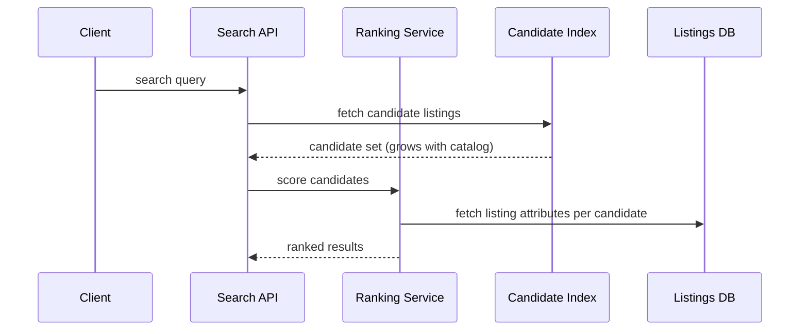

# Performance Economics — Senior

<!-- level-focus -->
At senior level, focus on this question:

> When cost-to-serve is growing faster than the traffic or revenue driving it, what evidence tells you whether the sustainable fix is architectural (change the shape of the hot path) versus economic (accept a higher run-rate as a deliberate, monitored trade), and how do you keep the door open to reverse that call later?

Use the smallest realistic scenario that exposes the decision and its failure behavior.

*By the time this decision reaches a senior engineer, "add servers" and "optimize the code" have usually both already been tried locally, and the interesting question has shifted: is the cost curve itself sustainable, and what does the architecture need to preserve so the org isn't locked into today's guess.*

---

## Core Concept 1 — Treat "Cost Sustainability" as an Invariant

Below senior level, the comparison in this topic is per-decision: this endpoint, this component, this quarter. At senior level, the organizing property to protect is a standing invariant — something like **cost per request must not grow faster than the value each request generates** — and every optimize-vs-scale decision should be checked against whether it protects or violates that invariant, not judged in isolation.

A single decision that's individually "cheap" (a quick scale-up that resolves this week's alert) can still violate the invariant if it's the fourth such decision in a row and the underlying cost-per-request trend line keeps climbing. The senior-level catch is noticing the trend, not just clearing the immediate alert.

| Signal | What it means |
|---|---|
| Cost-per-request flat or falling as traffic grows | Invariant holding; current architecture is absorbing growth |
| Cost-per-request rising slower than traffic | Invariant under pressure but not yet broken; watch it |
| Cost-per-request rising as fast as or faster than traffic | Invariant broken; scaling is no longer buying proportional capacity |

## Core Concept 2 — Failure Modes on Both Sides

**The failure mode of "always scale":** past a point, the component being scaled isn't the true constraint anymore — something it shares with other components is. This is the same shape as Amdahl's Law in parallel computing: once a serial (non-parallelizable) portion of the work dominates, adding more parallel workers buys less and less, and eventually nothing. In practice the "serial portion" is usually a single database's write capacity, a licensed component billed per core, a third-party API's rate limit, or a lock that only one worker can hold at a time. Scaling the stateless tier around a bottleneck like that doesn't remove the bottleneck — it just adds idle-waiting capacity that still costs money.

**The failure mode of "always optimize":** a hand-tuned hot path (custom caching, hand-rolled batching, code dropped to a lower-level language for speed) becomes harder for the rest of the team to change safely. The cost doesn't disappear — it moves from a monthly infrastructure bill into a standing tax on every future change to that code, paid in review time, onboarding time, and incident risk. Because this cost is diffuse and doesn't show up on an invoice, it's easy to under-count, and sunk-cost reasoning ("we already spent six weeks on this") can keep a team maintaining an optimization long after buying capacity would be cheaper — especially as compute prices tend to fall over time while bespoke code doesn't get simpler on its own.

## Core Concept 3 — Evidence, Not Preference

A senior-level recommendation on this trade-off needs to be backed by evidence a skeptical peer could check, not by which approach feels more rigorous or more pragmatic:

- **A load test or traffic replay that shows where the cost curve actually bends** — the point at which adding capacity stops producing proportional throughput. This is the empirical version of the Amdahl's-Law argument in Concept 2: don't reason about the serial bottleneck abstractly if you can measure its ceiling directly.
- **Profiling data that attributes cost to a component**, not an assumption about which part "must" be expensive.
- **A historical cost-per-request trend**, so the invariant from Concept 1 is checked against real data rather than a single snapshot.
- **A total-cost-of-ownership estimate that includes engineering maintenance time**, not just the infrastructure bill or the one-time build cost — the middle-level table of "ongoing cost" from the previous level, extended across the system's expected lifetime.

Treat each of these as a hypothesis check: "we believe the bottleneck is X" is worth testing with a load test before a redesign is scoped around it, the same way a failure-mode catalog entry is worth confirming with an incident or an experiment before it drives an architecture decision.

## Core Concept 4 — Preserve Optionality in the Architecture

Because the "right" answer here shifts as traffic, hardware prices, and team size all change, the architectural responsibility at senior level is less about picking the permanently correct answer and more about **not foreclosing the other option**. Concretely:

- Keep the expensive computation behind a stable interface (a function boundary, a service boundary) so it can be swapped for a faster implementation, moved to a managed service, or given more replicas — without every caller needing to change.
- Avoid architectural choices that only pay off if scaling continues linearly forever (for example, a design that assumes the database can always get a bigger box) without a documented plan for what happens when that stops being true.
- Avoid architectural choices that only pay off if a specific hand-optimized path is preserved forever (for example, baking a very specific hardware assumption — a particular CPU's instruction set — deep into business logic) without a fallback that a future team could reasonably maintain.

The test for a good decision here isn't "did we pick optimize or scale" — it's "if this assumption turns out wrong in a year, how expensive is it to change course."

## Core Concept 5 — Cross-Component Scenario: A Ranking Service Under Catalog Growth

A marketplace's search-ranking service scores every listing in a category against a query, and cost grows faster than catalog size because scoring is closer to quadratic than linear in the number of listings being compared per query. Traffic (queries per day) is flat, but catalog size is growing, and the cost-per-request trend is rising — the invariant from Concept 1 is under pressure.

Three plausible responses, each with a real trade-off:

| Approach | What changes | Trade-off |
|---|---|---|
| **A — Keep scaling the ranking tier horizontally** | Add ranking-service replicas as catalog grows | Buys time cheaply at today's catalog size, but cost grows with catalog size indefinitely — the invariant stays broken, just funded |
| **B — Invest in an approximate candidate-narrowing step** (e.g., a cheaper pre-filter or index structure before full scoring) | One-time, higher-cost engineering effort | Changes the growth curve's shape, not just its current value — the same fix keeps paying off as the catalog keeps growing, at the cost of a harder-to-reason-about approximation |
| **C — Move ranking to a managed third-party search/ranking service** | Build-vs-buy: stop maintaining this component at all | Removes the maintenance cost entirely, but introduces a new dependency, a new failure mode, and possibly a new recurring cost curve owned by someone else — worth it if the team's engineering time is better spent elsewhere |

The senior-level judgment isn't "B is architecturally superior" — it's checking, with the load-test and trend evidence from Concept 3, whether the catalog-growth trend is steep and durable enough to justify B's one-time cost, or flat enough that A remains cheaper for the system's realistic lifetime, or uncertain enough that C's transfer of both the cost and the maintenance burden is the better bet. Each answer is defensible; the failure is picking one without the trend data to back it.

## Core Concept 6 — Questions That Expose Weak Assumptions

- "Is the cost curve linear, sub-linear, or super-linear in the variable that's actually growing (traffic, catalog size, data volume)?" — the whole decision changes shape depending on the answer, and teams often assume linear without checking.
- "Where does horizontal scaling stop paying off for this component, and have we actually measured that ceiling or just assumed it's far away?"
- "If compute got noticeably cheaper next year, would this decision still make sense?" — surfaces whether the case for optimizing rests on today's prices or a durable structural problem.
- "What did we extrapolate this growth trend from — a sustained pattern, or one spike?"
- "If this call turns out wrong in a year, what does reversing it cost, and did we design for that cost to be low?"

## Core Concept 7 — Recovery: When the Curve Bends Again

None of these decisions are final. A trigger list worth keeping active: catalog or traffic growth rate changes meaningfully from the trend the decision was based on; the shared resource identified as the eventual scaling ceiling (Concept 2) gets replaced or upgraded, changing where that ceiling sits; the managed-service option's own pricing changes; or the team maintaining a hand-optimized path turns over, changing the real maintenance cost. Any of these should re-open the decision rather than let the original analysis fossilize as a permanent conclusion.

---

## Common Mistakes

- **Judging the invariant from a single snapshot** instead of a trend — a cost-per-request number that looks fine today can already be on a rising trajectory.
- **Assuming linear scaling without measuring the ceiling** — the Amdahl's-Law-shaped failure mode is invisible until someone actually load-tests past the point where a shared resource saturates.
- **Undercounting the maintenance cost of a hand-optimized path** because it doesn't appear as a monthly invoice line.
- **Architecting for only one of the two futures** — locking in an assumption that only pays off if scaling stays linear forever, or one that only pays off if a specific optimization is preserved forever, with no affordable way to reverse either.
- **Treating a managed-service migration as a pure cost transfer** without pricing in the new dependency's own failure modes and its own long-run cost trend.

---

## Apply it

1. Pick a system where you can get (or reasonably estimate) a cost-per-request or cost-per-unit-of-work trend over the last several months, and state whether it's flat, falling, or rising relative to the driver of growth (traffic, data volume, catalog size).
2. If it's rising, identify the shared resource most likely to be the eventual scaling ceiling, and describe what evidence (a load test, a saturation metric) would confirm where that ceiling actually sits.
3. Lay out three plausible responses to the trend — keep scaling, invest in a structural optimization, or move the component to a managed/third-party alternative — each with its real trade-off, in a table like the one in Concept 5.
4. Pick the response the evidence supports, and write one sentence on what it would cost to reverse this decision in a year if the trend changes.
5. Ask the five weak-assumption questions from Concept 6 against your own recommendation, and note which one you have the weakest evidence for.

## Verify your work

- The cost-per-request trend is stated as a trend over time, not a single current-state number.
- The scaling-ceiling claim is backed by a measurement (a load test, a saturation graph) rather than an assumption about where it "probably" is.
- All three response options in your table have a stated trade-off, not just the one you're recommending.
- You can answer, for your own recommendation, what it costs to reverse it — and that cost is proportionate to how confident your evidence actually is.

## Review questions

- Why is a single cost-per-request snapshot insufficient to judge whether the cost-sustainability invariant is holding?
- What does the Amdahl's-Law-shaped failure mode look like in a real system, and why does it make "just keep scaling" eventually stop working?
- Why is the maintenance cost of a hand-optimized code path a real cost even though it never appears as an infrastructure bill?
- What makes an architectural decision on this trade-off reversible, and why does that matter as much as which option is chosen?
