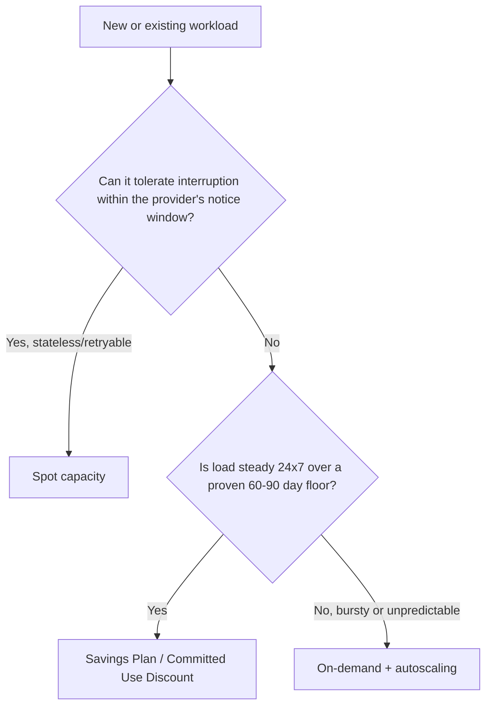

# Cloud Cost Optimization — Middle

<!-- level-focus -->
At middle level, focus on this question:

> Across a fleet of workloads with different traffic shapes, how do you decide the mix of on-demand, committed, and spot capacity — and compose autoscaling and tagging around it — so the choice stays correct as traffic shifts?

Use the smallest realistic scenario that exposes the decision and its failure behavior.

> **Roadmap:** [Cost Efficiency](../README.md) → Cloud Cost Optimization

*A junior decision picks the right lever for one resource. A middle-level decision picks the right mix of levers for a fleet, and keeps that mix from silently going stale as the fleet changes underneath it.*

---

## Core Concept 1 — From a Single Resource to a Portfolio

A single-resource decision ("this instance, spot or on-demand?") doesn't scale to a real system with dozens or hundreds of resources across several tiers. The unit of decision shifts from *one resource* to *a coverage target*: what fraction of the fleet's steady-state, always-on baseline should be covered by a commitment, what fraction is safe to run on spot, and what fraction must stay flexible on on-demand.

This is a portfolio problem, not a per-instance problem, because the three purchase options trade off against each other at the fleet level:

- Committing too much locks in spend against a baseline that might shrink (a service gets decomposed, traffic moves to another region, an instance family is deprecated).
- Committing too little leaves a real, provable discount unclaimed every month the steady baseline runs on-demand.
- Placing too much of the fleet on spot without tested interruption handling turns a routine capacity reclaim into a customer-facing incident.

The middle-level skill is setting a *coverage target* deliberately, backed by evidence, rather than treating each new instance as an isolated decision.

## Core Concept 2 — Evaluating Competing Purchase Options

Each purchase option trades flexibility for discount depth, and each carries a different operational burden:

| Option | Flexibility | Typical discount depth (illustrative, not current pricing) | Operational burden | Debuggability of billing anomalies |
|---|---|---|---|---|
| **On-Demand** | Full — cancel anytime, any instance | None (baseline rate) | Lowest | Easiest — cost tracks usage 1:1 |
| **Savings Plans / Committed Use Discounts** | High — flexible across instance family/size within a compute category | Moderate-to-high | Low — no code changes required | Moderate — discount applies automatically, but under-utilization can hide as "normal" spend |
| **Reserved Instances / Reserved VM Instances** | Low — tied to a specific instance family, size, and region | Highest for the narrowest fit | Low, but exchange/modification has friction | Harder — an unused reservation looks like a line item, not a problem, unless actively reviewed |
| **Spot / Preemptible / Spot VMs** | High discount, low capacity guarantee | Steepest | Highest — requires interruption handling, checkpointing, or graceful drain | Hardest — cost varies with market capacity, and interruption-driven retries can mask themselves as normal traffic |

The trade-off that matters most at this level: **discount depth and operational burden move together.** The deepest discounts (narrow Reserved Instances, Spot) demand the most engineering discipline to use safely. A team that reaches for the deepest discount without the matching operational investment (interruption handling, exchange planning) usually ends up paying for it in incident response instead of on the bill.

## Core Concept 3 — Under- and Over-Application Signals

**Over-committed:**
- Reserved Instance or Savings Plan coverage that exceeds the *proven* floor of usage — measured over the last 60-90 days, not a hopeful forecast — so a portion of the commitment sits unused (stranded spend) the moment traffic dips or an architecture change shifts load elsewhere.
- A workload placed on spot that turns out to be latency-sensitive and customer-facing, without a tested fallback, so an interruption becomes an outage instead of a routine capacity swap.

**Under-committed:**
- A workload with a demonstrably flat, 24/7 utilization graph for months, still running entirely on-demand — the discount is provably available and simply unclaimed.
- A fully interruption-tolerant batch or worker tier (idempotent jobs, a durable retry queue) still running on-demand or reserved capacity, when it's an obvious spot candidate.
- Autoscaling policies tuned only for availability headroom, never revisited for cost — a group that scales out aggressively but never scales back in once a metric returns to normal.

The pattern to watch for: commitment coverage should track a *conservative, evidence-based floor*, and spot eligibility should track *actual, tested interruption tolerance* — not a workload's theoretical tolerance that was never verified against a real interruption.

## Core Concept 4 — Incremental Adoption

Rolling a purchase-mix strategy across an existing fleet in one step invites both kinds of mistake above. Adopt incrementally instead:

1. **Establish the proven floor** for each tier — the minimum concurrent capacity observed over a trailing 60-90 day window, not a target or a forecast.
2. **Cover only the floor** with a commitment initially, even if current usage regularly runs higher — the excess above the floor stays on-demand or autoscaled.
3. **Layer spot in only after interruption handling is implemented and tested** — a workload isn't a spot candidate because it *should* tolerate interruption; it's a spot candidate once a real interruption test confirms it does.
4. **Revisit the floor on a fixed cadence** (quarterly is common) and grow commitment coverage as the floor genuinely rises, rather than reacting to a single good month.
5. **Only after several cycles**, consider deeper, narrower commitments (Reserved Instances over Savings Plans) for the portion of the floor that has proven stable across multiple review cycles.

## Core Concept 5 — Scenario: a Checkout Platform's Three Tiers

An e-commerce checkout platform has three tiers with different shapes:

- **Web tier** — customer-facing, autoscaling group, baseline traffic plus daily and promotional bursts.
- **Worker tier** — background job processing (receipt generation, inventory sync), idempotent, backed by a durable queue with retry.
- **Reporting tier** — internal, flat 24/7 utilization, no user-facing latency requirement.



Applying this to the three tiers: the **reporting tier** lands on committed capacity (steady, no interruption sensitivity assumed). The **worker tier** lands on spot, because it's idempotent and backed by a retry queue — but only after the team validates that a simulated interruption actually drains cleanly. The **web tier** is customer-facing and latency-sensitive, so it keeps a committed *base* capacity and only uses spot for *burst* capacity above that base, with on-demand as a fallback if spot is unavailable.

A mixed-instance autoscaling policy expresses this directly:

```yaml
# Illustrative AWS Auto Scaling Group mixed-instances policy for the web tier.
MixedInstancesPolicy:
  LaunchTemplate:
    Overrides:
      - InstanceType: m5.large
      - InstanceType: m5a.large   # alternate family for spot availability
  InstancesDistribution:
    OnDemandBaseCapacity: 10          # covers the proven floor, backed by Savings Plan
    OnDemandPercentageAboveBaseCapacity: 30   # burst above the floor: 30% on-demand fallback
    SpotAllocationStrategy: capacity-optimized
```

The `OnDemandBaseCapacity` line is the operational expression of "cover only the proven floor" — it's not a guess, it's the number from Core Concept 4's floor analysis.

## Core Concept 6 — Verifying at Unit and Integrated-Flow Level

**Unit-level checks** (fast, run per change):
- A policy-as-code check confirms every launch template or instance definition includes the required tag keys before it can be created.
- A config check confirms any resource marked spot-eligible has a registered interruption handler (a shutdown hook, a SIGTERM handler, or an equivalent lifecycle hook) in its deployment manifest.

**Integrated-flow checks** (slower, run against the real system):
- Simulate a spot interruption notice against the worker tier and confirm it drains within the provider's notice window, requeues in-flight work without duplication, and the retry queue's depth returns to baseline afterward.
- Compare the actual monthly cost breakdown (by tag: team, service, environment) against the forecast used to set the commitment coverage target — a persistent gap between forecast and actual is the earliest signal that the floor assumption is wrong.

## Core Concept 7 — Break-Even: On-Demand vs. Commitment (Illustrative)

The following is an illustrative worked example, not current pricing — always check your provider's current rates before making a real purchasing decision.

| Option | Illustrative relative hourly rate | Upfront cost | Break-even point (illustrative) |
|---|---|---|---|
| On-demand | 1.00x | None | N/A |
| 1-year Savings Plan (no upfront) | 0.70x | None | Immediate, if utilization ≥ committed amount every hour |
| 1-year Reserved Instance (partial upfront) | 0.60x | Moderate | Roughly month 5-6 of the 12-month term, assuming full utilization |
| 3-year Reserved Instance (all upfront) | 0.40x | High | Roughly month 14-16 of the 36-month term, assuming full utilization |

The pattern that matters: the deeper the discount, the further out the break-even point moves, and the more that break-even depends on an assumption (full utilization for the whole term) actually holding. A floor that looks stable for six months is not automatically evidence it will still be stable in month sixteen.

## Common Mistakes

- **Buying Reserved Instances for a workload about to migrate** to a new instance family, region, or a managed service — the reservation becomes stranded spend the moment the migration lands.
- **Tuning autoscaling only for availability**, never revisiting scale-in thresholds, so the group quietly runs above its needed capacity most of the day.
- **Leaving spot fallback untested** until a real interruption storm hits during a high-traffic event — the first real test of a fallback path should never be an incident.
- **Ignoring commitment expiration dates.** A one-year commitment that lapses unnoticed silently reverts the workload to full on-demand rate, and nobody notices until a monthly review.
- **Setting coverage targets from a forecast instead of a proven floor**, which is functionally the same mistake as buying before rightsizing at the junior level, just at fleet scale.

---

## Apply it

1. For one multi-tier system you know, list each tier and classify its traffic shape (steady, bursty, batch/interruption-tolerant).
2. For each tier, establish a proven floor using at least 60 days of utilization data, and propose a coverage target (percentage of the floor covered by commitment) with your reasoning.
3. For any tier you classify as spot-eligible, describe the specific interruption-handling mechanism it needs (drain hook, retry queue, checkpoint) and how you would test it before relying on it.
4. Draft a mixed-instance or equivalent autoscaling policy expressing the on-demand base, burst behavior, and spot allocation for one tier.
5. Define one unit-level check and one integrated-flow check that would catch this mix drifting out of date as traffic changes.

## Verify your work

- Each tier's coverage target is derived from a stated floor and time window, not a forecast or a round number.
- Every spot-eligible tier names a specific, testable interruption-handling mechanism — not just "it should be fine, it's stateless."
- The autoscaling policy draft explicitly separates base capacity (commitment-covered) from burst capacity (on-demand/spot), matching the floor analysis.
- The two verification checks you defined would each independently catch a real regression: one at deploy time, one by observing production behavior.

## Review questions

- Why does discount depth tend to move together with operational burden across the four purchase options?
- What distinguishes an over-committed fleet from an under-committed one, and what evidence would you check for each?
- Why should commitment coverage be set from a proven usage floor rather than from a forecast or current peak usage?
- What is the difference between a workload that is theoretically interruption-tolerant and one that is a verified spot candidate?
