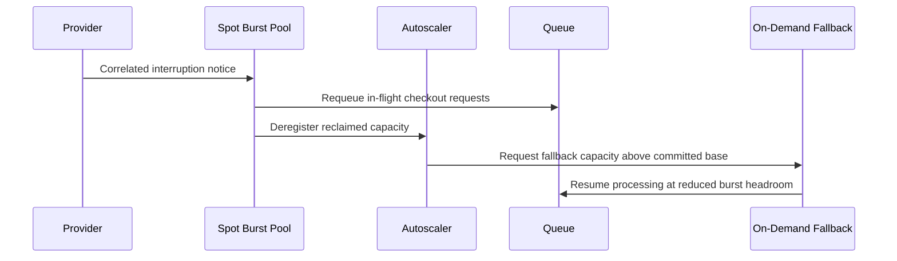

# Cloud Cost Optimization — Senior

<!-- level-focus -->
At senior level, focus on this question:

> How do you architect a compute-purchasing and capacity strategy that keeps its cost invariants intact as workload mix, architecture, and pricing structures change, and that degrades safely when a spot or commitment assumption turns out wrong?

Use the smallest realistic scenario that exposes the decision and its failure behavior.

> **Roadmap:** [Cost Efficiency](../README.md) → Cloud Cost Optimization

*A middle-level portfolio mix is correct for the system as it exists today. A senior-level architecture is correct for the system as it will exist after the next migration, the next region expansion, and the next pricing structure change nobody has announced yet.*

---

## Core Concept 1 — Separate the Capacity Abstraction Layer From the Purchase Commitment Layer

The architectural mistake that causes the most stranded spend is coupling application design to a specific purchasing decision. If a service's code, deployment, or operational runbooks assume "this runs on `m5.2xlarge` in `us-east-1`," then a Reserved Instance for exactly that shape becomes a hidden constraint on the architecture, not just a finance decision.

The fix is a clean boundary between two layers:

- **Capacity abstraction layer** — the application is packaged (containerized, or built against an instance-family-agnostic autoscaling group) so it can run on multiple instance families, sizes, and regions without code changes. This is what makes flexible commitments (Savings Plans, Committed Use Discounts) and Spot Fleets actually usable — they only pay off if the workload can absorb whatever capacity shape is actually available.
- **Purchase commitment layer** — the finance-facing decision of how much to commit, for how long, and in what form. This layer should be free to change (renegotiate, exchange, let lapse) without requiring an application redeploy, because it operates on a portfolio of interchangeable capacity, not on named instances the application depends on.

When these two layers are entangled, every purchasing decision becomes an architecture decision and vice versa — the team that wants to change instance family for performance reasons has to first unwind a multi-year reservation, and the team that wants to improve commitment coverage has to first confirm the application doesn't secretly depend on today's instance shape.

## Core Concept 2 — Invariants

A cost-purchasing architecture needs invariants that hold regardless of which team is making today's decision:

| Invariant | Statement | Why it must hold |
|---|---|---|
| **Interruption survivability** | Any workload placed on spot/preemptible capacity survives a full reclaim within the provider's notice window with no data loss and no duplicated side effect | Without this, "spot-eligible" is an assumption, not a fact, and the failure only surfaces during a real capacity crunch |
| **Floor-bounded commitment** | Committed coverage never exceeds the statistically proven floor of usage for that workload | Prevents stranded spend when traffic or architecture shifts |
| **Enforced attribution** | Every billed resource carries required cost-allocation tags, enforced at creation time by policy, not by convention | A cost anomaly with no owner cannot be fixed, only argued about |
| **Bounded blast radius** | No single purchasing decision creates an availability single point of failure (e.g., an entire fleet on spot in one region, or one region holding all committed capacity) | A correlated failure (regional spot shortage, AZ outage) must degrade the system, not take it down |

These invariants belong to the architecture, not to any one team's judgment call — which is why they need to be checkable independent of who made the original decision.

## Core Concept 3 — Failure Modes

- **Commitment lock-in on architecture migration.** A team migrates a workload to a new instance generation, a managed service, or a different region for unrelated reasons (performance, availability), and the existing Reserved Instance commitment for the old shape becomes unusable spend for the remainder of its term. This is the most common way "we saved money" in month one becomes "we're stuck paying for two things" in month eight.
- **Correlated spot interruption storms.** Spot/preemptible capacity is drawn from a shared pool. A regional capacity crunch (often during broad demand spikes) can reclaim a large fraction of a fleet's spot instances at once, rather than the gradual, isolated interruptions the fleet's design may have assumed.
- **Autoscaling fighting the cost strategy.** A scaling policy tuned purely for latency headroom can thrash between scale-out and scale-in in a way that defeats a mixed on-demand/spot base-capacity split — the group ends up paying for the churn (launch overhead, warm-up time) without the commitment coverage it was designed around actually applying cleanly.
- **Tag drift at scale.** As new services, teams, and environments are added without enforcement, tag coverage degrades gradually rather than suddenly — nobody notices until a cost anomaly can't be attributed to an owner, at which point the drift has often been accumulating for months.

## Core Concept 4 — Evidence Over Assumption

A senior-level purchasing architecture is validated with evidence, not with a single engineer's confidence:

- **Multi-month utilization trend**, not a snapshot — a floor claimed from one good quarter is a different claim than a floor confirmed across three.
- **Provider-published interruption-frequency signals** (for example, a spot placement/interruption-frequency indicator) checked *before* sizing a spot fleet, not after the first interruption surprises the team.
- **Reconciled showback data** — the internal report attributing spend to teams/services must tie back to the actual invoice line items; a showback report that has quietly diverged from the real bill is worse than no showback at all, because it's trusted.
- **An explicit maturity framing** (the FinOps Foundation's Inform-Optimize-Operate phases are a widely used reference point) used to judge whether a proposed change is appropriate for where the organization actually is, rather than importing a practice built for a more mature or a less mature environment.

## Core Concept 5 — Cross-Component Scenario: a Regional Spot Interruption Storm

A payments platform runs across two regions. The primary region covers its checkout web tier with a committed base plus a spot-backed burst pool, and keeps its payment-authorization tier entirely on committed on-demand-equivalent capacity per the bounded-blast-radius invariant (payment authorization is never placed on spot). A secondary region holds a smaller, warm on-demand footprint for failover.

During a flash sale, a regional capacity crunch reclaims most of the primary region's spot burst pool within a short window — a correlated interruption, not the isolated one-at-a-time reclaim the fleet's spot allocation strategy alone would suggest.

What the invariants from Core Concept 2 buy the system here: interruption survivability means the requeued checkout requests aren't lost or double-charged; the bounded-blast-radius invariant means the payment-authorization tier — never on spot — is untouched by the storm; and the floor-bounded commitment on the web tier's base capacity means the fallback only has to cover the burst gap, not the entire tier, keeping the fallback cost proportionate to the actual shortfall.

## Core Concept 6 — Trade-offs Among Plausible Approaches

| Approach | Flexibility across instance family/region | Discount depth | Interruption exposure | Best fit |
|---|---|---|---|---|
| **Savings Plans / Committed Use Discounts** | High | Moderate-high | None | Steady baseline across a mix of instance shapes that may still evolve |
| **Reserved Instances / convertible RIs** | Low (fixed) / moderate (convertible, exchangeable) | Highest for a fixed match | None | A proven, narrow, long-lived shape — convertible variants for shapes likely to shift |
| **Spot Fleets with fallback** | High (fleet spans families/AZs) | Steepest | High, but mitigated by diversification and fallback | Interruption-tolerant burst or batch capacity |
| **On-demand only** | Full | None | None | New workloads, or anything whose floor hasn't been proven yet |

No single approach dominates — the architecture question is how much of the fleet to place in each row, bounded by the invariants, not which single option is "correct."

## Core Concept 7 — Questions That Expose Weak Assumptions

- What fraction of our claimed steady baseline is actually stable over the length of the commitment term, versus an artifact of a recent growth spurt or a temporary promotion?
- If every spot instance in this fleet were reclaimed within the same five-minute window, what actually happens — has that been tested, or only assumed from the workload's design intent?
- Is this workload's architecture genuinely portable across instance families and regions, or did we buy a flexible commitment for a workload that secretly can't use that flexibility?
- Who reconciles the showback report against the actual invoice, and how would the organization notice if the two silently diverged?

## Core Concept 8 — Recovery and Evolution

- **Reservation exchange and modification.** Convertible Reserved Instances and instance-family/size modification paths exist specifically so a committed shape can adapt to an architecture change rather than becoming stranded spend outright — but only if the team knows the exchange path exists before the migration happens, not after.
- **Commitment laddering.** Staggering commitment start and renewal dates so only a fraction of total coverage expires or renews at once avoids a cliff where the whole portfolio's assumptions are re-validated (or re-negotiated) simultaneously under time pressure.
- **Mandatory review trigger on architecture change.** Any planned migration, region expansion, or instance-family change should trigger a commitment-portfolio review as a required step, the same way a schema change triggers a migration review — otherwise the purchase-commitment layer silently falls out of sync with the capacity abstraction layer it was supposed to sit cleanly beneath.

---

## Apply it

1. For one real multi-tier system, write down which tier(s) would violate the bounded-blast-radius invariant today if a regional capacity crunch hit — name the specific tier and the specific concentration (all spot, all one region, all one commitment) that creates the risk.
2. State the floor-bounded-commitment invariant for that system's steadiest tier: what is the proven floor, over what time window, and does current commitment coverage exceed it?
3. Design a fallback path for the tier most exposed to a correlated spot interruption, and sketch it as a short sequence (which component gets the interruption notice, what requeues, what replaces the lost capacity).
4. Pick one plausible purchasing approach from the trade-off table for that tier's burst capacity and justify it against at least one alternative, referencing the tier's actual interruption exposure and flexibility needs.
5. Write the one review trigger (a specific kind of migration or architecture change) that should force this portfolio to be re-evaluated, and name who is responsible for acting on it.

## Verify your work

- The blast-radius answer names a specific tier and a specific concentration risk, not a general statement that "spot is risky."
- The floor-bounded-commitment check uses an actual time window and a real coverage number, and states clearly whether current coverage exceeds the proven floor.
- The fallback design specifies what happens to in-flight work during the interruption, not just where replacement capacity comes from.
- The purchasing-approach justification explicitly weighs at least one alternative from the trade-off table and states why it was rejected for this tier.
- The review trigger names a concrete event and a named owner, not a calendar reminder alone.

## Review questions

- Why does coupling application architecture to a specific purchasing commitment create risk during a later migration?
- What is the difference between a spot-eligible workload and a workload whose interruption survivability has actually been tested?
- Why can a correlated spot interruption storm defeat a fleet design that assumed isolated, one-at-a-time reclaims?
- What evidence would distinguish a genuinely stable usage floor from one that merely looks stable over a short observation window?
