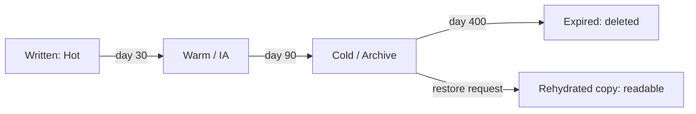

# Storage Tiering and Data Lifecycle — Junior

<!-- level-focus -->
At junior level, focus on this question:

> Given a set of objects with a known access pattern, which storage tier should each one live in, and how do you prove the lifecycle rule you wrote actually moves and expires them the way you expect?

Use the smallest realistic scenario that exposes the decision and its failure behavior.

*Storage isn't one price. The same byte gets cheaper to store and more expensive to fetch back as it moves from hot to archive — learn to read that trade-off before you write a single lifecycle rule.*

---

## Core Concept 1 — Vocabulary: tiers, access frequency, retrieval latency

Every major cloud storage service offers more than one "class" for the same object storage. They differ along two axes: **how often you expect to read the data** and **how long you're willing to wait to get it back**. The naming differs slightly per provider, but the shape is the same everywhere:

| Tier (generic) | AWS S3 | Azure Blob | Google Cloud Storage | Fits data read... | Retrieval latency |
|---|---|---|---|---|---|
| Hot | Standard | Hot | Standard | Multiple times a day | Milliseconds |
| Warm | Standard-IA (Infrequent Access) | Cool | Nearline | About once a month | Milliseconds, higher per-GB retrieval fee |
| Cold | Glacier / Glacier Instant Retrieval | Cold | Coldline | A few times a year | Milliseconds to minutes, depending on the specific cold class |
| Archive | Glacier Deep Archive | Archive | Archive | Rarely — compliance, legal, disaster recovery | Hours (a restore/rehydration step is required before you can download) |

Two things matter more than the exact names:

1. **Storage cost falls as you move down the table; retrieval cost and latency rise.** A tier is not "better" or "worse" — it's a bet about how often you'll actually read the data.
2. **Cold and archive tiers are not instantly readable.** You typically issue a *restore* request first, wait (minutes to hours depending on the class and how much you're willing to pay for expedited restore), and only then can you download the object. Treat this as a real step in your process, not an afterthought.

---

## Core Concept 2 — A repeatable method for choosing a tier

1. **Classify the access pattern.** For the data you're looking at, answer: how often is it actually read, and does that frequency drop off sharply after some age (most operational data does)?
2. **Match the pattern to a tier** using the table above — pick the tier whose "fits data read..." column matches your real behavior, not your hope.
3. **Check the tier's constraints.** Most infrequent-access and cold tiers have a *minimum storage duration* (commonly 30–180 days depending on class) — deleting or transitioning an object before that window incurs an early-deletion charge. Don't transition data that might be deleted or re-read sooner than that minimum.
4. **Write a lifecycle rule** that automates the transition at the point where your data's access frequency actually drops — not an arbitrary round number.
5. **Set an expiration** once you know how long the data legally or operationally needs to exist, so nothing accumulates forever by default.
6. **Verify** the rule against a real or simulated timeline before you trust it in production.

---

## Core Concept 3 — Worked example: an application log bucket

Say you run a service that writes structured logs to `s3://app-logs-prod/app-logs/`. You look at how the logs are actually used:

- **Days 0–7:** engineers query logs constantly while debugging recent incidents.
- **Days 8–90:** occasional reads, mostly during postmortems for older incidents.
- **After day 90:** essentially never read directly, but must be *retained* for 400 days to satisfy an internal audit requirement.

That access pattern maps cleanly onto the tiers: hot for the first month, infrequent access through day 90, then archive until the retention window closes. As an S3 lifecycle configuration:

```json
{
  "Rules": [
    {
      "ID": "app-logs-tiering",
      "Filter": { "Prefix": "app-logs/" },
      "Status": "Enabled",
      "Transitions": [
        { "Days": 30, "StorageClass": "STANDARD_IA" },
        { "Days": 90, "StorageClass": "GLACIER" }
      ],
      "Expiration": { "Days": 400 }
    }
  ]
}
```

Walk the timeline for a log object written on day 0:

```
Day 0    written, StorageClass = STANDARD (hot)
Day 30   transitions to STANDARD_IA (warm) — cheaper to store, small retrieval fee
Day 90   transitions to GLACIER (archive) — cheapest to store, restore step required to read
Day 400  expires — object is deleted, satisfying the 400-day retention requirement
```

If someone needs a log from day 120 during a postmortem, they can't just download it — they issue a restore request against the archived object, wait for it to rehydrate, and only then read it. That wait is the price of the storage savings between day 90 and day 400.

---

## Core Concept 4 — Compression is a separate, stackable lever

Tiering changes *where* data lives; compression changes *how big* it is. The two compose: a gzip-compressed log file transitioned to a cold tier is cheaper than an uncompressed one in the same tier. Before archiving verbose data (plain-text logs, uncompressed JSON exports), consider compressing it first — a routine gzip pass or switching an export format to a compressed columnar one (like Parquet with Snappy or Zstandard compression) commonly shrinks storage footprint substantially with no change to the tiering logic. Don't treat "which tier" and "how compressed" as the same decision — they're independent knobs you should both turn.

---

## Core Concept 5 — Lifecycle stages at a glance



The one edge junior engineers most often forget is the "restore request" branch — reading an archived object is not the same operation as reading a hot one.

---

## Real-World Examples

- **A support-ticket attachments bucket.** Attachments are read constantly for the first two weeks a ticket is open, occasionally for a few months after, and almost never once a ticket has been closed and archived internally. A two-step lifecycle (hot for 14 days, warm for 6 months, then archive) matches that curve without anyone having to think about it case by case.
- **A nightly database export used for analytics.** The export is read heavily the morning after it lands, then rarely again once the next night's export supersedes it — except for month-end exports, which analysts reopen for reporting. Tiering the daily exports aggressively while leaving month-end exports in a warmer tier for longer reflects that the "same kind" of file can have two different access patterns depending on why it was created.
- **A forgotten expiration.** A team sets up tiering for cost savings but never adds an expiration rule. Years later, the bucket holds terabytes of archive-tier data nobody reads and nobody remembers the retention requirement for — cheap per gigabyte, but never actually reviewed or deleted, quietly growing the bill anyway.

---

## Common Mistakes

- **Transitioning before the minimum storage duration.** Moving an object to infrequent-access or archive and then deleting or re-transitioning it days later can trigger an early-deletion charge — check the tier's minimum duration before picking a transition day.
- **Assuming archive tiers are instantly readable.** Forgetting the restore/rehydration step means your incident response plan silently assumes data that takes hours to arrive is available in seconds.
- **One lifecycle rule for a whole bucket that mixes data types.** A bucket holding both hot transactional exports and cold historical logs under a single prefix-less rule will mis-tier one of them.
- **Setting expiration from convenience instead of the actual retention requirement.** Expiring data at 30 days because "that felt reasonable" can violate an audit or legal retention requirement that nobody checked.
- **Skipping compression before archiving.** Paying archive-tier prices for an uncompressed format wastes the exact savings the tier was supposed to deliver.

---

## Apply it

1. Pick (or create) a small set of sample files representing one data type — e.g., 10 mock log files with different creation dates spanning 0–120 days old.
2. Write down the access pattern you're assuming for each age bucket (how often read, by whom, until when).
3. Write a lifecycle-policy snippet (JSON or YAML, S3- or GCS-style) that transitions and expires the files to match that access pattern, including at least two transition steps and one expiration.
4. Trace through the timeline by hand (or with a script) and list, for each sample file, its expected storage class on day 0, 30, 90, and 400.
5. Pick one file older than your archive-transition day and describe the extra step (restore/rehydrate) needed before it can be read, including the latency you'd expect.

## Verify your work

- Your lifecycle-policy snippet parses as valid JSON/YAML and names a real storage class per provider (e.g., `STANDARD_IA`, `GLACIER`, `COOL`, `ARCHIVE`, `NEARLINE`, `COLDLINE`).
- For each traced day, the predicted storage class matches what the rule's `Days` thresholds say it should be — no off-by-one errors in the transition schedule.
- The expiration day you chose is greater than or equal to any retention requirement you wrote down, not shorter.
- You can explain, in one sentence, why the archived file needs a restore step and roughly how long that step takes before the object is downloadable.

## Review questions

- What are the two axes that distinguish hot, warm, cold, and archive tiers from each other?
- Why can transitioning an object too early into a colder tier cost more, not less?
- What extra step does reading data from an archive tier require that reading from a hot tier does not?
- How do compression and tiering act as two separate, stackable levers on storage cost?
