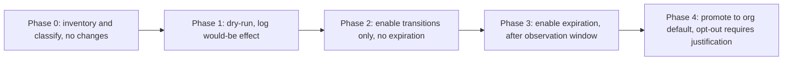

# Storage Tiering and Data Lifecycle — Professional

<!-- level-focus -->
At professional level, focus on this question:

> How do you design the ownership, governance, and rollout model so dozens of teams can each apply storage tiering and lifecycle policies safely and cheaply, with measurable outcomes, and without a central team reviewing every bucket's rule by hand?

Use the smallest realistic scenario that exposes the decision and its failure behavior.

*A tiering policy that only one team can operate correctly does not scale past that team. The professional problem is not "what's the right lifecycle rule" — it's building an operating model where dozens of teams get the right rule by default, and a wrong one is caught before it becomes a compliance incident or a cost surprise.*

---

## Core Concept 1 — A paved road, not a per-team decision

At organization scale, the choice is not "does each team design its own tiering strategy." It's whether a platform team ships a small number of pre-approved, well-tested lifecycle templates — one per data classification (say: transient logs, backups/snapshots, user-generated content, regulated records) — that product teams select from by default, deviating only with a documented reason.

This reframes the unit of decision-making. A product team's job becomes: **classify the data correctly** (which of the platform's standard classes does this belong to) rather than **design a lifecycle policy from scratch**. That is a smaller, more checkable decision, and it's the one that scales — misclassification is reviewable in a lightweight way; a bespoke policy per team is not.

```
Platform team owns:      the templates, the guardrails, the monitoring, the exception process
Data-owning team owns:   correct classification, reacting to alerts about their data
Legal/compliance owns:   what each classification's retention rule must say, and hold management
```

---

## Core Concept 2 — Decomposing the rollout into reversible, observable increments

Rolling out org-wide tiering is itself a delivery problem, not a one-time configuration change. A durable sequence:



- **Phase 0 — inventory and classify.** Enumerate buckets/prefixes across the org, tag each with a data classification and an owning team. No lifecycle behavior changes yet. This phase alone frequently surfaces unowned or misclassified data that predates any tiering effort.
- **Phase 1 — dry-run/shadow.** Compute, for each classified data set, what a candidate lifecycle rule *would* transition or expire, and log it against real access telemetry, without applying it. The output you're looking for is the false-positive rate: how much data the rule would have moved or deleted that was, in fact, still being read. This is the single most important gate before touching anything live.
- **Phase 2 — transitions only.** Apply tier transitions (moving colder), explicitly withholding expiration, for the lowest-risk classification first. Observe one full billing cycle for cost impact and any unexpected retrieval-latency complaints.
- **Phase 3 — expiration enabled.** Only after Phase 2 has run clean for a defined window (and only outside any legal-hold-tagged data) does deletion get enabled. This is the genuinely irreversible step in the sequence, so it's deliberately last and deliberately gated.
- **Phase 4 — org default.** Once a classification's template has proven itself across enough teams, it becomes the default for that classification org-wide; new buckets inherit it automatically, and *not* using it requires a documented, reviewed exception.

Each phase produces observable evidence before the next one is allowed to start — this is what makes the rollout reversible in practice, not just in principle.

---

## Core Concept 3 — Migration, governance, and coordination risks

- **Legal hold and regulatory retention as a platform-level guardrail, not a per-team promise.** A missed hold tag is a compliance incident, not a bug ticket. Enforce it structurally — object lock, a dedicated hold namespace, or a hard block in the platform's rule-application path that checks hold status before any transition or deletion — rather than trusting every team's individual rule to remember an exception.
- **Shared buckets across teams.** A common, real incident shape: two teams write to prefixes under one bucket, one team's lifecycle rule is scoped too broadly, and it silently affects the other team's objects. The platform's guardrail here is requiring rule filters to be scoped to a single owning team's prefix, checked at rule-creation time, not discovered after the fact.
- **Silent rule failure.** Cloud providers generally don't page you when a lifecycle rule stops matching anything — a filter typo, a permission change, or a renamed prefix all fail quietly. The platform must supply its own monitoring layer: expected-versus-actual transitioned-object counts per rule, alerting on divergence, independent of whether the provider considers the rule "healthy."
- **Conflicting requirements.** Regulatory retention ("keep 7 years") and a data-minimization or deletion request ("delete this person's data now") can directly conflict. This must have an explicit escalation path — a legal/privacy review queue — so individual engineers are never left resolving a legal conflict ad hoc under a support ticket's time pressure.

---

## Core Concept 4 — Outcome measures and evidence-based exit conditions

Vague goals ("save money on storage") don't survive contact with forty teams. Make the outcomes explicit and the promotion criteria evidence-based:

| Measure | What it tells you |
|---|---|
| % of stored bytes on the tier matching their measured access pattern | Whether classification and rules are actually correct, not just deployed |
| Relative storage cost trend per data classification (illustrative: month-over-month change, not an absolute figure) | Whether tiering is delivering the savings it was built for |
| Retrieval requests and retrieval cost per prefix/job | Early warning of scope creep or under-provisioned bulk-restore paths |
| Restore-SLA adherence (% of restore requests completed within the committed window, per tier) | Whether the org is honoring the retrieval-latency contract it implicitly made with consuming teams |
| Compliance-incident count (data deleted under hold, or retained past a mandated deletion date) | A zero-tolerance metric — any nonzero value should trigger automatic rollback of the responsible rule and a review |

Attach explicit exit conditions to each rollout phase rather than leaving "when do we move on" to judgment calls: for example, "promote a classification from dry-run to transitions-enabled only after two consecutive billing cycles show a false-positive rate under an agreed threshold in the shadow log," or "enable expiration only after zero unexpected-access alerts over a defined observation window." A phase without a written exit condition tends to either stall indefinitely or get promoted on optimism.

---

## Core Concept 5 — Cross-team contracts and accountability

Treat the relationship between the platform team and every consuming team as a contract, written down, not assumed:

- **What each tier promises.** A restore-time commitment per class (e.g., "warm-tier restores complete within minutes; archive-tier restores are queued and may take hours") that consuming teams can actually design their own SLAs against.
- **Who is paged when.** If a data-owning team's storage volume stops shrinking as the schedule predicts, who gets the alert — the platform team, the data owner, or both — and what's the expected response time.
- **How exceptions get requested and reviewed.** A team that genuinely needs a nonstandard policy (e.g., a compliance requirement not covered by the standard classifications) has a defined path to request one, reviewed by the platform and legal/compliance teams jointly, rather than quietly hand-rolling a rule outside the paved road.
- **How a new classification gets added.** As the org's data shapes evolve, the set of standard classifications isn't fixed forever — but adding one is a deliberate, reviewed act with its own template and guardrails, not an ad hoc addition by whichever team needed it first.

This is what keeps the model scaling without the platform team becoming a bottleneck: teams self-serve against a documented contract instead of filing a ticket for every bucket.

---

## Core Concept 6 — Sustained delivery: rolling out across forty teams

A platform team introduces the paved-road tiering model across roughly forty teams' storage over two quarters, organized in risk-ordered waves rather than one big-bang change:

```
Wave 1 (weeks 1-4):    internal build artifacts, transient logs        — lowest risk
Wave 2 (weeks 5-10):   application logs, intermediate pipeline data    — moderate risk
Wave 3 (weeks 11-16):  backups and snapshots                           — restore-sensitive
Wave 4 (weeks 17-24):  user-generated content, regulated records       — highest risk, last
```

Each wave passes through the full Phase 0–4 sequence from Concept 2 before the next wave starts on its riskiest classification, though earlier waves' low-risk classifications can run phases in parallel with later waves' inventory work — the constraint is evidence at each gate, not a fixed calendar. A shared dashboard exposes each team's classification status, phase, and the outcome measures from Concept 4, so any team can check their own progress and exit-condition status without opening a ticket to the platform team. The platform team's job during this stretch is less "configure every bucket" and more "unblock the teams whose evidence doesn't yet meet a phase's exit condition, and adjudicate the exceptions that legitimately don't fit a standard classification."

The organizational outcome that matters isn't a single migration completing — it's that the *next* team's bucket, created six months after the rollout finishes, inherits a correct default tiering policy automatically, with no one having to remember to ask for it.

---

## Common Mistakes

- **Treating rollout as a one-time configuration project** instead of a sustained, gated delivery sequence with evidence at each step.
- **Trusting per-team lifecycle rules to encode legal-hold exceptions** instead of enforcing holds structurally at the platform level.
- **Skipping the dry-run phase** and discovering the false-positive rate only after data has actually transitioned or expired.
- **No cross-team contract for restore-time expectations**, leaving consuming teams to discover the real SLA during an incident.
- **A single company-wide classification scheme with no path to add a new one**, forcing teams with genuinely novel needs to route around the paved road entirely.
- **Measuring only aggregate storage cost**, missing the retrieval-cost and compliance-incident signals that catch problems earlier and cheaper.

---

## Apply it

1. Define the organization-level outcome tiering should improve (e.g., % of bytes on the correct tier, or reduction in unmanaged storage growth) in terms specific enough to measure next quarter.
2. Draft the platform's standard data classifications and, for each, name the owning function responsible for its retention rule (legal, platform, or the data-owning team).
3. Write the exit condition that would move one classification from dry-run to transitions-enabled, stated as a measurable threshold, not a date.
4. Design the escalation path for a conflict between a regulatory retention requirement and a deletion request, naming who makes the final call.
5. Sketch the risk-ordered wave plan for rolling the model out across multiple teams, and identify which classification you'd deliberately place last.

## Verify your work

- Each classification has a named owner for its retention rule, discoverable without asking the platform team directly.
- The exit condition for at least one rollout phase is a measurable threshold that a dashboard could evaluate automatically.
- The escalation path for a legal/retention conflict names a specific decision-maker, not "the team figures it out."
- The wave plan places the highest-risk data classification last, with earlier waves having already produced evidence the mechanism works.

## Review questions

- Which measurable outcome would tell you the tiering rollout is succeeding, beyond a single team's cost report?
- Who owns correctness of data classification versus correctness of the retention rule itself?
- What evidence-based exit condition should gate enabling expiration for a data classification, not just enabling transitions?
- How does the operating model prevent a legal-hold exception from depending on any single team remembering to apply it correctly?
