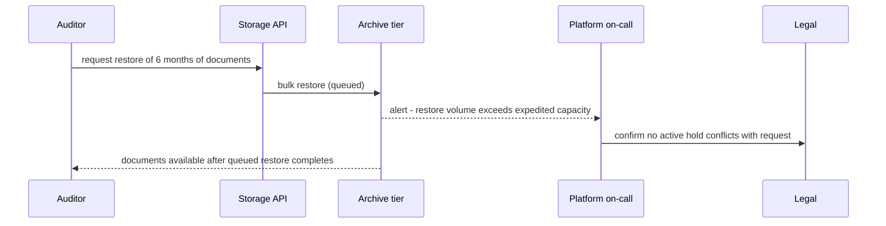

# Storage Tiering and Data Lifecycle — Senior

<!-- level-focus -->
At senior level, focus on this question:

> Which invariant — a retrieval-time SLA, non-deletion under legal hold, or bounded restore cost — must hold as objects transition automatically across tiers, and which failure mode breaks it first: a misconfigured rule, a bulk-restore spike, or a downstream job that silently starts scanning cold data?

Use the smallest realistic scenario that exposes the decision and its failure behavior.

*A lifecycle policy that has never been exercised under a real restore, a real legal hold, and a real access-pattern drift is a cost optimization, not a system design. Treat automated tiering as a subsystem with invariants, failure modes, and recovery paths, the same way you would a cache or a queue.*

---

## Core Concept 1 — The invariants a tiering system must protect

Automated lifecycle management touches three properties that must hold regardless of which tier an object currently sits in:

1. **Bounded retrievability.** Every object has an agreed maximum time-to-first-byte for its current tier. Archive-tier objects can take hours to rehydrate — that's acceptable *if it was designed for*, and a violation *if a caller assumed millisecond access*.
2. **Non-deletion under hold.** Any object under legal hold, active litigation, or a regulatory retention requirement must never be deleted or transitioned in a way that violates that hold — regardless of what a generic lifecycle rule's day-count says.
3. **Observable transition state.** At any moment, you can answer "what tier is this object in, and did it transition on schedule" — without that, a broken rule is indistinguishable from a working one until someone hits an unexpected restore delay or an audit finds data that should have been deleted.

A tiering design that can't state which of these three it's protecting for a given data class hasn't actually decided anything — it's inherited whatever the cloud provider's defaults happen to do.

---

## Core Concept 2 — Failure mode: bulk-restore spikes

Archive tiers are provisioned for rare, small restores — not for "we need a year of data back right now." When an incident, an audit, or a legal discovery request needs many archived objects restored simultaneously, providers commonly throttle or queue bulk restore requests, and the *expedited* retrieval option (faster, costlier) has its own capacity limits that can be exhausted under a large enough request.

The senior failure to avoid: assuming the "hours" retrieval latency documented for a single object also holds for ten thousand objects requested at once. It usually doesn't — queued bulk restores can stretch materially longer than expedited restoral of one object, and cost scales with both volume and retrieval speed chosen.

**Design response:**
- Know, before an incident, what your actual bulk-restore capacity and cost look like for the volumes you'd plausibly need — this is something you test, not estimate.
- For data likely to need bulk restoration under pressure (compliance audits, security investigations), consider keeping it one tier warmer than pure storage-cost optimization would suggest, trading some storage savings for materially faster incident response.
- Build a "rehydration path" for scheduled bulk needs (e.g., a recurring audit) that restores well ahead of when the data is actually needed, rather than restoring reactively under time pressure.

---

## Core Concept 3 — Failure mode: the silent scope-creep read

The most expensive tiering failure is rarely a single dramatic incident — it's a downstream job that used to read only recent, hot data and, through an innocuous code change (a widened date filter, a removed `WHERE` clause, a new report that "just scans everything"), starts reading data that tiering has since made slow and costly to access. Nothing crashes. The job gets slower, the bill for retrieval requests climbs, and by the time anyone notices, months of unexpected retrieval charges have accumulated and the job's latency SLA has quietly been breached.

**Design response:**
- Treat the tiering boundary as part of a job's contract, not an implementation detail: document and, where possible, enforce (via IAM scoping, partitioning, or a query-time date guard) that a given job's access is bounded to the tier(s) it was designed against.
- Alert on retrieval-request volume and retrieval cost per job/prefix, not just total storage cost — a spike in retrieval requests against a cold or archive prefix is an early, cheap signal; a spike in the monthly bill is a late, expensive one.

---

## Core Concept 4 — Failure mode: the misconfigured or drifted rule

Lifecycle rules degrade silently. A prefix gets renamed and a filter stops matching. A permission change breaks the rule's ability to execute without erroring visibly. A rule intended for one data class is copy-pasted onto another with an overlapping prefix, and now two policies apply to the same objects with unclear precedence. None of these announce themselves — they show up later, either as a compliance gap (data deleted that shouldn't have been) or a cost anomaly (data that should have transitioned, didn't).

**Design response:** monitor the *effect* of the rule, not just its existence — track "expected objects transitioned this period" against "actual objects transitioned," derived from your ingestion rate and rule schedule, and alert on divergence. Treat lifecycle-rule configuration as code: reviewed, tested against a synthetic object population before deployment, and diffed on every change.

---

## Core Concept 5 — Recovery and evidence

When a tiering-related incident does happen, the diagnostic questions are specific:

- **Restore workflow inspection.** Which retrieval tier (expedited/standard/bulk, or the provider's equivalent) was requested, what was its queue position, and does the observed delay match the tier's documented behavior or expose a capacity limit nobody accounted for?
- **Rule audit trail.** Does the currently-deployed lifecycle configuration match what the retention policy document says it should be, byte for byte? A drifted rule and a documented policy that quietly diverged is a common root cause.
- **Access-pattern telemetry, not assumption.** Before changing a boundary in response to an incident, look at the actual read frequency over the affected object age range — an incident caused by "this data was read more than we assumed" should be fixed with evidence from storage analytics, not a guess at a new day threshold.

This evidence is also what validates a tiering design *before* an incident forces the question: a restore drill (deliberately restoring a realistic volume from archive and measuring latency and cost) is the tiering equivalent of a disaster-recovery test, and should be run on the same cadence.

---

## Core Concept 6 — Cross-component scenario: multi-tenant document storage

A SaaS platform stores customer-uploaded documents. The natural lifecycle:

- **Days 0–30 (hot):** documents are actively edited and viewed.
- **Months 1–12 (warm):** occasional access, mostly re-opening an old document.
- **After 12 months (archive):** retained to satisfy a contractual 7-year record-keeping obligation, rarely accessed.

Two forces complicate the clean picture:

- **Legal holds.** The legal team occasionally flags a specific customer's documents as under litigation hold. Those objects must be excluded from the normal expiration path — indefinitely, regardless of age — until the hold is lifted. A generic age-based lifecycle rule has no concept of "except this customer," so this exception must be enforced structurally (a separate namespace/bucket with lifecycle disabled, or a tag-based exclusion filter checked before any deletion), not left to a shared rule to somehow know about.
- **Bulk audits.** Once or twice a year, an external auditor requests a large batch of archived documents across many customers. This is exactly the bulk-restore scenario from Concept 2, and if it wasn't planned for, it turns a routine compliance request into an incident.

The system-level decision here is not "which tier" for any single object — it's **where the legal-hold exception lives structurally**, so that a lifecycle rule can never race against a hold being set, and **whether bulk-restore capacity was provisioned for the audit case** before the audit request arrived rather than after.

---

## Core Concept 7 — Trade-offs among plausible approaches

| Approach | Strength | Weakness |
|---|---|---|
| Cloud-native lifecycle rules only (prefix/tag-based, provider engine) | Simple, no extra system to operate, provider-managed reliability | Can't easily encode conditional exceptions like "unless legal hold is set"; precedence between overlapping rules is provider-defined and easy to misjudge |
| Application-level tiering service (your code decides and calls storage APIs) | Encodes arbitrary business exceptions (holds, per-tenant overrides); full audit trail you control | A new system you must build, test, and keep from drifting out of sync with the actual data; another thing that can fail |
| Separate bucket/namespace per exception class (e.g., all legal-hold objects live outside normal lifecycle rules entirely) | The invariant "nothing here auto-deletes" is structurally true, not policy-dependent | More buckets/namespaces to provision, secure, and remember exist |
| Single bucket with tag-based exclusion filters | Fewer buckets to operate | A single tagging bug silently removes the protection — the invariant is only as strong as the tag being set correctly every time |

There's no universally correct choice; the senior judgment is matching the approach's failure mode to what your organization can tolerate. A regulated data class where a missed hold is a legal incident should lean toward structural separation (the third row) even at the cost of more infrastructure, because its failure mode is "a tag was wrong" versus "a bucket didn't exist to fail."

---

## Common Mistakes

- **Sizing bulk-restore expectations off single-object retrieval latency**, missing that queued volume restores behave very differently.
- **Letting a downstream job's read scope drift** without any alert on retrieval volume against cold/archive prefixes.
- **Trusting a lifecycle rule's existence as proof it's working**, instead of monitoring its actual transition effect against expected volume.
- **Encoding legal-hold exceptions as a tag inside the same rule path they're supposed to override**, creating a race between "rule fires" and "hold gets set."
- **Never running a restore drill**, so the first real bulk restore happens during an actual incident or audit, at the worst possible time to discover a capacity limit.
- **Treating "which tier" as the only decision**, when "where does the exception invariant live structurally" is usually the harder and more consequential one.

---

## Apply it

1. State the specific invariant (retrieval-time SLA, non-deletion under hold, or bounded restore cost) that matters most for one real or realistic data class you're responsible for.
2. Identify the single failure mode most likely to violate that invariant first, and where in the system it would surface.
3. Compare two plausible designs (e.g., cloud-native rules vs. structural separation for exceptions) against that failure mode specifically, not against general elegance.
4. Define what a restore drill or rule-audit check would need to measure to give you evidence the invariant holds today.
5. Write the one question about this design that, if answered wrong, would force a redesign — and try to answer it before building anything further.

## Verify your work

- You can name the invariant and the failure mode in one sentence each, without hedging.
- The comparison between designs cites a concrete failure behavior, not a general preference for simplicity or flexibility.
- A restore drill or equivalent test produces a real number (latency, cost, or objects-per-hour) rather than a documented assumption.
- The hardest question you identified has an answer backed by evidence (a test, a metric, an audit trail) rather than by confidence.

## Review questions

- Which invariant must remain true even while an object is mid-transition between tiers?
- Why does single-object restore latency fail to predict bulk-restore behavior during an incident or audit?
- Where should a legal-hold or compliance exception live so it can't race against a lifecycle rule's schedule?
- What evidence would tell you a lifecycle rule has silently stopped matching the objects it was meant to?
