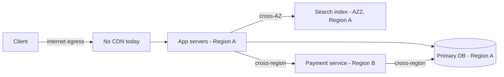

# Data Transfer and Egress Costs — Middle

<!-- level-focus -->
At middle level, focus on this question:

> When a system spans multiple AZs, regions, and components, how do you decide which data-transfer boundaries are worth eliminating now versus tolerating, and how do you verify a chosen fix doesn't just move the cost somewhere else?

Use the smallest realistic scenario that exposes the decision and its failure behavior.

---

## Core Concept 1 — From "find the expensive hop" to "choose the right boundary to fix"

At junior level, the skill is spotting the one dominant expensive hop and applying an obvious fix. At middle level, a real system has *several* boundaries that cost money at once — cross-AZ calls between microservices, a cross-region database replica, static assets without a CDN, log shipping to a central region — and they interact. Fixing one can shift load onto another. The middle-level skill is choosing which boundary to address first, with what technique, and confirming the fix actually reduced total cost rather than relocating it.

This also means data-transfer decisions stop being purely technical and start being **trade-off** decisions: every fix (CDN, read replica, PrivateLink, restructuring an API to be less chatty) has a different cost to build, a different cost to operate, and a different blast radius if it's wrong.

## Core Concept 2 — Evaluating Competing Choices

For any expensive cross-boundary path, there are usually three or four plausible fixes. Comparing them on the same dimensions avoids picking the one that's just familiar:

| Fix | Reduces | Operational cost | Best when |
|---|---|---|---|
| **CDN / edge cache** | Internet egress from origin | Low — mostly configuration | Content is read-heavy and cacheable (images, static assets, semi-static API responses) |
| **Regional read replica** | Cross-region reads | Moderate — new instance to patch, monitor, and keep in sync | A specific region has sustained read traffic and can tolerate replica lag |
| **VPC peering / PrivateLink** | Internet-egress pricing on traffic that was already private in nature | Low-to-moderate — one-time network setup | Two services/accounts talk constantly but currently route over the public internet |
| **Restructure the API (batch, cache client-side, reduce chattiness)** | Call volume itself, regardless of tier | Higher — code change, needs testing | The *number* of cross-boundary calls is the real problem, not just their price per call |

The comparison that matters is not "which fix is best in general" — it's "which fix addresses *this specific* boundary's actual driver." A CDN does nothing for a cross-AZ database call; a read replica does nothing for a chatty internal API making ten calls where one would do.

## Core Concept 3 — Testability, Debugging, and Change Cost

A data-transfer fix that can't be verified independently of "the bill went down" is a fix you can't trust or maintain:

- **Attribution first.** Before touching anything, cost-allocation tags and VPC flow logs should let you attribute transfer volume to a specific service, team, or even a specific code path — not just "the account's total went up." Without this, you're debugging a bill with no stack trace.
- **A contract test for topology.** A lightweight test that asserts a service's client configuration points at a same-region endpoint (not a hardcoded cross-region one) catches an entire class of regression before it reaches production — this is cheap to write and catches the "someone copy-pasted a config with the wrong region" mistake from the junior level automatically, on every change.
- **Change cost differs sharply by fix.** A CDN is close to a configuration change: low risk, fast rollback (turn it off, traffic reverts to the old path). A regional read replica is a standing piece of infrastructure: it needs monitoring, alerting on replication lag, and a plan for what happens if the replica falls behind or diverges. Restructuring an API to reduce chattiness touches application code and needs the same testing rigor as any functional change. Weigh a fix's savings against *this* cost, not just against the dollars it saves.

## Core Concept 4 — Under- and Over-Application Signals

**Signs you're under-applying (leaving cheap wins on the table):**

- A microservice makes many small cross-AZ calls per request (an N+1-style pattern, but across a network boundary) where request-level batching or co-locating the two services in the same AZ would collapse most of that traffic.
- A public-facing API serves the same response to thousands of clients per minute directly from the origin, with no cache layer at all.
- Debugging and analytics tooling routinely pulls full datasets across regions instead of sampling or aggregating closer to the source.

**Signs you're over-applying (adding cost or complexity without benefit):**

- Putting a CDN in front of an **internal-only** API that no external client ever calls — the cache adds an invalidation problem and configuration surface with no egress to reduce.
- Standing up a cross-region read replica for a service with no actual latency-sensitive traffic in that region, "in case we expand there someday" — this adds an always-on operational cost and a second failure mode (replication lag, split-brain risk) to prevent a cost that doesn't exist yet.
- Migrating a rarely-changing lookup table to a fully synchronized multi-region setup when a periodic (e.g. hourly) same-region refresh would serve the same purpose at a fraction of the transfer volume.

The test in both directions is the same: does removing (or adding) this boundary change the *actual measured* traffic pattern, or is it solving a problem that isn't there?

## Core Concept 5 — Incremental Adoption

Data-transfer fixes should ship the same way any risky change ships — gradually, with a rollback path:

1. **Pilot on the highest-volume, lowest-risk path first.** A CDN in front of static image assets is a safer first pilot than restructuring a payment-processing call chain, even if the payment path costs more per byte.
2. **Route a percentage of traffic through the new path** (10%, then 50%, then 100%) and compare cost-per-request and error rate against the untouched baseline before ramping further.
3. **Keep the old path reachable** until the new one has run cleanly through at least one full traffic cycle (including a weekend or peak-traffic day, whichever exposes edge cases in your system).
4. **Only then extend the pattern** to the next-highest-cost boundary, using the same measured process, rather than fixing everything at once and losing the ability to attribute which change caused which result.

## Core Concept 6 — A Cross-Component Scenario

Consider a checkout flow at a mid-size e-commerce company. The architecture: static product images with no CDN, app servers in Region A, a payment service that was recently moved to Region B for compliance reasons, and a search index replicated across two AZs within Region A.

Three boundaries accumulate cost here, each with a different right answer:

- **Client → App (no CDN):** product images are read far more often than they change — a strong CDN candidate, low operational cost, safe to pilot first.
- **App → Search (cross-AZ, same region):** cheaper per gigabyte than the other two boundaries, but called on nearly every page load. Worth checking whether the call *volume* (not the per-call price) is the actual driver — batching several lookups into one call might matter more than trying to eliminate the AZ crossing itself.
- **App/Payment → DB (cross-region):** this crossing exists *because of a compliance requirement* that placed the payment service in Region B. It cannot simply be "fixed" by co-locating everything in one region — this is a case where a cheaper transfer path (a private cross-region connection instead of one that might otherwise ride the public internet) is the available lever, not elimination of the region boundary itself.

This is the middle-level judgment call: recognizing that not every expensive boundary should be collapsed to zero, and that the correct fix depends on *why* the boundary exists, not just its price.

## Core Concept 7 — Verification at Two Levels

- **Unit level:** a configuration/contract test asserting each service's downstream client is configured to talk to the intended region/AZ (catching accidental cross-region drift before deploy), and a unit test on any new batching logic confirming it doesn't silently drop or duplicate requests.
- **Integrated-flow level:** a synthetic transaction (or canary traffic) that runs the full checkout flow end-to-end, with cost-allocation tags attached, so cost-per-checkout-transaction can be compared before and after a fix — not just "total account egress went down," which could be explained by lower traffic that week instead of the fix.

## Common Mistakes at This Level

- **Fixing the highest cost-per-byte hop instead of the highest total-cost hop.** A cross-region tier might be priced highest per gigabyte, but if its volume is tiny compared to a cheaper, high-volume hop, it isn't the right first target.
- **Shipping a fix without a rollback path.** Migrating traffic to a CDN or a new replica all at once, with no ability to revert quickly if hit rates or replication lag come in worse than expected.
- **Attributing a cost drop to the wrong cause.** Declaring victory because the bill went down, without checking whether traffic also happened to drop that week for unrelated reasons.
- **Treating a compliance-driven cross-region boundary as an engineering bug to eliminate**, rather than a constraint to route through as cheaply as possible.
- **Over-indexing on one fix pattern.** Reaching for "just add a CDN" or "just add a replica" as a reflex, instead of matching the fix to what's actually driving that specific boundary's volume.

## Apply it

1. Take the checkout-flow scenario above and list, for each of the three cost boundaries, whether the right first move is elimination (co-locating resources), caching (CDN/edge), a cheaper private path, or batching to reduce call volume — and justify each choice in one sentence.
2. Design a rollout plan for the CDN pilot: what percentage of image traffic goes through it first, what two metrics you'd watch (for example, cache-hit rate and error rate) before ramping to 100%.
3. Write one contract test (in pseudocode or a real test framework) that would fail if a developer accidentally pointed the search-index client at a cross-region endpoint instead of the intended same-region one.
4. Propose a synthetic transaction design for the checkout flow that reports cost-per-transaction, broken down by the three boundaries, so a future regression is attributable to a specific hop.
5. Identify one boundary in the scenario where adding a fix (of any kind) would be over-application, and explain what signal would tell you that.

## Verify your work

- Each of the three boundaries has a distinct, justified fix — not the same technique applied uniformly to all three.
- The CDN rollout plan names a specific starting percentage, a ramp path, and at least two concrete metrics to check before increasing traffic.
- The contract test would actually fail on a misconfigured cross-region endpoint and pass on a correct same-region one — not just check that a config value exists.
- The synthetic transaction design attributes cost to each of the three boundaries separately, not just to the checkout flow as a whole.
- Your over-application example names a specific boundary and a specific reason a fix there adds cost or complexity without a corresponding transfer-cost reduction.

## Review questions

- Why can fixing one expensive data-transfer boundary sometimes shift cost to another boundary instead of removing it?
- How would you decide between adding a CDN, adding a regional read replica, and restructuring an API to reduce call volume, for a given expensive boundary?
- What is the difference between a cost drop caused by a fix and a cost drop caused by lower traffic that week, and how would you tell them apart?
- Why might a cross-region data-transfer boundary be the correct design, rather than a problem to eliminate?
