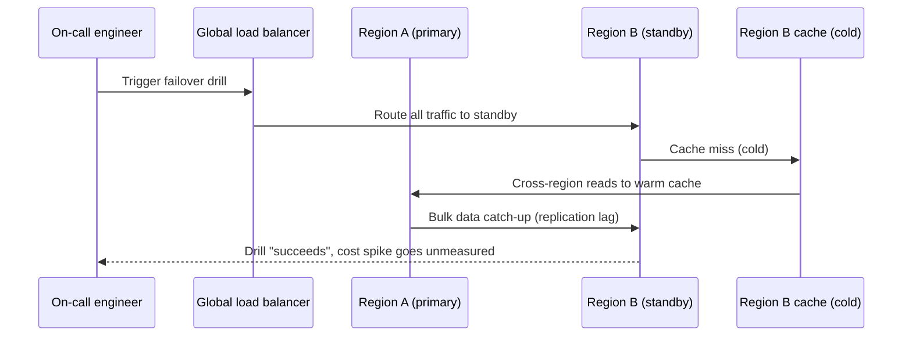

# Data Transfer and Egress Costs — Senior

<!-- level-focus -->
At senior level, focus on this question:

> What data-transfer invariant must hold across regions, AZs, and cloud boundaries so that a failover, migration, or bulk-replication event doesn't turn into an uncontrolled egress bill — and what evidence would show that invariant is at risk before it's tested for the first time in production?

Use the smallest realistic scenario that exposes the decision and its failure behavior.

---

## Core Concept 1 — System Boundaries as Cost Boundaries

Every distributed system already has boundaries engineers reason about for correctness and availability: process boundaries, network boundaries, trust boundaries. Data-transfer cost adds a boundary that doesn't always align with those: the **AZ boundary**, the **region boundary**, and the **provider (or public-internet) boundary**. A senior-level architectural review treats these as first-class boundaries with their own invariants, not an afterthought discovered in a monthly bill.

Useful invariants to hold at the architecture level:

- **No service silently defaults to a public-internet path when a private one (VPC peering, PrivateLink, a direct interconnect) is available and appropriate.** This should be a deliberate choice recorded somewhere, not an accident of which endpoint someone pasted into a config.
- **Any bulk or replication job that can cross a paid boundary has a bounded, monitored transfer budget**, not an open-ended "sync until done."
- **Cross-region and cross-cloud data flows are enumerable.** If nobody can produce a current list of "which datasets flow across which region/cloud boundaries and why," the system has an invariant no one is actually enforcing.

These invariants matter because data-transfer cost has a property most correctness bugs don't: it scales with the *volume* of a failure, not just its occurrence. A logic bug affecting 1% of requests is bounded. A replication job that loops and keeps re-sending the same terabytes is not bounded by anything except whoever eventually notices the bill or a budget alert firing.

## Core Concept 2 — Failure Modes Specific to Data Transfer

- **Replication thrashing.** A misconfigured or flapping health check causes a replica to be marked out-of-sync repeatedly, triggering a full (or large partial) re-sync each time — multiplying cross-region transfer far beyond the steady-state replication rate, often silently, because the system is "working," just wastefully.
- **DR failover drills that aren't cost-modeled.** A disaster-recovery test that fails traffic over to a passive region can trigger a burst of cross-region reads/writes as caches warm and data re-syncs — a cost spike that's invisible until the drill has already run, because nobody estimated the transfer volume a real failover would generate.
- **Observability/logging pipelines shipping raw payloads across regions.** A central logging or tracing pipeline that ships full request/response bodies (not just structured metadata) from every region to one central region turns an operational tool into one of the larger line items on the bill, growing quietly as traffic grows.
- **Retry storms crossing a paid boundary.** A downstream service in a different region returning transient errors, combined with an aggressive retry policy and no circuit breaker, can turn a brief availability blip into a multiplied, sustained cross-region transfer spike that outlasts the original incident.
- **Cross-cloud "data gravity" lock-in.** Once a large dataset accumulates in one cloud provider, egress fees to move that data elsewhere become large enough to influence (or effectively veto) an otherwise sound architectural decision to migrate or adopt a second provider. This is a well-established industry concept — provider egress pricing asymmetry (cheap or free to bring data in, priced to take it out) is a structural incentive, not an accident, and it is worth naming explicitly when evaluating any multi-cloud or migration plan.

## Core Concept 3 — Evidence That Validates a Design (Not Preference)

A senior-level design decision about data-transfer boundaries should be backed by evidence a reviewer can independently check, not "this pattern is what we usually do":

- **VPC flow logs / network flow analysis** showing actual current traffic volume and direction across each candidate boundary — not an architecture diagram's *assumed* traffic.
- **Cost-allocation tag analysis** attributing transfer spend to the specific service, dataset, or job responsible, over a long enough window to separate steady-state cost from one-off events.
- **A controlled failover or replication-burst drill**, run deliberately, measuring the actual gigabytes moved and dollars incurred — this is the only way to know what a *real* failover will cost before it happens for real, under worse conditions.
- **A budget/anomaly alert with a known-good baseline**, so a genuine spike is distinguishable from ordinary traffic growth quickly, rather than being noticed a billing cycle later.

The distinction that matters: "we assume replication traffic is small" is a preference. "We ran a replication-burst drill in a staging environment scaled to 10% of production data and measured X GB moved, extrapolating to Y GB and $Z at full scale" is evidence.

## Core Concept 4 — Cross-Component Scenario: A Failover That Wasn't Cost-Modeled

A payments platform runs active-passive across two regions for disaster recovery. Region A is primary; Region B holds an asynchronously replicated standby. A quarterly failover drill is run to validate recovery, but nobody had modeled what the drill itself would cost in cross-region transfer.

What actually happened: the standby region's cache was cold, so every request that would normally be a cache hit became a cross-region read against Region A while the cache warmed. Simultaneously, the replication lag that had accumulated since the last drill required a larger-than-usual catch-up transfer once failback began. The drill was declared a success because the *functional* recovery objective (RTO/RPO) was met — but the transfer volume it generated was an order of magnitude above steady-state replication, and nobody had a monitored budget or alert that would have flagged it as unusual in real time. The bill arrived a month later as the only signal.

What should have existed beforehand: a pre-warmed cache policy for the standby region (or an accepted, budgeted cost for cold-cache reads during failover), a monitored transfer-volume ceiling for the drill itself with an alert if exceeded, and a post-drill review that included the transfer bill as a line item next to the RTO/RPO result — treating cost as part of "did the drill succeed," not a separate concern.

## Core Concept 5 — Trade-offs Among Plausible Architectures

| Approach | Cross-boundary transfer profile | Where it fits |
|---|---|---|
| **Active-active multi-region** | Continuous, bidirectional cross-region replication traffic, but smaller, steady bursts rather than one large catch-up event | Strong availability requirements, traffic already region-distributed, team can operate conflict resolution |
| **Active-passive with async replication** | Low steady-state cost, but replication lag accumulates between drills, creating a variable-size catch-up burst at failover time | Lower cost tolerance day-to-day, willing to accept an occasional large, budgeted transfer event |
| **Single-region + CDN edge caching** | No cross-region replication cost at all; internet-egress cost shifted to (cheaper, cacheable) edge delivery | Read-heavy workloads where regional failover isn't a hard requirement, latency solved by caching rather than data placement |
| **Cross-cloud replication (multi-cloud)** | Adds a provider boundary on top of a region boundary — typically the most expensive tier, and the hardest to reverse once a large dataset has accumulated on one side (data gravity) | Justified only when the reason for multi-cloud (negotiating leverage, specific managed service, regulatory requirement) outweighs a durable, ongoing egress cost and reduced ability to migrate the data back out later |

None of these is universally "correct" — the senior-level judgment is matching the transfer profile of the chosen approach to what the team can actually monitor, budget, and afford to be surprised by, not picking whichever pattern looks most sophisticated on a diagram.

## Core Concept 6 — Questions That Expose Weak Assumptions Before Implementation

- Has a full failover (or a scaled-down but proportionally modeled version) ever actually been run with transfer volume and cost measured, or is the cost assumption based on steady-state replication numbers alone?
- Is there any path in this design that defaults to the public internet where a private, peered, or interconnected path would be available and cheaper — and if so, was that a deliberate choice?
- What happens to transfer cost if a retry policy or health check misbehaves and a sync or replication job loops? Is there a ceiling, or is the only limit "until someone notices the bill"?
- If this design involves more than one cloud provider, has anyone modeled what it would cost to move the accumulated dataset *out* of its current provider, not just what it costs to run today?
- Who is monitoring the transfer-cost line item as a first-class signal (with an alert and an owner), versus who would only find out from next month's invoice?

## Common Mistakes at This Level

- **Modeling replication cost from steady state only**, never from a burst/catch-up scenario, which is exactly the scenario a real incident or drill produces.
- **Treating a DR drill's success as purely a functional (RTO/RPO) question**, leaving transfer cost as an unrelated line item discovered later instead of part of the same review.
- **No budget ceiling or circuit breaker on replication and sync jobs**, so a misbehaving job can run (and re-run) without any automatic limit.
- **Assuming a private connectivity option is "obviously" in place** without verifying it in flow logs — architecture diagrams describe intent, not necessarily what traffic is actually doing.
- **Underestimating the exit cost of a cross-cloud data placement decision**, treating "we can always move it later" as free, when moving a large accumulated dataset out of a provider can itself be one of the largest transfer costs the organization ever incurs.

## Apply it

1. For the payments-platform failover scenario above, list the three specific changes (a monitoring/alerting change, a caching change, and a process change) that would have caught the cost spike before or during the drill, not a month later.
2. Draw (in words or a simple diagram) one additional failure mode not covered in Core Concept 2 that could occur in your own organization's actual architecture, and identify which paid boundary it would cross.
3. Pick one of the four architectural approaches in Core Concept 5 and write the one piece of evidence (a flow-log finding, a drill result, a cost-allocation report) that would justify choosing it over the alternatives for a specific real or hypothetical system.
4. Write down the transfer-cost ceiling you would set for a bulk replication or sync job in your own system, and what should happen automatically if that ceiling is exceeded.
5. Ask the five questions from Core Concept 6 about a system you actually know, and write one sentence per question stating whether the answer is known or currently unknown.

## Verify your work

- Your three changes for the failover scenario each target a distinct failure identified in the scenario (cold cache, replication lag catch-up, no monitored ceiling) rather than one generic "add monitoring" answer.
- Your additional failure mode names a specific paid boundary (AZ, region, or provider) it crosses, not just "something could go wrong."
- Your evidence for the chosen architectural approach is something that could actually be measured (a flow-log number, a drill result) rather than a stated preference.
- Your transfer-cost ceiling is a specific, checkable number or rate, with a defined automatic action (alert, throttle, kill switch) when exceeded.
- For at least one of the five questions in Core Concept 6, your honest answer is "currently unknown" — recognizing a real gap is part of the exercise, not a failure of it.

## Review questions

- Why does data-transfer cost scale with the size of a failure in a way that many correctness bugs don't?
- What evidence would distinguish a design decision about cross-region replication that is well-validated from one that is merely a preference?
- Why might a DR failover drill succeed on its recovery-time objective while still representing a costly, previously unmeasured event?
- What is "data gravity," and why does it make a cross-cloud data placement decision harder to reverse than it first appears?
