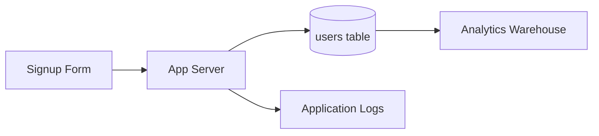

# PII and Data Classification — Junior

<!-- level-focus -->
At junior level, focus on this question:

> Given a small database schema, can you correctly classify every field into a PII category and a sensitivity tier, and record that label so it survives the next schema change?

Use the smallest realistic scenario that exposes the decision and its failure behavior.

---

## Core Concept 1 — Vocabulary: PII, PHI, and Sensitive Personal Data

Three terms get used loosely. Keep them apart:

- **PII (Personally Identifiable Information)** — any data that identifies, or could reasonably be linked back to, a specific individual. This is the umbrella term you'll use most often.
- **PHI (Protected Health Information)** — a specific subset of PII tied to health records and healthcare treatment (used heavily in US healthcare regulation). If your app touches health data, treat it as PII *plus* extra handling rules.
- **Sensitive personal data categories** — a term from data-protection frameworks (used by GDPR and similar regimes) for categories that carry extra risk regardless of whether they identify someone alone: health, genetic or biometric data, racial or ethnic origin, religious belief, sexual orientation, trade union membership, criminal history.

The point of this vocabulary at junior level is not to become a lawyer — it's to recognize that "PII" is not one flat bucket. A field can be PII without being sensitive-category (an email address), and a field can be sensitive-category and still combine with other fields to become identifying (a rare medical condition plus a small zip code). Classification is about naming *both* dimensions for every field: does it identify someone, and does it carry extra-sensitive content?

## Core Concept 2 — Three Buckets: Direct, Quasi-, and Sensitive-Category

This is the taxonomy you'll apply to every field you touch:

| Bucket | Definition | Examples |
|---|---|---|
| **Direct identifier** | Uniquely identifies one person, on its own | Full name, email address, phone number, government ID number, exact home address |
| **Quasi-identifier** | Doesn't identify anyone alone, but can when combined with a small number of other fields | Date of birth, ZIP code, gender, job title, employer, IP address at a point in time |
| **Sensitive-category data** | Reveals something about a protected or high-risk category, independent of whether it identifies someone | Health condition, religious affiliation, sexual orientation, biometric template, financial account details, criminal record |

A field can land in more than one bucket. "Date of birth plus ZIP code plus gender" is the textbook example of quasi-identifiers combining to re-identify someone — classic research on hospital discharge records showed this combination alone could uniquely identify a large share of a US population. You don't need the citation to use the lesson: **no single field looking "harmless" is proof that a table full of them is harmless.**

## Core Concept 3 — Four Classification Tiers

Separately from *what kind* of PII a field is, every field also gets a **sensitivity tier** — this is the access-control dimension, borrowed from standard data classification schemes such as those described in NIST and ISO/IEC 27001 guidance:

| Tier | Meaning | Who can access | Example fields |
|---|---|---|---|
| **Public** | Safe to publish externally with no restriction | Anyone | Product catalog name, public blog post content |
| **Internal** | Not secret, but not for external release | All employees | Internal ticket IDs, non-sensitive config values |
| **Confidential** | Business-sensitive or ordinary PII; restricted to those with a work reason | Need-to-know staff, specific service accounts | Customer email, shipping address, order history |
| **Restricted** | Highest sensitivity; direct identifiers combined with sensitive-category data, or data with legal/contractual handling requirements | Named roles only, often with additional logging of access | Government ID numbers, health notes, payment credentials, biometric data |

The two dimensions are independent and both required: a field's **PII bucket** (direct/quasi/sensitive-category/none) says *what kind of risk it carries*; its **tier** (public/internal/confidential/restricted) says *who is allowed to touch it*. A field can be "not PII at all" and still be confidential (unpublished financial forecasts), and a field can be PII and still only reach "confidential," not "restricted" (an email address, by itself).

## Core Concept 4 — A Repeatable Method

For each field in a table or event schema, ask the questions in order and stop at the first "yes":

1. **Does this field alone identify one specific person?** → Direct identifier.
2. **Could this field, combined with two or three others in the same table, identify one specific person?** → Quasi-identifier.
3. **Does this field reveal health, biometric, financial-account, religious, orientation, or criminal-history information about the person, regardless of question 1 or 2?** → Sensitive-category (this can stack with 1 or 2).
4. **None of the above, but is it something the business would not want public?** → Not PII; classify by ordinary business sensitivity (internal or confidential).
5. **None of the above, and safe to publish?** → Public.

Then assign the tier from Core Concept 3 based on the worst applicable bucket: any sensitive-category field is at least **restricted**; any direct identifier is at least **confidential**; a quasi-identifier alone is usually **confidential**, escalating to **restricted** if it sits alongside other quasi-identifiers that together narrow down to very few people.

## Core Concept 5 — Worked Example: a Signup and Orders Schema

Take a small e-commerce app with two tables. Here is the classification pass, field by field:

| Field | PII bucket | Tier | Reasoning |
|---|---|---|---|
| `users.id` | Not PII | Internal | An internal surrogate key; identifies a row, not directly usable to identify a person outside the system |
| `users.email` | Direct identifier | Confidential | Uniquely and directly identifies one person |
| `users.full_name` | Direct identifier | Confidential | Same as above |
| `users.date_of_birth` | Quasi-identifier | Confidential | Alone it's one of millions of people; combined with ZIP + gender it narrows fast |
| `users.signup_ip` | Quasi-identifier | Confidential | Can narrow to a household or a specific point in time |
| `users.shipping_address` | Direct identifier | Confidential | A home address identifies a specific person or household directly |
| `users.support_notes` (free text) | Sensitive-category (sometimes) | Restricted | A free-text field where an agent might write "customer mentioned their cancer treatment" — the *field* isn't inherently sensitive, but its *content* can be |
| `users.password_hash` | Not PII | Restricted | Not personal data in the classic sense, but restricted because of the security blast radius if leaked |
| `orders.total_amount` | Not PII | Internal | A number with no identifying content on its own |
| `orders.product_category` | Not PII | Public | Safe, non-identifying, often shown in dashboards |

Two rows are worth re-reading. `users.support_notes` shows that **free-text fields need content-aware classification**, not just a schema-level label — the column itself is "notes," but what a support agent typed into it can be restricted. `users.password_hash` shows that **"restricted" isn't only about PII** — some fields are restricted for security reasons even though they aren't personal data at all.

Once classified, the label needs to live *in* the schema, not in a separate spreadsheet someone forgets to update. A minimal annotated schema:

```yaml
table: users
fields:
  - name: id
    pii: none
    tier: internal
  - name: email
    pii: direct_identifier
    tier: confidential
  - name: date_of_birth
    pii: quasi_identifier
    tier: confidential
  - name: support_notes
    pii: sensitive_category_possible
    tier: restricted
    note: "free text; may contain health/financial disclosures"
  - name: password_hash
    pii: none
    tier: restricted
    note: "restricted for security, not privacy, reasons"
```

## Core Concept 6 — When a Field's Classification Is Actually Done

A classification entry is complete when it has all three parts:

1. A **named PII bucket** — direct identifier, quasi-identifier, sensitive-category, or none. Never leave it blank or "TBD."
2. A **named tier** — public, internal, confidential, or restricted. Guessing "internal" as a default for everything defeats the purpose.
3. A **short reasoning note**, especially for anything non-obvious (a free-text field, an internal ID that's actually derived from an SSN, and so on).

If any of the three is missing, don't move to the next field — an unclassified field is treated as **restricted by default** until someone actually looks at it, never as "probably fine."

---

## How Classified Data Enters the System



The arrow into `Logs` is the one junior engineers forget to think about. The classification you assigned to the `users` table doesn't automatically apply everywhere that data flows — a debug log line like `log.info("created user", email, date_of_birth)` moves a confidential field into a system (logs) that usually has weaker access control and much longer, less-managed retention than the database itself. Classifying the *field* is only half the job; noticing every place it *flows to* is the other half, and it's exactly what beginners skip first.

## Common Mistakes

- **Defaulting every field to "internal" without checking.** This looks harmless but silently under-protects real PII sitting in a table.
- **Classifying only the obvious identifiers.** Skipping `date_of_birth` and `signup_ip` because they "aren't really personal" ignores the quasi-identifier bucket entirely.
- **Treating a free-text field's column name as the whole answer.** `notes`, `comments`, and `description` fields need a content-aware note, not just a blanket tier based on the column label.
- **Forgetting that classification travels with the data.** A field classified "confidential" in the source table still needs the same tier wherever it's copied — logs, analytics exports, support tooling.
- **Confusing "not PII" with "not sensitive."** A password hash isn't personal data, but it's still restricted; classification has two independent dimensions, not one.

---

## Apply it

1. Take a schema you can access (a personal project, a sample app, or the `users`/`orders` example above) and list every field in two tables.
2. For each field, run the five-question method from Core Concept 4 and write down the PII bucket it lands in.
3. Assign a tier (public/internal/confidential/restricted) to each field using Core Concept 3, and write one sentence of reasoning per field.
4. Write the classification as a small annotated schema file (YAML or JSON, like the example above) instead of a separate document.
5. Trace one field marked "confidential" or "restricted" through your system and name every place it flows to besides the source table (logs, exports, a cache) — check whether that destination protects it at the same tier.

## Verify your work

- Every field in both tables has a named PII bucket and a named tier — no blanks, no "TBD."
- At least one quasi-identifier and one sensitive-category field appear in your table, proving you didn't stop at the obvious direct identifiers.
- The free-text field (if your schema has one) has a written note about its possible content, not just a column-level guess.
- You can point to one place outside the source table where a confidential or restricted field flows, and state whether that destination matches the required tier.

## Review questions

- What is the difference between a direct identifier and a quasi-identifier?
- Why can a field be "not PII" and still need a restricted classification tier?
- Why is a free-text column harder to classify than a fixed-format column like an email field?
- What happens to a field's classification when that field is copied into application logs?
