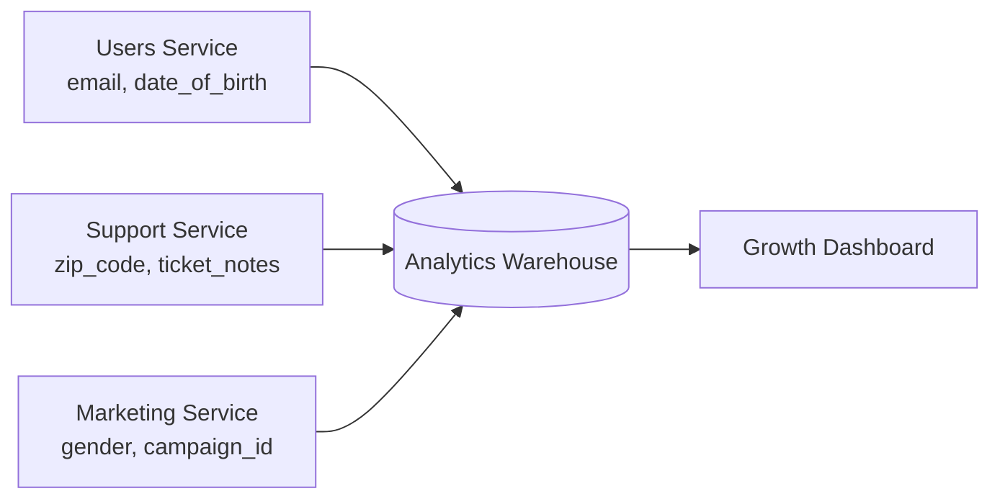

# PII and Data Classification — Middle

<!-- level-focus -->
At middle level, focus on this question:

> When classified fields from several independently-classified services are joined into one dataset, how do you decide whether the join itself creates a new, higher classification — and how do you enforce that decision as the schemas keep changing?

Use the smallest realistic scenario that exposes the decision and its failure behavior.

---

## Core Concept 1 — A Field's Classification Is Not a System's Classification

A junior-level pass classifies one table at a time: each field gets a PII bucket and a tier, and that's correct as far as it goes. The middle-level problem starts the moment two correctly-classified tables get joined, exported, or copied into a shared destination — because **the join can produce a dataset more sensitive than either input**, even when every source field was tagged correctly in isolation.

This isn't a hypothetical edge case; it's the normal shape of a data platform. A `users` table, a `support_tickets` table, and a `marketing_events` table are each owned by a different service, each independently classified, and each individually reasonable. The moment an analytics job joins all three on `user_id`, the resulting row can carry date of birth, ZIP code, and a support note about a medical condition, on the same person, in the same place. No single source table's classification predicted that.

## Core Concept 2 — Choosing the Classification Boundary

The junior boundary is the table or field. At middle level, the boundary that actually matters is the **dataset as it exists after joins, exports, or aggregation** — because that's the unit a re-identification risk or an access-control decision is actually made against.

Three plausible boundaries, and their trade-offs:

| Boundary | What it captures | Weakness |
|---|---|---|
| **Per-field, per-source-table** (junior default) | Correct labels at the point of origin | Misses everything that happens after a join; a warehouse table can silently combine three "confidential" tables into a "restricted" one |
| **Per-pipeline / per-destination-dataset** | Classifies the *output* of a join or export, not just the inputs | Requires someone to actually own the pipeline's classification, not just assume it inherits the loosest or strictest input label |
| **Per-consumer-query** | Classifies based on exactly which columns a specific query or dashboard touches | Most precise, but expensive to maintain at query granularity for every ad-hoc analytics query |

The practical middle-level answer is **per-pipeline / per-destination-dataset**: every place where data from more than one source lands — a warehouse table, a data export, a feature store, a search index — needs its own classification pass, computed as *at least* the highest tier of any contributing field, and re-evaluated whenever the join adds a new quasi-identifier that could combine with existing ones.

## Core Concept 3 — Competing Tagging Strategies

Once you accept the boundary needs to be dataset-level, there's a real choice about *how* the tag is carried and enforced:

| Strategy | Pros | Cons |
|---|---|---|
| **Schema comments / docstrings** | Zero tooling cost, easy to start | Not machine-checkable; drifts silently the moment someone adds a column without updating the comment |
| **Central data catalog with required tags** | Queryable, one source of truth, supports impact analysis ("what depends on this restricted field?") | Requires integration work and a process for keeping the catalog synced with actual schemas |
| **Column-level enforcement (masking, tokenization, access-controlled views)** | The tag *is* the control — a restricted column literally cannot be read without the right role | Highest engineering cost; retrofits onto legacy tables are slow and can break existing queries |

None of these is universally "the answer." A small team's user table is well served by a data catalog with required tags and a CI check; a warehouse table that regularly receives restricted health or payment data justifies the cost of column-level masking. The over-application signal is reaching for masked, access-controlled views on every internal-tier config table — that's cost without benefit. The under-application signal is relying on schema comments alone for a dataset that already combines quasi-identifiers from three services — that's a gap waiting for an incident to find it.

## Core Concept 4 — Testability: Make Missing Classification a Build Failure

A classification scheme that lives only in a wiki page is not testable — nobody finds out it's wrong until an incident does. Two checks make it enforceable:

```yaml
# CI check: every column in a migration must declare a classification,
# or the migration fails review. This turns "we forgot to classify it"
# from a silent gap into a blocked pull request.
check: schema_migration_classification
rule: "every new or altered column must include `pii:` and `tier:` metadata"
on_missing: "fail CI, block merge"
```

```python
# Unit-level check on the catalog itself: no column is allowed to have
# an empty or "unknown" classification once past the pilot phase.
def test_no_unclassified_columns_in_prod_schemas():
    unclassified = [
        col for col in catalog.all_columns()
        if col.pii is None or col.tier is None
    ]
    assert unclassified == [], f"Unclassified columns: {unclassified}"
```

The first check catches drift at the point it's introduced (a new column in a migration). The second catches drift that slipped through anyway (an existing column that lost its tag during a refactor, or was never tagged because the table predates the process). Neither replaces human judgment about *what* the classification should be — they only make it impossible to ship a column with *no* classification at all.

## Core Concept 5 — Under- and Over-Application Signals

**Under-classification** shows up as: a data catalog where most columns say "internal" by default because nobody revisited the default; a warehouse table combining three services' data with no classification pass done on the combined table itself; engineers not knowing which columns in a query result are restricted until an incident asks them to find out.

**Over-classification** shows up as: every column marked "restricted" because that felt safest, which then makes legitimate analytics work require exceptions so often that people route around the classification system entirely; the same field re-classified independently and inconsistently by five different consuming teams because there's no single owning classification for it. A system nobody can work within gets bypassed, which is functionally identical to having no system.

## Core Concept 6 — Incremental Adoption

Rolling out dataset-level classification across an existing warehouse in one pass is unrealistic. A workable order:

1. Classify the highest-risk join first — usually the one that combines a customer table with a support or health-adjacent table, since that's where sensitive-category data is most likely to appear alongside identifiers.
2. Add the CI check (Core Concept 4) to *new* migrations only, so the backlog of unclassified legacy columns doesn't block current work.
3. Backfill classification on existing tables incrementally, prioritized by which are actually queried by analytics or exported anywhere, not by an arbitrary alphabetical sweep.
4. Only after the highest-risk join is classified and enforced, expand the same process to the next pipeline, reusing the same tag schema so classifications are comparable across teams.

## Core Concept 7 — Cross-Component Scenario: the Warehouse Join

Three services each classify their own tables correctly in isolation:



Each source table's classification is defensible on its own: `date_of_birth` is a quasi-identifier tagged confidential; `zip_code` is a quasi-identifier tagged confidential; `gender` is a quasi-identifier tagged confidential; `ticket_notes` is flagged as possibly sensitive-category. Individually, none of these tables was under-classified. But the warehouse table produced by joining all three on `user_id` now carries date of birth, ZIP code, gender, and support-ticket free text about the same person in one row — the classic combination that can uniquely identify a small number of people, now sitting next to a sensitive-category field, and reachable from a growth dashboard that many more people can query than could ever query any one source table alone.

The middle-level fix is not "don't join the data" — the join is the business's actual analytics need. It's **classifying the warehouse table itself**, independently of its inputs, as restricted (because it now combines quasi-identifiers with sensitive-category content), and gating the dashboard's access accordingly — even though every contributing service did its own job correctly.

---

## Real-World Examples

- **A dashboard exposes more than any single source intended.** A growth dashboard built on the joined warehouse table above lets a marketing analyst filter by ZIP code and see support-ticket free text for the resulting small group of users — a capability nobody explicitly designed, and one that no source-table classification flagged, because the risk only exists in the joined output.
- **A CI check catches a silent regression.** A migration adds a new `emergency_contact_phone` column to the `users` table without a classification tag; the CI rule from Core Concept 4 blocks the merge until someone tags it as a direct identifier, restricted tier — a gap that would otherwise have shipped unnoticed.
- **Over-tagging drives a workaround.** A team marks every column in a reporting table "restricted" to be safe; analysts can no longer self-serve basic aggregate queries and start exporting raw data into personal spreadsheets to get their work done, which is a worse outcome for data protection than the original, more precisely-scoped classification would have been.

## Common Mistakes

- **Assuming a joined dataset inherits a classification automatically.** Without an explicit pass, a warehouse table defaults to whatever the least-careful engineer assumed, not to the actual combined risk.
- **Enforcing classification only through documentation.** A wiki page nobody's CI pipeline checks is not enforcement — it's a hope.
- **Treating "restricted everywhere" as the safe default.** Over-classification pushes people to work around the system, which produces worse outcomes than a well-scoped classification would.
- **Backfilling legacy tables before establishing the check for new ones.** This guarantees the backlog keeps growing faster than it shrinks; gate new work first.
- **Classifying inconsistently across teams because there's no shared tag schema.** The same field ends up "confidential" in one dataset's catalog entry and "restricted" in another's, and nobody trusts either.

---

## Apply it

1. Pick two or three tables you can access that are joined somewhere in a real pipeline (a warehouse, a feature store, an export job), and write down each source table's current field-level classifications.
2. Classify the *joined output* independently, using "at least the highest tier of any contributing field" as your starting rule, and check whether any new quasi-identifier combination appears that wasn't visible in any single source table.
3. Write one CI-style check (pseudocode is fine) that would fail a migration if a new column is added without a classification tag.
4. Identify one place in your classification scheme where you suspect over-classification (a column marked more restrictively than its actual risk) and one place you suspect under-classification, and justify each with a specific reason.
5. Sketch the three-to-four step incremental rollout you'd use to introduce dataset-level classification into this pipeline without blocking current work.

## Verify your work

- The joined dataset has its own classification entry, separate from and at least as strict as any single source table's entries.
- The CI-style check you wrote actually fails when a classification tag is missing — not just when the whole migration is missing.
- You can name a concrete quasi-identifier combination in the joined dataset that no single source table's classification would have caught alone.
- Your incremental rollout plan gates new migrations before it requires backfilling legacy tables, so it doesn't stall on backlog size.

## Review questions

- Why can a dataset produced by joining several correctly-classified tables still be under-classified?
- What is the practical difference between classifying at the field level and classifying at the pipeline/destination-dataset level?
- Why does over-classification create its own kind of data-protection risk?
- What makes a classification check "testable" rather than just documented?
