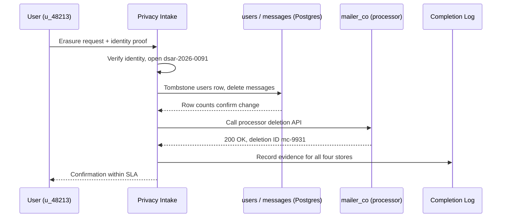

# GDPR and Right to Be Forgotten — Junior

<!-- level-focus -->
At junior level, focus on this question:

> Given one verified erasure request, can you find every place the subject's data lives and prove, with evidence, that each one no longer holds it?

Use the smallest realistic scenario that exposes the decision and its failure behavior.
> **Roadmap:** [Data Privacy](../README.md) → GDPR and Right to Be Forgotten

*A deletion request that only touches the primary database "worked" right up until someone runs a quarterly report and the subject's email shows up in an analytics export nobody remembered existed. This level is about executing one request correctly and completely — not designing the pipeline that will do this at scale. That's [`middle.md`](middle.md).*

> **Not legal advice.** This guide teaches the engineering mechanics of fulfilling privacy requests. Whether a specific request qualifies for a retention exception, and how that interacts with your jurisdiction's tax, employment, or fraud-prevention law, is a legal determination. Loop in legal or privacy counsel before you rely on an exception to refuse or delay a deletion.

---

## Core Concepts

### 1. Three rights, three different jobs

GDPR gives a data subject several rights; as an engineer you'll mostly implement three of them, and they are not the same task:

| Right | GDPR article | What you build | What "done" looks like |
|---|---|---|---|
| **Right to erasure** ("right to be forgotten") | Article 17 | Find and remove/anonymize the subject's personal data | Data is gone or unreadable, with a log proving it |
| **Right of access** (DSAR) | Article 15 | Find and export everything you hold about the subject | A complete, human-readable export delivered to them |
| **Right to data portability** | Article 20 | Export the subject's data in a structured, machine-readable format | A JSON/CSV file they (or another service) can import |

They share the hardest sub-problem — **finding every place the subject's data lives** — which is why [PII and Data Classification](../01-pii-and-data-classification/README.md) is a prerequisite, not optional reading. You can't erase, export, or port data you don't know you're holding.

### 2. The clock and the exceptions

A request has a **response-time expectation**: roughly one month from receipt, extendable by two further months for complex requests (with the subject notified why). That clock starts when the request is verified as valid, not when someone gets around to reading the support ticket.

Erasure is not unconditional. Article 17 itself lists cases where you may — sometimes must — retain data instead of deleting it: a legal obligation to keep it (tax and accounting records are the classic example), an active legal claim, or an overriding legitimate interest. The engineering implication: your deletion pipeline needs a **retain-with-reason** path, not just a delete path, and that reason needs an expiry — "we're keeping this because of X" is not a permanent exemption.

### 3. Vocabulary you need before you write any code

| Term | Meaning |
|---|---|
| **DSAR** | Data Subject Access Request — the umbrella term for any of these requests |
| **Hard delete** | The row/record is physically removed from storage |
| **Soft delete / tombstone** | The row is replaced or flagged so the personal fields are gone, but a marker record remains (often to preserve referential integrity or an audit trail) |
| **Cascading delete** | Deleting one record triggers deletion (or tombstoning) of everything that references it |
| **Legal hold** | A documented, time-bounded reason a specific record is exempt from deletion |
| **Data controller / processor** | Controller decides *why* data is processed (usually your company); processor handles it on the controller's behalf (a vendor like an email marketing tool) |

### 4. The five-step method for one request

1. **Intake and verify identity.** Confirm the requester is who they claim to be — an unverified "delete me" email is not an erasure request yet, it's a phishing risk waiting to happen.
2. **Locate every store holding the subject's data.** Use your data inventory (the output of PII classification) as the checklist — primary database, message queues, search indexes, third-party processors, backups.
3. **Classify each location: erase now, or retain with a documented reason.** Every "retain" needs a named legal basis and an expiry date, not a shrug.
4. **Apply the deletion strategy per store.** Hard delete where nothing references the row; tombstone where foreign keys or audit needs require the row to keep existing.
5. **Log completion evidence and respond inside the SLA.** "I think I deleted it" is not evidence. A timestamped log entry per store is.

---

## Worked Example: One Erasure Request, End to End

**Scenario:** `homegoods-marketplace`, a small online marketplace, receives a verified erasure request from user `u_48213` on **2026-03-03**. Their personal data lives in three places: a Postgres `users` table, a Postgres `messages` table (buyer/seller chat, which references `users` by foreign key), and a third-party email tool (`mailer_co`) that the marketing team uses for newsletters. Nightly backups of Postgres go to S3 with a 35-day retention window.

**Step 1 — the request record.**

```json
{
  "request_id": "dsar-2026-0091",
  "subject_user_id": "u_48213",
  "request_type": "erasure",
  "received_at": "2026-03-03T09:14:00Z",
  "identity_verified": true,
  "sla_due_by": "2026-04-02T09:14:00Z"
}
```

**Step 2 — the per-store plan**, built from the data inventory:

| Store | Contains PII? | Strategy | Reason |
|---|---|---|---|
| `users` table | email, name, address | Tombstone | Row is referenced by `orders` (financial records, retained 7 years for tax purposes) |
| `messages` table | chat text, possibly PII in free text | Hard delete of message bodies | No legal basis to retain chat content |
| `mailer_co` (processor) | email, name | API call to processor's deletion endpoint | Processor must delete on controller's instruction |
| S3 nightly backups | full row snapshots | No action now; ages out within existing 35-day retention | Restoring an old backup would resurrect deleted rows — documented as an accepted, time-bounded gap |

**Step 3 — tombstoning `users`, not hard-deleting it**, because `orders.user_id` is a foreign key and financial records must survive:

```sql
UPDATE users
SET email       = NULL,
    full_name   = '[deleted]',
    address     = NULL,
    phone       = NULL,
    deleted_at  = now(),
    deletion_request_id = 'dsar-2026-0091'
WHERE id = 'u_48213';
```

The row still exists — `orders` can still join to it and the tax-retained financial history stays intact — but every personal field is gone. This is the tombstone pattern: keep the shape, remove the substance.

**Step 4 — hard-deleting `messages` bodies**, since nothing needs to reference message content after the fact:

```sql
DELETE FROM messages WHERE sender_id = 'u_48213' OR recipient_id = 'u_48213';
```

**Step 5 — the completion log**, the actual evidence that closes the request:

| Store | Action | Completed at | Evidence |
|---|---|---|---|
| `users` | Tombstoned | 2026-03-04 10:02 UTC | Row `u_48213`, PII fields null, `deletion_request_id` set |
| `messages` | Hard deleted (14 rows) | 2026-03-04 10:03 UTC | Row count before/after: 14 → 0 |
| `mailer_co` | Deletion API call | 2026-03-04 10:05 UTC | HTTP 200, `mailer_co` deletion confirmation ID `mc-9931` |
| S3 backups | Accepted 35-day decay | N/A | Documented exception on this request record |



The request closes on **2026-03-04**, well inside the 2026-04-02 SLA deadline — with a log entry that would satisfy an auditor asking "prove you actually did this," not just "did you say you did this."

---

## Common Mistakes

1. **Deleting only the "obvious" table.** The `users` row is easy to find; the chat messages, support tickets, and analytics events that reference the same user are easy to forget. Work from the data inventory, not memory.
2. **Hard-deleting a row that other tables reference by foreign key.** This either breaks referential integrity or silently orphans records you needed to keep (like `orders` for tax purposes). Tombstone when something else still needs the row to exist.
3. **Treating backups as someone else's problem.** You don't need to purge every backup by hand, but you do need to know your backup retention window and write it down as an explicit, time-bounded exception — not leave it as an unstated gap nobody decided on.
4. **Skipping identity verification.** Acting on an unverified request either deletes the wrong person's data or hands an attacker a way to erase someone else's account.
5. **No evidence, just an action.** "I ran the delete" without a logged before/after count or confirmation ID is not something you can show an auditor six months later.

---

## Apply it

1. Pick a small app (or a toy schema you control) with at least two tables linked by a foreign key, one of which holds personal data.
2. Write a fake but realistic erasure request record (request ID, subject ID, received timestamp, SLA due date) like the one above.
3. Build a per-store table listing every place that subject's data lives, and for each one decide: hard delete, tombstone, or retain-with-reason.
4. Write and run the actual SQL (or code) that performs the tombstone/delete, and capture a before/after row count as evidence.
5. Write the completion log entry that would satisfy someone auditing the request after the fact.

## Verify your work

- You can point to a specific data inventory or table list you used to find every store — not "I checked the ones I remembered."
- Every store in your plan has an explicit decision (delete, tombstone, retain-with-reason) and, for any "retain," a stated reason and expiry.
- You have before/after evidence (row counts, confirmation IDs, or timestamps) for every action taken, not just a claim that it happened.
- The request closed before its SLA due date, and you can state that date from the request record, not by re-deriving it.

## Review questions

- What is the difference between what Article 17, Article 15, and Article 20 each require you to build?
- Why would you tombstone a row instead of hard-deleting it?
- What must accompany any decision to retain a subject's data instead of erasing it?
- What evidence would convince an auditor that a deletion request actually completed?
