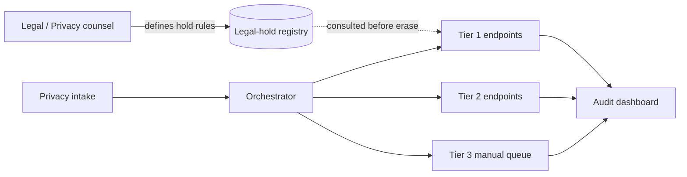

# GDPR and Right to Be Forgotten — Professional

<!-- level-focus -->
At professional level, focus on this question:

> How do you run privacy-request fulfillment as a durable, auditable operating model across dozens of teams and data stores, without the privacy team becoming the bottleneck for every request and every new service?

Use the smallest realistic scenario that exposes the decision and its failure behavior.
> **Roadmap:** [Data Privacy](../README.md) → GDPR and Right to Be Forgotten

*A correct reconciliation job and a well-stated invariant are worthless as an organization-wide guarantee if each team builds its own deletion logic, in its own format, discovered by the privacy team only when an audit asks for evidence. At scale, erasure is a governance and ownership problem before it's a distributed-systems problem.*

> **Not legal advice.** The operating model below is about organizing engineering work and accountability so erasure requests are reliably fulfilled and auditable. Which requests are valid, which exceptions apply, and how to respond to a regulator are legal/privacy-counsel decisions this model should route to the right people, not make on its own.

---

## Core Concept 1 — A standard erasure contract, not a standard implementation

Mandating one deletion mechanism for every team (one message bus, one schema, one language) doesn't survive contact with an organization that has a decade of services in different stacks. What scales is a **contract**, not an implementation: every team owning a PII-holding store commits to a stable interface the orchestrator can call, regardless of what's behind it.

```yaml
# platform-mandated erasure-endpoint contract — every registered store implements this
erasure_endpoint:
  service: recommendations-service
  contract_version: "1.2"
  operations:
    erase: "POST /internal/privacy/erase {subject_id, request_id}"
    status: "GET /internal/privacy/status/{request_id}"
  sla_response_seconds: 300          # must ack within 5 minutes
  supports_legal_hold_check: true    # must consult shared hold registry before deleting
  registered_pii_fields: ["click_history", "device_fingerprint"]
```

Recommendations Service can implement `erase` as a synchronous hard delete, an async queue consumer, or a scheduled batch job internally — the orchestrator and the audit dashboard don't care, because they only ever talk to the contract. This is what turns "every team does deletion their own way" from chaos into a federated model: teams own *how*, the platform owns *the interface everyone is measured against*.

---

## Core Concept 2 — Tiering by impact, not applying one SLA to everyone

Not every store carries the same risk if its part of an erasure request is late or wrong. A uniform policy either over-constrains low-risk internal tools or under-constrains stores that hold the most sensitive data:

| Tier | Example ownership | Required implementation | Audit cadence |
|---|---|---|---|
| **Tier 1 — regulated / high-sensitivity** | Payments, identity, health/financial fields | Automated erasure endpoint, mandatory legal-hold check, real-time status | Reviewed monthly |
| **Tier 2 — customer-facing, standard PII** | Profile, recommendations, support tickets | Automated erasure endpoint, async acceptable | Reviewed quarterly |
| **Tier 3 — internal tooling, low-sensitivity** | Internal dashboards, low-PII logs | Manual fulfillment acceptable if volume is low, but must still register in the inventory | Reviewed annually |

Tiering is what lets a Tier 3 team ship a manual process today without blocking the org-wide rollout, while Tier 1 teams aren't allowed to defer automation "until next quarter" — the same tiering discipline used for on-call severity or release risk applies just as directly to privacy-request fulfillment.

---

## Core Concept 3 — Decomposing the rollout into reversible, evidence-gated increments

Retrofitting erasure automation across an existing organization's stores is itself a multi-quarter initiative, and it fails when treated as a single cutover:

```text
Increment 1: Ship the erasure-endpoint contract + a registry of every
             PII-holding store (from the data inventory). No automation
             required yet — just register, and state current fulfillment
             method (manual or automated) per store.
             Exit evidence: 100% of known PII stores appear in the registry.

Increment 2: Tier 1 stores implement the automated erasure endpoint as a
             launch-readiness gate for any related release.
             Exit evidence: zero Tier 1 requests fulfilled manually for one
             full quarter.

Increment 3: Build the orchestrator that calls every registered Tier 1/2
             endpoint for a given request and aggregates status.
             Exit evidence: a sampled request's full fulfillment trail is
             visible on one dashboard, not stitched together by hand.

Increment 4: Extend the mandatory automated-endpoint gate to Tier 2.
             Tier 3 remains manual-eligible, deliberately, because the
             tiering says the cost of automation there exceeds the risk
             it removes.
```

Each increment is reversible — you can pause before extending to Tier 2 without undoing Tier 1's gains — and each has a measurable exit condition (a registry percentage, a manual-fulfillment count, a dashboard capability), not a calendar date. That's what keeps the initiative honest when priorities compete for engineering time across a dozen teams.

---

## Core Concept 4 — Cross-team contracts: who decides, who builds, who's accountable

At the senior level, the invariant spanned one architecture. At the professional level it spans teams that don't report to the same manager, and the organization needs explicit answers to questions that otherwise get argued fresh at every incident:

- **Who defines what counts as a valid legal hold?** Legal/privacy counsel owns the hold registry's content and expiry rules; engineering owns making every erasure endpoint check that registry before acting, mechanically, not by asking a person.
- **Who owns onboarding a new service onto the erasure contract?** The owning team implements the endpoint; the platform/privacy engineering team owns the registration CI check that fails a service's launch review if it holds PII fields with no registered endpoint.
- **Who is accountable when a request misses SLA?** The team owning the slow store owns the immediate fix; the platform team owns finding out whether the orchestrator's own tooling (not the endpoint) caused the delay, so a single bad orchestrator release doesn't silently miss every SLA that week.
- **Who talks to the regulator or the auditor?** Legal/privacy counsel, always — engineering's job is to make sure the dashboard and registry produce evidence fast enough that "let me check with three teams" is never the answer during a live audit.



Writing these answers down converts "whose fault was the missed SLA" from a post-incident argument into a lookup everyone already agreed to.

---

## Core Concept 5 — Outcome measures that prove the model is working, not just installed

A registry that's fully populated but never checked against reality tells you adoption happened, not that erasure is actually reliable. Track outcomes, reviewed on a recurring cadence:

| Measure | What it tells you | Healthy trend |
|---|---|---|
| **% of PII stores with an automated erasure endpoint, by tier** | Real automation coverage, not just registration | Rising toward 100% for Tier 1/2 |
| **% of requests fulfilled within SLA, by tier** | Whether the SLA commitment is actually being met | Sustained near 100% for Tier 1 |
| **Residual-PII incidents found by audit or reconciliation** | Whether the model catches gaps before a regulator does | Downward, each with a named root cause |
| **Median time to onboard a new service onto the erasure contract** | Whether the contract is genuinely low-friction to adopt | Downward over successive onboardings |
| **% of requests fulfilled without privacy-team manual intervention** | Whether the model reduces the central team's bottleneck load | Rising — proves the federated ownership is working, not just documented |

The rollout's exit condition (Concept 3's increments) is evidence-based: the initiative is "done" when SLA-compliance and residual-incident trends both hold steady across multiple audit cycles — not on the date the original plan projected.

---

## Common Mistakes

1. **Mandating one implementation instead of a contract.** Forcing every team onto the same message bus or language turns a governance problem into a rewrite project nobody has time for; a stable interface lets teams keep their own stack.
2. **One SLA and one automation bar for every store regardless of sensitivity.** Over-constrains low-risk internal tools, under-constrains the stores that matter most.
3. **Big-bang rollout with no reversible increments.** A mandate to "automate everything by Q3" with no phased exit conditions produces a rushed, unaudited implementation everywhere at once instead of a proven one extended tier by tier.
4. **Leaving legal-hold authority implicit.** If no one owns updating the hold registry, an expired hold either blocks a valid deletion indefinitely or an active one gets silently ignored.
5. **Measuring registration instead of outcomes.** A dashboard showing "95% of stores registered" says nothing about SLA compliance or residual-PII incidents — track both, or the model looks healthier than it is.

---

## Apply it

1. Draft an erasure-endpoint contract (even three required fields — an erase call, a status call, an SLA) that any team's store could implement regardless of its stack.
2. Classify a real or representative slice of your organization's PII-holding stores into impact tiers, and state the automation bar and audit cadence each tier requires.
3. Sequence the rollout into at least three reversible increments, each with a measurable exit condition expressed as a percentage or a count, not a date.
4. Write down, for legal-hold authority specifically, who owns the registry's content and how an erasure endpoint is required to consult it before acting.
5. Define the two or three outcome measures (SLA compliance by tier, residual-incident trend, onboarding time) you'd report to leadership or an auditor to prove the model is working.

## Verify your work

- Every store's tier assignment maps to a concrete automation and audit requirement you can point to, not a vague sensitivity label.
- At least one rollout increment has a stated exit condition and evidence that it was met before the next increment began.
- The legal-hold consultation is enforced mechanically by the erasure endpoint's contract, not dependent on someone remembering to check.
- The chosen outcome measures are something you could actually produce today from existing systems, and at least one shows a real trend, not a single snapshot.

## Review questions

- Why does a shared erasure-endpoint contract scale better across many teams than mandating one shared implementation?
- What risk does tiering guard against that a single organization-wide SLA does not?
- How would you sequence an org-wide erasure-automation rollout so a mistake in an early increment doesn't force redoing the whole plan?
- Which outcome measure would convince a skeptical auditor the model reduces risk rather than just looking adopted?
