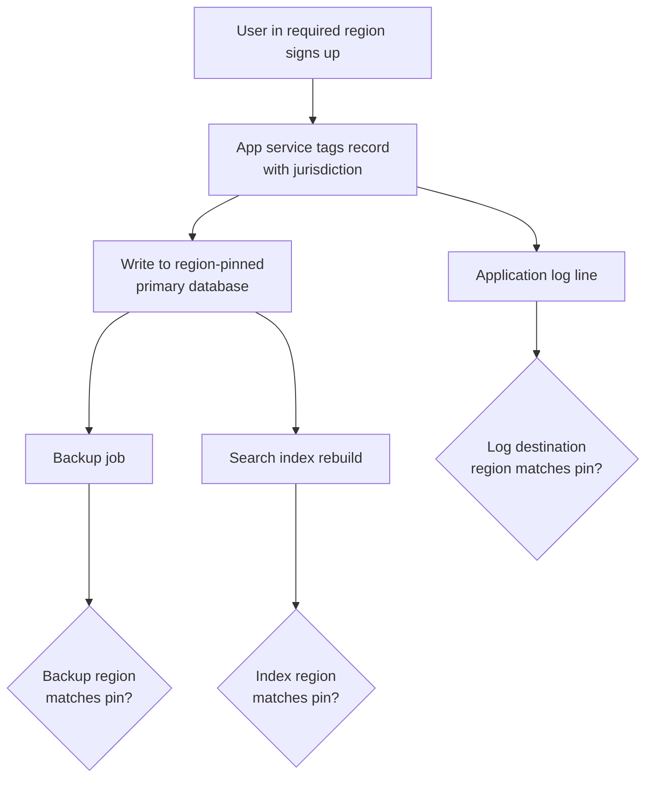

# Data Residency — Junior

<!-- level-focus -->
At junior level, focus on this question:

> Given a single user record and a rule that says "data belonging to users in region X must be stored in region X," can you trace that record from the moment it's written to every place it ends up, and confirm none of those places sit outside the required region?

Use the smallest realistic scenario that exposes the decision and its failure behavior.

*Data residency sounds like an infrastructure detail — "pick the right region when you create the database" — until you notice how many places a single user record actually visits: the primary database, its backups, the cache, the logs, the analytics pipeline, and whatever third-party support or monitoring tool your company plugs in. Residency isn't satisfied by getting one of those right. It's satisfied by getting all of them right, at the same time, and keeping them right as the system changes.*

---

## Core Concept 1 — Vocabulary

- **Data residency** — the requirement (legal, contractual, or self-imposed) that data belonging to users in a given jurisdiction is *stored* within a specific geographic boundary, usually a country or a defined region (like the EU).
- **Data sovereignty** — a broader idea: data stored in a jurisdiction is subject to that jurisdiction's laws, regardless of where the company that collected it is headquartered. Residency is often *how* you satisfy sovereignty concerns.
- **Data localization** — laws in a specific country that require certain categories of data (commonly financial records, government-related data, or personal data of that country's citizens) to be stored on infrastructure physically located inside that country. Several jurisdictions around the world have some form of localization requirement; the specifics (which data, how strict) vary by country and change over time, so treat "which countries require what" as a legal question to confirm with current sources, not something to memorize once.
- **Cross-border transfer** — moving data from one jurisdiction to another, which is the thing residency and localization rules constrain or forbid.
- **Region** (cloud provider sense) — a geographic location containing multiple data centers (availability zones). "EU region" in a cloud console usually maps to a specific city or country, not the whole EU — this distinction matters because "the EU" is not itself a single region.
- **Data at rest** — data sitting in storage (a database, an object storage bucket, a backup). **Data in transit** — data moving over a network. **Data in use** — data actively being processed in memory. Residency rules are almost always about data at rest and, often, where processing happens — not just about where a request happens to be answered from.

## Core Concept 2 — A Repeatable Method

1. **Tag the record with a jurisdiction at the point of collection.** Usually derived from the user's declared country or the entity (a legal business unit) the account belongs to — not their current IP address, which can be wrong (VPNs, travel, mobile networks).
2. **Route the write to the storage system pinned to that jurisdiction's region.** This means the primary database, not just the application server that happened to handle the HTTP request.
3. **Confirm every derived copy inherits the same region.** Backups, read replicas, and search indexes built from that data need the same pin — a residency-compliant primary with an out-of-region backup is still a violation.
4. **Confirm every side channel that touches the raw record also honors the pin.** Application logs, error-tracking tools, analytics events, and support-ticket systems frequently carry copies of PII fields (email, address, name) even when nobody intended it — these are the most common accidental leaks.
5. **Re-check after any infrastructure or vendor change.** Adding a new logging SaaS, switching CDN providers, or enabling a new caching layer can silently introduce a new copy of the data outside the pinned region.



The point of the diagram isn't the happy path in the middle — it's the three question marks at the bottom. A junior-level residency check is exactly those three questions, asked and answered explicitly, for every derived destination the record can reach.

## Core Concept 3 — Worked Example: One EU Signup

An online marketplace has one rule to start with: *personal data belonging to users who signed up with an EU country as their declared residence must be stored at rest in an EU region.* A new user, declared country `DE` (Germany), signs up.

The write path, and what's configured at each stop:

```yaml
# user-profile-service config (illustrative)
storage:
  primary_db:
    region: eu-central-1   # pinned — correct
  backups:
    target_region: eu-central-1   # pinned — correct
  search_index:
    cluster: global-search-us     # NOT pinned — this is the bug
logging:
  sink: company-wide-log-pipeline # ships to us-east-1 by default
```

Tracing this record end to end:

| Destination | Region | Compliant? |
|---|---|---|
| Primary database | `eu-central-1` | Yes |
| Nightly backup | `eu-central-1` | Yes |
| Search index (name/email searchable by support staff) | `global-search-us` (US) | **No** — the profile's name and email are copied into a US-based cluster |
| Application logs (includes email on signup event) | `us-east-1` via shared logging pipeline | **No** — the email address appears in a log line shipped to the company's default logging region |

Two of the four destinations are actually correct — the primary database and its backup were deliberately configured with the region pin in mind. The other two failed silently: the search index and the logging pipeline are *shared, company-wide infrastructure* that nobody re-pinned when this residency rule was introduced, because "add a database in the EU region" was the visible task and the log pipeline wasn't part of that ticket.

This is the core lesson at junior level: **residency is violated by omission, not by a deliberate bad decision.** The database team did their job correctly. The violation exists in the parts of the system nobody thought to check.

## Core Concept 4 — Success Criteria

A junior-level residency check for a given data flow is complete when you can state, for every destination that record reaches:

1. **The destination's actual physical region** (not the region of the service that writes to it — the region of where the data lands).
2. **Whether that region satisfies the applicable rule**, stated explicitly (yes/no), not inferred.
3. **The full list of destinations**, including backups, indexes, logs, and any third-party tool — not just the primary database.
4. **A specific person or config file you'd point to as evidence**, if asked to prove the answer rather than assert it.

If you can only answer for the primary database, the check isn't done — it's half done, and the missing half is exactly where residency violations tend to hide.

## Common Mistakes

- **Confusing "which server answered the request" with "where the data is stored."** A load balancer or CDN edge node in a nearby country doesn't mean the data at rest is in that country — check the storage layer, not the network layer.
- **Forgetting backups.** A pinned primary database with a default (non-pinned) backup target is a very common accidental violation, because backup configuration is often set once, globally, for an entire database cluster rather than per-tenant.
- **Forgetting third-party tools.** Support ticketing systems, error trackers, analytics platforms, and email-delivery services often receive a copy of user data (name, email, sometimes more) as a side effect of normal operation, and their storage region is decided by a vendor contract, not your application code.
- **Confusing encryption with residency.** Encrypting data before sending it to a server in the wrong region does not satisfy a residency requirement — residency is about the physical/legal location of storage and processing, not about whether the data is unreadable once it gets there. (Encryption key management is a related but separate topic.)
- **Using IP-derived location instead of declared jurisdiction.** A user traveling abroad, or using a VPN, has an IP address that doesn't reflect their actual residency status — using it as the routing signal produces incorrect and inconsistent results.
- **Treating the check as a one-time setup task.** A new logging sink, a new analytics vendor, or a new caching layer added six months later can reopen a violation that was correctly closed at launch.

---

## Apply it

1. Pick one real (or realistic) piece of user data in a system you know — a profile record, a support ticket, a payment record — and write down every jurisdiction-pinning rule that plausibly applies to it (even if none currently exist, state what a plausible rule would look like).
2. List every destination that record actually reaches: primary database, backups, replicas, search/index systems, logs, and any third-party SaaS tool it's sent to.
3. For each destination, find (or ask someone who would know) its actual physical/region configuration — not the region of the service that writes to it.
4. Build a table like the one in Concept 3, marking each destination compliant or not, with the region stated explicitly.
5. For any destination marked non-compliant, write one sentence on what specific configuration change would fix it (a region parameter, a different logging sink, a vendor data-residency addendum).

## Verify your work

- Every destination in your table has an explicit region stated, not "probably fine" or "should be okay."
- Backups and any index/search copy appear in your list — not just the primary database.
- At least one third-party tool (logging, analytics, support, or similar) is checked, even if it turns out to be compliant.
- For each non-compliant destination, you can name a specific fix, not just "needs to be reviewed."

## Review questions

- Why is data residency more often violated by omission than by a deliberate decision to store data in the wrong place?
- What is the difference between "the region of the server that answered the request" and "the region of where the data is stored," and why does that distinction matter?
- Why doesn't encrypting a piece of data satisfy a data residency requirement on its own?
- Beyond the primary database, what three other destinations does a complete residency trace need to check?
