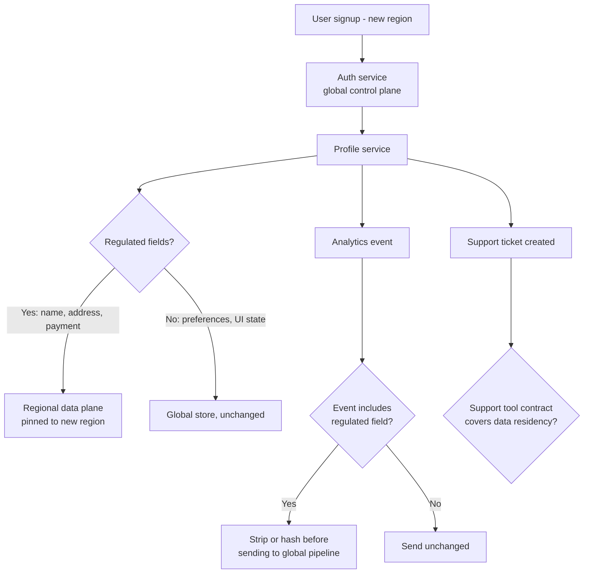

# Data Residency — Middle

<!-- level-focus -->
At middle level, focus on this question:

> When a new region-specific residency requirement lands on a system that was built as a single global service, which architectural boundary do you draw — and how do you justify that it's the right amount of change for what the requirement actually demands?

Use the smallest realistic scenario that exposes the decision and its failure behavior.

*At junior level, residency is a checklist: trace the record, confirm every destination. At middle level, the checklist isn't the hard part anymore — the hard part is that satisfying it usually means redrawing a boundary somewhere in the system, and every place you could draw that boundary has a different cost in latency, operational complexity, and how much of the codebase has to change. The skill here is picking a boundary that's proportional to the actual requirement, not the most convenient one or the most thorough-looking one.*

---

## Core Concept 1 — Three Architectural Shapes for Enforcing Residency

| Shape | How it works | What it buys | What it costs |
|---|---|---|---|
| **A — Row-level jurisdiction tag, single global database** | Every row has a `region` column; queries filter by it | Cheapest to build; no infrastructure change | Does **not** satisfy hard residency — the physical storage is still in one place regardless of the tag. Only useful for *routing logic*, not for the underlying legal requirement |
| **B — Full regional sharding** | Separate database clusters (and often separate application deployments) per region; a user's data lives entirely in their home region's cluster | Strong isolation; satisfies strict "must not leave the region" rules cleanly | Highest cost: cross-region queries become cross-cluster calls or are disallowed outright; every schema migration runs N times; operational load multiplies by number of regions |
| **C — Regional data plane, global control plane** | Non-sensitive metadata (user ID, account status, feature flags) stays in one global store; the data actually subject to residency (profile PII, financial records) lives in region-pinned stores, referenced by ID | Isolates the actual regulated data without duplicating everything; new regions can be added by extending the data plane, not rebuilding the whole stack | Requires a clean split between "what's regulated" and "what isn't," which takes real analysis to get right, and a join across two systems for any operation that needs both |

Shape A is a common but incorrect first instinct: it looks like it solves the problem (there's a `region` field, queries can filter on it) but it does not change where bytes are physically stored, so it satisfies nothing if the requirement is a real localization law rather than an internal reporting need. The middle-level judgment call is almost always between B and C — and it depends on how much of the system's data is actually regulated.

## Core Concept 2 — Evaluating the Trade-off Honestly

Ask these questions before picking a shape:

1. **How much of the data is actually in scope?** If residency applies to a narrow slice (profile PII, payment details) and the rest of the system (catalog data, product listings, feature flags) is unaffected, full regional sharding (B) duplicates infrastructure for data that never needed to move. Shape C fits better.
2. **How many regions are realistically in play?** Two regions is a very different operational commitment than eight. Shape B's operational cost scales roughly linearly with region count; underestimating this is the most common reason a "just shard it" plan blows its timeline.
3. **What does cross-region access actually need to do?** If support staff or fraud analysts need to query across regions routinely, Shape B makes every such query a federated, higher-latency operation; Shape C keeps that access pattern on the global control plane if the fields they need aren't the regulated ones.
4. **What's the cost of being wrong later?** Shape A can be *migrated into* Shape C reasonably (the tag already exists; the storage split is additive). Migrating a mature Shape A system directly into full Shape B sharding later, after data has already commingled across regions, is a much larger and riskier project — this asymmetry is a real reason to prefer designing toward C from early on, even if you don't need every region on day one.

## Core Concept 3 — Testability, Debugging, and Change Cost

- **Unit-level testability**: a schema or migration test that asserts every table holding a regulated field has a `region` column with a non-null constraint, and a lint rule or code-review check that flags any new database connection string that doesn't route through the region-aware data-access layer. These are cheap, fast, and catch the majority of accidental new violations at the point they're introduced — a new column added to a global table that happens to hold an address is caught before it ships, not after an audit finds it.
- **Integrated-flow testability**: a synthetic end-to-end test that creates a user tagged for a specific region, exercises the write paths that matter (profile update, support ticket, an analytics event), and then queries the actual storage backends (not the application layer) to confirm every resulting record physically resides in the expected region. This is slower and needs real infrastructure access, but it's the only test that catches the class of bug from the junior level — a correctly pinned primary database with an unpinned backup or search index — because unit tests against application code can't see infrastructure-level misconfiguration.
- **Debugging cost**: when Shape B (full sharding) is in place, a bug report like "a user's data appears missing" now has an extra branch to rule out — is this record even routed to the region the debugging engineer is querying? Shape C narrows this to just the regulated data plane, which is usually a smaller, better-understood subset of the system.
- **Change cost**: every new feature that touches regulated data needs to know which shape is in play. Under Shape B, a new feature that reads profile data has to be written region-aware from day one, or it silently only works for one region. Under Shape C, this awareness is localized to the data-access layer that talks to the regional data plane, and most feature code doesn't need to think about it at all — this containment is the main argument for spending the up-front design cost on C rather than defaulting to B.

## Core Concept 4 — Under- and Over-Application Signals

**Signals you're under-applying residency:**

- A new region's users are being served by existing global infrastructure "for now, we'll fix it later" past the point where real user data has already accumulated there — every day of delay increases the migration cost from Core Concept 2's asymmetry.
- Nobody can name, precisely, which fields on the user record are considered "regulated" for a given jurisdiction — if the boundary isn't written down, it can't be enforced consistently across teams.
- A support or analytics tool was granted broad read access to production data "temporarily" and nobody has since audited what it retains or where.

**Signals you're over-applying residency:**

- Every table in the system — including data with no plausible residency requirement, like public product-catalog listings — has been sharded per-region "to be consistent," multiplying operational cost for data nobody asked to be regionally isolated.
- A team stands up a full duplicate deployment (application servers, queues, caches) per region before confirming whether the actual legal or contractual requirement is about *storage location* specifically, or would be satisfied by a lighter-weight control (like keeping only the sensitive fields regional).
- New regions are blocked on a residency review even for launches where the product doesn't yet collect any personal data that would be subject to a residency rule — the process has become a gate applied uniformly rather than scoped to what's actually regulated.

## Core Concept 5 — Incremental Adoption

You rarely get to redesign the whole data layer at once, and you shouldn't try to. A workable incremental path:

1. **Inventory the regulated fields first**, on the existing system, without moving anything — name exactly which columns/tables are in scope for which jurisdictions.
2. **Split just those fields into a regional data plane**, referenced by user ID from the still-global control plane (moving toward Shape C), while everything else stays where it is.
3. **Add the integrated-flow test from Concept 3** for this one entity type before expanding further — this is the checkpoint that would have caught the junior-level backup/logging gaps, and it's cheap to run repeatedly as more entity types move.
4. **Extend to the next regulated entity type** (payment records, support tickets) using the same pattern, rather than attempting a single big-bang migration across every table.
5. **Only reach for full Shape B sharding** for a specific region if the evidence from Concept 2 (data volume, region count, cross-region access needs) actually supports the higher operational cost — not as a default starting point.

## Core Concept 6 — Cross-Component Scenario

A marketplace expands into a country with a data-localization requirement covering user identity and payment data. The existing system has one global Postgres cluster, one global analytics pipeline, and a third-party customer-support tool.

The interesting design decisions are at the diamonds: the profile service has to know which of its own fields are regulated (D), the analytics pipeline has to be changed so events carrying regulated fields are stripped or hashed rather than assuming "analytics data is never PII" (H), and the support tool — a third party the team doesn't control — needs its own contractual check (L), because no amount of internal architecture fixes a vendor that stores ticket contents in the wrong place.

## Verification at Both Levels

| Level | What it checks | Example |
|---|---|---|
| Unit | Schema constraints, code-review lint, static checks on data-access code | A CI check fails if a new migration adds a column flagged as PII to a table without a `region` constraint |
| Integrated flow | Actual data lands in the actual expected physical location, across the whole write path | A nightly synthetic job creates a test account in the new region, performs a profile update and a support-ticket creation, then queries each backend's actual storage location and fails loudly if any regulated field is found outside the pinned region |

Both levels matter and neither substitutes for the other: unit-level checks catch violations at the moment code is written, cheaply and often; the integrated-flow check catches the violations unit tests structurally can't see — infrastructure misconfiguration, vendor behavior, and interactions between services that no single unit test spans.

---

## Common Mistakes

- **Choosing Shape A (a `region` tag on a global database) and believing it satisfies a hard localization requirement** — it satisfies routing logic, not the physical storage constraint the requirement is actually about.
- **Defaulting to full regional sharding for every table** without checking how much of the data is actually in scope, producing an operational burden disproportionate to the actual requirement.
- **Treating the analytics pipeline and third-party tools as out of scope** because they're "not the database" — regulated fields flow into both routinely, and both need the same scrutiny as the primary data store.
- **Skipping the integrated-flow test** because unit tests pass — unit tests can confirm the code *intends* to route correctly without confirming the infrastructure actually did.
- **Delaying the regional split until real user data has already accumulated in the wrong place**, turning what could have been an additive migration into a data-relocation project with its own legal exposure.

---

## Apply it

1. For a system you know (or a realistic one), inventory which fields on a core entity (user profile, order, or similar) would plausibly be in scope for a residency requirement if the system expanded into a new jurisdiction — list the specific field names, not just "personal data."
2. Sketch which of the three shapes (A, B, C) the current system resembles today, and identify one concrete change that would move it toward Shape C for just the fields you listed.
3. Identify one downstream system (an analytics pipeline, a support tool, a data warehouse) that likely receives a copy of at least one in-scope field, and describe what change (stripping, hashing, or a contractual data-residency addendum) would bring it into compliance.
4. Write one unit-level check (a schema constraint, a lint rule, or a code-review checklist item) that would catch a new violation of your chosen boundary before it ships.
5. Describe one integrated-flow test — what it creates, what it exercises, and what physical evidence it checks — that would catch a violation your unit-level check can't see.

## Verify your work

- Your field inventory names specific columns or attributes, not a general category.
- Your chosen shape (A, B, or C) is justified against the questions in Concept 2 — scope, region count, access pattern, cost of being wrong later — not just asserted.
- At least one downstream system outside the primary database is addressed, with a specific fix.
- The unit-level check and the integrated-flow check are clearly different in what they catch — if they'd catch the same bug, one of them is redundant.

## Review questions

- Why does tagging rows with a `region` column on a single global database fail to satisfy a hard data-localization requirement?
- What three factors should drive the choice between full regional sharding and a regional-data-plane-with-global-control-plane design?
- Why is delaying a regional data split until after real user data has accumulated more expensive than doing it earlier?
- What can an integrated-flow test catch that a unit-level schema or lint check structurally cannot?
