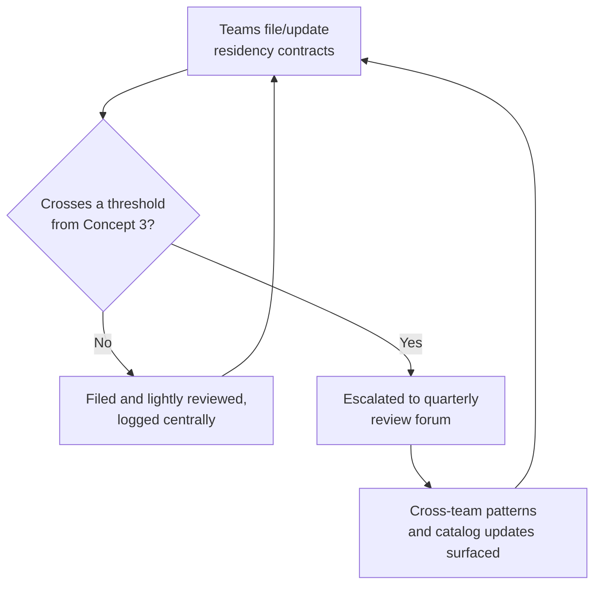

# Data Residency — Professional

<!-- level-focus -->
At professional level, focus on this question:

> How do you design an operating model so individual product teams can launch in new jurisdictions and adopt new vendors on their own cadence — without every decision needing central legal or platform sign-off — while still catching the moment a locally reasonable call quietly creates an organization-wide compliance gap?

Use the smallest realistic scenario that exposes the decision and its failure behavior.

*A single team can get residency right for its own service and the organization can still end up out of compliance — if every team reinvents its own data-flow mapping from scratch, if nobody notices the same subprocessor gap recurring across five different teams, or if a "ship fast, we'll add residency later" call in one team quietly becomes the reason the whole company can't answer an audit question. Professional-level work here is designing the process that turns good local engineering decisions into a defensible organizational posture — one that survives audits, region launches, and vendor changes without becoming a bottleneck on every one of them.*

---

## Core Concept 1 — Match Ownership to Where the Decision Actually Gets Made

Residency decisions get made at the moment a team builds a feature, picks a vendor, or ships into a new market — not at the moment a compliance team reviews a quarterly report. If the team building the feature doesn't have visibility into which fields are regulated, which jurisdictions apply, and which vendors are already approved, the decision gets made blind, and "blind" tends to default toward whatever's fastest to ship.

The organizational fix is giving each product team **enough context to make the call themselves, most of the time**: a maintained catalog of which jurisdictions the company operates in and what each requires, a list of pre-approved vendors with confirmed subprocessor locations, and a lightweight self-service way to ask "is this new field/vendor/region combination something I need to flag." Centralizing the *information* (the catalog, the approved-vendor list) while leaving the *decision* (how to build this specific feature) with the team that owns it is the same pattern that works for any cross-cutting concern at scale: build the shared resource once, let teams consume it many times without re-deriving it.

## Core Concept 2 — A Residency Contract Any Team Can Sign Up To

The unit that makes local decisions checkable is a lightweight, standard contract that any team building a feature touching user data fills in — short enough to write in an hour, specific enough that platform and legal partners can review it in minutes rather than a meeting:

| Field | What it captures |
|---|---|
| Data fields in scope | The specific fields this feature collects, stores, or forwards that might be regulated (name, address, payment detail, government ID, health data) |
| Jurisdictions touched | Which countries/regions the users generating this data are in |
| Storage destinations | Every system this data reaches — primary store, backups, search index, analytics, third-party tools — with each one's actual region |
| Transfer basis (if any) | If data crosses a jurisdictional boundary, what mechanism justifies it, and when it was last confirmed valid |
| Subprocessor disclosure | Any vendor involved, and whether their subprocessor list has been checked against this data's requirements |
| Owning team & review date | Who's accountable for keeping this contract current, and the next date it gets re-checked |

This contract is the same shape as the data-flow map and subprocessor registry from the senior level, standardized into a format every team fills in the same way — which is what makes it possible to spot patterns across dozens of these later (Concept 6), rather than each team's residency analysis being a differently-shaped, one-off document nobody else can quickly parse.

## Core Concept 3 — Thresholds That Trigger Visibility, Not Approval

Not every feature needs a legal review before shipping, and deciding which ones do is itself a design choice. A workable pattern uses thresholds that route a decision to visibility, not to a gate:

| Trigger | Example threshold | What happens |
|---|---|---|
| New jurisdiction | A team launches into a country not yet in the jurisdiction catalog | Contract required before launch; catalog gets a new entry once legal confirms the requirement, benefiting every future team that expands there |
| New vendor or subprocessor | A team adds a third-party tool with access to any field marked regulated in the contract | Vendor's subprocessor list checked once against the requirement, then added to the pre-approved list — future teams using the same vendor skip this step |
| Transfer mechanism relied on | A contract states a cross-border transfer basis (contractual clause, adequacy-style finding) | Logged centrally with a re-validation date; owning team gets an automatic reminder before that date lapses |
| Recurring gap pattern | The same missing-subprocessor-disclosure issue appears in three or more team contracts within a quarter | Flagged for the quarterly review (Concept 7) as a systemic gap, not re-solved ad hoc a fourth time |

Most contracts never cross a threshold and are filed, reviewed lightly by a platform partner, and acted on the same week. The handful that do cross one are exactly the ones with organization-wide exposure — a brand-new jurisdiction, a brand-new vendor, a transfer mechanism about to lapse — and those are the ones that actually need eyes beyond the team that filed them.

## Core Concept 4 — Decomposing a Residency Initiative Into Reversible Increments

"Bring the whole company into compliance with a new region's requirement" is not a single decision — it needs to be broken into checkable, reversible steps:

1. **Map before you migrate.** Get every affected team to fill in the contract from Concept 2 for their own services *before* any data actually moves — you cannot plan a migration for data flows you haven't inventoried.
2. **Pilot with one team and one entity type.** Run the full contract-to-compliant-architecture path (map, split regulated fields into a regional data plane, verify with the integrated-flow test from the middle level) with a single willing team before mandating it broadly — this surfaces gaps in the contract template and the review process itself while the blast radius of a bad template is one team, not fifty.
3. **Roll out the contract requirement broadly before the migration deadline**, so every affected team has filled theirs in and knows its own scope, well before anyone is asked to actually move data.
4. **Set a migration deadline with an explicit review checkpoint**, grounded in what the pilot showed was actually achievable per team — not an arbitrary date picked before any team had attempted the work.
5. **Re-measure against the outcome metrics (Concept 5) and decide whether to continue, extend, or escalate** — a team that hits the pilot's estimated timeline validates the plan for the rest; a team that blows past it by a wide margin is a signal to revise the estimate for everyone still to come, not a reason to quietly let that one team slip.

Each step is independently reversible: a flawed contract template can be revised without unwinding any migration already done; a missed deadline can be re-set using pilot data without discarding the mapping work that's already complete.

## Core Concept 5 — Outcome Measures and Exit Conditions

A residency initiative without a stated finish line becomes a permanent, unbounded background commitment. State up front:

- **The outcome measure** — for example, the percentage of teams with regulated data flows that have a current (not stale) contract on file, or the number of unresolved subprocessor-location gaps across the vendor catalog. Pick a measure the organization can actually track on a dashboard, not an internal proxy only one team understands.
- **The success exit condition** — for example, every team with an in-scope data flow has a contract dated within the last two quarters, and the two most recent audit or drill exercises found zero uninventoried destinations. Once met, the initiative moves from "active project" to "standing maintenance cadence" (Concept 7).
- **The escalation condition** — for example, if a pilot team's migration takes more than double the estimated time, or a recurring gap pattern (Concept 3) appears in more than a set number of teams, the initiative is re-scoped with more central support rather than left to grind on unchanged.

## Core Concept 6 — Risks Beyond the Compliance Checkbox

- **Coordination risk.** Two teams, unaware of each other, independently stand up separate regional data planes for overlapping jurisdictions using different vendors — duplicating both engineering effort and vendor risk surface. The shared jurisdiction catalog and pre-approved vendor list from Concept 1 exist specifically to prevent this by making the existing solution visible before a second one gets built.
- **Operational risk.** Each additional region a team supports adds real on-call and debugging surface (the cross-component debugging cost noted at the middle level, multiplied by however many teams now maintain regional planes). A residency initiative that expands regions faster than teams can absorb the added operational load produces reliability regressions that show up as incidents, not as compliance findings.
- **Governance risk.** Without the standard contract, an audit request ("show us every place customer data from this jurisdiction is stored") becomes an ad hoc scramble across every team, each producing a differently-shaped answer under time pressure — exactly the scenario the contract format exists to prevent.
- **Migration risk.** Moving data that's already commingled across regions into a properly pinned architecture is a data-relocation project with its own risk of downtime, data loss, or a window where the data is transiently non-compliant during the move — this needs the same rigor (staged, tested, reversible steps) as any other high-stakes migration, not a "just copy it over" weekend task.
- **Coordination with legal and vendor management.** Transfer-mechanism validity and subprocessor changes are decided outside engineering — a residency program that doesn't have a standing channel to legal and vendor-management teams will discover a lapsed transfer basis or an undisclosed subprocessor from an audit finding instead of from a proactive check.

## Core Concept 7 — A Cadence for Sustained Delivery, Not a One-Time Project

Jurisdictions get added, vendors change their subprocessors, and transfer mechanisms get challenged or replaced on their own schedule, independent of any one team's roadmap — so this can't be a project with a finish line. A standing quarterly review works well in practice:

The forum's job is not to approve every team's individual contract but to **catch what no single team can see**: a subprocessor gap that recurs across five contracts because the vendor itself changed its subprocessor list without anyone re-checking; a jurisdiction where three different teams independently built three different regional data planes because the catalog entry was missing; a transfer mechanism nearing its re-validation date across multiple teams at once, worth handling as a coordinated legal effort rather than five separate scrambles. Sharing these patterns back into the jurisdiction catalog and the pre-approved vendor list (Concept 1) is what turns isolated, correct local decisions into an organizational memory that makes the next team's version of the same decision faster and safer.

---

## Common Mistakes

- **Requiring central legal review for every feature that touches any user data**, turning a fast local decision into a queue behind a scarce team — teams route around a bottleneck like this informally, which is worse for compliance than a lightweight self-service contract would have been.
- **No standard contract format**, so every team's residency analysis is shaped differently, making it impossible to spot recurring gaps or answer an audit question quickly across the organization.
- **Treating a passed pilot as proof the full rollout needs no further checkpoints** — a pilot validates the template and the process at one team's scale, not automatically at fifty teams' scale.
- **No re-validation cadence for transfer mechanisms or subprocessor lists**, leaving the organization's compliance posture accurate only at the moment each contract was first filed, and stale indefinitely after.
- **No exit or escalation condition**, so the initiative runs forever as an unstated background commitment, with no clear point at which it becomes routine maintenance instead of an active project consuming dedicated attention.

---

## Apply it

1. Draft a one-page residency contract template covering the six fields from Concept 2, generic enough that a different team with a different service could fill it in without modification.
2. Define three concrete thresholds (a new-jurisdiction trigger, a new-vendor trigger, a recurring-gap trigger) that would route a team's contract to a lightweight central review rather than let it stay fully local, and justify each one.
3. Sketch a five-step rollout plan (map, pilot, roll out the contract broadly, set a deadline, re-measure) for bringing one specific existing system into compliance with a new jurisdiction's requirement.
4. Write the outcome measure, success exit condition, and escalation condition for that rollout.
5. Describe what a quarterly cross-team review forum would look at for this rollout, and name one pattern it could catch that no single team's own contract review would surface.

## Verify your work

- The contract template is specific enough to be useful (names concrete fields to fill in) and generic enough to be reused by other teams unmodified.
- Each threshold has a stated reason tied to a real risk (coordination, operational, or governance) from Concept 6, not a round number picked without justification.
- The rollout plan's five steps are each independently reversible — a failure at any step doesn't require unwinding the steps before it.
- Both exit conditions are concrete enough that a reviewer could check the tracked outcome measure in two quarters and say, unambiguously, whether the condition was met.
- The named cross-team pattern is something visible only by comparing multiple contracts, not something one team's own review would have caught alone.

## Review questions

- Why does requiring central legal sign-off on every data-touching feature tend to produce worse compliance outcomes than a lightweight, self-service contract with defined escalation thresholds?
- What is the difference between a threshold that triggers visibility and one that acts as an approval gate, and why does that distinction matter for keeping most teams' work unblocked?
- Why does a residency initiative need both a success exit condition and a separate escalation condition, rather than just a single target date?
- What kind of compliance gap can a quarterly cross-team review catch that no individual team's own contract review process would surface on its own?
