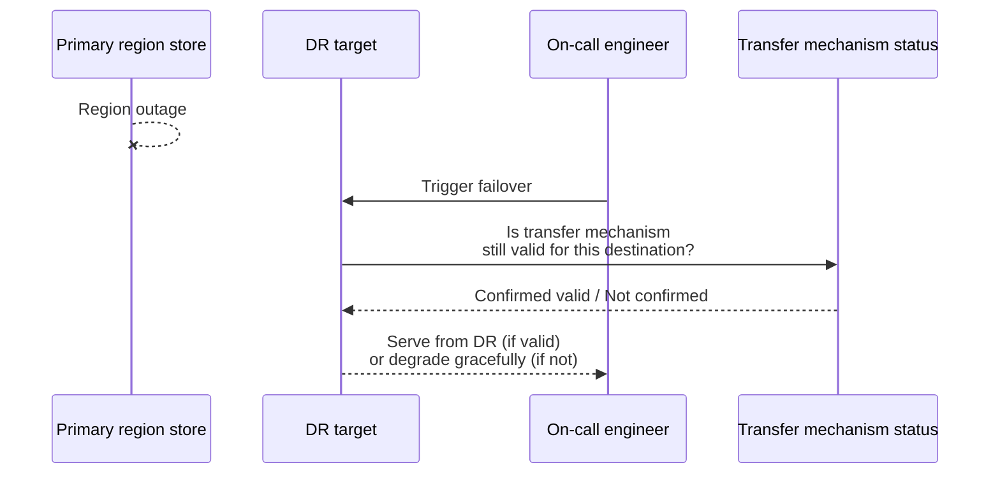
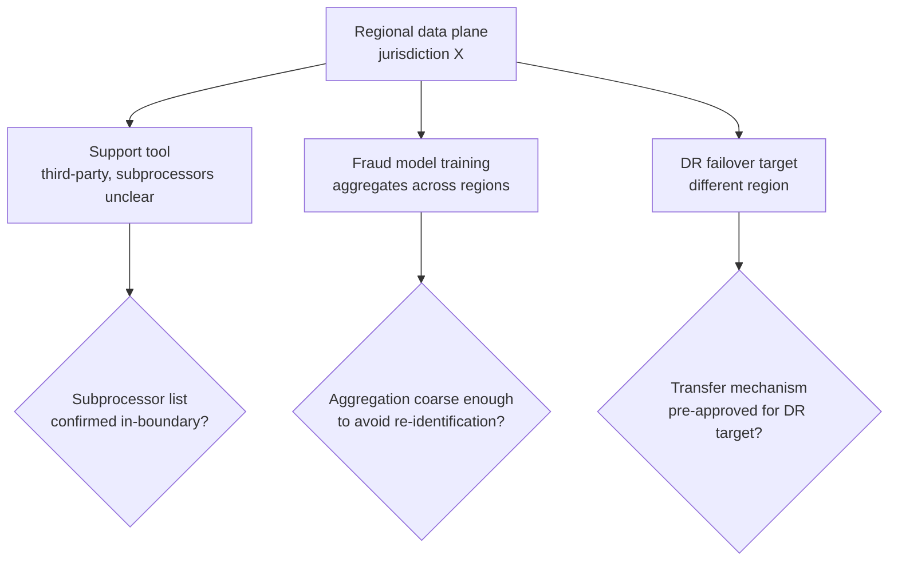

# Data Residency — Senior

<!-- level-focus -->
At senior level, focus on this question:

> When the region holding your regulated data plane fails, what does your recovery path actually do with that data — and can you show, with evidence rather than assumption, that neither the failover itself nor anything feeding off it moves that data across the jurisdictional boundary you're required to hold?

Use the smallest realistic scenario that exposes the decision and its failure behavior.

*Below senior level, residency is treated as a steady-state property: pin the region, verify the pin, done. At senior level the interesting failures live in the moments the steady state breaks — a region outage, a new subprocessor added to a vendor's stack, a machine-learning pipeline that quietly pulls global data to train a shared model. The architecture has to hold the invariant not just when everything is healthy, but especially when it isn't.*

---

## Core Concept 1 — The Invariant, Stated Precisely

The invariant worth protecting is not "data is stored in the right region." It's more specific: **regulated data must not be stored, processed, or rendered accessible outside its approved jurisdiction(s) at any point in its lifecycle — including failure, recovery, and every automated pipeline that touches it downstream of the primary store.**

Three words in that sentence carry the weight that lower levels can gloss over:

- **"Processed," not just stored** — a region-pinned database that's queried by a compute job running in a different region has still moved the data outside the boundary, even if it's written back afterward.
- **"Approved,"** not "any" — some jurisdictions permit cross-border transfer under specific legal mechanisms (contractual clauses between the parties, or a government finding that the destination country's protections are adequate). The invariant isn't "data can never leave" — it's "data only leaves through a mechanism that's actually approved for this data and this destination," which is a narrower and easier-to-violate-by-accident condition than a blanket ban would be.
- **"Every automated pipeline downstream"** — a residency boundary that holds for the primary write path and silently doesn't hold for the nightly ETL job, the ML training pipeline, or the disaster-recovery replica is not holding at all; it's holding for the part of the system someone happened to check.

## Core Concept 2 — Cross-Border Transfer Is a Real Mechanism, Not a Loophole

It's worth being precise here because architecture decisions hinge on it: cross-border data transfer is not automatically illegal or automatically a violation. Legal frameworks that impose residency-like constraints typically provide recognized mechanisms for transferring data across a boundary anyway — most commonly, a contractual instrument between the sending and receiving parties (often called something like standard contractual clauses) that binds the receiving party to equivalent protections, or a government-level finding that a destination country's legal protections are broadly equivalent (often called an adequacy decision). Where either mechanism is in place and correctly executed, a transfer that would otherwise violate residency can be compliant.

The architectural consequence: a design that assumes "our regulated data must physically never leave region X, full stop" is sometimes more restrictive than the actual requirement, at real cost in resilience and cross-region functionality. But relying on a transfer mechanism is not a one-time checkbox — these mechanisms have, historically, been challenged and replaced as legal frameworks evolved, and an architecture that hard-codes today's transfer mechanism as a permanent assumption is building on ground that can shift. Treat "is our current transfer basis still valid" as a standing question to re-ask, not a fact established once at design time — and treat any specific legal conclusion here as something to confirm with current legal counsel, not something this document can settle.

## Core Concept 3 — Failure Modes

| Failure mode | What actually happens | Why it's easy to miss |
|---|---|---|
| **Cross-region disaster recovery** | The regional data plane's DR/failover target is a different region than the primary, chosen for infrastructure reasons (capacity, cost) without checking it against the residency boundary | DR configuration is usually owned by an infrastructure or SRE team, separate from whoever owns the residency requirement; the two decisions are made in different meetings |
| **Subprocessor chains** | A vendor you've approved (support tooling, email delivery, fraud detection) itself uses a subprocessor — a sub-vendor — that stores or processes data in a different region than the one your contract with the primary vendor specifies | Vendor contracts typically list subprocessors, but the list changes over time and is rarely re-checked against your residency requirements after initial vendor approval |
| **Shared ML/analytics pipelines** | Data from a regional plane is aggregated into a global training set or a global dashboard, "just the aggregates, not raw records" — but if the aggregation is fine-grained enough, or if a model trained on it can be shown to memorize specifics, the boundary has been crossed by the model or dashboard, not by an obvious raw copy | The transfer isn't a row in a table moving; it's information content moving in a less visible form, which doesn't trigger the same review a database migration would |
| **Support/on-call access from another region** | An engineer or support agent physically located outside the approved jurisdiction remotely queries the regional data plane to debug an incident or answer a ticket | Remote *access* to data can itself constitute a transfer under some frameworks, distinct from where the data is stored — a distinction easy to miss because the data "never moved" from the storage engineer's point of view |
| **Telemetry and logging pipelines** | Traces, logs, or error reports generated by the regional service still get shipped to a company-wide, single-region observability platform, carrying fragments of regulated data in log lines or stack traces | Observability infrastructure is built for operational visibility first; residency is rarely part of its design brief unless someone explicitly adds it |

## Core Concept 4 — Recovery Without Violating the Boundary

The naive DR answer — "if the primary region goes down, fail over to the nearest healthy region" — is exactly what breaks the invariant, because "nearest healthy region" is chosen for latency and capacity, not jurisdiction. Two workable patterns exist, each a real trade-off:

- **In-boundary DR only.** The failover target is a second location *within the same approved jurisdiction* (a second availability zone or a second in-country data center from the same or a different provider). This preserves the invariant unconditionally but means a jurisdiction-wide outage (rare, but not impossible) has no failover target at all — the regulated service goes down for that region's users until the jurisdiction's infrastructure recovers.
- **Cross-region DR under an active transfer mechanism.** The failover target is in a different region, but a transfer mechanism (Concept 2) is already in place and *pre-approved* for exactly this data and this destination, so the failover itself doesn't need new legal groundwork in the middle of an incident. This buys real resilience against a jurisdiction-wide outage, at the cost of standing legal and contractual overhead that has to be kept current — not signed once and forgotten.

Whichever pattern is chosen, the recovery plan needs to be tested, not just documented: a DR drill that fails over and then queries the *actual* post-failover storage location is the only way to know whether the plan as executed matches the plan as written. A drill that only confirms "the service came back up" without checking where it came back up from is not evidence of anything about residency.

The step worth noticing in that sequence is the check against `Legal` happening *during* the incident, in the fully automated version of this pattern — which only works if that check was designed in ahead of time, not improvised under pressure. An architecture that can't answer "is our transfer basis still valid" quickly, in the middle of an outage, will make that call under duress, which is precisely when a compliance mistake is most likely.

## Core Concept 5 — Evidence, Not Assumption

A senior-level residency design is validated by artifacts a skeptical auditor or a new team member could independently check:

- **A data flow map** showing every system (not just the primary database) that a regulated field passes through, including third-party subprocessors, with the region each hop occurs in.
- **A subprocessor registry**, kept current, listing every vendor and sub-vendor with access to regulated data and their storage/processing locations — refreshed on a cadence, not built once at vendor onboarding and left stale.
- **A DR drill report** that includes the actual post-failover storage location, not just an uptime confirmation.
- **A transfer-mechanism status log** — when was the relevant contractual clause or adequacy basis last confirmed valid, and what would trigger a re-check (a legal challenge to the mechanism, a vendor changing subprocessors, a new jurisdiction added).
- **An access log for the regional data plane** that can answer "who queried this data, and from where" — the only way to check the remote-access failure mode from Concept 3 after the fact.

Each of these is boring to produce and exactly the kind of artifact that's missing when an incident forces the question "were we actually compliant" and the honest answer turns out to be "we believed so, but nobody can show it."

## Core Concept 6 — Cross-Component Scenario

A B2B platform operates a regional data plane for one jurisdiction's customer records (Shape C from the middle level). Three systems reach into it: a shared customer-support tool (third-party, subprocessors unknown at a granular level), a fraud-detection service that scores transactions using a model trained on aggregated data across all regions, and the platform's own DR setup, which fails over to a different region for infrastructure reasons unrelated to residency.

None of the three arrows out of the regional plane is obviously wrong on its own — a support tool, a fraud model, and a DR target are all completely ordinary things for a system to have. The senior-level work is exactly the three diamonds: none of them can be answered "probably fine" without becoming the failure mode from Concept 3.

## Core Concept 7 — Trade-offs Among Plausible Approaches

| Approach | What it buys | What it risks |
|---|---|---|
| **Hard in-boundary isolation** (no DR outside the jurisdiction, no cross-region aggregation ever) | Simplest compliance story; nothing to keep re-validating | A jurisdiction-wide outage has no failover; any legitimate business need for cross-region insight (fraud patterns, global support) has to be re-solved without raw data movement |
| **Cross-region DR + aggregation, under active transfer mechanisms** | Real resilience and cross-region capability | Standing legal/contractual maintenance burden; exposure if the transfer mechanism is later invalidated or the vendor's subprocessor chain changes without your knowledge |
| **Field-level tokenization with in-region key custody** (ciphertext or tokens can replicate globally; the key or lookup table that makes it meaningful stays in-region) | Some resilience and cross-region utility without moving readable regulated data | Whether tokenized/encrypted data still counts as "in-region" for a given legal requirement is a genuine gray area that varies by jurisdiction and data type — this needs explicit legal confirmation before being relied on, not an architectural assumption |

None of these is universally correct; the right one depends on the specific requirement, the actual likelihood and cost of a jurisdiction-wide outage, and how much cross-region functionality the business genuinely needs versus how much is convenience.

## Questions That Expose Weak Assumptions

- "When did we last actually test the DR failover and check where the data landed afterward — or have we only confirmed the service came back up?"
- "Do we have a current, complete list of every subprocessor our vendors use, or did we check this once at contract signing?"
- "If our cross-border transfer mechanism were invalidated tomorrow, what's our fallback, and how long would it take to execute?"
- "Can our fraud/ML pipeline's aggregation be shown to be coarse enough that it doesn't functionally re-identify regional records — or are we assuming that because nobody's tried to prove otherwise?"
- "Who can query the regional data plane remotely, from where, and do we actually log that, or only log what was queried?"

---

## Common Mistakes

- **Configuring DR failover based purely on infrastructure criteria** (nearest healthy region, cheapest capacity) without checking it against the residency boundary at all.
- **Treating a signed transfer mechanism as permanent** rather than as a standing commitment that needs periodic re-validation as legal frameworks and vendor arrangements change.
- **Assuming aggregation or model training automatically anonymizes data** without any check on whether the aggregate is coarse enough to actually prevent re-identification.
- **Never auditing subprocessors after initial vendor approval**, leaving an unknown and possibly growing list of sub-vendors with access to regulated data in unverified locations.
- **Testing DR only for uptime**, not for where the recovered data actually resides — producing false confidence that the recovery plan is compliant when nobody has checked.

---

## Apply it

1. For a regional data plane you know (or a realistic one), describe its current DR/failover target, and state explicitly whether that target is inside or outside the approved jurisdiction.
2. If the DR target is outside the jurisdiction, identify what transfer mechanism (if any) is currently relied on, and when it was last confirmed valid.
3. List every downstream system that reaches into this regional data plane — support tooling, analytics, ML pipelines, observability — and mark, for each, whether its own storage/processing location has actually been verified.
4. Pick one of the three approaches in Concept 7 (hard isolation, cross-region DR under a transfer mechanism, or field-level tokenization) as the right fit for this scenario, and justify it against the actual likelihood of a jurisdiction-wide outage and the actual cross-region functionality needed.
5. Design one piece of evidence (a drill report format, a subprocessor registry template, an access-log query) that would let a skeptical auditor check your answer to step 1 without taking your word for it.

## Verify your work

- You can state, with a yes/no answer backed by a specific artifact, whether your DR target is inside or outside the approved jurisdiction.
- Every downstream system in your list has an explicit compliance status — not "assumed fine."
- Your chosen approach from Concept 7 is justified against real trade-offs (outage likelihood, functionality need, standing legal maintenance) rather than picked because it's the most familiar pattern.
- The evidence artifact you designed could actually be produced today, not just described in the abstract.

## Review questions

- Why is "regulated data must never leave region X" sometimes a stricter and more costly standard than what the actual legal requirement demands?
- What specifically makes a DR drill that only confirms uptime insufficient evidence of residency compliance?
- Why can aggregation or model training constitute a cross-border transfer even when no raw record visibly moves?
- Why does relying on a cross-border transfer mechanism require ongoing re-validation rather than a one-time approval?
