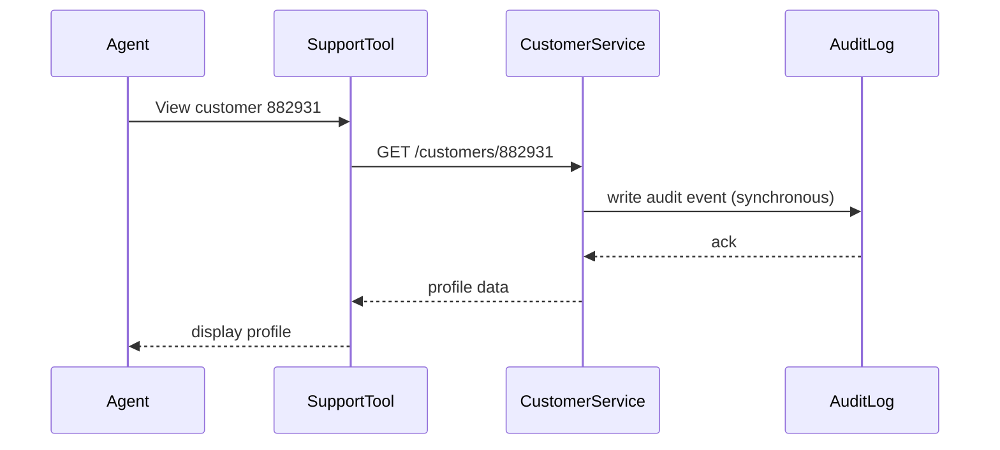

# Audit Logging — Junior

<!-- level-focus -->
At junior level, focus on this question:

> Given a support ticket asking "who looked at this customer's records last month," can your audit log answer it completely and correctly?

Use the smallest realistic scenario that exposes the decision and its failure behavior.

## What an audit log proves (and what it is not)

A **privacy audit log** is a different thing from the debug or application logs you already write. A debug log tells *you* what the system did so you can fix bugs. A privacy audit log exists to answer a much narrower, much higher-stakes question for someone else — a compliance officer, an auditor, a regulator, or the data subject themselves: **"who touched this specific person's data, when, and why?"**

That question shows up because of real obligations, not hypothetical ones. Frameworks like **SOC 2** and **HIPAA** explicitly require an auditable trail of access to sensitive and regulated data. If you cannot produce that trail on demand, the control is considered missing, regardless of how good your debug logs are.

Get the vocabulary straight first, because it is what every schema and query below is built from:

| Term | Meaning |
|---|---|
| Actor | The identity (person, service account, or automated job) that performed the access |
| Subject | The record or person the data belongs to (whose data was touched) |
| Action | What was done: `VIEW`, `EXPORT`, `UPDATE`, `DELETE` |
| Justification | The stated business reason for the access (a ticket number, a workflow, a support case) |
| Outcome | Whether the access succeeded or was denied |
| Immutability | Once written, an audit record can never be edited or deleted by anyone, including administrators |

Notice that "actor" and "subject" are almost always *different people*. A debug log usually cares about the actor (which service, which request ID). A privacy audit log must also capture the subject — whose record was it — because "who accessed customer 882931's data" is a query by subject, not by actor.

## A repeatable method

Follow the same five steps every time you add audit logging to a new access point that touches classified data:

1. **Identify every access point that reads or writes classified data** — not just the obvious "edit profile" screen, but every endpoint, background job, and admin script that can read a customer's PII.
2. **Define the record schema before you write any code** — decide the fixed set of fields every event must carry (see the table below). Do not let each team invent its own shape.
3. **Write the audit record synchronously, as part of the same operation** — not "best effort" after the response has already gone out. If the write to the audit store fails, the access should not silently go unrecorded.
4. **Make the store append-only** — no `UPDATE` or `DELETE` grants for anyone, including the team that owns the table. This is usually enforced with database permissions or a write-once storage class (WORM — Write Once, Read Many).
5. **Prove it with a query** — before you consider the work done, actually run the "who accessed subject X" query and confirm it returns exactly what happened.

## Worked example: a "View Customer Profile" action

A support tool lets agents look up a customer's profile — name, email, phone, address, billing history. Because email, phone, and address are classified as PII, every view must be audited.

Here is the audit event schema, with one real example row:

| Field | Type | Example value | Purpose |
|---|---|---|---|
| `event_id` | UUID | `7f3e2a10-...` | Unique identifier for this record |
| `occurred_at` | timestamp (UTC) | `2026-05-14T09:12:03Z` | When the access happened |
| `actor_id` | string | `agent_4471` | Who performed the action |
| `actor_role` | string | `support_agent` | Role held at the time of access |
| `action` | enum | `VIEW` | What was done |
| `subject_type` | string | `customer_profile` | What kind of record was touched |
| `subject_id` | string | `cust_882931` | Whose record was touched |
| `justification` | string | `"ticket #58210 — billing dispute"` | Stated business reason |
| `fields_accessed` | array | `["email", "phone", "address"]` | Which classified fields were exposed |
| `outcome` | enum | `SUCCESS` | Result of the access attempt |

The sequence that produces this row must guarantee the audit write happens as part of the request, not after it:



Notice the audit write happens **before** the profile data is returned to the caller. If the audit write fails, the request should fail too — an access that isn't recorded is, for compliance purposes, an access that never happened.

Now the payoff: three months later, legal asks "who looked at customer 882931's data in Q2 2026?" You run:

```sql
SELECT actor_id, occurred_at, action, justification, outcome
FROM audit_log
WHERE subject_type = 'customer_profile'
  AND subject_id = 'cust_882931'
  AND occurred_at BETWEEN '2026-04-01' AND '2026-06-30'
ORDER BY occurred_at;
```

And get a complete, trustworthy answer:

| actor_id | occurred_at | action | justification | outcome |
|---|---|---|---|---|
| agent_4471 | 2026-05-14T09:12:03Z | VIEW | ticket #58210 — billing dispute | SUCCESS |
| agent_2290 | 2026-06-02T14:47:11Z | EXPORT | ticket #59102 — refund request | SUCCESS |
| agent_4471 | 2026-06-20T11:03:44Z | VIEW | (no ticket linked) | DENIED |

That third row is exactly the kind of answer an audit trail exists to catch — an agent who tried to view the record without a linked justification, and was denied. If that row were missing because you only log successes, the audit is incomplete.

## Common junior mistakes

- **Logging only successful accesses.** Denied or failed attempts are often the most important rows — they show your access control is working, or reveal an attempted policy violation. Log both.
- **Making the audit table just another mutable table.** If any role — including yours — can `UPDATE` or `DELETE` a row, the log cannot be trusted as evidence. Immutability is not optional polish; it is the entire point.
- **Writing the audit record "best effort," after the response is sent.** If the write is fire-and-forget and the process crashes a moment later, the access happened but was never recorded. Write it as part of the same transaction or request path, not as an afterthought.
- **Forgetting non-interactive access paths.** A nightly export job, an admin CLI script, or a data pipeline reading the same customer table is just as reportable an access as a support agent clicking through a UI. If it touches classified data, it needs the same event.
- **Storing full PII inside the audit log itself.** If the audit log copies the customer's actual email and address into every event, you have created a second copy of sensitive data to protect, and deleting the source record later does not delete the copy. Reference the subject by ID; log *which fields* were accessed, not their values.
- **Confusing a debug log with an audit log.** A line like `logger.info("fetched customer 882931")` in your application logs is not an audit trail — it typically has no fixed schema, no immutability guarantee, no query interface by subject, and gets rotated or deleted with the rest of your logs long before compliance retention requirements are met.

## How to verify your work

Three checks confirm the audit trail actually does its job:

1. **Coverage** — every read or write to a classified field produces exactly one audit row, including denied attempts.
2. **Queryability** — you can retrieve every access to a specific subject over a specific time range in one query, and the result includes actor, action, timestamp, and justification.
3. **Immutability** — attempting to `UPDATE` or `DELETE` an existing row is rejected by the database or storage layer, not merely discouraged by convention.

## Apply it

1. Pick one endpoint in a small service that reads a classified field (for example, a customer's email or phone number).
2. Design the audit event schema from the table above, adapted to your endpoint's actual data.
3. Instrument the endpoint to write one audit record synchronously for every access attempt, success and denial alike.
4. Apply a database or storage permission that prevents any role from updating or deleting rows in the audit table.
5. Write and run the "who accessed subject X between date A and date B" query against your own test data and confirm the output matches what actually happened.

## Verify your work

- A successful view, a denied view, and an export each produce exactly one row with the correct actor, subject, and outcome.
- The subject-and-date-range query returns every access you performed during testing, in order, with no gaps.
- An attempted `UPDATE` or `DELETE` against the audit table fails with a permissions error.
- No row in the audit table contains the actual PII values themselves — only identifiers and field names.

## Review questions

- What is the difference between an actor and a subject in an audit record, and why does the "who accessed X" question depend on the subject field specifically?
- Why must denied or failed access attempts be logged, not just successful ones?
- What makes an audit log immutable in practice, rather than immutable only by convention?
- Why is storing the actual PII value inside the audit event itself a mistake?
