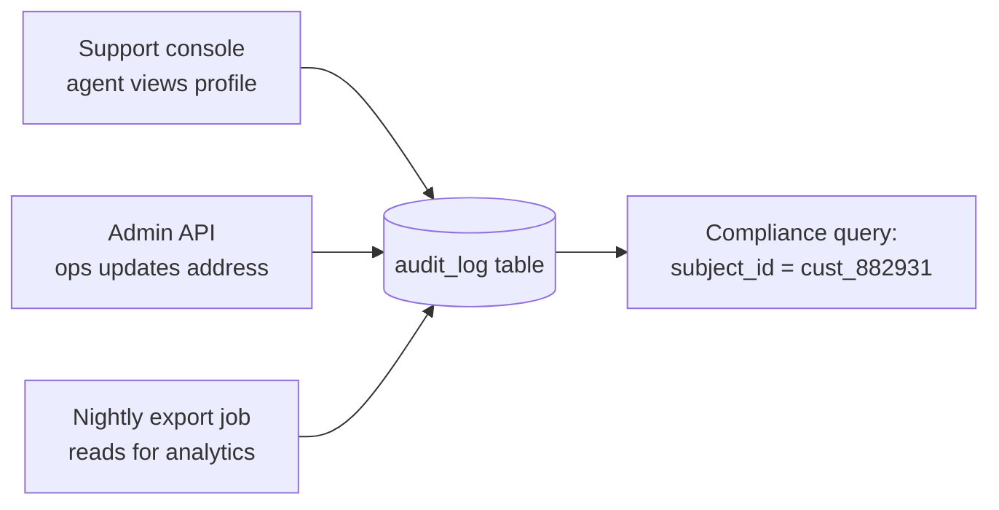

# Audit Logging — Middle

<!-- level-focus -->
At middle level, focus on this question:

> When three different components — a support console, an internal admin API, and a nightly export job — all touch the same classified customer table, where does the single source of truth for "who accessed this record and when" actually live?

Use the smallest realistic scenario that exposes the decision and its failure behavior.

## The placement question

At junior level, audit logging is "add a write call at the one place data is accessed." At middle level, the honest problem is that classified data is almost never accessed from one place. A customer's profile is read by a support console, an internal admin API used by ops, a nightly batch export for analytics, and probably a debugging endpoint someone added two years ago. If each of those components independently decides how (and whether) to write its own audit record, you get four different schemas, three different retention policies, and at least one access path that quietly never got instrumented.

The middle-level decision is **where the audit-writing responsibility lives**, and that decision determines how easy the system is to keep correct as it grows. There are three realistic placements, each with a real trade-off:

| Placement | How it works | Strength | Weakness |
|---|---|---|---|
| **Database trigger / CDC** | A trigger or change-data-capture stream on the classified table fires on every read or write | Impossible to bypass — even a rogue script or a forgotten endpoint is caught | Reads are harder to trigger than writes (most DBs don't fire on `SELECT`); ties audit format to schema of the underlying table |
| **Application/ORM middleware** | A shared library or ORM hook wraps every call that touches classified fields and emits an event | Captures rich context (actor, justification, which endpoint) that the database layer doesn't have | Only as complete as the discipline to route every access through the shared library; a raw query that skips it is invisible |
| **API gateway / service mesh** | A proxy in front of every service logs every request that touches a classified route | Centralized, consistent, and covers every service uniformly with no per-team opt-in | Sees the HTTP request, not necessarily *which* customer record or fields were actually returned in the response body |
| **Facade / query-layer** | A single library or service is the *only* sanctioned way to read/write classified fields; audit writes live there | Combines the middleware's rich context with a hard boundary — nothing bypasses it because there is no other path to the data | Requires migrating every existing caller onto the facade, which is real work, not just a config flag |

None of these is universally "correct." The choice depends on what you can actually enforce. If your organization can guarantee that classified fields are *only ever* reachable through one internal client library, the facade approach gives you both completeness and rich context for the least ongoing cost. If you cannot make that guarantee — because there are three years of ad hoc scripts with direct database credentials — a database-level trigger is the only placement that is honestly complete, even though it gives you a thinner event.

## Evaluating the trade-off with real criteria

Don't pick a placement by preference — evaluate it against the properties that actually matter for a compliance-facing log:

- **Completeness.** Can any access path bypass this layer? A trigger on the table is nearly impossible to bypass; middleware in a shared library can be bypassed by a raw SQL query; a gateway can be bypassed by internal service-to-service calls that skip the gateway.
- **Context richness.** Does this layer know *why* the access happened (a ticket number, a workflow name), or only *that* a query ran? The database layer typically knows the least; application middleware knows the most, because it sits closest to the business logic that has the justification.
- **Change cost.** How much does it cost to add audit coverage to a new access path? With a facade, coverage is automatic for every new caller. With middleware, every new service must remember to wire it in. With a gateway, coverage is automatic for external traffic but not internal.
- **Testability.** Can you unit test "this code path emits an audit event" without hitting a real database or a real gateway? Application-layer instrumentation is the easiest to test in isolation; database triggers usually require an integration test against a real (or containerized) database.

## Under- and over-application signals

Two failure directions are equally real, and both show up in code review, not in a design doc.

**Under-application** looks like: a new internal tool is built to read customer records directly from a read replica "just for reporting," bypassing the facade entirely. Six months later, nobody can answer "did anyone look at customer X's data" for that tool, because it was never wired into the audit path. The signal to watch for: any new service or script that has direct database credentials to a table containing classified fields.

**Over-application** looks like: someone decides every field read anywhere — including non-sensitive fields like a customer's account creation date or subscription tier — should generate an audit event "to be safe." The audit table balloons with noise, real queries ("who accessed the customer's *SSN*") get buried under irrelevant rows, and the storage and retention cost of the audit trail itself becomes a line item someone eventually tries to cut, sometimes by shortening retention below what compliance actually requires. The signal to watch for: an audit query for a specific subject returning hundreds of rows per day that have nothing to do with classified fields.

The corrective in both directions is the same: audit logging should be scoped to *classified* fields specifically, driven by the same data classification that PII and Data Classification work already produces — not to "every read" and not to "whatever one team remembered."

## Incremental adoption

You rarely get to build this cleanly from scratch; you retrofit it onto an existing system with several access paths already in production. A workable incremental path:

1. **Classify first.** Confirm which fields on which tables are actually PII/classified — this should already exist as an artifact from data classification work, not be invented here.
2. **Instrument the highest-risk path first.** Usually the support console, because it's the most frequently used interactive path to customer data and the one most likely to generate a real compliance request ("what did agent X see?").
3. **Add the facade or middleware for new code**, and require it for anything touching classified fields going forward — a lint rule or code-review checklist item, not just documentation.
4. **Backfill the remaining paths in priority order** — admin API, then batch jobs, then one-off scripts — rather than blocking the whole effort on 100% coverage on day one.
5. **Add a reconciliation check** (see the scenario below) once at least two independent instrumentation points exist, so gaps become visible instead of assumed away.

## Scenario: the same record touched three ways

A customer, `cust_882931`, files a data request asking "who has accessed my account in the last quarter?" The answer requires stitching together audit events from three components that each touch the same underlying `customers` table:

If all three components write into the same `audit_log` table using the same schema, the compliance query is a single `SELECT` filtered by `subject_id`. If instead the support console logs to one table, the admin API logs to its own request log with a different shape, and the export job doesn't log per-subject access at all (because "it's just analytics, not really access" — a classic under-application rationalization), the same compliance request now requires three separate investigations, one of which comes back empty not because nothing happened, but because nothing was recorded.

The concrete artifact that prevents this drift is a **shared audit event contract** — one schema, one client library that writes to the shared store, adopted by all three components regardless of which team owns each one.

## Verification at two levels

**Unit level:** test the instrumentation in isolation. For the admin API's "update customer address" handler, assert that calling it with a given actor and justification produces exactly one audit event with `action = UPDATE`, the correct `subject_id`, and both the before and after values of the address field — without needing a real database, using a fake/in-memory audit sink.

**Integrated-flow level:** exercise the real path end to end. Have a test agent view, then update, then have the export job read the same test customer record, and confirm that a single query by `subject_id` returns all three events, correctly ordered by time, each carrying the right actor and action — proving the three independently-owned components actually converge on one queryable trail, not just that each one *individually* claims to log correctly.

## Common middle-level mistakes

- **Treating "we have audit logging" as a single fact about the system**, rather than a per-access-path property. A system can have excellent audit logging on its main UI and none on its batch jobs — and that's a false sense of coverage, not a small gap.
- **Choosing a placement based on what's easiest to add today**, rather than what's hardest to bypass. Middleware is the easiest to add and the easiest for a future engineer to accidentally skip.
- **Not testing the instrumentation itself.** Teams routinely test that the *feature* works and never write a test asserting that the *audit event* was produced — so a refactor silently drops the audit call and nothing fails until an actual compliance request exposes the gap months later.
- **Auditing at the request layer but reporting at the record layer**, without a join key that connects them. If your gateway logs `GET /customers/882931` but the compliance query needs "every access to subject `cust_882931`," you need the URL parsed into a stable subject ID at ingestion time, not at query time.

## Apply it

1. Find a real component in your system where classified data is read from more than one place (a UI, an internal API, a batch job).
2. List the current audit-instrumentation placement for each of those access paths, and mark which ones have none.
3. Pick the placement (facade, middleware, gateway, or trigger) that best fits your constraints, and make the smallest reversible change that routes one previously-uninstrumented path through it.
4. Write a unit test asserting the instrumentation emits the correct event, and an integration test that queries by subject ID across at least two of the components.
5. Keep a short decision note recording which placement you chose and the constraint that ruled out the alternatives.

## Verify your work

- The unit test proves the instrumented code path alone emits a correctly-shaped audit event.
- The integration test proves a query by subject ID returns events from more than one component, in time order.
- Reverting your change restores the previous (gap) behavior without touching unrelated code.
- A teammate can read your decision note and understand why the chosen placement beats the alternatives for this system.

## Review questions

- Which of the four placements (trigger, middleware, gateway, facade) is hardest for a future engineer to accidentally bypass, and which is easiest to add today?
- What is the concrete difference between under-applying and over-applying audit logging, and how would each show up in a query result?
- How would you unit test that an access emits an audit event without depending on a real audit store?
- Why does a shared audit event schema matter more as the number of components touching classified data grows?
