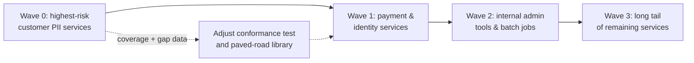

# Audit Logging — Professional

<!-- level-focus -->
At professional level, focus on this question:

> How do you run an audit-logging program across dozens of independently-owned services so that "prove who accessed record X" stays answerable within days, without a central team hand-holding every new service?

Use the smallest realistic scenario that exposes the decision and its failure behavior.

## The organizational problem, not the technical one

By the time an organization has more than a handful of services touching classified data, privacy audit logging stops being a technical pattern you implement once and becomes an **operating model** you have to sustain across teams that don't report to each other, ship on independent schedules, and have every incentive to prioritize their own roadmap over a compliance control they didn't ask for. A design that requires a central team to review every new service before launch does not scale past a few teams; a design that assumes every team will independently do the right thing does not survive contact with deadline pressure. The professional-level problem is building an operating model that gets both coverage and speed, with the coordination cost living in the contract, not in a person.

## Ownership split: platform paved road, team-level instrumentation

The architecture that scales is a clean split of responsibility, matched to who can actually verify what:

| Responsibility | Owner | Why this owner |
|---|---|---|
| Audit event schema (the contract) | Central privacy/platform team | A shared contract only works if one team can evolve it without every consumer renegotiating |
| Audit storage, retention enforcement, immutability guarantees | Central platform team | These require infrastructure-level guarantees (WORM storage, permission lockdown) that are wasteful to reimplement per team |
| Instrumenting each service's own access points | The service-owning team | Only the team that owns the code knows every place classified data is actually read or written |
| Conformance to the schema (CI check) | The service-owning team, enforced by a shared test suite the platform team publishes | Makes "did we do this correctly" self-serve and checkable before merge, not after an audit finding |
| Reconciliation and coverage monitoring | Central platform team | Coverage across dozens of services is a cross-cutting signal no single team can see |

This mirrors how a paved road works for other cross-cutting concerns like build tooling or service mesh: the platform team builds a library and a conformance test, publishes it once, and every service team adopts it against a stable contract instead of a person reviewing their design.

## The contract that makes limited coordination possible

The single artifact that lets teams move independently is a **versioned audit event schema published as a contract**, with a runnable conformance test rather than a document:

- The schema defines required fields (`event_id`, `occurred_at`, `actor_id`, `subject_id`, `action`, `justification`, `outcome`) and is additive-only — existing fields never change meaning or get removed, only new optional fields are added.
- A conformance test suite, provided as a library any team can pull into their CI pipeline, asserts that a given service's audit events satisfy the schema and that a sample classified-data access actually produces one. This turns "did we implement audit logging correctly" from a design-review question into a CI gate any team can run without asking the platform team anything.
- Backward compatibility is the platform team's obligation to the rest of the org — they can add fields and capabilities, but a service that only emits last year's required fields must keep passing conformance, or the whole paved road stops being adoptable at each team's own pace.

## Decomposing the rollout into reversible, observable increments

A program covering dozens of services cannot be a single migration. It has to be sequenced so each step produces evidence before the next one is funded:

Each wave is reversible in the sense that a team can adopt the paved-road library and, if it breaks something, roll back to their prior instrumentation without blocking other teams — coupling is at the contract level, not at deploy time. Each wave is observable because coverage is a measurable percentage, not a checkbox: "12 of 40 services now pass the conformance suite" is a number leadership can track, unlike "teams have been asked to add audit logging."

## Governance: connecting technical controls to compliance requirements

A compliance auditor does not ask "do you have audit logging" — they ask for evidence mapped to a specific control. Maintain that mapping explicitly, not implicitly in someone's head:

| Compliance requirement | Technical control | Evidence produced |
|---|---|---|
| SOC 2 CC6/CC7 — logical access is monitored | Audit event on every classified-data access, immutable storage | Query result for any subject over any date range, retrievable within the SLA |
| HIPAA audit-trail requirement (access to PHI) | Same conformance-tested schema, applied to services touching health data | Coverage report showing 100% of PHI-touching services pass conformance |
| GDPR right-to-erasure vs. audit retention | Audit rows keyed by opaque subject ID, PII fields not duplicated into audit events | A demonstrable erasure that removes PII while the audit trail of the erasure itself remains queryable |
| Retention requirement (data kept N years) | Automated retention check on the audit store, independent of application-level retention | Automated report confirming no audit record was deleted before its retention floor |

This table is itself a governance artifact — the thing you hand an auditor, and the thing that tells you which technical work actually matters versus which is nice-to-have.

## Operational risk: the audit pipeline becomes critical-path infrastructure

Once dozens of services depend on the same audit-writing path, that path's availability becomes everyone's availability problem. This has to be owned with the same rigor as any other shared dependency:

- **SLOs for the audit ingestion pipeline** (e.g., events durably accepted within a defined latency, backlog processed within a defined window) owned by the platform team, with on-call rotation like any other production service — not an afterthought batch job.
- **A published incident playbook** for "audit ingestion is degraded," including whether consuming services should fail open with a durable local outbox or fail closed, decided per data sensitivity tier rather than left to each team's judgment during an actual incident.
- **Capacity planning** tied to onboarding waves — bringing 15 new services onto the paved road in a quarter is a load-planning input for the shared audit store, not a surprise.

## Outcome measures and exit conditions

Sustained delivery needs measures that are checked continuously, not a single "we're done" milestone:

| Measure | What it tells you | Target used as an exit condition |
|---|---|---|
| Conformance coverage | % of services touching classified data passing the conformance suite | 100% for Wave 0/1 services before Wave 2 funding is approved |
| Reconciliation gap rate | % of gateway-observed classified-data requests with no matching audit event | Below an agreed threshold (e.g., under 0.1%) sustained over a trailing 30-day window |
| Time-to-answer | Time from a compliance/legal request for "who accessed subject X" to a delivered, correct answer | Days, not weeks — tracked per request, reviewed quarterly |
| Retention compliance | % of audit records confirmed retained for their required period by an automated check | 100%, verified automatically, not by manual spot check |

The exit condition for the whole program is not "every service has been migrated" as a one-time event — it's these measures holding steady over a sustained trailing window, because a program that hits 100% coverage once and then silently regresses as new services launch has not actually solved the organizational problem.

## Cross-team accountability without a central bottleneck

The mechanism that keeps this from requiring a human gatekeeper on every launch: make the conformance test a **release gate owned by CI**, not by a person. A service cannot ship a new endpoint that reads a field marked classified without its pipeline running the conformance suite and passing. This pushes accountability to exactly the team that can fix a gap (the service owner) at exactly the moment it's cheapest to fix (before merge), while the platform team's job shifts from reviewing every service to maintaining the gate itself and watching the aggregate coverage and reconciliation numbers.

When a team resists — deadline pressure, "we'll add it next quarter" — the escalation path should already exist and be known in advance: missing conformance on a service handling classified data is a compliance risk item tracked the same way a security vulnerability would be, with an owner, a severity, and a review cadence, not a informal ask that quietly expires.

## Scenario: sustained delivery across two quarters

An organization has 40 services touching customer PII, none currently passing a common conformance bar. The program is not "write the schema, then migrate everyone" — it runs as continuous delivery:

1. **Quarter 1, Wave 0–1:** the platform team ships the schema and conformance library, and pairs directly with the 8 highest-risk teams (payments, identity, customer profile) to onboard them, discovering real gaps in the contract itself — a schema field that turns out to be missing gets added additively, not redesigned.
2. **Between waves:** coverage and reconciliation-gap numbers from Wave 0/1 are reviewed before Wave 2 is funded — if the reconciliation gap rate is still high, that's evidence the contract or the library needs another iteration before asking 15 more teams to adopt it.
3. **Quarter 2, Wave 2–3:** the remaining teams self-serve against a now-proven paved road, with the platform team's role reduced to monitoring the release-gate metrics and handling exceptions, not hand-holding each integration.
4. **Ongoing:** the four outcome measures are reviewed quarterly for as long as the audit-logging program exists, because new services launch continuously and the exit condition is sustained health, not a single finish line.

## Apply it

1. Define the measurable outcome this program improves for your organization (e.g., time-to-answer for compliance requests, or conformance coverage across classified-data services).
2. Assign one owner for the schema/contract, one owner per service for instrumentation, and one owner for the shared audit pipeline's operations and incidents.
3. Split the rollout into waves by risk, starting with the services most likely to receive a real compliance request, and define what evidence each wave must produce before the next is funded.
4. Publish the conformance test suite, the compliance-control mapping table, and the escalation path for teams that miss the gate.
5. Decide, in advance and per data-sensitivity tier, whether the shared audit pipeline's degradation makes dependent services fail open or fail closed.

## Verify your work

- Each wave has a named owner, a rollback path if the paved-road library breaks a service, and a measurable exit condition before the next wave starts.
- Conformance coverage, reconciliation gap rate, time-to-answer, and retention compliance are tracked on a recurring cadence, not measured once.
- A simulated compliance request and a simulated audit-pipeline incident both exercise the documented playbooks and produce the expected outcome.
- A service that fails the conformance gate is blocked from shipping the offending change until it passes, without requiring a person to notice and intervene manually.

## Review questions

- Which measurable outcome would tell you this audit-logging program is actually working, versus merely rolled out?
- What decision moved from "a person reviews this" to "CI enforces this," and why does that change matter for scaling past a handful of teams?
- Which reversible increment in the rollout would surface a bad contract decision before it was forced onto 40 services?
- What evidence would convince you the program can be sustained with limited coordination, rather than requiring a central team indefinitely?
