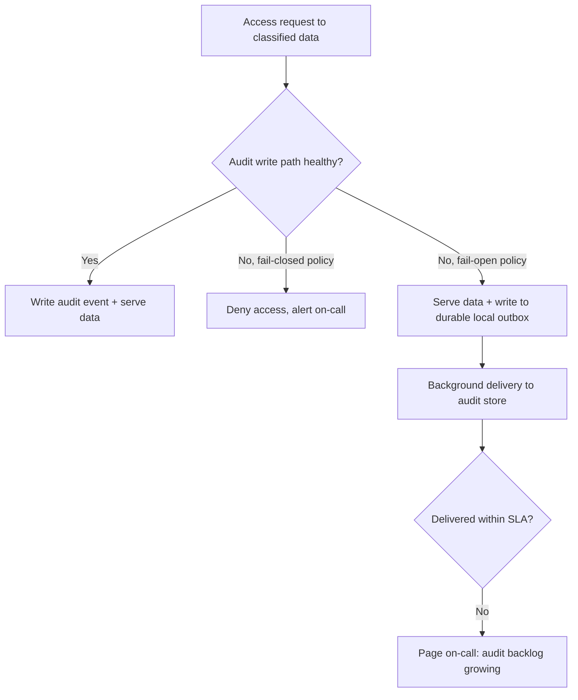

# Audit Logging — Senior

<!-- level-focus -->
At senior level, focus on this question:

> If the audit-logging pipeline itself is degraded or unreachable, should access to classified data fail closed or fail open — and what evidence would prove your choice holds under real load and partial failure?

Use the smallest realistic scenario that exposes the decision and its failure behavior.

## The invariant the whole system exists to protect

Strip away the schemas and the tables, and privacy audit logging exists to protect exactly one invariant:

> Every access to classified personal data has a corresponding, tamper-evident record — and that record cannot be silently lost, altered, or made to disappear without detection.

Everything a senior engineer does with this topic is either defending that invariant directly or deciding what happens when defending it collides with something else the system also needs — availability, latency, or the data subject's own right to be forgotten. The interesting engineering is entirely in those collisions.

## Failure mode 1: the audit sink is unavailable

The first hard question: a support agent requests a customer's profile, and the service that writes audit events is down, slow, or unreachable. Two designs are both defensible, and the difference is which invariant you are willing to weaken.

**Fail closed.** Refuse the data access if the audit write cannot be confirmed. This protects the audit invariant absolutely — no access is ever unrecorded — at the cost of making the audit pipeline's availability a hard dependency of every feature that touches classified data. A blip in the audit store now takes down customer support.

**Fail open with guaranteed backfill.** Allow the access, but write the audit event through a durable local buffer (an outbox table, a local disk queue) that is guaranteed to eventually deliver to the audit store, and treat "audit event pending" as an operational alert, not a silent gap. This protects availability, and the invariant becomes "every access is recorded, possibly with bounded delay" rather than "every access is recorded synchronously."

Neither answer is universally right. The evidence that should decide it: what does your compliance obligation actually require — real-time completeness, or completeness within a bounded, provable window? SOC 2 and HIPAA audit-trail requirements are generally satisfied by "the record exists and is complete," not by "the record was written within the same millisecond as the access." That reframes the choice: fail-open-with-guaranteed-delivery is usually acceptable *if and only if* you can prove the outbox cannot silently drop events under the failure modes you actually expect (process crash mid-write, disk full, network partition to the audit store lasting hours). If you cannot prove that, fail-closed is the honest choice, and the real fix is making the audit pipeline itself highly available rather than routing around its unavailability.



## Failure mode 2: gaps you don't know about

The more dangerous failure is not the outage you get paged for — it's the access path that quietly never emitted an event in the first place, because a refactor dropped the call, a new endpoint shipped without instrumentation, or a raw database credential was handed to a data science notebook. This is a silent invariant violation: the system looks healthy, dashboards are green, and the audit trail is simply incomplete.

The senior-level answer is **reconciliation as a standing control, not a one-time audit**. Instrument access at two independent layers that cannot both fail the same way — for example, a network-level or gateway-level record of every request that touched a classified route, and the application-level audit event with full context (actor, subject, justification). Periodically compare the two: every request seen at the gateway should have a matching application-level audit event. A gap means either an uninstrumented code path (fix the code) or an access that bypassed the gateway entirely (a bigger problem — investigate how).

This is the same idea as a bank reconciling two independently-maintained ledgers rather than trusting one ledger's self-report. The gateway log and the application audit log should never be produced by the same code path, or a single bug takes out both simultaneously and the reconciliation catches nothing.

## Tamper-evidence: hash chaining

Immutability (no `UPDATE`/`DELETE` grants) stops casual tampering, but it relies entirely on database permissions being correctly configured and never changed. A senior design should not depend solely on "we trust the permission settings were never touched" — it should make tampering *detectable* even by someone with elevated access, such as a database administrator or an attacker who compromised admin credentials.

**Hash chaining** does this cheaply: each audit event's stored hash includes the hash of the previous event.

```
entry_hash[n] = SHA256( entry_hash[n-1] || event_fields[n] )
```

| event_id | occurred_at | ... fields ... | prev_hash | entry_hash |
|---|---|---|---|---|
| evt_1001 | 2026-05-14T09:12:03Z | actor=agent_4471, action=VIEW, subject=cust_882931 | `GENESIS` | `a3f9...` |
| evt_1002 | 2026-05-14T09:15:41Z | actor=agent_2290, action=EXPORT, subject=cust_882931 | `a3f9...` | `b71c...` |
| evt_1003 | 2026-05-14T09:20:02Z | actor=agent_4471, action=VIEW, subject=cust_774002 | `b71c...` | `d802...` |

If any historical row is edited or deleted, every subsequent `entry_hash` fails to recompute — the chain breaks at exactly the point of tampering, and verification is a linear scan that recomputes and compares hashes. Periodically publishing the latest `entry_hash` to a separate, independently-controlled system (a different team's store, a write-once object storage bucket, or an external timestamping service) means even someone who can rewrite the entire audit table cannot make their rewrite match a hash that was already published elsewhere. This is the same principle WORM (write-once-read-many) storage classes provide at the infrastructure layer; hash chaining provides it at the data layer, and combining both is stronger than either alone.

## Evolution: the audit schema will change, the trail must not break

The audit event schema from the junior and middle levels will not survive unchanged. New classified fields get added, new action types appear (a "bulk anonymize" action didn't exist last year), and retention requirements shift. The invariant that must hold across schema evolution: **a query for "who accessed subject X in year Y" must return correct results whether Y is last month or three years ago**, even though the schema in year Y-3 didn't have a field the current schema relies on.

The practical approach is additive-only evolution: new fields are added with defined defaults for historical rows, action types are extended rather than renamed, and the query layer is versioned or written defensively against missing fields — never assume every historical row has every current field. Treat the audit schema itself as a public contract with unusually long-lived consumers (auditors reading three-year-old records), which means breaking changes are effectively never acceptable; only additions are.

## The right-to-be-forgotten tension

Here is the collision that catches teams off guard: a data subject exercises their right to erasure under GDPR, and the customer's profile is deleted or anonymized. Does the audit trail referencing that customer get deleted too?

No — and this is a real invariant conflict that needs to be designed for explicitly, not discovered during an incident. The audit trail's job is to prove *what happened*, including the fact that the erasure itself happened, who performed it, and when. If erasing the subject also erased the record of the erasure, you would have destroyed the exact evidence a future audit needs to confirm the erasure was performed correctly and on time.

The resolution is to design the audit trail to reference subjects by a stable identifier that does not itself carry erasable PII — the `subject_id` in every example so far has been an opaque customer ID, never an email address or name. Erasing the underlying profile removes the PII from the system of record; the audit trail continues to show "actor X performed a DELETE on subject `cust_882931` on date D," which is compliance evidence, not a copy of the erased personal data. This is why junior-level guidance to "never store the actual PII value in the audit log, only field names and identifiers" is not a minor hygiene tip — it is what makes the audit trail and the right to erasure compatible instead of contradictory.

## Recovery: restoring from backup without falsifying the trail

A subtler failure: the primary customer database is restored from a backup taken before some accesses occurred. The restored data no longer reflects some of the changes the audit trail says happened. The invariant to protect here is that the **audit trail is the higher-authority record of history** — it should never be "corrected" to match a restored database; instead, the restoration event itself should be audited (who restored, from what backup, why), and any discrepancy between the restored data and the audit trail's account of prior changes should surface as an alert, not be quietly reconciled away. Treating the audit trail as subordinate to whatever the live database currently says inverts its entire purpose.

## Trade-offs among plausible approaches, summarized

| Decision | Option A | Option B | What tips the choice |
|---|---|---|---|
| Sink unavailable | Fail closed | Fail open + durable outbox | Whether you can prove the outbox never silently drops events |
| Tamper resistance | Rely on DB permissions only | Hash chain + external anchor | Whether an insider or compromised admin is in your threat model |
| Detecting silent gaps | Trust single instrumentation point | Reconcile two independent layers | Whether a single bug can plausibly take out your only audit path |
| Schema change | Modify fields in place | Additive-only, versioned schema | Whether historical queries must remain correct years later |
| Erasure conflict | Delete audit rows referencing erased subject | Keep audit rows keyed by opaque ID, erase only the PII copy | Whether you can prove erasure happened without destroying the proof |

## Questions that expose weak assumptions before implementation

Before committing to a design, force answers to these — vague answers here predict production incidents later:

- "What happens to access during a 10-minute audit-store outage?" If the answer is "we haven't decided," that is a fail-open-by-accident, the worst of both options.
- "How would we know if a code path stopped emitting audit events six months ago?" If the answer relies on someone noticing, you have no reconciliation control.
- "Can someone with database admin access silently edit an audit row?" If yes, immutability is a policy, not a guarantee.
- "If this customer is erased under GDPR, what happens to the rows referencing them?" If the honest answer is "we'd have to check," the schema was not designed with this collision in mind.

## Apply it

1. State the invariant your audit pipeline must protect (completeness, tamper-evidence, or both) and write it down in one sentence.
2. Pick a real or simulated access path and identify exactly what happens to it when the audit sink is unreachable — trace the current code, don't guess.
3. Compare fail-open-with-outbox against fail-closed for that path, and decide which one your current implementation actually behaves as (it may not be the one anyone intended).
4. Design or sketch a hash-chain field for your audit schema and confirm by hand that editing one historical row breaks verification for every row after it.
5. Run a focused experiment: kill the audit sink for one access attempt and observe whether the system behaves the way your policy says it should.

## Verify your work

- The experiment shows the actual fail-open or fail-closed behavior under a real (or simulated) sink outage, not the assumed behavior.
- Recomputing the hash chain over a deliberately-edited historical row detects the tampering at the correct point.
- A reconciliation pass between two independent instrumentation layers surfaces at least one real or planted gap.
- A simulated right-to-erasure request removes PII while leaving a verifiable, queryable audit trail of the erasure itself.

## Review questions

- Which invariant does your audit pipeline actually protect today: real-time completeness, or completeness within a bounded and provable delay?
- What would have to be true for a fail-open design with a durable outbox to be as trustworthy as fail-closed?
- How does hash chaining change what an attacker with database admin access can get away with?
- Why must the audit trail survive a data subject's right-to-erasure request even though the underlying PII does not?
