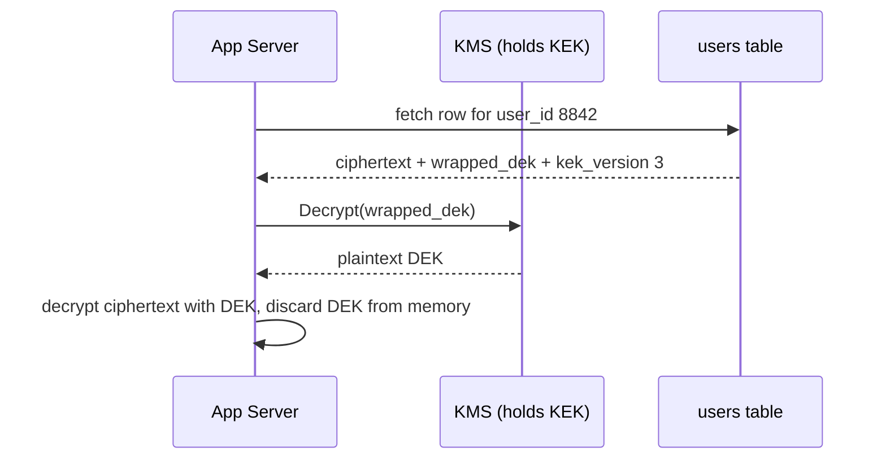

# Encryption Key Lifecycle — Junior

<!-- level-focus -->
At junior level, focus on this question:

> Given a small system that stores per-user data encrypted with a per-user data-encryption-key wrapped by a shared master key in a KMS, can you correctly generate, wrap, rotate, and crypto-shred one user's key without touching any other user's key or any ciphertext at rest?

Use the smallest realistic scenario that exposes the decision and its failure behavior.

> **Roadmap:** [Data Privacy](../README.md) → Encryption Key Lifecycle

*Encrypting data is the easy part. The hard part — and the part this topic is about — is everything that happens to the **key** afterward: where it's generated, how it's protected, when it gets replaced, and what happens the day someone asks you to make one specific user's data permanently unreadable.*

---

## Core Concept 1 — Vocabulary: DEK, KEK, and Envelope Encryption

Four terms you'll use constantly:

- **DEK (Data Encryption Key)** — the key that actually encrypts your data (a row, a file, a user's record). It's a plain symmetric key, usually AES-256.
- **KEK (Key Encryption Key)** — a key whose only job is to encrypt *other keys*, not data. A KEK lives in a KMS or HSM and almost never touches your application's data directly.
- **Envelope encryption** — the pattern of encrypting data with a DEK, then encrypting (*wrapping*) that DEK with a KEK, so the plaintext DEK never has to be written to disk — only the wrapped (encrypted) DEK is stored, next to the ciphertext it protects. This topic assumes you understand this pattern at a basic level; for the full cryptographic mechanics — why wrapping instead of using the KEK on data directly, how authenticated encryption works, how a KMS API call is shaped — see [Envelope Encryption and KMS](../../security-at-scale/14-envelope-encryption-and-kms/README.md). Here, the focus is different: not *how the wrapping works*, but *what has to happen to that key over its lifetime* — generation, rotation, and destruction as an erasure technique.
- **KMS (Key Management Service)** — a managed service (cloud provider or self-hosted) that generates, stores, and uses KEKs, backed by an **HSM (Hardware Security Module)** — tamper-resistant hardware that never lets a raw key leave it in plaintext. Your application asks the KMS to "wrap this DEK" or "unwrap this DEK"; it never asks for the KEK itself.

## Core Concept 2 — A Repeatable Method for One Key's Lifecycle

For any piece of classified data (see [PII and Data Classification](../01-pii-and-data-classification/README.md)), apply this sequence:

1. **Generate** a DEK for the smallest unit of data you might need to erase independently — usually one user, sometimes one record.
2. **Encrypt** the data with that DEK (AES-256-GCM is the standard default).
3. **Wrap** the DEK by calling the KMS's `Encrypt` operation with your KEK — the KMS returns a wrapped (ciphertext) DEK. Discard the plaintext DEK from memory immediately after use.
4. **Store** the wrapped DEK alongside the ciphertext it protects (same row, same object metadata) — never the plaintext DEK, ever.
5. **Decrypt** later by calling the KMS's `Decrypt` operation on the wrapped DEK (the KMS unwraps it using the KEK), then use the returned plaintext DEK to decrypt the data.
6. **Rotate** the KEK on a schedule (commonly annual, sometimes shorter for regulated data) — this re-wraps existing DEKs under a new KEK version without touching the underlying ciphertext at all.
7. **Retire** a key when its data is deleted: destroy the DEK, not the KEK. This step is called **crypto-shredding** and is covered in Concept 4.

## Core Concept 3 — Worked Example: Reading One User's Profile

A small app stores each user's profile encrypted with its own DEK, wrapped by one shared org-level KEK held in a cloud KMS.

```yaml
# users table, illustrative row
user_id: 8842
ciphertext: "a1F9...==="              # profile data, encrypted with this user's DEK
wrapped_dek: "AQICAHi7z...=="         # this user's DEK, wrapped by the org KEK
kek_version: 3                        # which KEK version wrapped it
```

Reading the profile back:



The KMS never sees the profile data — only the wrapped DEK. The app never sees the KEK — only a plaintext DEK, held in memory for the shortest possible time.

## Core Concept 4 — Crypto-Shredding: Destroying the Key, Not the Data

When user 8842 asks to be forgotten (see [GDPR and Right to Be Forgotten](../02-gdpr-and-right-to-be-forgotten/README.md)), the fastest and most reliable way to make their data permanently unreadable is not to hunt down and delete every copy of their ciphertext across a database, its backups, and a data warehouse. It's to **destroy their DEK**.

```text
Before erasure:
  ciphertext:   a1F9...===          (unchanged, still on disk)
  wrapped_dek:  AQICAHi7z...==      (still on disk)
  -> App can call KMS.Decrypt(wrapped_dek) -> gets plaintext DEK -> reads profile

After crypto-shred (destroying the DEK, e.g. KMS.ScheduleKeyDeletion on it):
  ciphertext:   a1F9...===          (byte-for-byte unchanged, still on disk)
  wrapped_dek:  AQICAHi7z...==      (byte-for-byte unchanged, still on disk)
  -> App calls KMS.Decrypt(wrapped_dek) -> KMS returns an error: key does not exist
  -> The ciphertext is now permanently unreadable, forever, without deleting a single byte of it
```

This is the entire point of per-user DEKs: **the ciphertext never has to be touched.** A backup taken last night, a replica in another datacenter, a row cached somewhere — all of them become simultaneously and permanently unreadable the moment the one small DEK is destroyed, because none of them can be decrypted without it. This is why crypto-shredding is recognized as a valid technique for satisfying an erasure request even when literally deleting every physical copy of the ciphertext would be impractical or impossible.

## Core Concept 5 — When a Key's Lifecycle Setup Is Correct

Before moving on, confirm all of these are true for your setup:

1. **Every unit of data you might need to erase independently has its own DEK.** If two users share one DEK, you cannot crypto-shred one without breaking the other.
2. **No plaintext DEK is ever written to disk, logs, or a long-lived cache.** Only the wrapped form is persisted.
3. **The KEK has a rotation schedule**, and rotating it re-wraps DEKs without requiring you to re-encrypt any actual data.
4. **You have actually tested destroying one DEK** and confirmed both that its data becomes unreadable and that no other user's data is affected.
5. **You know the difference between destroying a DEK (erases one unit of data) and destroying a KEK (erases *every* DEK it ever wrapped — catastrophic, almost never what you want).**

## Common Mistakes

- **Storing the plaintext DEK next to the ciphertext.** This defeats the entire purpose of wrapping — anyone with database access can now decrypt everything without ever touching the KMS.
- **Using one shared DEK for every user.** This makes per-user crypto-shredding impossible; deleting the one shared key erases everyone's data, not just one person's.
- **Deleting the KEK instead of the DEK when asked to erase one user.** The KEK protects potentially thousands of DEKs; destroying it is an outage, not a targeted erasure.
- **Treating "key rotation" and "data re-encryption" as the same operation.** Rotating a KEK only re-wraps DEKs — it's cheap and doesn't touch the actual ciphertext. Confusing the two leads either to unnecessary, expensive re-encryption jobs, or to skipping rotation because it's wrongly assumed to be expensive.
- **Never testing the deletion path.** A crypto-shred flow that has never actually been exercised is a compliance promise nobody has verified.

---

## Apply it

1. Write a small script (any language) that generates two "users," each with a random 32-byte DEK, and encrypts a short string of profile data for each with AES-256-GCM.
2. Simulate a KMS with two functions, `wrap(dek, kek)` and `unwrap(wrapped_dek, kek)`, using a single hardcoded "KEK" byte string, and store each user's wrapped DEK next to their ciphertext — never the plaintext DEK.
3. Write a `decrypt_user(user_id)` function that unwraps the DEK via your KEK, decrypts the ciphertext, and prints the result. Run it for both users to confirm both work.
4. Simulate crypto-shredding user A: delete only user A's wrapped DEK (or mark it destroyed in your mock KMS so `unwrap` fails for it). Confirm `decrypt_user("A")` now fails with a clear error, while `decrypt_user("B")` still succeeds and user B's ciphertext was never touched.
5. Print user A's ciphertext bytes before and after the shred and confirm they are byte-for-byte identical — the data itself was never modified, only the key was destroyed.

## Verify your work

- User A's data is unreadable after the shred, and the error is a clear "key not found" style failure, not a silent wrong-plaintext result.
- User B's decryption still works, unmodified, proving the blast radius of the deletion was exactly one user.
- User A's ciphertext bytes are identical before and after the shred — you can prove this by comparing them directly.
- You can explain, in one sentence, why destroying the KEK instead of user A's DEK would have been the wrong operation.

## Review questions

- What is the difference between a DEK and a KEK, and why does only one of them ever touch your application's data directly?
- Why does rotating a KEK not require re-encrypting the underlying data?
- Why is crypto-shredding considered a valid erasure technique even when a backup of the ciphertext still physically exists?
- What goes wrong if two different users' data is encrypted under the same shared DEK?
