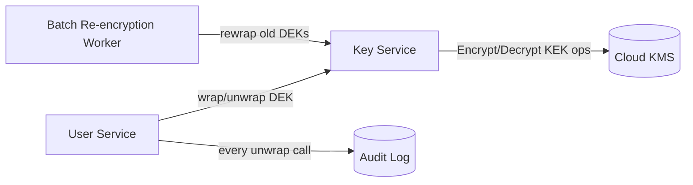

# Encryption Key Lifecycle — Middle

<!-- level-focus -->
At middle level, focus on this question:

> When multiple services and several derived copies of the same data all need to decrypt it, which key granularity and rotation boundary keeps blast radius, crypto-shred guarantees, and operational cost in balance as the system grows?

Use the smallest realistic scenario that exposes the decision and its failure behavior.

> **Roadmap:** [Data Privacy](../README.md) → Encryption Key Lifecycle

*A junior-level setup has one service, one database, and one clean per-user DEK. The moment a second service reads the same data, or a batch job copies it into a warehouse, "one key per user" stops being a design decision you made once — it becomes a boundary you have to actively defend against every new consumer.*

---

## Core Concept 1 — Choosing the Right Key Granularity

There is no single correct granularity for a DEK — only trade-offs between blast radius, crypto-shred precision, and operational cost:

| Granularity | Blast radius of one key's compromise | Crypto-shred precision | Operational cost (keys to manage, KMS calls) |
|---|---|---|---|
| **One key for the whole database** | Catastrophic — every user | None — cannot erase one user without erasing all | Lowest — one key, rotated occasionally |
| **One key per tenant** | Bounded to one tenant's users | Coarse — can erase a tenant, not one user inside it | Low — hundreds of keys, not millions |
| **One key per user** | Bounded to one user | Exact — matches most erasure requests directly | Moderate — one key per user, more KMS calls on read |
| **One key per record** | Bounded to one record | Finer than most erasure requirements ever need | High — often unjustifiable unless records are erased individually far more often than users are |

The middle-level judgment: **match the granularity to the smallest unit you will actually be asked to erase.** Most erasure requests target a whole user, not a single record, so per-record DEKs usually buy precision nobody needs at a real operational cost. Per-tenant DEKs, conversely, under-deliver the moment a single user inside a multi-user tenant asks to be forgotten and the rest of the tenant's data must survive.

## Core Concept 2 — Rotation Boundaries: What Actually Gets Re-Encrypted

Two operations get conflated constantly, and they have wildly different costs:

- **Rotating a KEK** — generate a new KEK version, then re-wrap existing DEKs under it. This never touches the underlying data ciphertext. It's a KMS-side operation, cheap even at scale, and can usually run as a background job with no application changes.
- **Rotating a DEK** — generate a new DEK for a unit of data and re-encrypt that data with it. This *does* touch the ciphertext, and at scale is a real, potentially slow, resource-consuming job.

Because of this asymmetry, most systems rotate KEKs far more often than DEKs. A workable policy:

```yaml
key_policy:
  root_kek:
    rotation: automatic-annual        # KMS-managed, re-wraps every DEK it protects
  per_tenant_kek:                     # optional middle layer, see Concept 5
    rotation_days: 180
  per_user_dek:
    rotation: on_write_only           # a new DEK is only generated when a user's data is fully rewritten
    forced_rotation_after_days: 730   # background job re-encrypts data untouched for 2 years
```

**Key versioning** is what makes this survivable: every wrapped DEK is stored with the KEK version that wrapped it, and every ciphertext is implicitly tied to the DEK version that encrypted it. A read path that supports "decrypt using whichever version protected this specific row" lets old data keep working through a rotation instead of requiring a flag-day re-encryption of the entire dataset.

## Core Concept 3 — A Cross-Component Scenario

A multi-tenant SaaS platform has:

- a **user-service** that writes and reads per-user encrypted profile data,
- a **key-service** — a thin wrapper around the KMS that owns KEK rotation policy and exposes `wrap`/`unwrap`/`destroy` to other services,
- a **batch re-encryption worker** that walks old data forward to newer DEK/KEK versions on a schedule,
- an **audit log** (see [Audit Logging](../04-audit-logging/README.md)) that records every unwrap call: which service, which key ID, when.



When a user asks to be forgotten, the request goes to the key-service, not the user-service: the key-service calls `destroy(dek_id)` on the KMS, logs the destruction event to the audit log with a timestamp, and the user-service's next read for that user fails cleanly because `unwrap` now errors. The user-service does not need its own erasure logic at all — it only needs to handle "unwrap failed" as an expected, user-facing "this account no longer exists" case rather than a crash.

## Core Concept 4 — Testability and Debuggability

- **Unit level.** Test the `wrap`/`unwrap` functions against a local KMS emulator (most cloud KMS SDKs ship a local or test mode) with known inputs, confirming a destroyed key ID reliably produces a specific, catchable error rather than a generic exception.
- **Integrated-flow level.** Write data, rotate the KEK, confirm the data still decrypts (proves rotation didn't break reads). Then destroy one user's DEK and confirm exactly that user's read fails while a second user's read succeeds — this is the same "blast radius of exactly one" check from the junior level, now run against the real key-service and a real (or emulated) KMS instead of a hand-rolled script.

```python
# Integrated-flow check: rotation must not break existing reads.
def test_kek_rotation_preserves_existing_reads():
    user = create_user_with_encrypted_profile("alice")
    before = read_profile(user.id)
    key_service.rotate_kek()                 # generates new KEK version, rewraps DEKs
    after = read_profile(user.id)
    assert before == after                   # same plaintext, no re-encryption needed
    assert user.wrapped_dek_kek_version_after > user.wrapped_dek_kek_version_before
```

A test like this catches the most common rotation bug: a rotation job that updates the KEK but forgets to re-wrap one class of DEKs, which then fail to decrypt the next time they're read — often not discovered until the affected user's next login, well after the rotation "succeeded."

## Core Concept 5 — Under- and Over-Application Signals

**Under-application** shows up as: a single shared DEK for an entire table (no per-user crypto-shred possible at all), a KEK that has never been rotated because "nothing forces it," or a key-service with no `destroy` operation at all — erasure requests are handled by manually deleting rows instead, which does nothing for backups or replicas.

**Over-application** shows up as: generating a new DEK on every write instead of only when data is meaningfully rewritten (churns key count for no benefit), a four-layer key hierarchy (root -> region KEK -> tenant KEK -> per-field DEK) for a system with no regulatory reason to isolate at the field level, or rotating KEKs weekly when nothing downstream consumes that frequency and it only adds audit noise.

**Incremental adoption**, for a system currently on one shared key: (1) introduce the key-service as a wrapper even before changing granularity, so callers go through one interface; (2) migrate the highest-erasure-volume tenant or data class to per-user DEKs first — this is usually the data under active legal deletion deadlines; (3) add the background re-encryption worker once per-user DEKs exist somewhere to re-encrypt; (4) only then decide whether a per-tenant KEK layer is worth the added hierarchy for isolation or residency reasons (see [Data Residency](../03-data-residency/README.md) and [Envelope Encryption and KMS](../../security-at-scale/14-envelope-encryption-and-kms/README.md) for the deeper mechanics of that middle layer).

## Common Mistakes

- **Treating KEK rotation and DEK rotation as equally expensive**, either avoiding KEK rotation out of unfounded fear of a big re-encryption job, or scheduling full DEK re-encryption far more often than any policy actually requires.
- **Building a key-service with no audit trail on unwrap calls**, so a rotation bug or a suspicious access pattern has no evidence trail to investigate.
- **Letting each service call the KMS directly** instead of through a shared key-service, so rotation policy, destroy semantics, and audit logging all have to be reimplemented and kept consistent per service.
- **Choosing per-record DEKs by default** without checking whether the actual erasure unit (usually a user) needs that precision.
- **Skipping the integrated-flow test for rotation**, catching a rewrap bug only when a real user's login fails in production.

---

## Apply it

1. Design a key granularity decision for a scenario: a multi-tenant B2B app where each tenant is a company with 50–500 individual employee users, and erasure requests can target either a whole tenant (contract termination) or a single employee (individual erasure request). State which granularity (per-tenant, per-user, or both layered) you'd choose and why.
2. Write the `key_policy` YAML (like Concept 2) for that scenario, including both a KEK rotation cadence and a DEK rotation/forced-re-encryption cadence, with a one-sentence justification for each number.
3. Sketch the cross-component flow (like Concept 3) for what happens when one employee at one tenant asks to be forgotten — name which component receives the request, which component calls `destroy`, and which component logs the event.
4. Write the integrated-flow test from Concept 4 for your own scenario: rotate the KEK, confirm an unrelated user's read is unaffected, then destroy one user's DEK and confirm only that user's read fails.
5. Identify one under-application and one over-application risk specific to your scenario, and state the concrete signal that would tell you which one you're at risk of.

## Verify your work

- Your chosen granularity is justified against the actual erasure unit described in the scenario (tenant-level vs individual), not chosen by default.
- Your rotation cadences distinguish KEK rotation (cheap, re-wrap only) from DEK rotation (expensive, re-encrypts data) with a stated reason for each interval.
- Your integrated-flow test demonstrates both that rotation preserves an unrelated user's read and that destroying one DEK produces a clean, catchable failure for exactly that user.
- Your under- and over-application signals are specific to this scenario's data (a shared employee dataset, individual erasure requests), not generic statements that would apply to any system.

## Review questions

- Why does rotating a KEK cost far less than rotating a DEK, and what does that asymmetry imply for how often each should happen?
- What does key versioning let a system do during a rotation that it couldn't do otherwise?
- Why should erasure requests be handled by a key-service's `destroy` operation rather than by each service deleting its own rows?
- What is one concrete signal that a system has chosen a DEK granularity that is finer than it actually needs?
