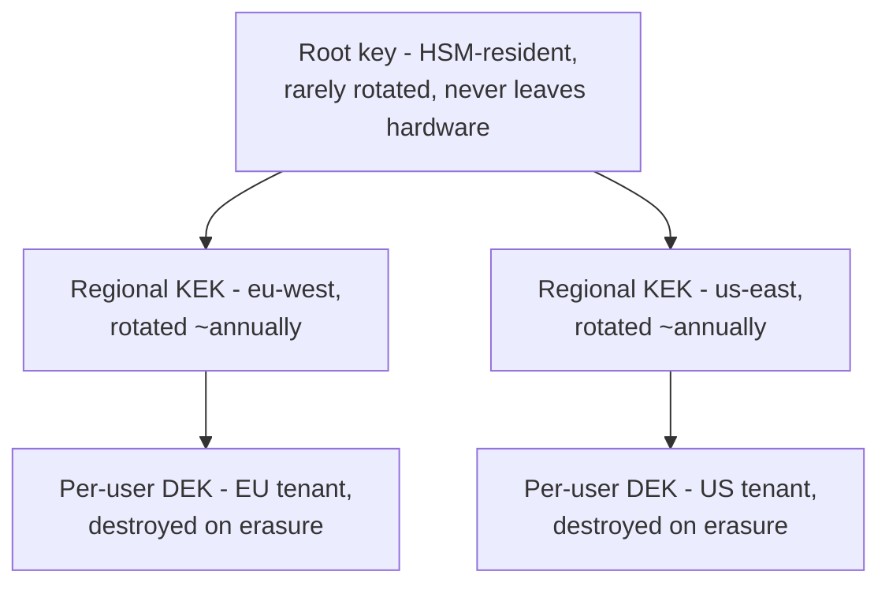

# Encryption Key Lifecycle — Senior

<!-- level-focus -->
At senior level, focus on this question:

> What invariant guarantees that destroying a data-encryption-key permanently and irrevocably erases access to its data across every replica, backup, and derived copy — and what evidence proves that invariant holds under KMS failure, backup restoration, and cross-region replication?

Use the smallest realistic scenario that exposes the decision and its failure behavior.

> **Roadmap:** [Data Privacy](../README.md) → Encryption Key Lifecycle

*A middle-level design gets one service's rotation and erasure path working correctly. A senior-level design has to keep that guarantee true across every backup, every replica, every derived copy, and every failure mode nobody has hit yet — because the moment it silently stops being true, an erasure request looks successful and isn't.*

---

## Core Concept 1 — Name the Invariant, Not the Mechanism

"We support crypto-shredding" describes a mechanism. It is not falsifiable on its own — you can point to a `destroy` API and call the box checked. The invariant that mechanism is supposed to guarantee has to be stated precisely enough that it can be checked against reality:

> *Once a DEK is destroyed, no process anywhere in the system — including a restored backup, a cross-region replica, or a derived analytics copy — can produce plaintext for the data it protected, ever again.*

This reframing matters because it exposes every place the guarantee can quietly fail: a backup taken before deletion that gets restored later, a replica in a second region that hasn't yet received the deletion event, a data warehouse table populated by change-data-capture that cached the plaintext before the key was destroyed. None of these show up if the design question stops at "does `destroy(dek_id)` return success" — they only show up when the question is "does the invariant hold against every path that could resurrect this data."

## Core Concept 2 — Key Hierarchy Sketch

A senior-level key hierarchy makes the invariant enforceable by construction rather than by convention:

Each layer exists to bound a different kind of blast radius: the root key never directly protects data, so its compromise (extremely unlikely, HSM-resident) requires re-wrapping every regional KEK rather than losing every DEK at once. A regional KEK is scoped to a region for two independent reasons that are easy to conflate: **isolation** (a KEK compromise in one region doesn't expose another region's data) and **residency** (a KEK protecting EU tenant data may itself be required to be generated, stored, and operated inside an EU KMS region — see [Data Residency](../data-residency/README.md) for why the *key's* location, not just the data's, can be in scope). The per-user DEK is the layer that actually gets destroyed on an erasure request; nothing above it should ever need to be touched for a single user's erasure.

## Core Concept 3 — Failure Modes That Break the Invariant

| Failure mode | How it breaks the invariant | Why it's easy to miss |
|---|---|---|
| **KMS/HSM unavailable** | Every read that needs to unwrap a DEK fails, system-wide, until KMS recovers — an availability failure, not a confidentiality one, but often discovered the same week as a rotation change and blamed on it | Availability of the *decrypt path* is a different property from confidentiality of the *data*, and teams often only design for the latter |
| **Backup restoration after deletion** | Restoring a backup taken *before* a DEK was destroyed brings back a wrapped DEK reference that, if the KMS key still technically exists in a "pending deletion" grace window, can still be unwrapped — silently resurrecting erased data | Backup/restore procedures are usually owned by a different team than the erasure workflow, and neither one tests the intersection |
| **Cross-region replica lag on deletion events** | A DEK is destroyed in the primary region, but a replica in a second region hasn't yet processed the deletion event and still serves reads using a cached wrapped DEK | Replication is designed for data availability, not for propagating negative events (deletions) with the same urgency as positive ones (writes) |
| **Derived copy caches plaintext, not the key** | An analytics pipeline or search index decrypts data once and stores the *plaintext* (not the wrapped DEK reference) in its own store, so destroying the source DEK does nothing to that copy | This one doesn't violate the crypto-shred mechanism at all — it bypasses it entirely, because the derived store never re-checks the key on every read |

The fourth row is the one most designs miss first: crypto-shredding only protects copies that **re-derive plaintext from the wrapped DEK on every access**. Any component that decrypts once and persists the plaintext downstream has silently opted out of the entire erasure guarantee, and no amount of KMS-side rigor fixes that — the fix has to be architectural (every consumer of classified data holds a reference, never a cached plaintext, or has its own independently enforced deletion path).

## Core Concept 4 — Recovery When a KEK Is Lost, Not Deleted Deliberately

Deliberate DEK destruction is the erasure mechanism working as intended. **Losing a KEK by accident** — corrupted KMS state, a misconfigured infrastructure migration, an operator error — is not erasure, it's an outage with no recovery path: every DEK that KEK ever wrapped becomes permanently unreadable, for every user, all at once. This is why KEKs need their own availability strategy, distinct from and sometimes in tension with the deliberate-deletion path for DEKs:

- **Multi-region KEK replication for availability** — but reconciled against residency constraints, so an EU-scoped KEK replicates only within compliant boundaries, not to an arbitrary "closest available" region.
- **A tested KEK recovery procedure.** Most managed KMS services support a deletion grace period (commonly some number of days) specifically because KEK loss is catastrophic and irreversible after that window; senior-level ownership means knowing that window's exact length and having verified, not assumed, that recovery within it actually works.
- **Treating "restore this KEK from backup" as a distinct, rehearsed runbook**, separate from the ordinary DEK-destruction erasure runbook — conflating the two procedures risks someone "restoring" a KEK that was deliberately destroyed as part of a real erasure, which would violate Concept 1's invariant in the other direction.

## Core Concept 5 — Evolution: Crypto-Agility

Algorithms and key sizes considered strong today will eventually need replacing — not on a fixed calendar, but the architecture has to support it without a flag-day migration. **Crypto-agility** means the system can run two algorithm or key-size generations side by side: existing wrapped DEKs keep decrypting under the algorithm that produced them, while new writes use the new one, and a background job (the same shape as the middle-level re-encryption worker, run over a longer horizon) migrates old data forward. The invariant this protects: a future algorithm transition should be a scheduled, observable migration, not an emergency rewrite discovered only when an auditor or a security review asks "what happens if this algorithm is deprecated."

## Core Concept 6 — Evidence That Validates the Design

A senior-level design earns trust through evidence, not preference:

- **A chaos test that disables KMS access** and confirms the system fails in the intended way (a clear, bounded read outage with a defined SLA) rather than an undefined one (partial decrypt failures, or worse, falling back to an unencrypted path).
- **A rehearsed deletion-then-restore test.** Destroy a DEK, restore the most recent backup of the row that referenced it, and confirm the restored row is still unreadable — this is the single test that most directly proves or disproves Concept 1's invariant against Concept 3's backup-restoration failure mode.
- **A replica-lag test.** Destroy a DEK, immediately query a secondary region, and measure how long a stale replica can still serve a readable result — if that window is longer than the erasure SLA promised to a user, the invariant is violated in practice even though the primary region behaved correctly.
- **An audit-log reconstruction.** Given only the audit trail (see [Audit Logging](../audit-logging/README.md)), can you answer "was this specific user's DEK actually destroyed, and when" without trusting a status flag in an application database that could itself be wrong?

## Core Concept 7 — Cross-Component Scenario and the Trade-off It Forces

A platform has per-user DEKs in its primary store, nightly backups, a cross-region replica for failover, and a CDC pipeline feeding an analytics warehouse. Two architectures for enforcing the invariant across all four:

| Approach | How erasure propagates | Trade-off |
|---|---|---|
| **A: Propagate the wrapped-DEK reference everywhere** | Every consumer (replica, warehouse row, cache) stores the *reference*, not plaintext, and re-unwraps on every read; destroying the DEK once makes every consumer's data unreadable automatically | Correct by construction, but requires disciplined enforcement across every team that builds a new consumer — one team that decrypts-and-caches plaintext breaks the guarantee silently |
| **B: Centralize all decryption behind one gateway** | No consumer talks to the KMS directly; every read for classified data goes through a single decrypt-gateway service, which is the only place that needs to check whether a key has been destroyed | The invariant is enforced in exactly one place, which is easier to audit and test — but that gateway is now a single point of failure and a latency/throughput bottleneck for every read of classified data platform-wide |

Neither approach is free: A distributes the correct behavior into every future consumer's hands and hopes discipline holds; B concentrates correctness into one component and pays for it in blast radius on that component's own availability. The senior-level judgment depends on what's more likely to actually happen — a platform with strong review discipline over new data consumers can sustain A; a platform onboarding many teams quickly, where a missed review is likely, is often safer defaulting to B even at the throughput cost.

## Core Concept 8 — Questions That Expose Weak Assumptions

- "When this DEK is destroyed, which of our derived copies re-check the key on every read, and which ones cached plaintext once?" — if the honest answer includes any cached-plaintext copy, the erasure guarantee is already false for that copy today, not just hypothetically.
- "Does our backup restoration path re-check DEK-deletion status before making a restored row's key available again?" — most restore runbooks are written to bring data *back*, not to preserve a deletion that happened after the backup was taken.
- "What's the actual propagation delay between destroying a DEK in the primary region and every replica refusing to serve it?" — if nobody has measured this, the erasure SLA promised to users is a guess.
- "If an auditor asked us to prove, six months from now, that a specific user's key was truly destroyed and not merely flagged deleted in a table, what would we show them?"
- "What happens to in-flight requests that fetched the wrapped DEK a moment before it was destroyed — do they hold a plaintext DEK in memory that outlives the deletion?"

---

## Real-World Examples

- **A derived copy quietly breaks the invariant.** A search index built from CDC decrypts each record once at ingest time and stores the plaintext fields for fast querying. An erasure request destroys the source DEK, the primary database becomes unreadable as expected, and the search index — never re-checked — keeps serving the "erased" user's data in results for months before anyone notices.
- **A backup-restore drill exposes a gap.** During a routine disaster-recovery test, a team restores last week's backup and discovers a handful of rows belonging to users who were erased in the interim are readable again, because the restore procedure had no step that re-applied deletion events after loading the backup.
- **A chaos test changes an SLA.** Disabling KMS access in a test environment reveals that the system doesn't fail cleanly — it falls back to a cached plaintext DEK with a multi-hour TTL that nobody remembered configuring, quietly extending the actual blast radius of a "the KMS is unreachable" incident far past what the design intended.

## Common Mistakes

- **Treating "the `destroy` API returned success" as proof the invariant holds**, without testing the backup-restore and cross-region-replica paths that can quietly resurrect data anyway.
- **Designing the key hierarchy around isolation only**, missing that a regional KEK's own *location* can be a residency requirement independent of where the data it protects lives.
- **Confusing KEK loss (an outage, needs its own recovery runbook) with DEK destruction (intended erasure, must never be "recovered")** — and using the same procedure for both.
- **Assuming crypto-agility can be retrofitted later.** A system with no key-version tagging from the start has no way to run two algorithm generations side by side when a migration eventually becomes necessary.
- **Choosing a decentralized (Approach A) architecture without the review discipline to sustain it**, so new consumers keep quietly caching plaintext instead of re-deriving it from the key.

---

## Apply it

1. Take a system you know (or the CDC/warehouse scenario above) and write the precise invariant statement (like Concept 1) that your crypto-shredding mechanism is supposed to guarantee — not "we support erasure," but a falsifiable sentence naming every kind of copy it must cover.
2. List every derived copy of classified data in that system (replicas, backups, caches, analytics pipelines, search indexes) and mark each one "re-derives plaintext from the key on every read" or "caches plaintext" — any copy in the second category is a concrete gap in your invariant today.
3. Design the deletion-then-restore test from Concept 6 for one real backup/restore procedure in your system, and predict what it would find before running it (or note explicitly that nobody has run it yet).
4. Pick one of the two cross-component architectures from Concept 7 (propagate references vs. centralize behind a gateway) for your system, and justify the choice against your organization's actual review discipline and consumer growth rate, not a generic preference.
5. Ask three of the five weak-assumption questions from Concept 8 against your own system and record the honest answer to each, including "we don't know" where that's the truth.

## Verify your work

- Your invariant statement names every category of derived copy explicitly (backup, replica, cache, analytics) rather than a vague "the data becomes unreadable."
- At least one derived copy in your inventory is honestly marked "caches plaintext," or you can state with evidence that none are — either answer is useful, a guess is not.
- Your deletion-then-restore prediction is falsifiable (a specific row is or isn't readable after restore) and, if you ran it, matches or corrects your prediction.
- Your architecture choice (Concept 7) names the specific organizational condition (review discipline, consumer growth rate) that makes it the right one for your system, not just "it's more correct."
- At least one of your Concept 8 answers is "we don't know" or "we haven't measured this" — if all five have confident answers on a first pass, revisit whether they were actually tested or just assumed.

## Review questions

- Why is "the destroy API returned success" insufficient evidence that a crypto-shredding invariant actually holds?
- What is the difference between a derived copy that "re-derives plaintext from the key" and one that "caches plaintext," and why does that difference decide whether erasure reaches it?
- Why must KEK loss and DEK destruction be handled by different, non-interchangeable recovery procedures?
- What does crypto-agility require a key-management design to support from day one, before any algorithm migration is actually needed?
