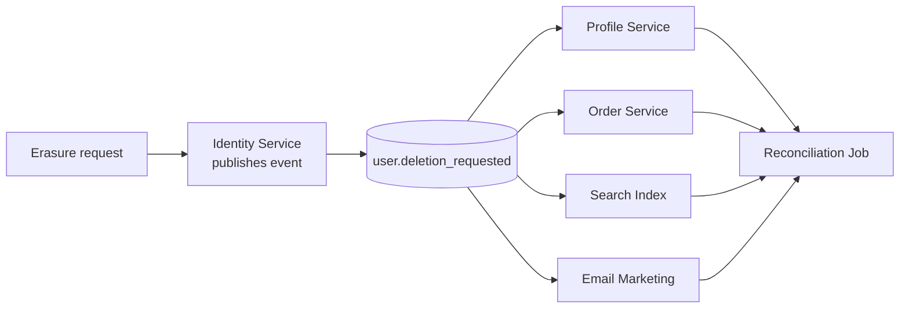

# GDPR and Right to Be Forgotten — Middle

<!-- level-focus -->
At middle level, focus on this question:

> When an erasure request has to propagate across several services, how do you design the fan-out so it's testable, debuggable, and doesn't silently leave orphaned PII behind?

Use the smallest realistic scenario that exposes the decision and its failure behavior.
> **Roadmap:** [Data Privacy](../README.md) → GDPR and Right to Be Forgotten

*One table, one request, one engineer — that's the junior scenario. The moment a second service owns a copy of the subject's data, "delete the row" becomes "get every service that has ever touched this subject to agree the data is gone," and that's a distributed-systems problem wearing a compliance hat.*

> **Not legal advice.** This guide is about designing the propagation mechanism, not determining which fields legally must be retained — get that classification from your data inventory and legal/privacy counsel, then build the pipeline around it.

---

## Core Concepts

### 1. Deletion strategy is a spectrum, not a binary

At the junior level, a single request picked hard-delete or tombstone per table. At the middle level, you're choosing a **default strategy for a whole system**, and the choice trades off differently depending on what else reads that data:

| Strategy | Mechanism | Best when | Cost |
|---|---|---|---|
| **Hard delete** | Row physically removed | No other table references it, no audit need | Cheapest, but destroys referential integrity if something *does* reference it |
| **Tombstone / soft delete** | PII fields nulled, row (or a marker) remains | Foreign keys, audit trails, or analytics need the row's existence, just not its content | Extra schema complexity; every reader must respect the tombstone flag |
| **Anonymization** | Fields replaced with irreversible aggregates (e.g., `age_bucket: "30-40"` instead of birthdate) | You need the row for statistics but not the identity | Requires proving the transform is genuinely irreversible |
| **Crypto-shredding** | Data stays encrypted; the per-subject key is destroyed | Cold storage, backups, or data lakes where per-record deletion is impractical | Requires per-subject (or per-tenant) encryption keys designed in *before* you need to shred them — see [Encryption Key Lifecycle](../encryption-key-lifecycle/README.md) |

A common middle-level mistake is treating this as one system-wide decision ("we tombstone everything") when the right default is per-store, driven by what else depends on that store's data.

### 2. Cascading delete as an event, not a synchronous call chain

The naive design — the erasure handler calls Service B, which calls Service C, which calls Service D — couples every service's deployment and uptime to every other service's, and a single timeout anywhere in the chain leaves the request in an unknown state. The more maintainable shape is an **event-driven fan-out**: one service publishes `user.deletion_requested`, and every service that holds data for that subject consumes it independently, deletes its own slice, and acknowledges.



This decouples deployment and failure domains — Order Service being down doesn't block Profile Service from completing its part — but it introduces the core middle-level problem: **you no longer get a synchronous "yes, it's done."** You need a way to know when *all* consumers have finished, which is what the reconciliation job (Concept 4) is for.

### 3. Testability: unit-test the tombstone logic, integration-test the propagation

Two different things need two different kinds of test, and conflating them is how deletion bugs survive to production:

- **Unit level:** given a `users` row, does `applyTombstone(row)` null the right fields and leave the right ones (like the foreign-keyed order history)? This is a pure function test — no queue, no network, fast, runs on every commit.
- **Integrated-flow level:** given a `user.deletion_requested` event, do all four consuming services actually receive it, process it, and leave zero residual PII behind — including under a consumer restart or a duplicate delivery? This needs a real (or realistic test-double) message bus and a way to query every store afterward.

```python
# integrated-flow test sketch
def test_deletion_event_reaches_all_consumers(event_bus, stores):
    publish(event_bus, "user.deletion_requested", {"user_id": "u_48213"})
    wait_for_all_consumers_to_ack(event_bus, timeout_s=30)

    for store in [profile_db, orders_db, search_index, mailer_client]:
        assert not store.contains_pii_for("u_48213"), f"{store.name} still has PII"
```

A pipeline that only has unit tests on the tombstone function looks green in CI while a consumer silently never subscribed to the topic — that gap only shows up in the integrated test.

### 4. Reconciliation: the thing that answers "are we actually done?"

Because the fan-out is asynchronous, you need a job — not a person — that periodically re-checks: for every open deletion request older than N hours, query every registered store for residual PII tied to that subject, and either mark the request complete or raise it as a stuck request needing investigation.

| Field | Example |
|---|---|
| `request_id` | `dsar-2026-0091` |
| `stores_expected` | `["profile_db", "orders_db", "search_index", "mailer_co"]` |
| `stores_confirmed` | `["profile_db", "orders_db", "mailer_co"]` |
| `stores_pending` | `["search_index"]` |
| `age` | 6 hours |
| `status` | `IN_PROGRESS` (escalates to `STUCK` past 24h) |

This reconciliation record is what makes the SLA defensible — you can show, per request, exactly which stores confirmed and which didn't, rather than assuming success because no error was thrown.

### 5. Under- and over-application signals

| Signal you're **under-applying** | Signal you're **over-applying** |
|---|---|
| A new microservice ships without subscribing to the deletion event — nobody remembered it holds PII | Every service tombstones by default, even ones with no foreign-key or audit reason to keep the row, adding schema complexity for no benefit |
| Reconciliation only checks the primary database, never the search index or cache | Legal-hold/retention logic duplicated per service instead of read from one shared source of truth |
| "It probably worked" is the actual verification step | A blanket policy deletes data still under an active legal hold because the pipeline doesn't check hold status before acting |

The fix for under-application is a **registration requirement**: no service goes to production holding PII without also registering a consumer for the deletion event (enforced the same way a new service must register its logs or metrics). The fix for over-application is centralizing the retain/delete decision (the legal-hold check) in one place the fan-out consults, rather than letting each service reimplement it.

---

## Scenario: Adding a New Service to an Existing Deletion Pipeline

`homegoods-marketplace` already has `user.deletion_requested` wired to Profile, Orders, and Search. The team ships a new **Recommendations Service** that stores per-user click history to power "you might also like." Six months in, someone notices recommendations never subscribed to the deletion event — a stuck-request root cause the reconciliation job should have caught but didn't, because Recommendations was never added to `stores_expected`.

**Incremental fix, not a big-bang rewrite:**

1. Add a unit test: `applyTombstone()` on a click-history row nulls the `user_id` link and the raw click payload, keeping only an anonymized `event_type` count for the team's existing dashboards.
2. Subscribe Recommendations to `user.deletion_requested`, consuming idempotently (duplicate delivery must not error — check-then-delete, not delete-and-assume-once).
3. Add Recommendations to the reconciliation job's `stores_expected` list so future stuck requests actually surface it.
4. Backfill: run the deletion logic once against every *already-closed* request that predates this service, since those subjects' click history was never touched.
5. Add an integrated-flow test asserting a fresh deletion event now clears Recommendations too, alongside the three existing stores.

Step 4 — the backfill — is the step teams most often skip, and it's the one that actually closes the gap for subjects who already "successfully" completed a request before Recommendations existed.

---

## Common Mistakes

1. **Synchronous call chains for cascading delete.** Coupling every service's availability to every other service's turns one slow dependency into a missed SLA for the whole request.
2. **No idempotency in event consumers.** A duplicate delivery (normal in most message buses) that isn't handled safely can throw errors, double-log, or — worse — silently no-op in a way that looks like success but isn't.
3. **Reconciliation checks only the stores that existed when it was written.** New services need to register themselves; reconciliation has no way to check a store it doesn't know about.
4. **Duplicating legal-hold logic per service.** When each service decides independently whether a record is under legal hold, they will eventually disagree, and one of them will be wrong.
5. **No backfill step when a new consumer is added.** Fixing the pipeline going forward without addressing subjects who already went through it leaves those requests silently incomplete.

---

## Apply it

1. Take (or design) a system with at least three services that each hold some data for the same user ID.
2. Design an event schema for `user.deletion_requested` (or your topic's equivalent) and wire at least two services as consumers.
3. Write one unit test per consumer's deletion logic, and one integrated-flow test that publishes the event and asserts zero residual PII across all consumers.
4. Add a lightweight reconciliation check (even a script run manually) that reports `stores_expected` vs `stores_confirmed` for a given request ID.
5. Simulate adding a new service to the pipeline after the fact: write its consumer, add it to reconciliation, and write the backfill step for requests that predate it.

## Verify your work

- The integrated-flow test fails if any one consumer is disconnected from the event bus, not just if the publisher itself fails.
- Duplicate delivery of the same deletion event does not produce an error or a second, different outcome.
- The reconciliation output names exactly which stores are pending for a given request, not just an aggregate "not done yet."
- The backfill step, when run, changes the completion status of at least one previously "closed" request that predates the new consumer.

## Review questions

- Why does a synchronous call chain for cascading delete create a worse failure mode than an event-driven fan-out?
- What's the difference between what a unit test and an integrated-flow test can each catch in a deletion pipeline?
- What does the reconciliation job need to know about a new service before it can catch that service missing an event?
- Why is a backfill step necessary when adding a new consumer to an existing deletion pipeline?
