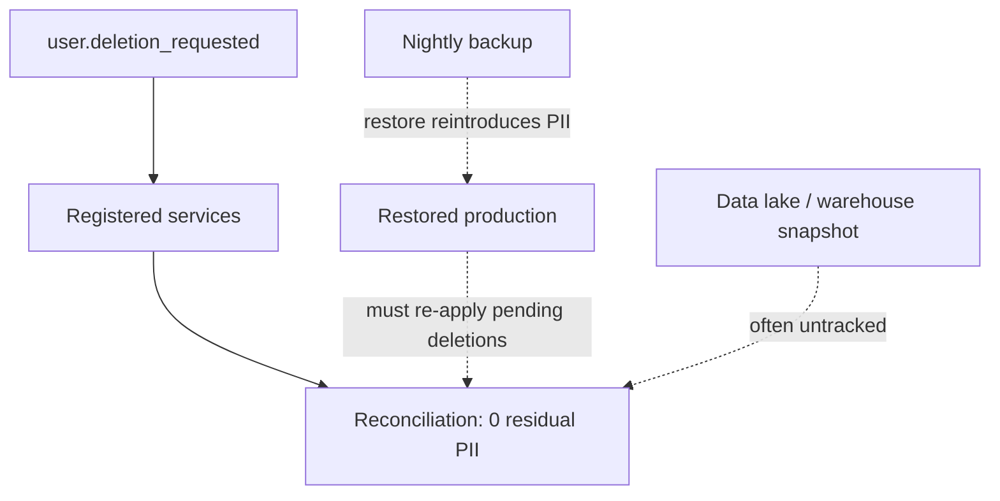

# GDPR and Right to Be Forgotten — Senior

<!-- level-focus -->
At senior level, focus on this question:

> What invariant guarantees an erasure request converges to zero residual PII across an evolving, multi-store architecture — including backups and data lakes — and what evidence, not a diagram, proves that invariant actually holds?

Use the smallest realistic scenario that exposes the decision and its failure behavior.
> **Roadmap:** [Data Privacy](../README.md) → GDPR and Right to Be Forgotten

*The middle level built a fan-out and a reconciliation job for the services that exist today. The senior question is what happens eighteen months from now, after three reorgs, a new data lake, and a service nobody remembers registering for deletion events — and whether the guarantee still holds, or just used to.*

> **Not legal advice.** The invariant below is an engineering guarantee about where and how deletion propagates; whether a specific record's retention is legally required, and for how long, is a determination for legal/privacy counsel working from your data inventory.

---

## Core Concept 1 — State the invariant, don't just point at the pipeline

The middle level treats deletion as "we have a fan-out and a reconciliation job." At senior level that has to compress into a single, falsifiable **invariant** — a statement precise enough that any engineer can check a new design against it before it ships:

> *Every store that has ever held a field classified as personal data for subject X either (a) processes an erasure event for X within the SLA window, or (b) holds that data only under a currently-valid, expiring legal-hold record naming a specific legal basis, with no third state permitted.*

The value of stating it this precisely is that it's falsifiable: "we have a deletion pipeline" is true regardless of how many stores it actually reaches; "every PII-holding store either erases within SLA or has a named, expiring hold" is a claim a new service, a new backup target, or a new analytics export can violate — and you can write a test that catches the violation instead of discovering it in an audit.

---

## Core Concept 2 — The three failure modes that only show up at scale

**Zombie data from backup restores.** A store that was correctly tombstoned on Tuesday can have its deleted data resurrected on Friday when an engineer restores a backup snapshot taken Monday, to debug an unrelated incident. The invariant has to explicitly address restores: any restore process must re-apply outstanding deletion requests against the restored data before it's considered live again, not treat "restore completed" as "system is compliant again."

**Partial fan-out under service failure.** In the middle-level event-driven design, a consumer that's down when the event publishes will miss it entirely unless the message bus guarantees at-least-once delivery with durable subscriptions. Even then, a consumer that crashes mid-processing needs a dead-letter path — an event that silently vanishes because a pod restarted during processing is indistinguishable, from the subject's point of view, from a service that never implemented deletion at all.

**Downstream copies nobody tracked.** A data warehouse or lake that snapshots the primary databases nightly for analytics has its own copy of the PII, on its own retention schedule, usually built before anyone thought about erasure. This is the single most common way an organization's erasure guarantee has a hole: the invariant was written against the OLTP stores, and the OLAP copy was never in scope.



The dotted paths are exactly the paths a senior review has to force into scope — they're the ones a fan-out diagram drawn from the OLTP side of the house tends to omit by default.

---

## Core Concept 3 — Recovery: reconciliation as a designed capability, not a cron job that happens to exist

At the middle level, reconciliation was a job that reports stuck requests. At senior level, reconciliation has to be a **designed recovery mechanism** with its own guarantees: it must know the full, current list of PII-holding stores (kept current by the registration requirement from `middle.md`), it must be able to re-drive a deletion into any store that missed it, and it must distinguish "still propagating, within SLA" from "actually stuck."

| Recovery mechanism | What it catches | What it can't catch |
|---|---|---|
| Dead-letter queue + retry | A consumer that crashed mid-processing | A consumer that was never subscribed at all |
| Scheduled reconciliation scan | A store with residual PII past the expected completion time | A store not in the registry to begin with |
| Registry audit (quarterly) | A service holding PII that never registered for the deletion event | Data copied out of a registered store into an unregistered one (e.g., an ad hoc export) |
| Restore-time re-application | Zombie data reintroduced by a backup restore | A restore that happens outside the standard restore tooling |

No single mechanism closes every gap — the invariant is only as strong as the union of these, which is why a senior design review asks "which of these four do we actually have" rather than assuming reconciliation alone is sufficient.

---

## Core Concept 4 — Trade-offs among propagation architectures

| Architecture | Latency to converge | Coupling | Best for |
|---|---|---|---|
| **Synchronous cascading API calls** | Fast (seconds) if everything is up | High — every service's uptime blocks the request | Small, tightly-owned systems, low service count |
| **Event-driven fan-out (async)** | Minutes to hours, bounded by consumer lag | Low — services fail independently | Most multi-team microservice architectures |
| **Scheduled batch purge** | Hours to a day (runs on a fixed schedule) | Very low — no real-time dependency at all | Cold storage, data lakes, backups where per-record real-time deletion is impractical |
| **Crypto-shredding** | Near-instant (destroy the key) | None — no need to touch every encrypted record | Encrypted-at-rest cold storage and backups; see [Encryption Key Lifecycle](../encryption-key-lifecycle/README.md) |

A mature system typically runs all four simultaneously for different tiers of storage: synchronous or near-real-time for the primary transactional stores the subject actually interacts with, event-driven for the microservice fan-out, batch purge for the data lake, and crypto-shredding for backups where record-level deletion would mean re-encrypting an entire archive per request. The senior job is choosing the right tier for each store, not picking one architecture and forcing every store through it.

---

## Core Concept 5 — Evidence over preference: validating the invariant

An invariant that has never been tested against a real failure is an opinion with good production values. Treat every audit and every incident as a chance to gather evidence for or against the stated invariant, and change the architecture — not just the incident report — when the evidence contradicts it.

```text
Hypothesis: an erasure request against a subject with data in 6 registered
            stores converges to 0 residual PII within the SLA window, and
            surviving a mid-fan-out consumer crash does not change that.

Experiment: submit a real (test-account) deletion request; kill the Search
            Index consumer mid-processing; restore a backup taken before
            the request; verify reconciliation status at T+24h.

Evidence to collect:
  - Residual PII count per store at T+24h (expect 0 across all 6)
  - Whether the killed consumer's dead-letter retry actually re-delivered
  - Whether the backup restore re-applied the pending deletion automatically
    or left zombie data undetected
  - Whether the data lake's next scheduled purge cycle picked up the request
```

If the restored backup shows the subject's data again and nothing flags it, that's not a footnote — it's proof the invariant has a hole at the restore boundary, and it needs fixing before the next audit finds it the hard way.

---

## Common Mistakes

1. **Writing the invariant only against OLTP stores.** Data lakes, warehouses, and ad hoc exports are exactly the copies most likely to be left out, and they're often the ones an external auditor asks about first.
2. **Treating reconciliation as sufficient on its own.** It catches stores that are registered but slow; it does nothing for a store that was never registered, or for data copied outside the registry entirely.
3. **Assuming a backup restore is a rare edge case not worth designing for.** Restores happen during incidents, exactly when nobody has spare attention for privacy correctness — which is precisely why it needs to be automatic, not a manual checklist item.
4. **Picking one propagation architecture for every store.** Forcing a data lake through the same near-real-time path designed for the primary database either fails or becomes prohibitively expensive; forcing backups through per-record deletion instead of crypto-shredding does the same.
5. **Validating the invariant with a diagram instead of an experiment.** An architecture diagram describes intent; only a real erasure request pushed through failure conditions (a killed consumer, a restore) produces evidence the invariant actually holds.

---

## Apply it

1. Write your system's blast-radius-for-erasure invariant as one falsifiable sentence, naming every category of store (OLTP, OLAP/lake, backups, third-party processors) it must cover.
2. List every store currently in scope of your deletion pipeline versus every store that actually holds PII (from the data inventory) — the gap between the two lists is your invariant's known holes.
3. Design one experiment that would falsify the invariant: pick a specific failure (consumer crash, backup restore, or an unregistered downstream copy) and state exactly what evidence would prove the invariant survived it.
4. Run the experiment (in a test environment with synthetic subjects, never real user data) and record the residual-PII count per store at a fixed time after the request.
5. For any store the experiment shows uncovered, decide and document which recovery mechanism (dead-letter retry, restore-time re-application, registry audit) should have caught it, and add it.

## Verify your work

- The invariant is written as a specific, falsifiable claim naming store categories, not a general statement like "we handle deletions properly."
- The experiment produced a residual-PII count per store, not a single pass/fail for the whole system.
- Every store identified as "in scope" versus "holds PII but not covered" is named explicitly, not left as an assumed gap.
- Any hole the experiment exposed has an assigned recovery mechanism and an owner, not just a ticket describing the gap.

## Review questions

- Why does an invariant written only against OLTP stores fail to protect against the most common real-world compliance gap?
- What must a restore process do before restored data can be considered compliant again?
- Why might a mature system run four different propagation architectures simultaneously instead of standardizing on one?
- What distinguishes evidence that an invariant holds from a diagram that merely describes the intended architecture?
