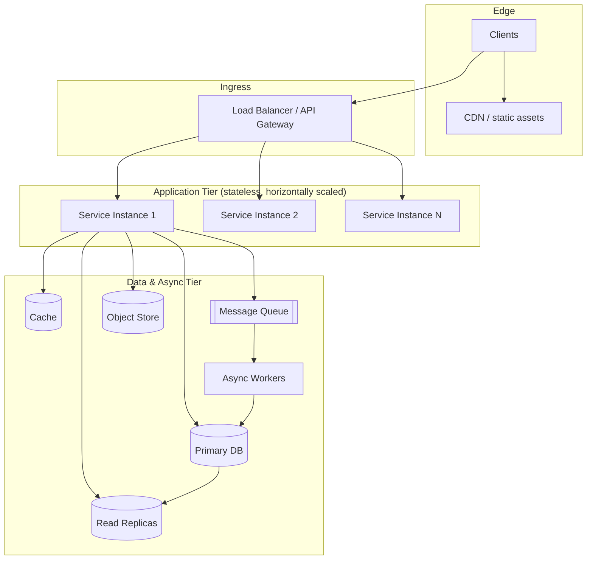
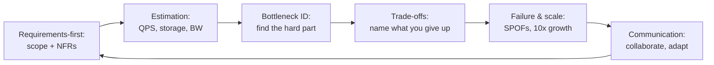

# What Is System Design? — Interview Questions

This page is a curated bank of interview questions about *what system design actually is* and *how the discipline is evaluated in interviews*. It is not a catalogue of "design Twitter" prompts — it is the layer beneath that: definitions, building blocks, the functional/non-functional split, scaling axes, and the meta-skill of turning an open-ended prompt into a defensible architecture. Each answer is written to be repeatable in a real interview and defensible under follow-up pressure.

## Table of Contents

1. [Junior Questions](#junior-questions)
2. [Middle Questions](#middle-questions)
3. [Senior Questions](#senior-questions)
4. [Professional / Deep-Dive Questions](#professional--deep-dive-questions)
5. [Staff / Judgment Questions](#staff--judgment-questions)
6. [What Interviewers Actually Grade](#what-interviewers-actually-grade)

---

## Junior Questions

**Q1: What is system design, and how is it different from coding?**

> System design is the activity of deciding *how the major pieces of a software system fit together* to satisfy a set of requirements at a target scale, under explicit constraints (latency, availability, cost, consistency). Coding answers "how do I implement this function correctly?"; system design answers "what components should exist, what are their responsibilities, how do they communicate, where does state live, and how does the whole thing behave when traffic grows 100×?"
>
> The unit of work is different. In coding, the unit is a function, class, or module, and correctness is the dominant concern. In system design, the unit is a *component and the boundary between components* — a service, a database, a cache, a queue, a load balancer — and the dominant concerns are non-functional: latency, throughput, availability, consistency, cost, and operability. A program that is correct in isolation can still be a bad design if it has a single point of failure, can't be scaled horizontally, or couples two teams to one deploy.
>
> A short way to say it: coding is about making one machine do the right thing; system design is about making *many machines, owned by many teams, over a long lifetime* do the right thing together — and keep doing it under failure and growth.

**Q2: What are the basic building blocks of a system, and what is each one *for*?**

> Most backend systems are assembled from a small, recurring vocabulary of components. Knowing what each one *buys you* — and what it costs — is the foundation of the whole discipline.
>
> | Building block | Primary purpose | What it buys you | What it costs |
> |---|---|---|---|
> | **Load balancer** | Spread requests across many identical servers | Horizontal scale + failover | Extra hop; must be HA itself |
> | **Application / service tier** | Run business logic (ideally stateless) | Easy horizontal scaling | State must live elsewhere |
> | **Database** | Durable source of truth | Persistence, queries, transactions | Hard to scale writes; often the bottleneck |
> | **Cache** | Serve hot data fast from memory | Lower latency, less DB load | Invalidation + staleness complexity |
> | **Message queue / log** | Decouple producers from consumers | Async work, buffering, resilience | Eventual consistency, ordering, ops |
> | **Object/blob store** | Store large unstructured files | Cheap, durable bulk storage | Not for low-latency structured queries |
> | **CDN** | Serve static/cacheable content near users | Lower latency, offload origin | Invalidation, cache-key correctness |
> | **Reverse proxy / API gateway** | Single ingress for routing, auth, rate limits | Cross-cutting concerns in one place | Another tier to operate |
>
> The skill is not memorising the list — it's reaching for the *right* block for a *stated* reason. "I'll add a cache because read latency must be < 50 ms and the same 1,000 hot items serve 95% of reads" is a design decision. "I'll add Redis because systems have Redis" is cargo-culting.

**Q3: What is the difference between functional and non-functional requirements?**

> **Functional requirements** describe *what the system does* — the features and behaviours. "A user can post a tweet," "a follower sees it in their timeline," "a URL shortener returns the original URL for a short code." They are testable as yes/no: does the feature work?
>
> **Non-functional requirements** (NFRs, sometimes "quality attributes") describe *how well* the system must do those things. They are usually numeric and define the engineering problem: 100M daily active users, p99 latency under 200 ms, 99.99% availability, reads within 1 second of a write, $X/month budget, GDPR data residency.
>
> The crucial interview insight: **functional requirements tell you what to build; non-functional requirements tell you how hard it is.** "Build a URL shortener" is a weekend project at 10 requests/second and a serious distributed-systems problem at 1M redirects/second with global low latency. Two candidates can name the same components, but the one who pins down the NFRs first is the one who designs the *right* system. Always elicit scale, latency, availability, and consistency numbers before drawing boxes.

**Q4: What is the difference between vertical and horizontal scaling?**

> **Vertical scaling (scale up)** means making one machine more powerful: more CPU, RAM, faster disks. **Horizontal scaling (scale out)** means adding more machines and distributing load across them.
>
> | Dimension | Vertical (scale up) | Horizontal (scale out) |
> |---|---|---|
> | How | Bigger machine | More machines |
> | Code changes | Usually none | Needs statelessness / partitioning |
> | Ceiling | Hard physical limit | Effectively unbounded |
> | Fault tolerance | One box = one failure domain | Survives single-node loss |
> | Cost curve | Super-linear at the top end | Roughly linear |
> | Complexity | Low | High (LB, coordination, consistency) |
>
> Vertical scaling is the cheap first move: it's operationally simple and requires no architectural change, so it's the right answer for early-stage systems and for stateful components (a single primary database) that are awkward to split. But it hits a wall — there is a biggest machine, and a single machine is a single failure domain. Horizontal scaling has no hard ceiling and gives you fault tolerance for free (lose a node, the rest carry on), but it forces architectural discipline: services must be stateless, requests must be routable to any instance, and shared state must move into databases, caches, or queues. Mature systems do both: scale up the stateful pieces as far as is sensible, scale out the stateless pieces freely.

**Q5: Why do we make application servers "stateless," and what does that even mean?**

> A server is *stateless* when it stores no client- or session-specific data between requests in its own memory or disk — everything it needs to handle a request is either in the request itself or in shared backing stores (database, cache, token). Two consecutive requests from the same user can land on two different servers and behave identically.
>
> Statelessness is the enabling precondition for horizontal scaling. If a server holds session state in local memory, then (a) a user is pinned to one server, so the load balancer can't freely distribute traffic, and (b) if that server dies, the user's session dies with it. Push the state out — into a JWT the client carries, or a Redis session store both servers can read — and now any server can handle any request. You can add capacity by adding identical instances, remove capacity by killing instances, and tolerate a node crash without losing user data.
>
> The state doesn't disappear; it *moves* to a tier explicitly designed to be shared, replicated, and durable. The art of scalable design is largely about deliberately deciding where each piece of state lives.

---

## Middle Questions

**Q6: Walk me through the high-level architecture of a typical scalable web application.**

> Here is the canonical layered topology, staged so each tier's role is clear.

> The request path: clients hit a CDN for static content and the load balancer for dynamic requests. The LB fans out to a pool of stateless application instances. Each instance reads from a cache first (hot path), falls back to the database (writes to a primary, reads scaled across replicas), and offloads slow or non-urgent work (sending email, generating thumbnails, fanning out a timeline) to a message queue consumed by async workers. Large files go to an object store. Each tier scales on its own axis: app tier by adding instances, reads by adding replicas and cache, throughput-spiky work by buffering in the queue. The interviewer wants to see that you understand *why* each tier exists and *what it independently scales*, not just that you can name them.

**Q7: When you're asked to "design X" and the prompt is vague, what do you do first?**

> I do not start drawing boxes. The first five minutes are **scoping**, and skipping that step is the single most common way strong coders fail system-design interviews. My sequence:
>
> 1. **Clarify functional scope.** List the core use cases and explicitly *cut* the rest. "I'll support posting and reading; I'll treat editing, deletion, and DMs as out of scope unless you want them." Narrowing scope out loud is a positive signal — it shows you can manage scope under time pressure.
> 2. **Pin down non-functional numbers.** Ask for or state assumptions: DAU, read:write ratio, latency target, availability target, consistency tolerance, data size/retention. These numbers *are* the design constraints.
> 3. **Do back-of-envelope estimation.** Convert DAU into QPS, into storage/year, into bandwidth. This tells me whether a single database suffices or whether I need sharding, caching, or a CDN — *before* I commit to an architecture.
> 4. **State the data model and API.** A couple of core entities and 2–3 key endpoints anchor everything that follows.
> 5. **Only then draw the high-level diagram**, and dive into the components the numbers proved are hard.
>
> The meta-point: an open-ended prompt is a *test of whether you'll impose structure on ambiguity*. A great candidate turns "design a chat app" into a precise, bounded problem in the first few minutes and gets agreement before building.

**Q8: How do you turn "100 million daily active users" into something you can design against?**

> By doing back-of-envelope estimation — deliberately rough math that converts a headline number into the QPS, storage, and bandwidth figures that decide the architecture. Worked example for a read-heavy feed at 100M DAU:
>
> - **Average QPS:** assume each user makes ~20 reads/day → 2B reads/day ÷ 86,400 s ≈ **23,000 reads/sec average**.
> - **Peak QPS:** real traffic is bursty; multiply average by ~2–3× → **~50,000–70,000 reads/sec peak**.
> - **Writes:** if read:write is 100:1, writes are ~230/sec average — comfortably one primary database, so the *write* path is easy and the *read* path is the real problem.
> - **Storage:** if each user generates 1 KB of new data/day → 100 GB/day → ~36 TB/year. That rules out a single un-sharded disk over a few years.
> - **Bandwidth:** 50K reads/sec × 2 KB response ≈ 100 MB/sec egress — well within CDN/LB territory but worth noting for cost.
>
> The point isn't precision to three significant figures; it's *order of magnitude*. These numbers immediately tell me: reads dominate (cache + replicas), writes are easy (single primary is fine for now), and storage forces partitioning within a couple of years. I round aggressively (86,400 ≈ 100,000 seconds/day) and narrate the assumptions so the interviewer can correct them. Estimation is how you justify every later decision instead of guessing.

**Q9: What does a *great* answer look like versus a *mediocre* one in a system-design interview?**

> They often name the same components. The difference is the *reasoning and process* around them.
>
> | Aspect | Mediocre answer | Great answer |
> |---|---|---|
> | Start | Jumps straight to boxes/tech | Clarifies scope & NFRs first |
> | Scale | Hand-waves "it scales" | Quantifies QPS, storage, bandwidth |
> | Component choice | "Add Kafka/Redis" by reflex | Adds each piece for a stated, measured reason |
> | Trade-offs | Presents one "right" answer | Names alternatives and *why* it chose one |
> | Bottlenecks | Ignores them | Identifies the hardest part and dwells there |
> | Failure | Assumes happy path | Asks "what happens when this node dies?" |
> | Communication | Monologue | Checks in, adjusts to interviewer steering |
>
> A mediocre answer is a *parts list*. A great answer is a *line of reasoning*: "Given 50K read QPS and a 100:1 read:write ratio, reads are the bottleneck, so I'll cache hot items and add read replicas; writes fit one primary today but I'll note the sharding trigger; the riskiest part is timeline fan-out, so let me spend time there." It treats the design as a sequence of justified decisions, surfaces trade-offs proactively, and dwells on the genuinely hard component instead of spreading effort evenly. The single strongest signal is *requirements-first thinking* combined with *naming a trade-off before the interviewer has to ask for one*.

**Q10: Why is a cache such a common first move, and what does it actually cost you?**

> A cache is a small, fast (usually in-memory) store that holds the results of expensive operations so subsequent requests skip the expensive path. It's the first move in read-heavy systems because read traffic is usually skewed: a small set of "hot" items serves the majority of requests (the classic 80/20 or worse). Serving those from RAM instead of hitting the database cuts latency by an order of magnitude and removes most of the load from your hardest-to-scale tier.
>
> The cost is **invalidation and staleness** — famously one of the two hard problems in computer science. The moment you cache a value, you've created a second copy of the truth that can drift from the source. You must answer: how does cached data get refreshed or evicted? What's the acceptable staleness window? What happens on a cache miss stampede when a hot key expires and thousands of requests hit the database at once? A cache trades *consistency and operational complexity* for *latency and load reduction*. It's the right trade for data that's read far more than written and tolerant of brief staleness — and the wrong one if you reach for it before you've confirmed those properties hold.

---

## Senior Questions

**Q11: System design is "the art of trade-offs." Give a concrete example of articulating one well.**

> The single most graded skill is making a trade-off *explicitly* — naming what you give up to get what you want, rather than presenting a choice as obviously correct.
>
> Concrete example, choosing how to deliver a social timeline:
>
> - **Fan-out on write (push):** when a user posts, immediately write the post into each follower's precomputed timeline. *Buys you* fast, cheap reads (the timeline is already assembled). *Costs you* expensive writes and a "celebrity" problem — a user with 50M followers triggers 50M writes per post.
> - **Fan-out on read (pull):** assemble the timeline on demand by querying the posts of everyone a user follows. *Buys you* cheap writes. *Costs you* expensive, slow reads, especially for users following thousands of accounts.
>
> A senior answer doesn't pick one and move on. It says: "Reads dominate by 100:1, so I'll default to fan-out on write for the common case; but I'll special-case high-follower accounts with fan-out on read to avoid the write explosion — a hybrid. The trade-off I'm accepting is added system complexity in exchange for bounded cost on both the read and write paths." That sentence — *what I gain, what I give up, and why that's the right balance for these specific requirements* — is exactly what distinguishes a senior signal from a mid-level one.

**Q12: How do availability and consistency force design decisions (and how do you reason about CAP in an interview)?**

> CAP says that when a network partition occurs (and in distributed systems, partitions *will* occur), you must choose between consistency (every read sees the latest write) and availability (every request gets a non-error response). You can't have both *during* a partition.
>
> In an interview I don't recite CAP as trivia — I use it to drive a decision per data type:
>
> - **Money, inventory, bookings:** prefer **consistency**. A bank would rather reject a transaction than double-spend. I'll use a strongly consistent store and accept that some requests fail during a partition.
> - **Likes, view counts, feeds, social graphs:** prefer **availability**. Showing a slightly stale like count is fine; showing an error page is not. I'll use eventual consistency, replicate widely, and reconcile asynchronously.
>
> The senior move is recognising that *consistency is not a system-wide setting* — it's a per-feature decision. A single product mixes strongly consistent paths (checkout) with eventually consistent ones (recommendations). I also distinguish CAP's "C" (linearizability) from looser guarantees like read-your-own-writes, which are often the actual product requirement and are cheaper to provide. Naming the *specific* consistency model the feature needs — rather than "strong vs eventual" as a binary — is what reads as depth.

**Q13: How do you identify and reason about the bottleneck in a design?**

> The bottleneck is the component that hits its limit first as load grows — and a good design spends most of its time there, not spread evenly across every box. My process:
>
> 1. **Follow the numbers.** From estimation I know read:write ratio and absolute QPS. The tier with the highest load relative to its scaling difficulty is the suspect — usually the database, because the stateless app tier scales trivially and the database (especially writes) does not.
> 2. **Classify the limit.** Is it CPU, memory, disk I/O, network, or a coordination/lock? Each has a different fix. A read-throughput bottleneck → cache + replicas. A write-throughput bottleneck → sharding, batching, or a different storage engine. A connection bottleneck → pooling.
> 3. **Apply the cheapest fix that moves the limit**, then re-ask "what's the next bottleneck?" Optimisation is iterative: removing one bottleneck reveals the next.
>
> The discipline is resisting the urge to optimise everything. If the design serves 50K read QPS and 500 write QPS, the write path is not your problem — say so and move on. Senior engineers explicitly state "this component is fine, I won't spend time here" as confidently as they dive deep on the one that matters. Knowing where *not* to look is as valuable as knowing where to.

**Q14: How do you handle the demand to "design X" when X is genuinely underspecified — like "design a notification system"?**

> Underspecification is the test, not an accident. The interviewer wants to see whether I'll impose a frame. My approach:
>
> 1. **Enumerate the dimensions the prompt left open and make them explicit.** For notifications: channels (push/email/SMS/in-app), volume, latency tolerance (instant vs digest), delivery guarantee (at-least-once vs best-effort), and ordering. I list these and propose defaults: "I'll assume push + email, at-least-once delivery, seconds-not-milliseconds latency — does that match what you're picturing?"
> 2. **Get explicit agreement on scope before building.** This protects me from designing the wrong system for 30 minutes. It also demonstrates collaboration, which is itself graded.
> 3. **Pick a representative slice and design it deeply**, rather than a shallow design of everything. A deep, correct design of the push pipeline beats a hand-wave across five channels.
> 4. **Flag the cuts.** "I'm deferring deduplication and user-preference management; I'd add them as a separate service — happy to go there if you want."
>
> The anti-pattern is silently picking an interpretation and building. The senior behaviour is *converting ambiguity into a stated, agreed-upon problem* and being transparent about every assumption, so the interviewer can redirect cheaply. An open prompt is an invitation to demonstrate judgement about *what to build*, not just *how*.

**Q15: What's the difference between latency and throughput, and why does conflating them produce bad designs?**

> **Latency** is how long one operation takes (e.g., p99 = 200 ms). **Throughput** is how many operations the system completes per unit time (e.g., 50K req/sec). They are related but distinct, and the fixes for each often *trade against the other*.
>
> Conflating them produces bad designs because optimisations diverge:
>
> - **Batching** improves throughput (amortise fixed costs over many items) but *hurts* per-request latency (a request waits for the batch to fill). A queue that buffers writes raises throughput and write latency simultaneously.
> - **Adding replicas/caches** improves read latency *and* read throughput together — these don't conflict, which is why read scaling is the "easy" axis.
> - **Parallelism** can improve latency (split one request's work) or throughput (handle more requests), but the design differs.
>
> The interview signal is stating *which one the requirement actually demands*. "p99 < 100 ms for a single redirect" is a latency requirement → caching, geographic proximity, avoiding extra hops. "Ingest 1M events/sec" is a throughput requirement → batching, partitioning, async pipelines — and I'd happily accept higher per-event latency to get it. A candidate who optimises latency when the requirement was throughput (or vice versa) has misread the problem, no matter how clean the diagram looks.

---

## Professional / Deep-Dive Questions

**Q16: How do you decide *where* state lives in a system, and why is that the central question of scalable design?**

> State placement is the decision that everything else follows from, because state is what *can't* be trivially scaled by adding identical copies. The reasoning framework:
>
> - **Move state out of the request-handling tier** so that tier becomes stateless and horizontally scalable. Session data → token or shared session store; in-progress work → a queue; uploaded files → object store. The app tier should be a pure function of its inputs plus backing stores.
> - **Classify each piece of state by its access pattern and consistency need**, and place it accordingly:
>
> | State type | Access pattern | Where it goes | Why |
> |---|---|---|---|
> | Source of truth (orders, accounts) | Strongly consistent writes | Primary database | Durability + transactions |
> | Hot read data | High read rate, tolerant of staleness | Cache | Latency, offload DB |
> | Large blobs | Write-once, read-many, big | Object store | Cheap durable bulk |
> | In-flight work | Producer/consumer decoupling | Message queue/log | Buffering, async, retries |
> | Search/aggregation | Complex queries over text | Search index | Purpose-built reads |
>
> - **Minimise the number of strongly consistent, hard-to-scale stores**, because each one is a coordination point and a potential bottleneck. The art is keeping the *source-of-truth* footprint small and pushing everything tolerant of staleness or partitioning to scalable tiers.
>
> Phrased as a principle: *scalability is achieved by making the stateless parts numerous and the stateful parts few, small, and deliberately chosen.* Every "add a cache / queue / replica" decision is really a decision about where to relocate state and what consistency you'll accept for it.

**Q17: How do you account for failure as a first-class part of the design, not an afterthought?**

> In a distributed system every component *will* fail — nodes crash, networks partition, dependencies time out, disks fill. A professional design assumes failure is the steady state, not the exception. I apply a few lenses:
>
> 1. **Eliminate single points of failure.** Any component whose loss takes down the system must be redundant: multiple app instances, a replicated database with failover, a load balancer that is itself HA. I walk the diagram and ask of each box, "what happens when this dies?" If the answer is "outage," it needs redundancy.
> 2. **Contain blast radius.** Use timeouts, retries with backoff and jitter, circuit breakers, and bulkheads so one slow dependency doesn't exhaust threads and cascade into a full outage. A failing recommendation service should degrade the feed gracefully, not take down checkout.
> 3. **Make operations idempotent and retries safe.** At-least-once delivery means duplicates; designing consumers to be idempotent (dedup keys, upserts) is what makes "just retry" a valid strategy.
> 4. **Define degradation modes.** Decide in advance what the system does when a dependency is down: serve stale cache, queue writes for later, shed non-critical load. Graceful degradation beats hard failure.
>
> The interview signal is *unprompted* failure reasoning — saying "if this replica falls behind, reads here could be stale, so I'd route consistency-sensitive reads to the primary" before being asked. Treating availability as something you *engineer* (via redundancy and isolation) rather than something you *hope for* is a senior-to-staff differentiator.

**Q18: How do cost and operability shape a design, beyond pure performance?**

> A design that meets the latency and availability targets but is unaffordable or unoperable is a failed design — and senior interviewers probe exactly here to separate "can draw a fast system" from "can own a system in production."
>
> - **Cost.** Every component has a price: compute instances, replica storage, cross-region bandwidth (often the silent budget killer), managed-service fees. I sanity-check that the architecture's cost scales sub-linearly or at least linearly with users, and I prefer the cheapest option that meets the requirement. Caching isn't just for latency — it's often the cheapest way to avoid scaling an expensive database tier. I'll explicitly say "we could shard now, but a bigger primary plus cache is cheaper until we cross ~X writes/sec."
> - **Operability.** Can the team run this at 3 a.m.? That means: is it observable (metrics, logs, traces, meaningful alerts on SLOs)? Can it be deployed safely (gradual rollout, rollback)? How many moving parts must an on-call engineer reason about? Every additional technology is an operational tax — a new thing to monitor, patch, and debug. A design with three components the team already operates well often beats a "more optimal" design with seven novel ones.
>
> The mature instinct is *minimum sufficient complexity*: the simplest architecture that meets the requirements, because every component you add is paid for forever in dollars and on-call burden. Bringing up cost and operability unprompted signals you've actually run systems, not just diagrammed them.

**Q19: What does "requirements-first" really mean, and how does it change the design rather than just the opening?**

> "Requirements-first" is not a ritual you perform in minute one and then forget — the requirements should *visibly drive every subsequent decision*. The chain looks like this: a stated NFR justifies an estimation, which identifies the bottleneck, which selects a component, whose trade-offs you then evaluate against the *same* NFR.
>
> Concretely, if the requirement is "feed must load in < 200 ms p99 for users following up to 5,000 accounts," that single sentence cascades: it rules out fan-out-on-read for high-following users (too slow), justifies precomputed timelines in a fast store, sets the cache hit-ratio target I need, and defines the consistency I can relax (a 2-second-stale feed is fine, so eventual consistency is acceptable on this path). Later, when I consider sharding, I evaluate it against *that* latency budget, not in the abstract.
>
> The failure mode it prevents is **solution-first design** — reaching for a familiar stack ("microservices + Kafka + Cassandra") and retrofitting the problem onto it. That produces architectures that are impressively complex and wrong. Requirements-first means the design is *derivable* from the constraints: if I changed the latency target or the read:write ratio, you should be able to predict how the architecture changes. An interviewer testing seniority will often *change a requirement mid-interview* ("now it's write-heavy") specifically to see whether your design flexes — which only happens if it was requirements-driven in the first place.

---

## Staff / Judgment Questions

**Q20: At staff level, how does "system design" expand beyond the architecture of a single system?**

> The textbook view is component topology for one system. At staff scope, system design also includes the dimensions that make that topology *survivable and evolvable over years and across an organisation*:
>
> - **Evolution and migration.** Real systems are rarely greenfield. The hard design question is often "how do we get from the system we have to the one we want without downtime?" — expand/contract schema migrations, dual-writes, backfills, strangler-fig replacements. A design that can't be *incrementally adopted* is academically interesting and practically useless.
> - **Organisational fit (Conway's Law).** The architecture will come to mirror the communication structure of the teams that build it. Service boundaries are also *team boundaries*. A staff engineer designs the system *and* the ownership model, choosing boundaries that minimise cross-team coupling, not just runtime coupling.
> - **Total cost of ownership over the lifecycle.** Including the cost of *change*: how expensive is it to add the next feature, onboard the next engineer, or debug the next incident? A design optimised purely for today's throughput but impossible to evolve is a liability.
>
> So staff-level system design is the practice of choosing an architecture that is *correct for the current requirements, affordable to operate, safe to evolve, and aligned with how the organisation actually works* — and being explicit that those constraints sometimes outrank raw performance.

**Q21: When is the "right" design deliberately *not* the most scalable one?**

> Almost always, early on — and recognising that is a maturity signal, not a weakness. Over-engineering for scale you don't have is one of the most expensive mistakes in practice: it burns engineering time, multiplies operational surface, slows iteration, and frequently optimises for a future that never arrives or arrives in a different shape than predicted.
>
> The judgment is matching architectural complexity to *actual, near-term* requirements while leaving a clear path to scale when the numbers demand it:
>
> - At 1,000 users, a single well-chosen database (vertically scaled, with backups) and a stateless app tier is the *correct* design — sharding and multi-region would be malpractice.
> - The skill is identifying the **trigger points**: "this single primary is fine until ~X writes/sec or ~Y TB; here's the metric I'd watch, and here's the migration to sharding I'd do when it trips." That's better than either premature sharding or being caught flat-footed.
>
> A staff-level answer states the simplest sufficient design *and* the explicit conditions under which it would evolve, with the migration sketched. "Build for 10× your current scale, design so 100× is a known migration, don't build for 1000× today" captures the instinct. Demonstrating that you'll *resist* unnecessary complexity is, paradoxically, one of the strongest signals of system-design seniority — because juniors over-build to look sophisticated, and the experienced have been burned by it.

**Q22: How would you evaluate someone else's system design — what separates a strong design from a clever one?**

> When I review a design (in an interview, a design doc, or an architecture review), I grade it against the requirements, not against novelty. My checklist:
>
> 1. **Does it meet the stated requirements?** Trace each functional requirement and each NFR through the design and confirm the architecture actually satisfies it. A clever design that misses the latency target is wrong.
> 2. **Are the trade-offs explicit and defensible?** Strong designs *name* what they sacrificed. If a doc presents only upsides, the author either didn't understand the trade-offs or is hiding them — both are red flags.
> 3. **Where's the bottleneck, and is it addressed?** I look for the hardest component and check that effort was concentrated there.
> 4. **What happens under failure and growth?** I probe single points of failure, blast radius, and the 10× scenario.
> 5. **Is it the *simplest* design that works?** I push back on every component that isn't justified by a requirement. Complexity must earn its place.
>
> The distinction I'm drawing: a **clever** design shows off techniques; a **strong** design is the *minimal, well-reasoned* response to the actual constraints, with its trade-offs on the table. The best designs often look boring — they reach for proven components in justified ways and concentrate sophistication only where the problem genuinely demands it. Evaluating well means rewarding fit and clarity over flash.

---

## What Interviewers Actually Grade

This is the meta-layer that ties every answer above together. Across companies and levels, system-design interviews score a consistent set of dimensions. Knowing them lets you *steer your own answer* toward the signal.

> The rubric most interviewers carry, explicitly or not:
>
> | Signal | What strong looks like | What weak looks like |
> |---|---|---|
> | **Structured thinking** | Clear method: scope → estimate → design → deep-dive | Random walk through components |
> | **Requirements-first** | Pins NFRs before drawing; design flexes when requirements change | Jumps to a solution and retrofits |
> | **Estimation** | Converts DAU → QPS → storage to justify choices | "It scales" with no numbers |
> | **Trade-off articulation** | Names alternatives and why one was chosen | Presents one option as obviously correct |
> | **Depth on the hard part** | Concentrates time on the real bottleneck | Even, shallow coverage of everything |
> | **Failure/scale awareness** | Unprompted "what if this dies / grows 10×?" | Happy-path only |
> | **Simplicity & judgment** | Minimum sufficient complexity; resists over-build | Over-engineers to look sophisticated |
> | **Communication** | Thinks aloud, checks in, adapts to steering | Monologue; ignores hints |
>
> Two final, load-bearing observations. First: the interview is **collaborative**, not a presentation. Interviewers steer — a hint like "what about a hot user?" is an invitation to go deeper, and the strongest candidates treat the interviewer as a teammate, narrating their reasoning so the thread is visible and adjustable. Second: the most reliable single predictor of a strong score is **requirements-first thinking paired with proactive trade-off articulation** — establishing the constraints early and then, throughout, naming what each decision costs. Master those two habits and the rest of the rubric tends to follow, because they force estimation, bottleneck-finding, and failure-reasoning to happen naturally.
>
> System design, in the end, is the disciplined practice of deriving an architecture from constraints, making the trade-offs explicit, and choosing the simplest thing that survives growth and failure. The interview just compresses that practice into 45 minutes and watches *how you think*.

---

*Next step:* [How to Approach System Design](../02-how-to-approach/junior.md)
