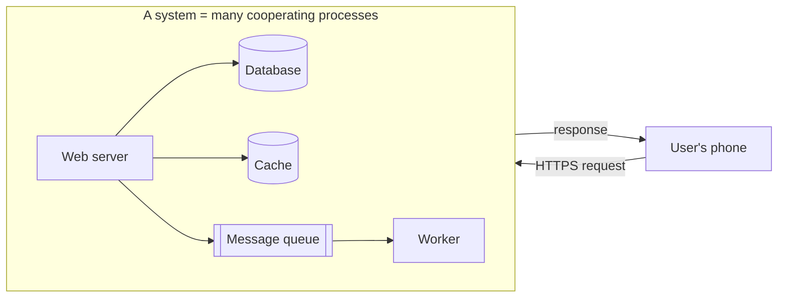
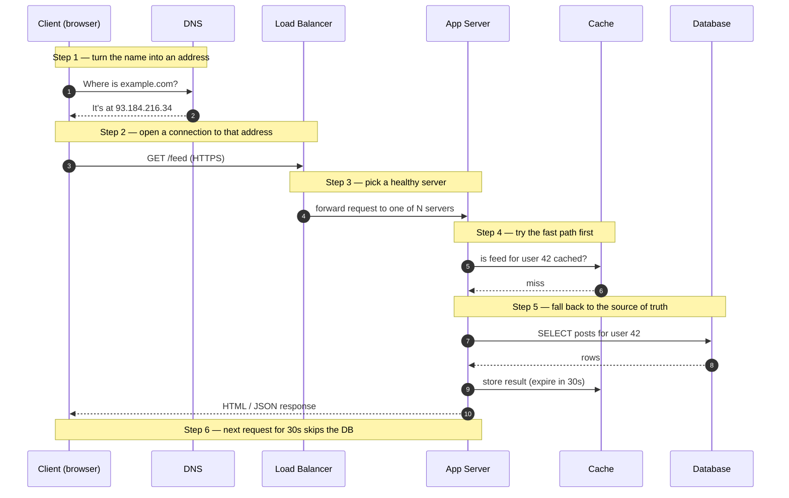
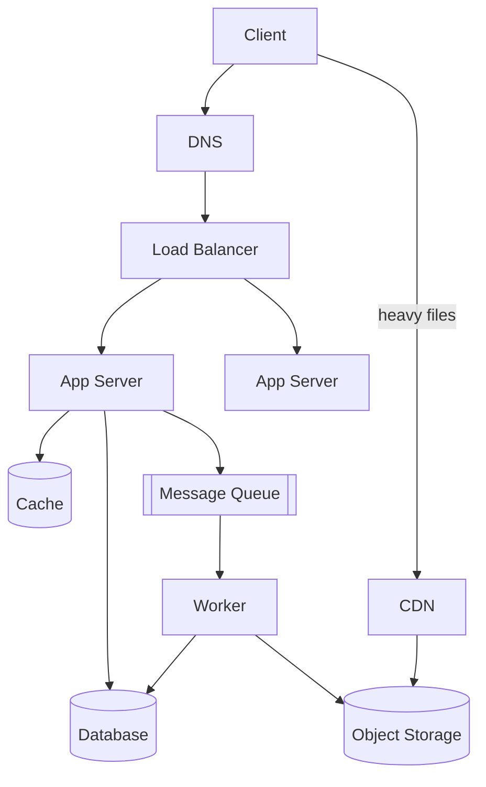
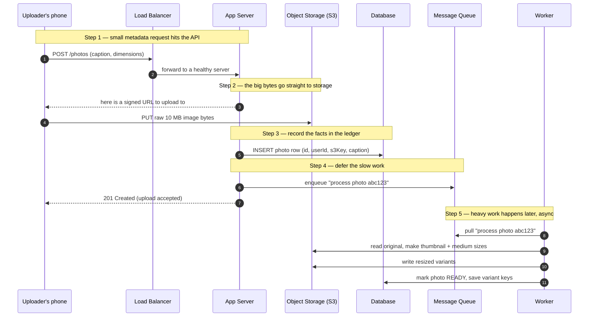
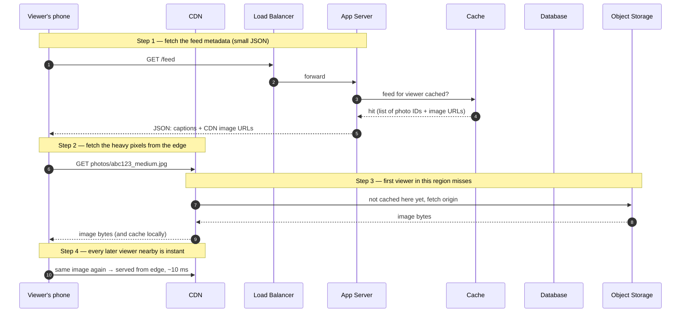
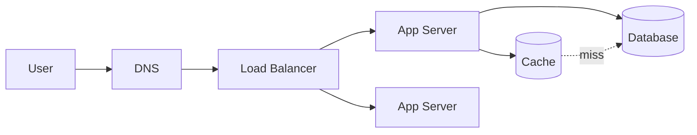

# What Is System Design? — Junior

<!-- level-focus -->
At junior level, focus on this question:

> How can I apply **What Is System Design?** in one small example and prove the result?

Use the smallest realistic scenario that exposes the decision and its failure behavior.
System design is the discipline of deciding how the pieces of a software product fit together so that it stays fast, correct, and available while real users hammer it. You already know how to write a function, a class, a request handler. System design zooms out: it asks how thousands of those handlers, running on dozens of machines, talking to databases and caches and queues, behave as one product. This page is for an engineer who writes application code every day but has never drawn the full picture of a distributed system. We will keep it concrete and tie everything to products you have used.

## 1. What "a system" actually means

When we say "a system" in this context, we do not mean a single program. We mean a **collection of independent processes, running on different machines, that cooperate to serve a product**. The defining traits:

- **Multiple machines.** A photo-sharing app does not run on one laptop. It runs on web servers, database servers, cache servers, and storage clusters, often in several data centers.
- **The network sits between the parts.** Any two components talk over TCP/IP. The network is slow compared to a function call (milliseconds vs. nanoseconds) and it can drop messages, reorder them, or stall. This single fact drives most of system design.
- **Partial failure is normal.** In a single program, either the whole thing runs or it crashes. In a system, one of fifty machines can die while the other forty-nine keep serving. Your design has to keep working anyway.
- **State lives somewhere durable.** User accounts, photos, and likes must survive a server reboot, so they live in databases and object storage, not in a process's memory.

A useful mental model: a system is a small economy of specialized workers. One worker only routes traffic, one only stores bytes, one only remembers recent answers, one only holds a backlog of jobs. System design is deciding **which workers exist, what each one's single job is, and how they hand work to each other.**

The boundary that matters is the box labeled "Your system." From the user's phone it looks like one thing answering at one address. Inside, it is many parts. **System design is the art of what goes inside that box and how the parts connect.**

---

## 2. System design vs. writing application code vs. low-level design

These three activities are often confused. They operate at different altitudes.

| Activity | Question it answers | Typical artifact | Example decision |
|---|---|---|---|
| **Application coding** | How do I implement this one feature correctly? | Functions, handlers, tests | "Validate the caption is ≤ 2,200 chars before saving." |
| **Low-level / object design** | How do I structure the classes and modules inside one service? | Class diagrams, interfaces | "`PhotoService` depends on a `PhotoRepository` interface, not a concrete DB client." |
| **System (high-level) design** | How do the services, data stores, and networks fit together at scale? | Box-and-arrow architecture diagrams | "Put a CDN in front of images so we don't read 10 MB from origin on every view." |

A concrete way to feel the difference: imagine the feature "show a user's profile photo."

- **Application coding** is writing `getProfilePhoto(userId) -> bytes`.
- **Low-level design** is deciding that this function lives in a `ProfileService`, calls a `PhotoStore` interface, and caches the result in a small in-process map.
- **System design** is deciding that profile photos are stored in object storage (like Amazon S3), fronted by a CDN, that the database only stores the *URL* of the photo (not the bytes), and that a single popular celebrity's photo viewed a million times per minute should cost the database zero reads because the CDN absorbs it.

The same feature, three altitudes. System design is the highest. It rarely touches a `for` loop; it touches **where data lives, who talks to whom, and what happens when a part fails.**

A second distinction worth holding onto: low-level design changes are cheap and local. You can refactor a class in an afternoon. System design decisions are **expensive and sticky.** Choosing the wrong database or putting state in a place that can't be replicated can cost months to undo once you have real data and real users. That is exactly why we think hard before we build.

---

## 3. Where system design sits in building a product

A product does not start with system design, and it does not end with it. It is one stage in a loop.

Two things to notice in that loop.

First, **system design depends on requirements, especially scale.** "Build a URL shortener for my team of 20" and "build a URL shortener for 100 million daily users" are the same feature and completely different systems. The second needs caching, sharding, and a CDN; the first needs a single database and a weekend. A senior engineer's first move is always to ask *how big, how fast, how reliable* before drawing a single box.

Second, **system design is revisited, not done once.** You design the simplest thing that meets today's requirements, ship it, watch it under real traffic, find the part that buckles first, and redesign just that part. Real systems grow by repeatedly fixing the current bottleneck — not by predicting all bottlenecks up front. Junior engineers often try to design the final, perfect, planet-scale system on day one. That is usually a mistake (see [Section 9](#9-common-beginner-mistakes)).

---

## 4. The request lifecycle: what happens when you tap a button

Before naming the building blocks abstractly, let's trace one real request end to end. You open a web app and load `https://example.com/feed`. Here is the journey, step by step.

Walk through it slowly, because every junior engineer should be able to recite this:

1. **DNS resolution.** Your browser only knows the name `example.com`. It asks DNS (the internet's phone book) to translate that name into an IP address. This is cached aggressively, so it's usually instant.
2. **Connecting.** The browser opens a TCP connection (and a TLS handshake for HTTPS) to that IP. The IP doesn't point at one server — it points at a load balancer.
3. **Load balancing.** The load balancer is a traffic cop. It holds a list of healthy app servers and forwards your request to one of them, spreading load so no single server is overwhelmed.
4. **Application logic.** An app server runs your code. It checks the **cache** first — a fast, in-memory store — to see if it already computed this answer recently.
5. **Database.** On a cache miss, the app reads from the **database**, the durable source of truth. It then *writes the answer back into the cache* with a short expiry, so the next identical request is fast.
6. **Response.** The app server sends the response back through the load balancer to your browser. For the next 30 seconds, the same feed request is served from cache and never touches the database.

That is the skeleton of nearly every web request you have ever made. The building blocks below are just the named parts of this journey, plus a few more for writes and heavy media.

---

## 5. The standard building blocks at a glance

Here is the vocabulary. Each block has exactly **one job**. Learn the one-line job of each and you can read 80% of architecture diagrams.

| Block | One-line job | Real example | Mental image |
|---|---|---|---|
| **Client** | Originates requests, renders responses | iOS app, web browser | The customer at the counter |
| **DNS** | Translate a name into an IP address | Route 53, Cloudflare DNS | The phone book |
| **Load balancer** | Spread requests across many app servers, skip unhealthy ones | NGINX, AWS ELB, HAProxy | Traffic cop at a junction |
| **App server** | Run business logic, orchestrate the other blocks | Your Go/Java/Python service on EC2 | The clerk who does the actual work |
| **Cache** | Return recent or hot answers in microseconds, save the DB | Redis, Memcached | A sticky note of recent answers |
| **Database** | Store the durable, queryable source of truth | PostgreSQL, MySQL, DynamoDB | The official ledger |
| **Message queue** | Hold a backlog of work to be done later, decouple producers from consumers | Kafka, RabbitMQ, SQS | The "to-do" inbox |
| **CDN** | Serve static/heavy files from a location near the user | Cloudflare, Akamai, CloudFront | A local warehouse in every city |
| **Object storage** | Cheaply store huge blobs (images, video) by key | Amazon S3, Google Cloud Storage | A giant coat-check room |

A few clarifications that trip up beginners:

- **Cache vs. database.** Both store data, but a cache is allowed to lose data and is allowed to be *stale*; it trades correctness for speed. The database is the authority. If the cache and database disagree, the database is right. You rebuild a cache; you never lose a database.
- **Database vs. object storage.** A database is for *structured, queryable* data you ask questions about ("give me all posts by user 42 from last week"). Object storage is for *large opaque blobs* you fetch by a known key ("give me the bytes at `photos/abc123.jpg`"). You would never store a 10 MB image *inside* a relational database row, and you would never run a `WHERE caption LIKE ...` query against object storage.
- **Why a queue exists.** Some work is slow (encoding a video, sending a million notifications) and the user should not wait for it. The app server drops a small message onto a queue and immediately returns "got it." A separate **worker** picks up the message later and does the heavy job. This is the difference between **synchronous** (caller waits) and **asynchronous** (caller is told "later") work.

Notice the client talks to the system in **two lanes**: the API lane (through DNS → load balancer → app server) for logic and small data, and the **CDN lane** for heavy files. Keeping these separate is a recurring system-design move: don't make your app servers babysit 10 MB downloads when a CDN can do it better and cheaper.

---

## 6. The four words you must own: latency, throughput, availability, scalability

You cannot discuss system design without these four words. Memorize their definitions precisely — they are not interchangeable.

- **Latency** — *how long one request takes.* Measured in milliseconds. "The feed loads in 200 ms." Latency is about a single user's experience. We usually care about the *tail*, not the average: **p99 latency** means "99% of requests are at least this fast," which catches the slow stragglers that an average hides.
- **Throughput** — *how many requests the system handles per second.* Measured in QPS (queries per second) or RPS. "We serve 50,000 requests per second." Throughput is about total volume, not any single user.
- **Availability** — *what fraction of the time the system is up and answering correctly.* Measured in "nines." 99.9% ("three nines") allows ~8.7 hours of downtime per year; 99.99% allows ~52 minutes; 99.999% allows ~5 minutes. Each extra nine is dramatically harder and more expensive.
- **Scalability** — *the ability to handle more load by adding resources.* A system scales well if doubling the machines roughly doubles the throughput. A system that needs a total rewrite to handle 10× traffic does not scale.

These interact, and the interactions are where engineering judgment lives:

| Term | Unit | "Good" example | Improved by |
|---|---|---|---|
| Latency | milliseconds (p50, p99) | p99 = 150 ms | Caching, CDN, indexes, fewer network hops |
| Throughput | requests/second (QPS) | 50,000 QPS | More app servers behind a load balancer |
| Availability | % uptime ("nines") | 99.99% (~52 min/yr down) | Redundancy, failover, no single point of failure |
| Scalability | load handled per unit cost | 2× servers → ~2× QPS | Stateless servers, sharding, async work |

Two relationships to internalize:

1. **Latency and throughput are not the same and can trade off.** Adding a queue can *lower* latency for the user (they get an instant "received") while the actual work happens later. Batching requests can *raise* throughput while *raising* per-request latency. Always ask which one a change actually helps.
2. **Availability is killed by single points of failure.** If every request must pass through one database and that database dies, your availability is zero regardless of how many app servers you have. The first availability move is always: *find the part that exists only once, and make a second one.*

A back-of-envelope habit worth building early: before designing, estimate the numbers. "1 million daily users, each loading their feed 10 times a day" is 10 million requests/day ≈ 116 average QPS, but peak might be 5× that ≈ 580 QPS. Those numbers decide whether you need one server or one hundred.

---

## 7. A concrete walkthrough: an Instagram photo, upload and view

Let's stop being abstract. Take a product everyone knows and watch a single photo move through every building block — first when someone uploads it, then when a follower views it.

### 7.1 The upload path (a write)

Read it slowly:

1. The phone sends a **small** request to the API with just the metadata (caption, size). The 10 MB of pixels do **not** go through your app servers — that would waste their CPU and bandwidth.
2. The app hands back a **signed URL** and the phone uploads the raw bytes **directly to object storage (S3).** Object storage's one job is cheaply holding big blobs; let it.
3. The app writes a **row in the database** recording that this photo exists, who owns it, its caption, and the storage key. The database holds the *facts*, not the pixels.
4. Resizing a photo into thumbnail and feed sizes is slow, so the app drops a message on the **queue** and immediately returns success. The user is not made to wait.
5. A **worker** later pulls the message, generates the resized variants, stores them back in object storage, and flips the database row to `READY`.

Notice every block earned its place by doing exactly one job. Remove the queue and the user waits seconds for resizing. Remove object storage and your database bloats with binary blobs it was never built for.

### 7.2 The view path (a read)

Now a follower scrolls their feed and sees that photo. Reads vastly outnumber writes on a product like this — one upload can be viewed millions of times — so the read path is optimized hard.

The key insights:

- The **metadata** (caption, like count, the *URL* of the image) comes from the API path and is served from **cache** because feeds are read constantly. The database is only touched on a cache miss.
- The **pixels** come from the **CDN**, a network of servers placed physically near users. The first viewer in Tokyo causes the CDN to fetch from origin storage once; every other Tokyo viewer for hours gets it from a server a few milliseconds away. A celebrity's photo viewed ten million times might hit your origin storage only a handful of times.
- This split is why your database and app servers survive a viral post. They handle small, cacheable JSON; the CDN absorbs the terabytes of image traffic.

If you understand these two diagrams, you understand the spine of most consumer products: **writes go to durable stores with slow work deferred to queues; reads are served from the fastest, closest layer that has the answer, falling back toward the source of truth only on a miss.**

---

## 8. Why companies test system design in interviews

If you are interviewing for a backend, full-stack, or infrastructure role above the entry level, you will face a system design round. Companies do this on purpose, and understanding *why* tells you what they're actually grading.

- **It predicts senior impact.** Writing a correct function is table stakes. The decisions that make or break a product — where data lives, what fails gracefully, what scales — are system design decisions. Companies want to know you can make them.
- **There is no single right answer, so it reveals reasoning.** A coding question has a correct output. A design question ("design a URL shortener") has dozens of valid answers. Interviewers watch *how* you navigate trade-offs: do you ask about scale first? Do you justify the cache? Do you notice the single point of failure?
- **It tests communication.** You must drive an open-ended, ambiguous conversation, draw a clear diagram, and explain choices to another engineer. That is the actual job. A brilliant design you can't explain is worthless on a team.
- **It surfaces what you've actually built.** Buzzword-dropping collapses fast under follow-up questions. "Why Kafka and not a database table?" separates people who *used* the words from people who *understand* them.

What interviewers reward, in order: **clarifying the requirements and scale before designing, starting simple and adding complexity only when justified, naming trade-offs out loud, and identifying bottlenecks and single points of failure.** What they penalize: jumping to a "web-scale" design with no justification, silence, and inability to explain why a chosen component is there.

You are not expected, as a junior, to design Twitter from scratch flawlessly. You *are* expected to know the building blocks in [Section 5](#5-the-standard-building-blocks-at-a-glance), the vocabulary in [Section 6](#6-the-four-words-you-must-own-latency-throughput-availability-scalability), and to reason out loud instead of freezing.

---

## 9. Common beginner mistakes

These are the recurring errors that mark someone new to system design. Recognizing them now saves you embarrassment later.

1. **Designing for a billion users when you have a thousand.** Over-engineering is as harmful as under-engineering. Sharding, multi-region replication, and microservices add enormous operational cost. Build the simplest thing that meets the *actual* stated scale, then evolve. The instinct to "do it properly from day one" usually produces an unshippable, unmaintainable mess.
2. **Not asking about scale and requirements first.** Drawing boxes before you know "how many users, how many requests per second, read-heavy or write-heavy, how much downtime is acceptable" means you're guessing. The numbers determine the design. Always estimate first.
3. **Storing big blobs in the database.** Putting images, videos, or large files directly in a relational database row destroys its performance and bloats backups. Big blobs belong in object storage; the database stores the *reference* (a URL or key).
4. **Treating the cache as the source of truth.** A cache can be wiped, can expire, can hold stale data. If your design *requires* the cache to be correct and present, you have a data-loss bug waiting. The database is authoritative; the cache is a speed-up you can always rebuild.
5. **Forgetting the single point of failure.** One database, one load balancer, one anything that the whole system depends on, with no backup, means one failure takes everything down. Ask of every box: "what happens when this one dies?"
6. **Making the user wait for slow work.** Resizing video, sending email blasts, generating reports — if the user's request blocks on these, latency is terrible and the request may time out. Push slow work to a queue and return immediately.
7. **Confusing latency with throughput.** "It's slow" and "it can't handle the load" are different problems with different fixes. Adding servers helps throughput, not the latency of a single slow query. Diagnose which one you actually have before reaching for a solution.
8. **Ignoring failure entirely.** Junior designs assume every call succeeds. Real networks drop packets and servers crash. You don't need to solve every failure as a junior, but you must *acknowledge* that the database can be unreachable and the network can be slow.

The meta-lesson behind all eight: **system design is mostly about trade-offs and failure, not about knowing the fanciest technology.** The senior engineer's superpower is asking "what could go wrong and what does this cost?" before adding anything.

---

## 10. Hands-on paper exercise

Reading about architecture builds recognition. Drawing it builds understanding. Do this with pen and paper (or a whiteboard tool) — actually draw it, don't just think it.

**The task: design a "Pastebin" — a service where a user pastes text, gets a short link, and anyone with the link can read the text.**

Work through these steps in order. Resist the urge to skip to a complex design.

**Step 1 — Clarify scale (write down assumptions).**
- How many new pastes per day? Assume 1 million.
- How many reads per paste? Assume 10 reads each → 10 million reads/day.
- That's roughly 12 writes/second and 116 reads/second on average. This is a **read-heavy** system. Peak might be 5× → ~580 reads/second. Modest. You do not need planet-scale machinery.

**Step 2 — Draw the write path.** When a user submits text:
- Where does the request land first? (Hint: a load balancer, then an app server.)
- The app generates a short unique ID (e.g. `aB3xK`) and stores the text. *Where* does the text go — database or object storage? For short text snippets, a database row is fine. For megabyte pastes, object storage with the DB holding the key. Decide and justify.
- The app returns the short URL.

**Step 3 — Draw the read path.** When someone opens `pastebin.com/aB3xK`:
- Request hits the load balancer, then an app server.
- Where do you look for the paste? You learned reads are 10× writes and some pastes go viral. Add a **cache** between the app server and the database. On a hit, skip the DB. On a miss, read the DB and populate the cache.

**Step 4 — Apply the four words.**
- **Latency:** what makes a read fast? (The cache.)
- **Throughput:** how do you handle 5× more reads next year? (Add app servers behind the load balancer.)
- **Availability:** where is your single point of failure? (Probably the one database. Note that you'd add a replica.)
- **Scalability:** does adding servers help? (Yes for the stateless app tier; the database needs more thought.)

**Step 5 — Self-check against the building blocks table.** Look at [Section 5](#5-the-standard-building-blocks-at-a-glance). Did you use: client, DNS, load balancer, app server, cache, database? You probably don't need a CDN (no heavy media) or a queue (no slow async work) for a basic Pastebin. **Knowing which blocks to *leave out* is as important as knowing which to include.** A junior who adds a queue and a CDN to Pastebin "to be safe" has over-engineered.

**Step 6 — Find one improvement.** Pick one weakness in your own design and name the fix in a sentence. For example: "My single database is a single point of failure; I'd add a read replica so reads survive if the primary goes down." That sentence — naming a weakness and its fix — is the exact muscle system design interviews test.

Here is a reference solution shape to compare against *after* you've drawn your own:

If your drawing has roughly these blocks, with the cache on the read path and a note about the database being a single point of failure, you have done a junior-level design correctly. That is genuinely the foundation everything else builds on.

---

## 11. Key terms recap

A compact glossary you should be able to define from memory before moving on.

| Term | One-sentence definition |
|---|---|
| **System** | Many independent processes on different machines cooperating over a network to serve a product. |
| **Synchronous** | The caller waits for the work to finish before getting a response. |
| **Asynchronous** | The caller is told "received" immediately; the work happens later, often via a queue. |
| **Source of truth** | The authoritative, durable copy of data — normally the database, never the cache. |
| **Cache hit / miss** | Hit = the answer was already in the cache (fast); miss = it wasn't, so fall back to the database. |
| **Single point of failure** | A component that exists only once and would take the whole system down if it failed. |
| **Stateless server** | An app server that keeps no per-user data in memory, so any server can handle any request — which is what makes the tier easy to scale. |
| **p99 latency** | The latency value that 99% of requests beat; catches slow stragglers an average would hide. |
| **QPS** | Queries (requests) per second — the throughput unit. |
| **Nines** | Availability shorthand: 99.9% ≈ 8.7 hrs/yr downtime, 99.99% ≈ 52 min/yr, 99.999% ≈ 5 min/yr. |
| **Read-heavy / write-heavy** | Whether a system serves far more reads than writes (like a feed) or the reverse (like a logging pipeline). |

You now have the definition of system design, the altitude that separates it from coding and object design, the named building blocks with their one-line jobs, the four words of the trade, and a worked example through a product you know. The next level goes deeper on each block — how a cache actually decides what to evict, how a load balancer checks health, how a database scales past one machine — and starts turning these recognitions into design judgment.

*Next step:* [Middle level](middle.md)

---

## Apply it

1. Choose one small, known input for **What Is System Design?**.
2. Predict the output or observable behavior.
3. Run the smallest example or probe that exercises the concept.
4. Change one input to trigger a failure or boundary case.
5. Explain the evidence using the guide's vocabulary.

## Verify your work

- Record the exact input, command or code path, and output.
- Repeat the probe and confirm the result is consistent.
- Show one expected success and one expected failure.
- Resolve any difference between the prediction and the evidence.

## Review questions

- What problem does What Is System Design? solve in the example?
- Which input changes the observed result, and why?
- What is the smallest useful success check?
- Which beginner mistake would your evidence catch?
