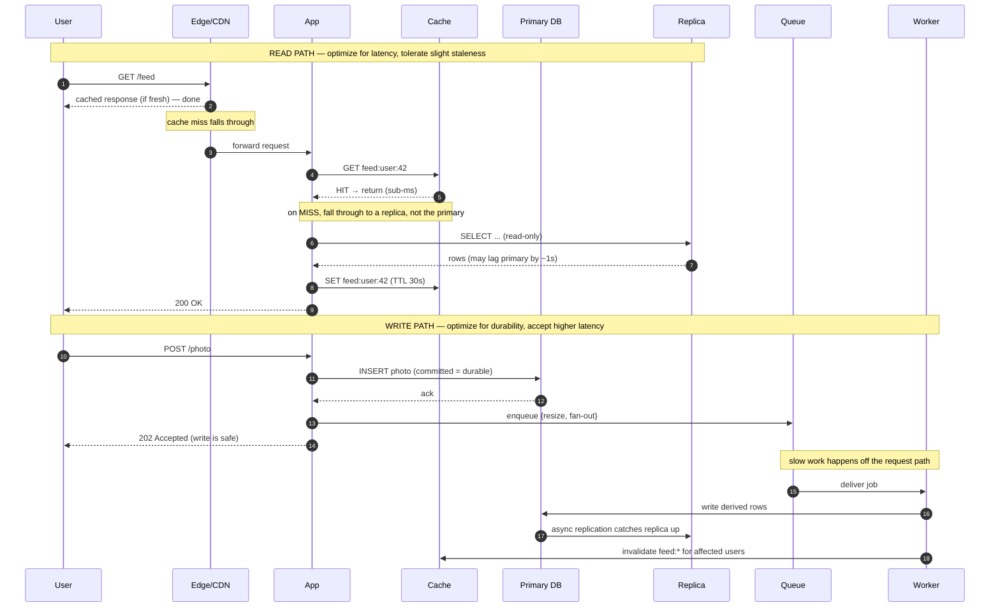
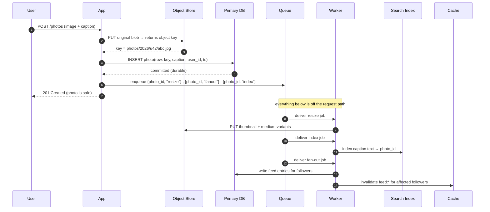

# What Is System Design? — Middle

<!-- level-focus -->
At middle level, focus on this question:

> Where does **What Is System Design?** belong in a maintainable component, and which trade-off selects the design?

Use the smallest realistic scenario that exposes the decision and its failure behavior.
You have shipped features. You have been paged at 2 a.m. because a query that ran in 8 ms on your laptop took 4 seconds in production. You have added an index and watched a dashboard go green. System design is the discipline that turns those one-off reactions into a deliberate practice: choosing the *shape* of a system — which tiers exist, what flows through each, where data lives, what happens under load — before the load arrives.

This level is applied. We will dissect the anatomy of a real system, trace one product's read and write paths through every tier, do the arithmetic that justifies adding a cache or a replica, and end with a checklist you can run against any design.

## 1. What system design actually produces

A finished design is not a diagram. The diagram is the *summary*. The actual artifact is a set of defensible decisions, each tied to a requirement and a number. When someone asks "why is there a Redis box here?" the answer is never "caches are good" — it is "the feed endpoint serves 12,000 reads/sec, Postgres tops out near 3,000 on this query, and 94% of reads hit the same 50,000 hot rows, so a cache absorbs the read amplification and keeps the primary for writes."

So a good design output contains four things:

1. **A component map** — the tiers and the edges between them (the diagram).
2. **Per-edge contracts** — what protocol, what payload shape, what timeout, what happens on failure.
3. **Data placement** — what is the source of truth, what is derived, what is replicated, what is partitioned.
4. **A capacity story** — the read/write QPS, storage growth, and the bottleneck each component is sized against.

If your design has boxes and arrows but no numbers and no failure behavior, you have drawn a picture, not designed a system. The rest of this document is about producing the other three things.

## 2. The standard reference architecture

Almost every internet-facing read-heavy product converges on the same skeleton. You do not start every design from a blank page; you start from this template and *remove* blocks that the requirements do not justify.

Read that diagram as a set of *responsibilities*, not a set of products. "Cache" might be Redis or Memcached; "Primary" might be Postgres, MySQL, or Aurora; "Queue" might be Kafka, SQS, or RabbitMQ. The skeleton stays constant; the substitutions change with the workload.

The blocks, roughly in the order a request encounters them:

- **Edge / CDN** — closest to the user, handles TLS and serves cached static + cacheable dynamic content.
- **Load balancer** — spreads live traffic across healthy app instances.
- **Stateless app tier** — your business logic; holds no per-user state between requests.
- **Caching layer** — keeps hot data in memory to spare the database.
- **Primary store + replicas** — the source of truth and its read-scaling copies.
- **Async queue + workers** — moves slow or deferrable work off the request path.
- **Object store** — cheap, durable storage for large blobs (images, video, exports).
- **Search index** — purpose-built for text and faceted queries the SQL store handles poorly.

## 3. What each tier is responsible for

The skill is knowing the *one job* of each tier and refusing to let jobs leak across boundaries. Leaking responsibilities is the single most common cause of systems that work in staging and melt in production.

| Tier | One job | Holds state? | Scales by | Typical failure when overloaded |
| --- | --- | --- | --- | --- |
| Edge / CDN | Terminate TLS, serve cacheable bytes near the user | No (cache only) | More PoPs / providers | Origin shielding fails → origin gets hammered |
| Load balancer | Route to a healthy backend | No (conn state) | Add LBs, anycast IPs | Even distribution to *unhealthy* nodes |
| App tier | Run business logic per request | No | Add instances (horizontal) | Thread/conn pool exhaustion |
| Cache | Serve hot reads from memory | Yes (volatile) | Shard keys, add nodes | Stampede on cold key after eviction |
| Primary DB | Be the source of truth; accept writes | Yes (durable) | Vertical, then shard | Write lock contention, IOPS saturation |
| Read replica | Serve read-only queries | Yes (derived) | Add replicas | Replication lag → stale reads |
| Queue | Buffer and deliver async work | Yes (durable) | Partition the topic | Backlog growth, consumer lag |
| Object store | Store/serve large immutable blobs | Yes (durable) | Effectively infinite | Hot-object bandwidth, not capacity |
| Search index | Answer text/faceted queries fast | Yes (derived) | Shard + replica per index | Reindex storms, stale documents |

Two rows deserve emphasis at this level:

- **The app tier must be stateless.** "Stateless" does not mean it touches no data; it means *no request depends on which instance handled the previous request.* Session data lives in a shared cache or token, not in instance memory. The moment an instance holds state a user needs again, you cannot freely add, remove, or restart instances — and horizontal scaling, the cheapest scaling lever you have, is gone.

- **A read replica is a *derived* store, not a second primary.** It will be seconds behind under load. You may read from it freely *only when stale-by-a-few-seconds is acceptable*. The "post a comment, then immediately don't see it" bug is almost always a write going to the primary and the subsequent read going to a lagging replica.

## 4. Requirements drive which blocks you add

You do not add a search index because the reference architecture has one. You add it because a requirement *forces* it. The discipline is to map each requirement to the block it justifies — and to delete blocks no requirement justifies.

Requirements come in two flavors:

- **Functional** — *what* the system does. "Users can post a photo." "Users can search captions." "Users see a chronological feed."
- **Non-functional (NFRs)** — *how well*. "Feed loads under 200 ms p95." "Survive one AZ failure." "99.9% of the month available." "Handle 10× traffic on launch day."

Functional requirements decide which blocks *exist*. Non-functional requirements decide how each block is *sized and made redundant*.

| Requirement (real shape) | Block it forces | Why nothing cheaper works |
| --- | --- | --- |
| "Serve 4K profile photos globally" | Object store + CDN | Blobs don't belong in a row store; CDN kills cross-ocean latency |
| "Full-text search over 50M captions, p95 < 100 ms" | Search index (Elasticsearch/OpenSearch) | `LIKE '%term%'` can't use a B-tree index → full scan |
| "Feed p95 < 200 ms at 12k reads/sec" | Cache layer | Primary can't sustain that read QPS on the join |
| "Image processing must not block upload response" | Queue + workers | Synchronous resize blows the request budget |
| "Read traffic is 95% of load, growing" | Read replicas | Offload reads so the primary keeps capacity for writes |
| "Tolerate one server dying mid-request" | Load balancer + ≥2 app instances | A single instance is a single point of failure |
| "Must not lose a single payment record" | Durable primary + backups + replication | Object stores and caches give wrong durability guarantees |

The inverse discipline matters just as much. A B2B tool with 500 internal users, no global audience, and modest data does **not** need a CDN, a search cluster, or sharding. Adding them is not "future-proofing"; it is paying operational cost for capacity you will not use for years, and every box you add is a box that can page you.

> Rule of thumb: start with edge → LB → stateless app → one primary DB. Add each additional block *only* when a specific requirement or a back-of-envelope number says the simpler shape will break.

## 5. Read path and write path are separate designs

This is the conceptual jump that separates middle from junior. A junior designs "the system." A middle engineer designs **two systems that happen to share components**: the path a read takes and the path a write takes. They have different traffic ratios, different latency budgets, different consistency needs, and different failure modes.

For most consumer products:

- **Reads** are 90–99% of traffic, latency-critical, and *tolerant of mild staleness*. They want caches, replicas, denormalized views, CDNs.
- **Writes** are rare, durability-critical, and *intolerant of being lost*. They want the primary, transactions, idempotency, and durable queues.

Designing them together leads to bad compromises — like routing writes through a cache (loses durability) or forcing every read to hit the primary for "consistency" (throws away your read-scaling).

Notice what each path optimizes:

- The **read path** burns no time on durability — it reads from memory or a replica and returns. Its enemy is latency and the *thundering herd* when a hot key expires.
- The **write path** burns no time on speed — it commits durably to the primary, then *defers* everything non-essential (resize, fan-out, search indexing) to the queue, returning `202 Accepted` the instant the data is safe.

The queue is the seam between them. It lets the write path return fast while the slow consequences of the write propagate asynchronously, eventually updating the replica, the cache, and the search index that the read path depends on.

## 6. Worked example: a photo-sharing feed

Let's make this concrete with one product and trace both paths through every tier. Product: a photo feed. A user uploads a photo with a caption; their followers see it in a reverse-chronological feed; anyone can search captions.

**Functional requirements:** upload photo + caption; view your home feed; search captions.
**Non-functional requirements:** feed p95 < 200 ms; upload returns < 500 ms; full-text search p95 < 150 ms; survive one app instance dying; don't lose uploaded photos.

These requirements force exactly this block set: CDN (serve photos), object store (store photos), cache (feed latency), primary + replica (durability + read offload), queue + worker (async resize and fan-out), search index (caption search). Nothing in the requirements forces sharding yet, so we leave it out.

### 6.1 The write path — uploading a photo

Walk the responsibilities:

1. The **original photo never touches the database.** It goes straight to the object store; the database stores only the *key* (a string) plus metadata. A 4 MB JPEG in a row store would bloat the table, wreck the buffer cache, and slow every query.
2. The database write is the **only** thing that must finish before we answer the user. The instant the `INSERT` commits, the photo is durable, so we return `201`.
3. Resize, search indexing, and fan-out are **deferred to the queue.** They are slow (resize is CPU-bound; fan-out may touch thousands of follower rows) and the user does not need them done to know their upload succeeded.
4. The worker **invalidates** the affected cache entries so the read path will recompute fresh feeds on the next miss.

### 6.2 The read path — loading the home feed

1. `GET /feed` hits the **CDN** first. The feed JSON itself is usually too personalized to cache at the edge, but every `` URL in it points at the CDN, so the actual photo bytes are served from a PoP near the user — that is where the latency win is.
2. The app checks the **cache**: `GET feed:user:42`. On a hit (the common case after the first load), it returns in single-digit milliseconds. Done.
3. On a **miss**, the app queries a **read replica** — not the primary — for the user's feed rows. Reading from the replica keeps the primary's capacity reserved for writes. A feed being ~1 second stale is invisible to the user.
4. The app **populates the cache** with a short TTL (say 30 s) and returns the response.
5. Caption **search** is a different read path entirely: `GET /search?q=sunset` goes straight to the search index, which returns photo IDs; the app then hydrates them (from cache or replica) and returns. The SQL store is never asked to do `LIKE '%sunset%'`.

The same eight tiers serve both paths, but each request only touches the subset it needs, and the optimization goals are opposite. That is the whole point of separating them.

## 7. Back-of-envelope: justifying a cache and a replica

No box goes on the diagram without a number. Here is the arithmetic that turns "we should probably cache this" into a defensible decision. The goal is not precision — it is being *right within an order of magnitude*, which is enough to choose an architecture.

### 7.1 Estimate the read load

Assume the product has reached:

- 10,000,000 registered users
- 2,000,000 daily active users (DAU)
- Each active user opens the feed ~15 times/day

Daily feed reads: `2,000,000 × 15 = 30,000,000 reads/day`.

Convert to per-second. There are 86,400 seconds in a day, so the *average* is `30,000,000 / 86,400 ≈ 347 reads/sec`. But traffic is not flat — peak is roughly 3× average for a consumer app:

**Peak feed reads ≈ 347 × 3 ≈ ~1,040 reads/sec, call it 1,000 RPS.**

### 7.2 Can the primary alone handle it?

The feed query is a join across `feed_entries` and `photos`, ordered by timestamp. On a well-indexed Postgres on commodity hardware, a query like this realistically costs ~5–15 ms and a single primary sustains on the order of **2,000–3,000 such queries/sec** before connection contention and IOPS dominate. At 1,000 RPS we are at 33–50% of a single primary's ceiling — *with zero headroom for writes, background jobs, or a traffic spike.*

So the primary is not comfortable, and it certainly can't absorb the launch-day 10× spike (10,000 RPS) the NFRs hint at. We need to shed read load. Two cheap levers: cache and replica.

### 7.3 Does a cache pay off?

The decision hinges on **hit ratio**, which depends on access skew. Feed access follows a strong power law — a small set of active users and recent photos account for most reads. A realistic assumption: **90% of reads are repeat reads of recently computed feeds** within the cache TTL.

- With a 90% cache hit ratio, of 1,000 RPS only `1,000 × 0.10 = 100 RPS` reach the database.
- Memory needed: say a serialized feed is ~20 KB and we keep the 200,000 most-active users' feeds hot → `200,000 × 20 KB = 4 GB`. That fits comfortably in a single cache node with room to spare.

**Conclusion: a cache turns 1,000 DB-RPS into 100 DB-RPS — a 10× reduction — for ~4 GB of RAM.** That single decision is what makes the whole design affordable. It is justified, not assumed.

### 7.4 Does a replica pay off?

Even the post-cache 100 RPS of misses, plus search hydration and the write traffic, are better split off the primary:

- Route the 100 RPS of cache-miss reads to a **read replica**. The primary now handles essentially writes only.
- Estimate writes: if active users post ~1 photo/day, that's `2,000,000 writes/day ≈ 23/sec average, ~70/sec peak` — trivial for the primary once reads are gone.

**Conclusion: one replica lets the primary specialize in writes while the replica absorbs cache-miss reads.** The cost — replication lag of ~1 s — is acceptable because the read path already tolerates staleness (Section 5).

| Configuration | DB read RPS at peak | Primary headroom | Survives 10× spike? |
| --- | --- | --- | --- |
| Single primary, no cache | ~1,000 | ~50% used | No — saturates near 2,500 RPS |
| Primary + cache (90% hit) | ~100 | ~95% free | Yes — 10× spike → 1,000 DB RPS |
| Primary + cache + replica | ~100 (on replica) | ~100% free for writes | Yes, with isolation between read and write load |

The table *is* the justification. Each row is a number, not an opinion. (For the full estimation discipline — QPS, storage, and bandwidth math — see the dedicated estimation material; the point here is that two pieces of arithmetic justified two boxes.)

## 8. The vocabulary of scale at a working level

You need these terms precisely, because they are the words you will use to defend a design. Vague usage ("just scale it") is how bad designs slip through review.

**Vertical scaling (scale up)** — give one machine more CPU, RAM, or faster disk. Simple, no code changes, no distributed-systems problems. But it has a hard ceiling (the biggest instance you can buy), it's a single point of failure, and the price curve is super-linear — the top-end instance costs far more than 2× a mid instance. Use it to buy time, not as a strategy.

**Horizontal scaling (scale out)** — add more machines and spread load across them. Effectively unbounded and fault-tolerant (lose one of N, keep serving). The catch: it only works for **stateless** components. You scale the app tier out trivially; you cannot scale a stateful primary database out by "just adding a box" — that requires partitioning.

**Stateless service** — a service where any request can go to any instance because no request depends on instance-local memory. State is externalized to a shared store (DB, cache) or carried in the request (a signed token). Statelessness is the *precondition* for cheap horizontal scaling. Make the app tier stateless first; everything else gets easier.

**Partitioning (sharding)** — split one dataset across multiple nodes by a key, so each node owns a slice. `user_id % 16` sends each user to one of 16 shards. This is how you scale *writes* and *storage* past one machine. The cost is real: cross-partition queries become expensive, transactions across shards are hard, and choosing a bad shard key creates hot partitions. You shard when a single primary genuinely can't hold the data or the write rate — not before.

**Replication** — keep copies of the same data on multiple nodes. Two purposes: **read scaling** (route reads to replicas) and **availability** (promote a replica if the primary dies). The fundamental tradeoff is *lag* — asynchronous replication is fast but replicas trail the primary; synchronous replication is consistent but slows every write. Most read-heavy systems pick async and design the read path to tolerate the lag.

The mental model that ties these together:

The progression is deliberate: scale up to buy time, make the app stateless so it scales out for free, add replicas to absorb reads, and only shard when writes or storage genuinely outgrow a single primary. Skipping to sharding on day one is the classic over-engineering mistake.

## 9. How to read and produce a system diagram

A system diagram is a communication tool with a grammar. Reading and drawing one well is a learnable skill, not an art.

**Reading a diagram — ask these questions of every arrow:**

- **What flows on this edge?** A request? An event? A replication stream? An arrow with no payload meaning is decoration.
- **Which direction, and is it sync or async?** Synchronous arrows (the caller waits) sit on the latency budget; asynchronous ones (fire-and-forget via a queue) do not. The difference decides whether a slow dependency is a user-facing problem.
- **What happens if this edge fails?** Every arrow is a thing that can be slow or down. A diagram that doesn't make you ask "and if this is down?" is hiding its real complexity.
- **Where does the data live, and what is the source of truth?** Find the one box that owns each piece of data. Derived stores (cache, replica, search index) should be visibly downstream of it.

**Producing a diagram — a repeatable recipe:**

1. **Draw the user and the entry point first** (browser → CDN/LB). Everything hangs off the request.
2. **Lay tiers left-to-right in request order**: edge → LB → app → data stores. Reading order matches request order; reviewers follow it instantly.
3. **Put the source-of-truth store at the center-right** and place derived stores (cache, replica, index) around it with arrows showing *how they're kept fresh*.
4. **Draw the write path and read path as distinct flows** — different colors or two diagrams. This single habit prevents the most common design mistakes (Section 5).
5. **Annotate the load-bearing edges with a number**: "12k RPS," "p95 200 ms," "~1 s lag." A diagram with numbers is a design; without them it's clip art.
6. **Mark the async boundary explicitly** — the queue between request-path and background work. It's the most important line in the picture because it's where latency and durability trade off.

A diagram that survives review is one where every box has a one-job answer (Section 3), every arrow has a payload and a failure story, and the load-bearing edges carry numbers.

## 10. A design checklist you can actually run

Run this against any design — yours or one you're reviewing. It catches the failures that hurt in production, in roughly the order they bite.

**Requirements**

- [ ] Functional requirements are listed and each maps to at least one block on the diagram.
- [ ] Non-functional requirements have *numbers* (p95 latency, target QPS, availability target, data scale).
- [ ] Every block on the diagram is justified by a requirement; unjustified blocks are deleted.

**Read / write separation**

- [ ] The read path and write path are described separately.
- [ ] Reads have a defined latency budget; writes have a defined durability guarantee.
- [ ] You know the read:write ratio and the design reflects it (caching/replicas scale the bigger side).

**Capacity**

- [ ] Peak QPS is estimated (average × peak factor), not guessed.
- [ ] The bottleneck component is identified and sized against peak, with headroom for a spike.
- [ ] Storage growth per day/month is estimated for the source-of-truth store.

**State and scaling**

- [ ] The app tier is stateless (session state externalized) and runs ≥2 instances behind a load balancer.
- [ ] No single point of failure on the request path (LB, app, and data tier all have redundancy).
- [ ] You can name the next scaling lever before you need it (up → out → replicas → shard).

**Data correctness**

- [ ] The source of truth for each piece of data is unambiguous; derived stores are clearly downstream.
- [ ] Replica lag is acceptable for every read that uses a replica; reads that need their own write go to the primary.
- [ ] Cache invalidation is defined for every write that changes cached data.

**Failure behavior**

- [ ] For each external dependency: timeout set, retry policy chosen, and a defined behavior when it's down.
- [ ] The async boundary (queue) is durable, and jobs are idempotent so retries don't double-apply.
- [ ] You've asked "what happens if this is down?" of every arrow on the diagram.

If a design passes this list, it is not necessarily the best design — but it is a *defensible* one, and it won't surprise you at 2 a.m. for a reason you could have predicted on a whiteboard.

---

## Apply it

1. Find a real component where **What Is System Design?** affects an interface or dependency.
2. Write two plausible choices and the constraint that favors each one.
3. Make the smallest reversible change at that boundary.
4. Exercise the component alone, then exercise the integrated flow.
5. Keep the decision note with the evidence that selected the option.

## Verify your work

- A focused check proves the local behavior.
- An integrated check proves callers and dependencies still agree.
- Logs, traces, compiler output, or benchmarks expose the boundary.
- Reverting the change restores the previous behavior without unrelated edits.

## Review questions

- Which boundary is most affected by What Is System Design??
- What constraint would make you choose the alternative design?
- How would you isolate a local defect from an integration defect?
- What evidence shows that the change remains maintainable?
