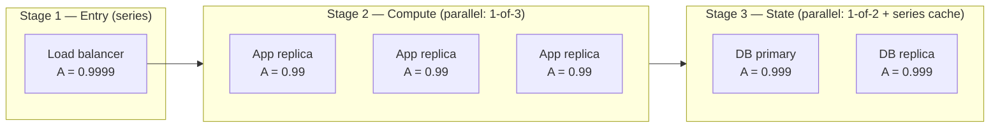
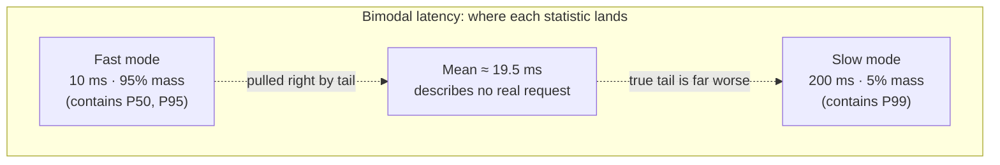
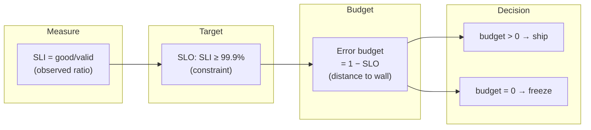

# What Is System Design? — Theory and Formal Foundations

<!-- level-focus -->
At professional level, focus on this question:

> How should teams adopt and operate **What Is System Design? — Theory and Formal Foundations** with measurable outcomes and limited coordination?

Use the smallest realistic scenario that exposes the decision and its failure behavior.
System design, stripped of folklore, is **constrained optimization over a space of architectures**. You are choosing a configuration — number of replicas, partition strategy, consistency model, cache placement — that minimizes a cost objective while never violating a set of hard constraints on availability, latency, consistency, and durability. Everything else in this document is machinery for making that sentence precise: how to *define* the constraints as measurable quantities, how to *compose* them across dependent components, and how a small set of theorems *bounds* what any architecture can possibly achieve. This is the theory axis — formulas, proof sketches, and worked numbers — not a catalogue of patterns.

## 1. System Design as Constrained Optimization

A "good" design is not a matter of taste. It is the solution to a program of the form:

```
minimize     Cost(x)
over          x ∈ X                    (the architecture space)
subject to    Availability(x) ≥ A_min
              Latency_p99(x)   ≤ L_max
              Durability(x)    ≥ D_min
              Consistency(x)   ⪰ C_min
```

Here `x` ranges over discrete and continuous knobs: replica count, instance type, shard count, replication factor, cache size, consistency level, timeout and retry policy. `Cost(x)` is usually dollars per unit time (compute + storage + egress + operational toil), though it can also be carbon or developer hours.

Three properties of this framing are worth internalizing:

- **Constraints are not preferences.** Availability ≥ 99.95% is a hard wall, not something you trade a little of for cheaper instances. The moment you treat a constraint as soft, you have changed the problem. Reliability engineering exists precisely to keep these walls enforced.
- **The objective and the constraints are interchangeable by viewpoint.** Latency can be the thing you minimize (objective) *or* a ceiling you must stay under (constraint). Which role it plays is a product decision, not a technical one. The SLO (Section 11) is how the business *declares* which quantities are constraints and at what level.
- **The feasible region can be empty.** Some requirement sets have *no* satisfying architecture — not because you are not clever enough, but because a theorem forbids it. CAP forbids simultaneous linearizability and total availability under partition; the speed of light forbids sub-millisecond strongly-consistent writes across continents. Recognizing infeasibility early is the highest-leverage skill in this discipline, and it is what the theorems in Sections 9–10 give you.

The rest of this document defines each symbol in the program above with enough rigor that you can actually compute it.

## 2. The Quality Attributes, Formally Defined

Loose words like "fast," "reliable," and "consistent" must become numbers before they can enter the optimization. The table below gives the working definitions used throughout.

| Attribute | Formal definition | Unit / scale | Common error |
|---|---|---|---|
| **Availability** | Probability that a request issued at a random instant is served correctly within the SLO. `A = uptime / (uptime + downtime)` in the long-run limit. | Dimensionless probability, quoted in "nines." | Confusing *uptime fraction* with *request success rate*; they differ under partial degradation. |
| **Latency** | The full distribution `F(t) = P(response_time ≤ t)`, summarized by quantiles P50, P90, P99, P999. | Time (ms). A *distribution*, never a single number. | Reporting the mean, which hides the tail that users actually feel. |
| **Throughput** | Sustained completion rate `λ` the system holds without unbounded queue growth. | Requests/second (or bytes/s). | Confusing *peak* (burst) with *sustained* capacity. |
| **Durability** | Probability that committed data is *not* lost over a stated horizon, quoted in nines (e.g. 11 nines ⇒ expected loss of 1 object per 10¹¹ per year). | Dimensionless probability per horizon. | Conflating durability (data survives) with availability (data reachable now). |
| **Consistency** | The strength of the guarantee about which values a read may return, ordered from linearizable (strongest) down to eventual (weakest). | A partial order of models, not a scalar. | Treating "consistency" as one thing rather than a lattice of models. |

Two of these — availability and durability — are **probabilities**, and probabilities *compose by multiplication* under independence. That single algebraic fact, developed next, drives most architectural intuition about redundancy and dependency chains.

## 3. Availability as a Probability — and How It Composes

Quote availability in nines. The downtime budget is `(1 − A)` times the window:

| Availability | Nines | Downtime / year | Downtime / 30 days |
|---|---|---|---|
| 99% | "two nines" | 3.65 days | 7.2 hours |
| 99.9% | "three nines" | 8.77 hours | 43.2 minutes |
| 99.95% | — | 4.38 hours | 21.6 minutes |
| 99.99% | "four nines" | 52.6 minutes | 4.32 minutes |
| 99.999% | "five nines" | 5.26 minutes | 25.9 seconds |

Composition follows two rules, each a direct consequence of probability algebra.

**Series (dependency) composition.** If a request must traverse components `1…n` and *each must succeed*, and failures are independent, the availabilities multiply:

```
A_series = A_1 × A_2 × … × A_n
```

Series composition is *pessimistic*: chaining N components each at availability `A` gives `A^N`, which decays fast. Five components at 99.9% yield `0.999^5 ≈ 0.99500` — you have spent your way down to two-and-a-half nines just by *adding hops*.

**Parallel (redundancy) composition.** If a function is served by `k` redundant replicas and succeeds when *at least one* works, you multiply the *failure* probabilities:

```
A_parallel = 1 − ∏(1 − A_i) = 1 − (1 − A)^k     (identical replicas)
```

Parallel composition is *optimistic*: two replicas at 99% give `1 − 0.01² = 0.9999` — four nines from two-nines parts. This is the entire mathematical reason redundancy works.

The independence assumption is the load-bearing fixture and the most frequently violated one. Correlated failure — a shared power zone, a shared dependency, a bad config pushed to all replicas at once — collapses `(1 − A)^k` back toward `(1 − A)`, because the failures are no longer independent events. Treat the independence assumption as a claim to be *audited*, not granted.

The staged diagram below shows how the two rules interleave in a realistic request path.



Stage 1 contributes `0.9999` in series. Stage 2 is three parallel replicas: `1 − (1 − 0.99)³ = 1 − 10⁻⁶ = 0.999999`. Stage 3 is two parallel database nodes: `1 − (1 − 0.999)² = 1 − 10⁻⁶ = 0.999999`. The end-to-end series product is computed in full in the next section.

## 4. Worked Example: Availability of a Dependent Service Chain

Take a checkout request that must succeed through four tiers. Three tiers are internally redundant; one (the payment gateway, a third party) is a single point of dependency you cannot replicate.

| Tier | Replicas | Per-replica A | Tier availability |
|---|---|---|---|
| Load balancer | 2 parallel | 0.9990 | `1 − (1 − 0.999)² = 0.99999900` |
| App servers | 3 parallel | 0.9900 | `1 − (1 − 0.99)³ = 0.99999900` |
| Database | 2 parallel | 0.9990 | `1 − (1 − 0.999)² = 0.99999900` |
| Payment gateway | 1 (external) | 0.9995 | `0.99950000` |

The request needs *all four tiers* (series), so multiply the tier availabilities:

```
A_total = 0.99999900 × 0.99999900 × 0.99999900 × 0.99950000
        ≈ 0.999499 × (0.99999900)³
        ≈ 0.999499 × 0.99999700
        ≈ 0.99949600
```

**Result: ≈ 99.9496%**, roughly three nines. The annual downtime budget this implies:

```
downtime = (1 − 0.999496) × 8760 h/yr ≈ 0.000504 × 8760 ≈ 4.41 hours/year
```

Read the lesson carefully: we triple- and double-replicated three tiers to push each to *six nines*, yet the end-to-end number is **pinned to ~3 nines by the single non-redundant 99.95% dependency.** Redundancy upstream and downstream of a weak link is nearly wasted spend. The optimization in Section 1 would tell you to stop buying app replicas and instead either (a) find a second payment provider to put in parallel, or (b) renegotiate the gateway SLA. This is what "reasoning rigorously rather than by intuition" buys: it tells you *where the next dollar should go*, and it is rarely where intuition points.

If you *could* add a second payment provider at 0.9995 in parallel: `1 − (1 − 0.9995)² = 1 − 2.5×10⁻⁷ ≈ 0.99999975`, and `A_total` jumps to ≈ **99.99970%** — from 3 nines to nearly 5 nines, by addressing the *one* component the math identified.

## 5. Latency Is a Distribution, Not a Mean

A latency *mean* is nearly useless and frequently dangerous, because response-time distributions in real systems are heavy-tailed: dominated by a fast body with a long, fat tail produced by GC pauses, lock contention, cache misses, retries, and queueing. Two systems with identical means can offer wildly different user experiences.

Always work with the **CDF** `F(t) = P(T ≤ t)` and report **quantiles**. The P99 is the value `t` such that `F(t) = 0.99`; one request in a hundred is slower than it.

Consider a concrete bimodal service: 95% of requests hit cache at 10 ms, 5% miss and take 200 ms.

```
mean   = 0.95 × 10 + 0.05 × 200 = 9.5 + 10 = 19.5 ms
P50    = 10 ms      (the median sits firmly in the fast mode)
P95    ≈ 10 ms      (still inside the fast mode)
P99    = 200 ms     (the slow mode owns the top 5%, so P99 lands there)
```

The mean (19.5 ms) describes *no actual request*. The P50 (10 ms) tells you the typical experience. The P99 (200 ms) — twenty times the median — tells you what your unluckiest customers and your fan-out aggregations actually suffer. **A mean that falls between two modes is a lie of central tendency.** This is why latency SLOs are *always* quantile-based: "P99 ≤ 250 ms," never "mean ≤ 100 ms."



## 6. Tail-Latency Math: Why P99 Dominates Fan-Out

The most expensive consequence of tails appears in **fan-out** — when one request must wait for `N` parallel sub-requests and returns only when the *slowest* completes (a scatter-gather over shards, a page assembled from many microservices).

If each sub-request independently has probability `p` of exceeding its P-quantile threshold, then the probability that *at least one* of `N` exceeds it is:

```
P(slowest > threshold) = 1 − (1 − p)^N
```

Set the threshold at each backend's P99, so `p = 0.01`. Then the probability the *aggregate* is slow grows with N:

| Fan-out N | P(aggregate exceeds backend's P99) = `1 − 0.99^N` |
|---|---|
| 1 | 1.0% |
| 10 | 9.6% |
| 50 | 39.5% |
| 100 | 63.4% |
| 200 | 86.6% |

At a fan-out of 100, **nearly two out of three** aggregate requests are slower than any single backend's P99. Put differently: *your service's P50 is governed by your backends' P99* once fan-out is large. This is Dean & Barroso's "tail at scale," and it is the formal reason that backend tail latency — not mean latency — is the quantity worth engineering. Mitigations (hedged requests, tied requests, request-level timeouts with retries, replica-side cancellation) all attack the same `1 − (1 − p)^N` term by lowering `p` or capping the threshold per sub-request.

The composition rule for *additive* (series) latency is different and simpler: along a sequential chain, the means add, but quantiles do **not** add — `P99(A+B) ≤ P99(A) + P99(B)`, with equality only under perfect positive correlation. For independent stages, the convolution of the distributions concentrates and the combined P99 is *less* than the sum of P99s. Never sum P99s as if they were means; you will over-provision.

## 7. Little's Law and the Concurrency Budget

Little's Law is the most universally applicable result in this document. For *any* stable system (one whose queue does not grow without bound), regardless of arrival distribution, service distribution, or scheduling discipline:

```
L = λ × W
```

where `L` = average number of requests *in the system* (concurrency), `λ` = average arrival rate (= throughput, in steady state), and `W` = average time a request spends in the system (latency, including queue wait).

The law is exact and assumption-light — it requires only conservation of flow (in steady state, requests leave as fast as they arrive). That generality is why it appears everywhere: thread-pool sizing, connection-pool sizing, in-flight-request limits, buffer sizing, and capacity planning all reduce to rearrangements of `L = λW`.

Three rearrangements you will use constantly:

```
Concurrency needed:   L = λ × W           (how many in-flight slots?)
Max throughput:       λ = L / W           (given L slots, how much load?)
Implied latency:      W = L / λ           (given concurrency and load, how slow?)
```

A subtle but critical corollary, **Little's Law applied to a single server**: utilization `ρ = λ × S`, where `S` is mean service time. For a single-server queue, response time `W` blows up as `ρ → 1` per the M/M/1 relation `W = S / (1 − ρ)`. This is why systems planned to run at 90%+ utilization exhibit catastrophic latency under the smallest load bump: at `ρ = 0.9`, `W = 10S`; at `ρ = 0.95`, `W = 20S`. The knee is brutal and non-negotiable. Capacity headroom is not waste — it is the price of bounded tail latency.

## 8. Worked Example: Sizing a Service with Little's Law

You are asked to size a synchronous API service. Measured facts: sustained arrival rate `λ = 8,000 req/s`, and mean end-to-end service time per request `W = 40 ms = 0.040 s` (including downstream calls).

**Step 1 — Required concurrency.** How many requests are in flight on average?

```
L = λ × W = 8,000 req/s × 0.040 s = 320 concurrent requests
```

So at any instant, ~320 requests are being processed. If each occupies a thread (blocking I/O model), you need a thread pool that can hold at least 320 — and by queueing theory you want headroom, so target the pool above the *peak* concurrency, not the average. Provisioning a 200-thread pool here guarantees queue buildup and the `1/(1−ρ)` latency explosion from Section 7.

**Step 2 — Per-instance throughput.** Suppose one instance runs 64 worker threads and you refuse to exceed 70% utilization for tail safety. The usable concurrency per instance is `L_inst = 64 × 0.70 = 44.8`. The throughput one instance sustains:

```
λ_inst = L_inst / W = 44.8 / 0.040 = 1,120 req/s
```

**Step 3 — Fleet size.** To carry 8,000 req/s:

```
instances = ⌈ 8,000 / 1,120 ⌉ = ⌈7.14⌉ = 8 instances
```

Add N+2 for availability (so a deploy plus a failure still leaves capacity): provision **10 instances**. Notice every number traces back to `L = λW` and a utilization target chosen to dodge the latency knee. No intuition was involved; the answer is *derived*, and you can defend each step in a design review.

**Sanity check via tail latency.** At 70% utilization with mean service `S ≈ 40 ms`, the M/M/1 approximation gives `W ≈ S/(1−ρ) = 40/0.30 ≈ 133 ms`. If your SLO is P99 ≤ 250 ms, 70% is comfortable; if the SLO were P99 ≤ 100 ms, the math tells you *before you ship* that 70% is too hot and you must add instances to lower `ρ`.

## 9. Scalability Bounds: Amdahl and the Universal Scalability Law

Throughput does not scale linearly with hardware, and two laws bound how badly it deviates. Both are proven in depth later; here we establish them precisely as ceilings on the feasible region.

**Amdahl's Law.** If a fraction `α` of work is inherently serial (cannot be parallelized), the speedup from `N` processors is capped:

```
Speedup(N) = 1 / ( α + (1 − α)/N )
```

As `N → ∞`, `Speedup → 1/α`. A workload that is 5% serial can never run more than **20×** faster, no matter how many cores you add. Amdahl explains a hard *ceiling*; it is monotonic (more N never hurts), just sharply diminishing.

**Universal Scalability Law (USL).** Amdahl ignores a second, worse effect: **coherency / crosstalk** — the cost of N workers coordinating with each other (cache coherence, lock contention, distributed consensus chatter). The USL adds a `κ` term:

```
C(N) = N / ( 1 + σ(N − 1) + κ·N·(N − 1) )
```

where `σ` is the *contention* coefficient (serialization, Amdahl-like) and `κ` is the *coherency* coefficient (pairwise coordination cost, scaling as `N²`). When `κ > 0`, throughput **peaks and then declines** — adding capacity makes the system *slower*. The optimum is:

```
N_max = √( (1 − σ) / κ )
```

This is the formal statement behind "we added more nodes and it got worse." The USL turns that war story into a number you can fit from load-test data and use to refuse over-provisioning.

| Law | Models | Behavior as N grows | Bound |
|---|---|---|---|
| Linear (ideal) | nothing | grows forever | none |
| Amdahl | serial fraction `α` | rises, saturates at `1/α` | ceiling |
| USL | serial `σ` + coherency `κ` | rises, **peaks at `N_max`, then falls** | retrograde |

The practical takeaway for the optimization in Section 1: **horizontal scaling has a mathematically locatable point of negative return.** If your `κ` is non-trivial (shared lock, chatty consensus, hot row), the answer is not "more nodes" — it is reducing `κ` (sharding the contended resource, batching coordination, choosing a weaker consistency model). The theory tells you *which lever* before you waste a quarter on the wrong one.

## 10. CAP and PACELC: The Consistency–Availability–Latency Frontier

**CAP (Brewer, proven by Gilbert & Lynch).** In an asynchronous network that may **partition** (P), a distributed data store cannot simultaneously guarantee both **linearizable Consistency** (C) and **total Availability** (A). The proof sketch is short and worth carrying in your head:

> Suppose nodes G1 and G2 are partitioned and cannot communicate. A client writes `v2` to G1, then reads from G2. If the system is **available**, G2 *must* answer without hearing from G1 — so it returns the stale `v1`, violating **consistency**. If instead the system insists on **consistency**, G2 must *refuse or block* until the partition heals — violating **availability**. No third option exists during the partition. ∎

CAP is therefore not "pick 2 of 3" — partitions are not optional in real networks, so **P is mandatory**, and the genuine choice is **C vs A during a partition**: a CP system (e.g. a consensus store) sacrifices availability to stay linearizable; an AP system (e.g. a Dynamo-style store) sacrifices linearizability to stay available.

**PACELC (Abadi)** completes the picture by naming the cost that CAP omits — the *normal-operation* trade-off when there is **no** partition:

```
PACELC:  if Partition  → choose between Availability and Consistency  (PA / PC)
         Else (normal) → choose between Latency      and Consistency  (EL / EC)
```

The "ELC" half is what you pay every single day, not just during the rare partition. Strong consistency requires coordination (a quorum write, a consensus round), and coordination costs **latency** — bounded below by the speed of light across your replica set. A cross-region linearizable write is *physically* floored by inter-region RTT; no engineering removes that floor.

| System class | Partition behavior | Normal-op behavior | Example category |
|---|---|---|---|
| PA/EL | stay available, weaker C | favor latency over C | Dynamo-style, Cassandra (tunable) |
| PC/EC | refuse/block to keep C | pay latency for C | Spanner-class, consensus stores |
| PA/EC | available under partition | strict C when healthy | hybrid / tunable quorums |
| PC/EL | consistent under partition | fast (weak C) when healthy | rarer, specialized |

For the Section-1 program, PACELC is the rule that tells you when `Consistency(x) ⪰ C_min` and `Latency_p99(x) ≤ L_max` define an **empty feasible region** for a given geographic spread: if `C_min` is linearizable and `L_max` is below the cross-region RTT, *no architecture satisfies both*, and the only fixes are relaxing consistency, relaxing latency, or moving the data closer (co-locating, regional sharding). Naming the infeasibility is the deliverable.

## 11. SLI, SLO, and SLA — Three Formally Distinct Objects

These three are routinely conflated; they are different mathematical objects with different owners and consequences.

| Term | Formal nature | Example | Owner | Consequence if breached |
|---|---|---|---|---|
| **SLI** (Indicator) | A *measured ratio* over a window: `good_events / valid_events`. A number in [0, 1]. | `(requests with latency ≤ 250 ms) / (all valid requests)` over 28 days | Measurement / telemetry | None — it is just the observation. |
| **SLO** (Objective) | A *threshold* on an SLI: `SLI ≥ target` over a window. An internal target. | "≥ 99.9% of requests under 250 ms over 28 days" | Engineering / product | Internal: burn error budget, freeze risky changes. |
| **SLA** (Agreement) | A *contract* wrapping an SLO with **financial/legal penalties**. | "99.5% monthly uptime or 10% service credit" | Legal / business | External: money, credits, breach of contract. |

The formal relationships you must keep straight:

- An **SLI is a query**, not a goal. It returns a number. `SLI = good/valid` measured over a defined window with a defined "good" predicate.
- An **SLO is an inequality** placed on that number. It is *internal* and is deliberately set **stricter** than any SLA — you want your alarms to fire before your contract is breached.
- An **SLA is the SLO plus consequences**, set **looser** than the SLO so there is a safety margin between "we are unhappy" (SLO breach) and "we owe money" (SLA breach). A common ratio: SLA 99.5%, SLO 99.9% — the gap is your protective buffer.

A subtle formal point: the SLO window matters as much as the target. "99.9% over 30 days" and "99.9% over 1 hour" are *different objectives* — the latter is far stricter, because a single bad hour cannot be amortized against good days. Rolling windows vs calendar windows further change the math of when budget resets. Specify the window explicitly or the SLO is undefined.

## 12. The Error Budget as a Control Variable

The SLO induces a precisely quantified permission to fail, called the **error budget**:

```
error_budget = 1 − SLO_target
```

At an SLO of 99.9% over 30 days, the budget is `0.1%` of requests (or of time). Converted to an absolute allowance:

```
Budget (time)     = (1 − 0.999) × 30 days = 0.001 × 43,200 min = 43.2 minutes / 30 days
Budget (requests) = (1 − 0.999) × (req in window)
```

The error budget is not an accounting curiosity — it is the **control variable that closes the loop** between reliability and velocity. The policy is mechanical and removes politics from release decisions:

- **Budget remaining > 0:** you may ship features, take risk, run experiments. Reliability is *better than required*, and excess reliability is wasted opportunity cost.
- **Budget exhausted:** automatic change freeze on risky deploys; engineering effort redirects to reliability until the budget recovers in the next window.

This reframes "should we ship?" as an inequality test against a measured quantity, exactly the spirit of the constrained-optimization view: the SLO is the constraint, the error budget is your *distance to the constraint boundary*, and you spend that distance deliberately. Burn-rate alerting — alarming when you are consuming budget faster than the window allows (e.g. "2% of monthly budget in 1 hour") — is the derivative of this control variable, catching problems before the budget is gone.



## 13. Putting It Together: The Design Loop

The theory composes into a repeatable, defensible procedure. Each step is a calculation, not a guess.

1. **Declare the constraints.** Turn product requirements into formal thresholds: `A_min`, `L_max` (as a quantile + window), `D_min`, `C_min`. Write the SLOs.
2. **Check feasibility against the theorems.** Does CAP/PACELC forbid your `(C_min, L_max)` pair at your geography? Does the USL's `N_max` cap your throughput target below demand? Does series availability composition put `A_min` out of reach given an irreducible external dependency? If infeasible, *renegotiate requirements now* — this is the cheapest moment to do it.
3. **Compose the candidate architecture.** Use series/parallel availability rules to compute end-to-end `A`. Use `L = λW` to size pools and fleets. Use the tail-latency `1 − (1−p)^N` rule to bound fan-out exposure.
4. **Find the binding constraint.** Identify which single component or term pins the end-to-end number (Section 4's payment gateway, Section 9's `κ`). The marginal dollar goes *there*, nowhere else.
5. **Optimize cost within the feasible region.** Among architectures that satisfy all constraints, pick the cheapest. Re-derive after each knob change — composition is non-linear and intuition lies.
6. **Instrument and close the loop.** Wire SLIs to SLOs to the error budget. Let the budget govern velocity. Measured reality feeds back into the next iteration of step 1.

The discipline is precisely this: **never assert "this design is good" — compute it.** Every claim in a design review should reduce to a number with the formula beside it.

## 14. Key Formulas and Takeaways

| Concept | Formula | What it bounds |
|---|---|---|
| Series availability | `A = ∏ A_i` | Dependency chains decay fast (`A^N`). |
| Parallel availability | `A = 1 − ∏(1 − A_i)` | Redundancy multiplies *failure*, not success. |
| Downtime budget | `(1 − A) × window` | Translates nines into minutes. |
| Tail under fan-out | `1 − (1 − p)^N` | Backend P99 becomes aggregate P50 at scale. |
| Little's Law | `L = λ × W` | Concurrency, throughput, latency are one relation. |
| Single-server latency | `W = S / (1 − ρ)` | Latency explodes near full utilization. |
| Amdahl's Law | `1 / (α + (1−α)/N)` → `1/α` | Serial fraction caps speedup. |
| Universal Scalability Law | `N / (1 + σ(N−1) + κN(N−1))` | Coordination makes scaling *retrograde*. |
| USL optimum | `N_max = √((1−σ)/κ)` | The node count past which more hurts. |
| Error budget | `1 − SLO_target` | Your permission-to-fail, as a control variable. |

The throughline: **system design is constrained optimization, the constraints are probabilities and distributions, and a handful of theorems tell you which corners of the design space are unreachable before you waste effort exploring them.** Availability composes by multiplication; latency lives in the tail of a distribution; concurrency obeys `L = λW`; scaling is bounded by Amdahl and the USL; consistency trades against availability and latency by CAP and PACELC; and the SLO/error-budget machinery turns all of it into a closed control loop. Master the algebra and "good design" stops being a matter of opinion and becomes a quantity you can compute, defend, and improve.


---

## Apply it

1. Define the user or business outcome that **What Is System Design? — Theory and Formal Foundations** should improve.
2. Assign one owner for code, contracts, operations, and incidents.
3. Split delivery into reversible increments that produce evidence early.
4. Publish responsibilities, escalation paths, and compatibility windows.
5. Stop or expand only when the agreed measures support that decision.

## Verify your work

- Each increment has an owner, rollback path, and observable exit condition.
- Adoption, reliability, delivery time, and coordination cost are measured.
- Incident and migration exercises prove that responsibility is executable.
- The old path is removed only after telemetry proves it is unused.

## Review questions

- Which measurable outcome justifies investing in What Is System Design? — Theory and Formal Foundations?
- Which team owns the full lifecycle and incident response?
- What reversible increment produces the earliest useful evidence?
- Which exit condition proves that migration or adoption is complete?
