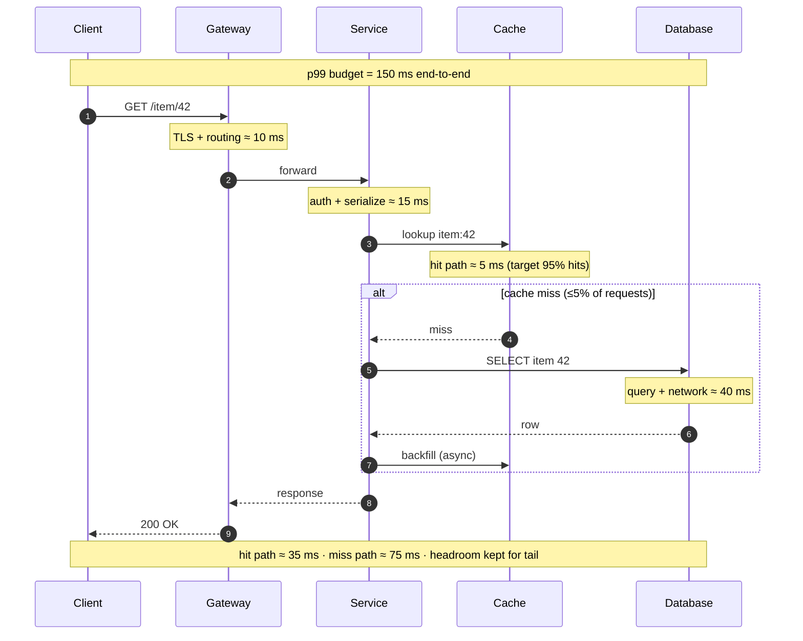

# What Is System Design? — Senior

<!-- level-focus -->
At senior level, focus on this question:

> Which system invariant is affected by **What Is System Design?** under failure, load, and change?

Use the smallest realistic scenario that exposes the decision and its failure behavior.
System design, at the senior level, is not the act of arranging boxes on a whiteboard. It is the act of **owning a set of consequences**. You commit to numbers (latency, durability, cost), you commit to a shape the system can evolve into, and you commit to being the person who explains — six months later, in an incident channel at 03:00 — why the trade-off was correct given what was known at the time. The diagram is a byproduct. The judgment is the work.

This document treats system design as ownership and judgment: how non-functional requirements drive architecture, how to reason in trade-offs instead of components, how to run and survive design reviews, and how to write designs that other people can operate and change.

## 1. The senior reframe: design is owning consequences

Junior designers ask *"what components do I need?"* Senior designers ask *"what am I willing to give up, and who pays when I'm wrong?"* The shift is from **assembly** to **accountability**.

A useful mental model: every design decision spends one resource to buy another. Adding a cache spends consistency to buy latency. Adding a queue spends end-to-end visibility to buy resilience and throughput smoothing. Sharding spends operational simplicity and cross-entity transactions to buy horizontal scale. There is no decision that only adds — if it looks free, you haven't found the bill yet.

Three habits separate senior design from competent design:

- **You design backward from constraints, not forward from technology.** You do not "use Kafka." You have a write-amplification problem and a need to decouple producers from consumers at 200k events/sec with at-least-once delivery, and Kafka is one of three candidates that satisfy it.
- **You quantify before you choose.** "We need it to be fast" is not a requirement. "p99 read latency ≤ 150 ms at 50k QPS, measured at the API gateway" is a requirement that eliminates designs.
- **You name the failure modes you are accepting.** A design that has no documented failure modes is a design that hasn't been thought through — every real system has them; the only question is whether *you* chose them or they chose you.

The deliverable of senior design is therefore not a diagram. It is a **defensible set of trade-offs**, written down, with the assumptions that make them valid stated explicitly so they can be rechecked when the world changes.

## 2. Non-functional requirements drive the architecture

Functional requirements ("users can post a comment") tell you *what* the system does. They rarely change the architecture — almost any architecture can store a comment. **Non-functional requirements** (NFRs) tell you *how well*, and they are what actually force structural decisions.

The NFRs that move architecture, in rough order of impact:

| NFR | Concrete form | What it forces |
|-----|---------------|----------------|
| Latency | p99 ≤ 150 ms read, ≤ 400 ms write | Read replicas, caching, denormalization, data locality / edge |
| Throughput | 50k QPS sustained, 200k peak | Horizontal scale, partitioning, async write paths |
| Availability | 99.95% (≈ 22 min/month down) | Multi-AZ, redundancy, no single points of failure, graceful degradation |
| Durability | 99.999999999% (11 nines) for objects | Replication factor ≥ 3, cross-region copies, fsync policy |
| Consistency | Read-your-writes for the author; eventual for others | Routing reads, session stickiness, conflict resolution |
| Data volume | 50 TB now, +30 TB/year | Sharding strategy, tiered storage, retention policy |
| Cost | ≤ $0.002 per request all-in | Cache hit ratio targets, instance right-sizing, tiering |
| Security/compliance | PII residency in EU, audit log immutable | Regional partitioning, encryption boundaries, WORM storage |

The senior move is to **derive structure from these numbers**. Suppose you are told: 50 TB of data, p99 read ≤ 150 ms, 99.95% availability, read-your-writes for the author only. Each number prunes the design tree:

- 50 TB does not fit a single node's working set in RAM → you cannot serve all reads from memory → you need a partitioning + caching layer with an explicit hit-ratio target.
- p99 ≤ 150 ms across 50 TB → cold reads from spinning disk at the tail will blow the budget → hot data must be cached and the cache miss penalty must itself fit under the SLO.
- 99.95% availability → a single replica of any critical path is disqualified; failover must be automatic and faster than your error budget tolerates.
- Read-your-writes for the author only → you do **not** need global strong consistency. This is the single most valuable line in the spec because it lets you choose async replication and avoid a consensus protocol on the hot path. Most consistency cost is paid for guarantees nobody asked for.

That last point generalizes: **the cheapest design is the one that delivers exactly the guarantees required and not one more.** A huge fraction of over-engineering is paying for a stronger NFR than the business needs. Before you architect for strong consistency, multi-region active-active, or zero data loss, make someone with the budget say out loud that they are buying it.

## 3. SLOs and latency budgets as design inputs

An SLO (Service Level Objective) is a target on a Service Level Indicator (SLI) — a precise, measurable property of the service. "99.9% of read requests complete in under 200 ms, measured at the gateway, over a rolling 28-day window." The complement of the SLO is the **error budget**: at 99.9% availability you may be unavailable 0.1% of the time — about 43 minutes per month. The error budget is not a failure allowance to apologize for; it is a design and release currency you spend deliberately.

SLOs become architecture through **latency budgeting**. You take the end-to-end target and decompose it across the call chain. If the user-facing p99 is 150 ms, you cannot spend 150 ms in your database; you must allocate.

The budget surfaces design decisions immediately:

- If the database alone costs 40 ms and the network adds another 20 ms, a 95% cache hit ratio is not a nice-to-have — it is **load-bearing** for the SLO. That makes cache warming, eviction policy, and hit-ratio alerting first-class concerns, not afterthoughts.
- You must budget for the **tail**, not the mean. The p99 of a chain of independent calls is worse than the sum of each call's median, because slow components correlate with load. A request that touches 5 services each with p99 = 30 ms can have an end-to-end p99 well above 150 ms. The classic mitigation is to reduce fan-out, hedge requests, or set per-hop timeouts that fail fast.
- **Timeouts and retries are part of the budget.** A 200 ms timeout with one retry can produce a 400 ms+ user experience. Budgets force you to choose: fail fast and degrade, or wait and blow the SLO.

The error budget also governs **how aggressively you ship**. When the budget is healthy, you take risks — deploy on Friday, run experiments. When you've burned it, you freeze and stabilize. This couples design (how much redundancy, how fast failover) to process (release cadence) through a single number, which is exactly why SLOs are a design input and not a monitoring afterthought.

## 4. The design space is a set of trade-offs

There is rarely a "best" architecture. There is a **Pareto frontier** of designs, each giving up something to gain something else, and your job is to pick the point on that frontier that matches your constraints. Choosing a design *is* choosing what to sacrifice.

The fundamental trade-off axes a senior reasons over:

| Axis | One end | Other end | What you trade |
|------|---------|-----------|----------------|
| Consistency vs availability | Strong (linearizable) | Eventual / high availability | Under partition, you serve stale data **or** you reject writes — CAP says you can't keep both |
| Latency vs durability | ack on memory write | ack after fsync + replication | Faster acks risk data loss on crash; durable acks add tail latency |
| Read vs write optimization | normalized, write-cheap | denormalized, read-cheap | Denormalization speeds reads but multiplies write paths and fan-out |
| Coupling vs autonomy | shared DB, sync calls | events, own data store | Decoupling buys independent scaling/deploy; costs eventual consistency + ops surface |
| Simplicity vs scalability | single node, vertical | sharded, distributed | Distribution scales but adds partial failure, coordination, and debugging cost |
| Cost vs performance | tiered/cold storage | all-hot/in-memory | Speed costs money continuously; nobody funds infinite headroom |

The senior skill is to make the trade explicit and quantified. "We chose eventual consistency" is a junior statement. The senior version: "We chose async replication with read-your-writes routing. This gives us p99 write acks of 12 ms instead of ~45 ms for synchronous quorum, at the cost of a replication lag window of typically <100 ms during which a *different* user may see stale data. We verified with product that cross-user staleness under 1 second is acceptable for this feature; it would not be acceptable for the payments ledger, which is why that path uses a synchronous quorum write."

Notice the structure: **named decision → quantified benefit → quantified cost → who signed off on paying it → where the boundary of validity is.** That is what trade-off reasoning looks like written down.

## 5. Designing for evolution and the next 10x

Systems are not built and finished; they are grown and continuously modified. The senior question is not "does this design handle today's load?" — almost anything does. It is **"what breaks at 10x, and is that break a tuning change or a rewrite?"**

A useful discipline: for each major load dimension (QPS, data volume, users, fan-out), state what happens at 10x and 100x.

- **10x should be a configuration / capacity change.** Add replicas, raise instance size, increase shard count. If 10x requires re-architecting, you have built a system with a short fuse and you should know it now.
- **100x is allowed to require redesign**, and you should *not* build it today. Designing the 100x system now is over-engineering: you pay complexity and delivery cost up front for scale you may never reach, and you'll likely guess the wrong bottleneck anyway.

The goal is a design whose **next 10x is a known, boring operation**, and whose first re-architecture point is clearly identified and far enough away. You earn this not by building big, but by keeping the right seams:

- **Keep services stateless** so scaling out is "add instances behind the LB," not a data-migration project.
- **Choose shard keys / partitioning early**, even if you run one shard today. Re-keying a populated dataset is one of the most painful migrations in our field; picking the key on day one when the table is empty is nearly free.
- **Put indirection at the volatile boundaries** — an interface in front of the third-party payment provider, a repository in front of the data store — so swapping the implementation later is local, not viral.
- **Don't put indirection everywhere.** Premature abstraction is its own tax. Add a seam where you have concrete evidence the thing behind it will change (regulatory pressure, a known vendor risk, a roadmap commitment), not "just in case."

Evolvability is fundamentally about **keeping reversible what is likely to change, and committing only to what is genuinely stable.** Which leads directly to the most important framing tool a senior has.

## 6. Reversibility: one-way vs two-way doors

Borrowed from Amazon's decision framework: decisions come in two kinds, and the cost of getting them wrong is wildly different.

- **Two-way doors** are reversible. If it's wrong, you walk back through. *Examples:* an internal API shape between two of your own services, a caching policy, an instance type, a feature flag rollout, a library choice with a thin adapter around it. These should be made **fast, by the people closest to the problem**, with low ceremony. Over-deliberating a two-way door is waste.

- **One-way doors** are expensive or impossible to reverse. *Examples:* your public API contract (external consumers now depend on it), your sharding key, your primary datastore's data model, your event schema once events are persisted forever, the choice to expose PII in a particular field, the partitioning of data across regulatory boundaries. These deserve **slow, careful, documented decisions** with review and explicit assumption-checking.

Two senior techniques fall out of this framing:

1. **Convert one-way doors into two-way doors when you can.** You can't easily change a sharding key — but you *can* introduce a logical-to-physical mapping layer that lets you re-shard later. You can't un-publish a public API — but you *can* version it and run versions side by side. The art is paying a small reversibility tax up front to avoid a catastrophic irreversible commitment.
2. **Match deliberation cost to door type.** Juniors often agonize over two-way doors (which library? which naming convention?) and rush through one-way doors (let's just put it in the same database). Seniors invert this: ship the reversible decisions quickly to gather data, and spend the deliberation budget where reversal is genuinely impossible.

## 7. Unstated assumptions are where systems die

Most failed designs are not wrong in their logic; they are correct given assumptions that quietly turned out to be false. The senior discipline is to **surface assumptions and write them down as testable statements** so they can be rechecked.

Assumptions hide in five common places:

- **Traffic shape.** "Reads dominate writes 100:1." True today — but a new feature could invert it. Is your design merely *tuned* for that ratio, or does it *break* if the ratio shifts?
- **Data distribution.** "Keys are uniformly distributed across shards." Real-world keys are almost never uniform — a celebrity user, a viral item, or a single big tenant creates a **hot shard** that no amount of "we have N shards" protects against.
- **Failure independence.** "AZs fail independently." Mostly — until a control-plane dependency, a shared deploy, or a config push correlates the failure across all of them at once.
- **Dependency behavior.** "The payment provider responds in <100 ms." Under their incident, it returns in 30 seconds or hangs. Did you assume a timeout, or did you assume success?
- **Human/operational.** "On-call will notice within 5 minutes." Only if the alert exists, fires, isn't drowned in noise, and points at the actual cause.

The practice: for every load-bearing assumption, write it as a falsifiable statement, attach the consequence if it's false, and where possible attach a **monitor that fires when it stops being true**. "We assume cache hit ratio ≥ 95%. If it drops below 90%, the database exceeds its latency budget and p99 breaches the SLO. Alert wired at 92%." Now the assumption is no longer silent — it announces its own death before the outage does.

The single most powerful question in any design review is: **"What has to be true for this to work, and how would we know if it stopped being true?"**

## 8. Worked example: two valid designs, one chosen

**Problem.** Build a notification fan-out service. When a user with up to ~50 million followers posts, every follower should get a notification. Requirements derived with the team:

- Functional: post → followers notified.
- Latency: median follower notified within 30 s; p99 within 5 min. This is *not* a real-time-trading SLO — minutes are acceptable.
- Throughput: 5k posts/sec average, 50k/sec peak (a major event). Average followers per post ≈ 200; tail accounts (celebrities) reach 50M.
- Delivery: at-least-once acceptable; duplicates must be deduplicated client-side.
- Cost: this is a cost-sensitive internal service; we are not allowed to provision for peak-as-baseline.

Two valid designs emerge.

**Design A — Synchronous fan-out on write.** On each post, the service expands the follower list and writes a notification row per follower inline, then returns.

**Design B — Asynchronous fan-out via queue + workers.** On each post, the service enqueues a single "post event" and returns immediately. A pool of workers consumes events, expands followers in batches, and writes notifications. Celebrity accounts above a threshold are handled by a separate, isolated "hot fan-out" path.

| Dimension | Design A (sync fan-out) | Design B (async queue + workers) |
|-----------|-------------------------|----------------------------------|
| Write latency (poster) | Scales with follower count — 50M followers = minutes inline; **unbounded tail** | O(1) enqueue, ~10 ms regardless of follower count |
| Peak absorption | None — 50k/sec posts hit the DB directly, write storm | Queue acts as a buffer; workers drain at sustainable rate |
| Hot-key (celebrity) | Single post stalls a request thread for minutes | Isolated hot path; doesn't block the common case |
| Failure blast radius | Poster's request fails if any write fails | Retries per message; poster already got 200 |
| Operational surface | Simpler — no broker, no workers | Broker, consumer lag, DLQ, backpressure to manage |
| Cost at peak | Must provision DB for 50k/sec write peak | Provision workers for *average*; queue absorbs spikes |
| End-to-end visibility | Synchronous, easy to trace | Async — needs correlation IDs and lag dashboards |

**Decision: Design B, with the hot-path split.**

Justification, stated the way it would go in the design doc:

> We choose asynchronous fan-out (B). The decisive constraint is the **50M-follower tail combined with a 50k/sec peak**: Design A makes the poster's write latency a function of follower count, which violates any reasonable write SLO for celebrity posts and turns a peak event into a database write storm with no buffer. Design B's queue lets us provision workers for *average* throughput and absorb the 10x peak in the broker — directly satisfying the cost constraint ("no provisioning for peak-as-baseline").
>
> We pay for this with operational complexity: a broker, consumer-lag monitoring, a dead-letter queue, and the loss of synchronous traceability (mitigated with correlation IDs). We accept eventual notification delivery because the SLO is explicitly in minutes, not milliseconds — Design A's only real advantage (synchronous, immediately consistent delivery) buys a guarantee the product does not require.
>
> The celebrity hot path is split out because uniform-key-distribution is a **false assumption** here (§7): a single 50M-follower post would otherwise monopolize the worker pool and starve the 200-follower common case. Isolating it bounds the blast radius.
>
> **Assumptions to monitor:** (a) average followers stays ≈200 — if it climbs, worker capacity planning shifts; (b) the broker sustains 50k events/sec enqueue — load-tested to 80k with headroom; (c) consumer lag stays under the 5-min p99 — alert wired at 3 min lag.

The point of the example is not that B is universally right. If the SLO had been "notify within 1 second" and follower counts were bounded at, say, 5,000, Design A's simplicity might win — fewer moving parts, lower latency, no eventual-consistency reasoning. **The constraints chose the design.** That is the whole job.

## 9. Running and surviving a design review

A design review is not a presentation; it is a **structured attempt to falsify your design before production does it for you, at higher cost.** Treat reviewers as collaborators trying to find the cheapest possible failure — the one that happens in a meeting room instead of an incident.

**Preparing as the author:**

- **Lead with the problem and the constraints, not the solution.** Reviewers cannot evaluate a design without the NFRs and the assumptions it's optimizing for. Half of bad reviews are reviewers solving a different problem than the author.
- **Present the alternatives you rejected and why.** A design with no rejected alternatives reads as "I picked the first thing I thought of." Showing the trade space (§4, §8) is the strongest signal of senior thinking and pre-empts the obvious "did you consider X?"
- **State your assumptions out loud** (§7) and invite attack on them specifically.
- **Bring the failure modes yourself.** "Here's what happens when the cache is cold / the broker is down / the hot key arrives." Reviewers trust a design more when the author already mapped the dark corners.

**During the review:**

- Separate **clarifying questions** from **challenges**. Answer clarifications crisply; on challenges, restate the concern before responding so the room agrees on what's being asked.
- When a reviewer finds a real hole, **say so and capture it** — do not defend reflexively. The fastest way to lose a room is to argue away a legitimate risk. The fastest way to earn it is "good catch, that's a one-way door I under-thought; let me take it as an action."
- Distinguish **blocking** concerns (this design will fail the SLO / lose data) from **non-blocking** (style, future nice-to-haves). Time-box the non-blocking ones; they can live as follow-ups.

**As a reviewer of others' designs** — a core senior responsibility:

- Review against the **constraints**, not your personal taste. "I'd have used a different queue" is noise unless it changes whether an NFR is met.
- Probe the **assumptions and the tail**, not the happy path. The happy path almost always works; ask about the hot shard, the cold cache, the partition, the 100x.
- Ask the reversibility question: *"Which parts of this are one-way doors?"* and concentrate scrutiny there. A wrong two-way door is cheap; spend the review budget on the irreversible commitments.
- Leave the author with a **clear decision**: approved, approved-with-changes, or needs-another-round — and the specific conditions for each.

A review that ends with "looks good" and no captured risks or assumptions was theater. A good review produces a list of accepted trade-offs and monitored assumptions — which is exactly the design doc.

## 10. Documenting a design others can operate and change

A design that lives only in your head is a liability. The test of documentation quality is operational: **can an engineer who has never met you operate this system at 03:00, and can a future engineer change it without re-deriving every decision from scratch?**

Two lightweight artifacts carry most of the weight.

**The design doc** captures the *what and why before building*: problem statement, NFRs/SLOs, the chosen design, the **alternatives considered and rejected with reasons**, the explicit trade-offs accepted, the assumptions and their monitors, and the known failure modes. The rejected-alternatives section is the part people skip and the part that saves the most time later — it stops the next engineer from re-proposing an option you already eliminated for a reason that's no longer obvious.

**The ADR (Architecture Decision Record)** captures a *single significant decision*, immutably, in a few hundred words. The canonical shape:

- **Context** — the forces in play (constraints, NFRs, what we knew).
- **Decision** — what we chose, in active voice ("We will use async fan-out").
- **Consequences** — what becomes easier and what becomes harder as a result.
- **Status** — proposed / accepted / superseded (and by which ADR).

The discipline that makes ADRs valuable: **they are append-only.** You don't edit the old decision when you change your mind — you write a new ADR that supersedes it. This preserves the reasoning *as it was at the time*, which is what lets a future engineer understand why the system is shaped the way it is, and whether the reasons still hold. An ADR answers the most expensive question in any codebase: *"why is it like this?"*

What to write down vs. what to skip:

- **Write down** every one-way door (§6), every load-bearing assumption (§7), and every trade-off where a reasonable person would have chosen differently. These are the decisions whose rationale is non-obvious and costly to reverse-engineer.
- **Skip** the obvious and the reversible. Documenting "we used a for-loop here" or a two-way-door choice that's easy to change is noise that buries the signal. Documentation has a maintenance cost; spend it where reversal is expensive and rationale is non-obvious.

A design doc plus a thread of ADRs turns a system from "the thing only Alice understands" into an asset the team owns. That transfer of ownership — from individual to organization — is the final and most senior part of designing a system.

## 11. The senior design checklist

Run this before calling a design "done." It is organized around the themes above, and every item maps to a section.

**Requirements and constraints**
- [ ] NFRs are written as **numbers** (latency, QPS, durability, availability, cost), not adjectives (§2).
- [ ] Each SLO has an SLI, a measurement point, and a window; the error budget is computed (§3).
- [ ] The consistency requirement is stated precisely and is **no stronger than the business needs** (§2).
- [ ] A latency budget is decomposed across the call chain, including the **tail and retries** (§3).

**Trade-offs and design space**
- [ ] At least two viable designs were compared; the rejected ones are documented with reasons (§4, §8).
- [ ] Every major decision names what it **gives up**, quantified, with who signed off on paying (§4).
- [ ] The boundary of validity for each trade-off is stated ("this holds while reads:writes ≥ 10:1").

**Evolution and reversibility**
- [ ] 10x behavior is identified per load dimension and is a **capacity change, not a rewrite** (§5).
- [ ] The first re-architecture point is named and is acceptably far away.
- [ ] One-way doors are explicitly listed and got extra scrutiny; reversible decisions were made fast (§6).

**Assumptions and failure**
- [ ] Load-bearing assumptions are written as **falsifiable statements** with consequences (§7).
- [ ] Hot-key / skew, cold-cache, partition, and dependency-failure cases are designed for, not assumed away (§7).
- [ ] Each critical assumption has a **monitor that fires before** it causes an outage (§7).
- [ ] The blast radius of each component failure is bounded and known.

**Review and documentation**
- [ ] The design survived a review that produced captured risks, not "looks good" (§9).
- [ ] A design doc exists with NFRs, alternatives, trade-offs, assumptions, and failure modes (§10).
- [ ] Every significant/irreversible decision has an ADR (§10).
- [ ] An on-call engineer who never met you could operate this from the docs (§10).

## 12. Anti-patterns of senior designers

The failure modes that specifically afflict *experienced* designers — juniors don't reach these because they haven't accumulated the pattern library that makes them dangerous.

- **Resume-driven design.** Choosing the architecture that's interesting to build (microservices, event sourcing, a new datastore) over the one the constraints demand. Symptom: the design is more sophisticated than any NFR requires. Cure: re-derive every component from a stated constraint; delete any that doesn't trace to one.
- **Designing for a 100x you'll never reach.** Paying complexity and delivery cost now for scale that's speculative. The right answer is usually "make 10x boring, name where 100x would force a rewrite, and stop" (§5).
- **Strong guarantees nobody asked for.** Building linearizable consistency, zero-RPO, or active-active multi-region because they sound responsible — when the product would accept eventual consistency and a 5-minute RTO at a fraction of the cost (§2).
- **The unstated-assumption trap.** Assuming uniform key distribution, independent failures, or well-behaved dependencies, and never writing those assumptions down so they can be challenged (§7). This is the number-one cause of "but it worked in the design review."
- **Treating two-way doors like one-way doors (and vice versa).** Agonizing over reversible choices while rushing the irreversible ones — the exact inversion of where deliberation should go (§6).
- **The undocumented genius.** A brilliant design that only the author understands, with no ADRs and no rejected-alternatives record. It becomes un-ownable, un-changeable, and a single point of human failure (§10).
- **Defending instead of falsifying in review.** Treating the review as a verdict on your competence rather than a cheap chance to find the failure before production does (§9). The senior posture is to *want* the holes found in the room.

The throughline of all of these: senior design fails not from lack of cleverness but from **mismatch between the design and the constraints** — too much system, the wrong guarantees, unexamined assumptions, or knowledge trapped in one head. Stay anchored to the numbers, name what you're giving up, write down why, and you will be the person who can still explain — and defend — the decision when the page goes off.

---

*Next step:* [Professional level](professional.md)

---

## Apply it

1. State the system invariant that **What Is System Design?** must protect.
2. Mark ownership, state, and failure propagation at each boundary.
3. Compare two designs under load, dependency failure, and future change.
4. Define recovery and compatibility behavior before implementation.
5. Test the riskiest assumption with a focused experiment.

## Verify your work

- The experiment supports the design with evidence, not preference.
- Failure injection shows the blast radius and recovery path.
- Compatibility checks cover old and new callers or data.
- Operational signals reveal invariant violations and recovery progress.

## Review questions

- Which invariant must remain true when What Is System Design? fails?
- Where should recovery responsibility live, and why?
- Which assumption deserves an experiment before implementation?
- How can the design evolve without changing every consumer at once?
